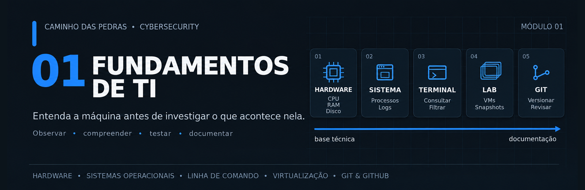
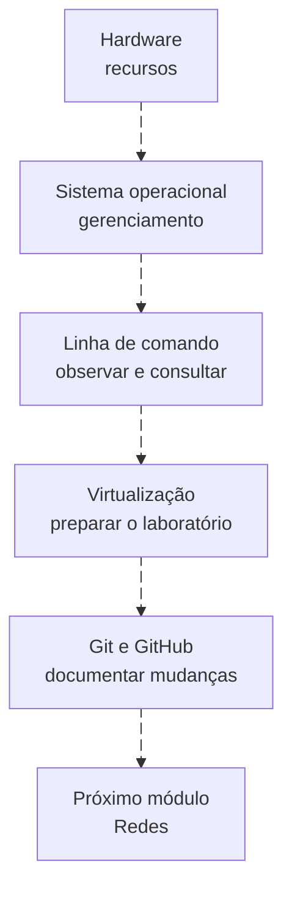
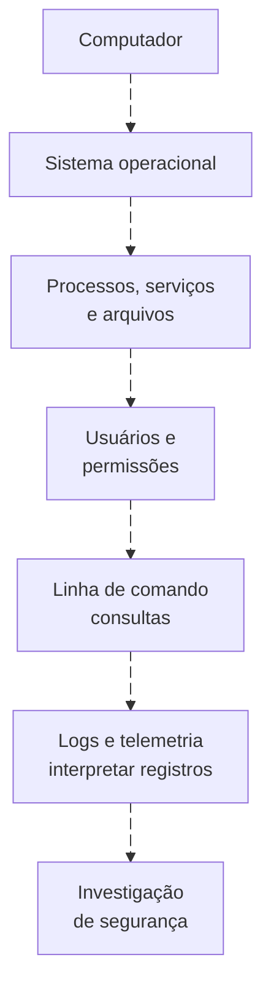
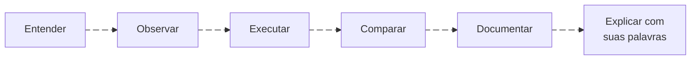

# 01 Fundamentos de TI

<!-- markdownlint-configure-file {"MD033": {"allowed_elements": ["details", "summary"]}} -->

[← Página principal](../README.md) · [↑ Índice do módulo](README.md) · [Próximo tópico → Hardware](hardware.md)

Proteger e investigar uma tecnologia exige entender como ela funciona. Este módulo constrói essa base: recursos do computador, execução de programas, identidades, arquivos, terminal, laboratório e histórico de mudanças.

> O que preciso entender de Tecnologia da Informação antes de avançar nos estudos de Cybersecurity?

A resposta começa com situações conhecidas de suporte: computador lento, serviço que não iniciou, usuário sem acesso ou arquivo que não foi encontrado. Investigar essas situações desenvolve observação, comparação e formulação de hipóteses. Nem todo comportamento diferente é malicioso; contexto faz parte da análise.

## O que você vai aprender

| Ordem e tópico | O que compreender | Por que importa |
| --- | --- | --- |
| 1. [Hardware](hardware.md) | CPU, RAM, armazenamento, rede e inicialização. | Reconhecer recursos, limites e sinais de disponibilidade. |
| 2. [Sistemas operacionais](sistemas-operacionais.md) | Processos, serviços, usuários, permissões, arquivos e logs. | Entender quem executa uma ação e como ela pode ser observada. |
| 3. [Linha de comando](linha-de-comando.md) | Navegação, consultas, ajuda, entrada, saída e filtros. | Repetir uma consulta e explicar como o resultado foi obtido. |
| 4. [Virtualização](virtualizacao.md) | Host, guest, hipervisor, redes, snapshot e backup. | Preparar um ambiente próprio para praticar com controle. |
| 5. [Git e GitHub](git-github.md) | Edição, staging, commit, branch, remoto e revisão. | Versionar estudos e acompanhar decisões técnicas. |

Não é preciso dominar cada ferramenta antes de seguir. O critério é conseguir explicar o conceito, observar um exemplo e reconhecer uma limitação. Quem já trabalha com suporte pode usar os checkpoints para localizar lacunas e revisitar apenas o necessário.

## Caminho deste módulo

A sequência conecta conhecimentos. Primeiro entendemos o computador e o sistema; depois consultamos seu estado, planejamos um ambiente de teste e registramos o aprendizado.

Esse segundo fluxo representa a construção do entendimento, não uma promessa de que toda consulta gera um log. Antes de investigar um processo suspeito, precisamos reconhecer um processo normal. Antes de interpretar memória, arquivos ou comandos, precisamos saber o que esses elementos representam e quais dados realmente estão disponíveis.

## Fundamentos e Cybersecurity

| Fundamento | Onde aparece em Cybersecurity |
| --- | --- |
| Hardware | Capacidade de endpoints, disponibilidade, memória, disco e limites para preservar evidências. |
| Sistema operacional | Execução, identidade, privilégios, serviços, alterações em arquivos e eventos. |
| Linha de comando | Administração, consultas reproduzíveis, investigação e apoio à resposta. |
| Virtualização | Laboratórios, testes de configuração, geração de eventos e retorno controlado de estado. |
| Git | Histórico de queries, regras, documentação e scripts, com revisão antes de publicar. |

Aqui o foco está nessas bases. Os [labs dos módulos posteriores](../12-Labs-Praticos/README.md) usarão esse conhecimento; não é necessário começar por SIEM, linguagens de consulta ou técnicas ofensivas.

## Como estudar este módulo

Leia o conceito, observe o sistema e faça a prática em ambiente próprio. Compare o resultado com a explicação e registre diferenças. Se um comando falhar ou uma informação não estiver acessível, isso também é parte da observação.

Considere o assunto compreendido quando conseguir explicar uma situação concreta sem apenas repetir a definição. Por exemplo: por que CPU alta não confirma ataque? Por que snapshot não protege contra toda perda? Se ainda não conseguir, volte à seção e teste outra hipótese.

## Pré-requisitos

Este é o primeiro módulo. Uso básico do computador, como abrir programas e localizar arquivos, é suficiente para começar. Não existe obrigação de conhecer Cybersecurity ou ter experiência com terminal.

Use apenas dispositivos próprios ou explicitamente autorizados. As práticas de consulta podem ser feitas com conta comum; informações inacessíveis devem ser registradas como uma limitação. Não é necessário coletar dados corporativos.

## Ambiente recomendado

| Recurso sugerido | Como começar sem transformar isso em uma barreira |
| --- | --- |
| Computador Windows, Linux ou macOS | Estude os conceitos no sistema disponível. Os comandos desta trilha estão separados entre Windows e Linux; macOS pode ter ferramentas e opções diferentes. |
| Terminal e editor de texto, como VS Code | Use ferramentas conhecidas e salve apenas notas próprias. |
| Git | Necessário na prática final, não nas primeiras leituras. |
| VirtualBox ou outra solução compatível | Avalie arquitetura, requisitos e recursos antes de instalar. |
| VM Windows e VM Linux opcional | Comece com uma VM por vez, ou apenas desenhe o ambiente enquanto planeja recursos. |

Imagens de sistema devem vir de fontes oficiais, com licenciamento adequado. Reserve recursos para o host. O módulo não exige assinatura cloud nem serviços pagos e não fornece uma promessa de isolamento absoluto por usar VMs.

## Entregas pequenas, verificáveis

| Tópico | Entrega |
| --- | --- |
| Hardware | Inventário resumido e proposta de recursos para VMs. |
| Sistemas operacionais | Três processos identificados e um serviço observado. |
| Linha de comando | Consulta e filtro explicados, com uma limitação reconhecida. |
| Virtualização | Diagrama e plano de rede; resultado real de snapshot se executado. |
| Git | Alteração de uma nota, diff revisado e commit local. |

Evite capturas sem explicação. Registre conceito, procedimento, resultado observado, dúvida e próximo teste. Nenhuma prática está declarada como executada só por estar descrita aqui.

## Checklist do módulo

Os itens abaixo servem como referência rápida dentro do README.

Para acompanhar seu progresso e conseguir **marcar os itens diretamente pelo GitHub**, abra um checklist próprio:

<strong>Ver checklist completo do módulo</strong>

### Hardware

- [ ] Explico CPU, RAM e armazenamento com um exemplo de uso.
- [ ] Distingo falta de espaço de atividade intensa de disco.
- [ ] Reconheço memória virtual e a diferença entre memória livre e disponível.

### Sistemas operacionais

- [ ] Distingo programa, processo e serviço.
- [ ] Identifico PID e usuário de processos acessíveis, sem presumir privilégios.
- [ ] Entendo que auditoria e coleta limitam os logs disponíveis.

### Linha de comando

- [ ] Confiro diretório e identidade antes de consultar arquivos.
- [ ] Explico um filtro e sei encontrar ajuda para um comando.
- [ ] Sei que redirecionamento pode sobrescrever um arquivo.

### Virtualização

- [ ] Distingo host, guest e hipervisor.
- [ ] Escolho um modo de rede e explico quem pode alcançar a VM.
- [ ] Diferencio snapshot, backup e clone.

### Git e GitHub

- [ ] Explico working directory, staging, commit e remote.
- [ ] Reviso alterações e entendo por que apagar um segredo não basta.

## Checkpoint de conhecimento

Tente responder antes de abrir a explicação. Use um exemplo do seu próprio laboratório.

### 1. Um computador lento precisa ser tratado imediatamente como ataque?

Ver resposta

Não. Primeiro compare recursos, processos, horário e atividades esperadas. Os fundamentos ajudam a testar causas comuns e reconhecer o que exige investigação adicional.

### 2. Você precisa de todos os recursos sugeridos para começar?

Ver resposta

Não. A leitura e as consultas podem começar no sistema disponível. Planejamento de VM pode ficar no papel até haver recursos; o status deve refletir o que foi realmente executado.

### 3. O que torna uma prática mais útil que uma captura de tela isolada?

Ver resposta

Uma pergunta clara, procedimento reproduzível, contexto do resultado e explicação das limitações. A imagem pode apoiar o relato, mas não substitui o raciocínio.

### 4. Quando é razoável avançar para Redes?

Ver resposta

Quando você consegue explicar os recursos e componentes observados, consultar o próprio ambiente com segurança e reconhecer as lacunas. Não é necessário decorar comandos ou dominar todos os sistemas.

## Mini desafio integrador

Escolha uma situação simples, como abrir um editor. Explique quais recursos são usados, qual processo aparece, sob qual usuário ele executa e como você o consultaria. Planeje repetir a observação em uma VM e registrar sua nota no Git. Separe claramente observação, hipótese e etapa ainda não realizada.

## Resumo e próximo módulo

Você agora tem um roteiro para compreender a máquina, consultar seu estado, preparar um laboratório e registrar mudanças. A próxima etapa é entender como sistemas se comunicam: interfaces, endereços, nomes, portas e protocolos completam o contexto do endpoint.

[Próximo módulo → 02 Redes](../02-Redes/README.md)
