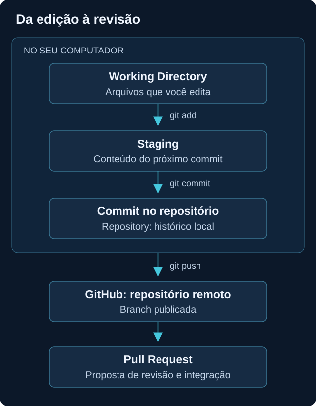
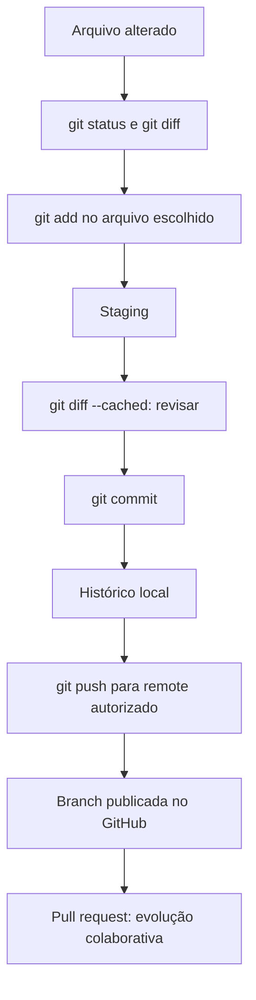

# Git e GitHub

<!-- markdownlint-configure-file {"MD033": {"allowed_elements": ["details", "summary"]}} -->

[← Página principal](../README.md) · [↑ Índice do módulo](README.md)

## Por que versionar seus estudos?

Uma nota muda quando você aprende algo novo. Uma query recebe um filtro. Uma regra precisa explicar por que uma exceção foi incluída. Git ajuda a registrar essas mudanças, compará-las e recuperar o raciocínio por trás delas.

**Git não é GitHub.** Git é o sistema de controle de versão que pode funcionar localmente, sem Internet. GitHub hospeda repositórios e oferece recursos para colaboração e documentação. Fazer commit não publica automaticamente nada no GitHub.

## As peças do Git

| Conceito | Significado no trabalho diário |
| --- | --- |
| Repositório | Projeto com histórico e metadados de versionamento. Em uma cópia local comum, ficam em `.git`. |
| Working directory | Arquivos da cópia de trabalho que você lê e edita. |
| Staging ou index | Conteúdo selecionado para entrar no próximo commit. |
| Commit | Registro de um estado preparado, com metadados e mensagem. |
| Branch | Referência a uma linha de desenvolvimento, útil para separar trabalho. |
| Merge | Integração de históricos; conflitos podem exigir decisão sobre o conteúdo. |
| Remote | Nome associado a outro repositório, como `origin`, e sua localização. |

`git add` prepara a versão do arquivo naquele momento. Se você editar novamente, a área de trabalho e o staging podem conter versões diferentes. `git commit` registra o que está preparado, não qualquer alteração que exista na pasta.



## Da edição ao histórico



O fluxo básico pode terminar no histórico local. Branches e pull requests entram quando você quer compartilhar uma proposta e revisá-la antes da integração. Consulte também a [explicação das áreas do Git](https://git-scm.com/book/en/v2/Getting-Started-What-is-Git%3F).

## O que o GitHub acrescenta

Um repositório remoto permite compartilhar código e documentação. **Issues** registram dúvidas, problemas e propostas. **Pull requests** reúnem uma proposta de alteração entre branches, discussão e revisão. Abrir um pull request não significa que a mudança já foi integrada.

O histórico permite consultar commits e comparar versões. O README apresenta o projeto; outras páginas aprofundam temas. Visibilidade privada limita acesso conforme a configuração, mas não transforma o repositório em local adequado para guardar credenciais.

## Onde isso aparece em Cybersecurity?

Git pode versionar consultas KQL, regras Sigma, scripts e relatos de laboratório. O histórico ajuda a relacionar uma mudança de lógica com seus testes e justificativas. Revisar alterações antes de publicar reduz a chance de incluir dados indevidos ou modificar uma regra sem explicar o impacto.

Neste primeiro módulo, a prática usa apenas uma nota de texto. As linguagens e ferramentas de segurança serão estudadas depois; o objetivo é compreender como uma alteração percorre as áreas do Git.

## Nunca envie credenciais para o Git

Senhas, tokens, API keys, arquivos `.env`, chaves privadas e credenciais de cloud devem ficar fora do repositório. Capturas, comandos, exportações e logs também podem conter segredos ou dados identificáveis.

`.gitignore` ajuda a evitar a inclusão de determinados arquivos ainda não rastreados. Ele não inspeciona o conteúdo de uma nota nem deixa de rastrear automaticamente um arquivo já versionado. Antes do commit, revise os nomes dos arquivos e o diff preparado.

Apagar um segredo na versão atual não o remove necessariamente de commits anteriores, cópias ou forks. Se houver exposição real, a primeira medida é revogar ou rotacionar a credencial e seguir o procedimento de resposta aplicável. Não publique o valor em uma issue pedindo ajuda. Este exercício não usa credenciais reais.

## Exemplo: uma explicação foi corrigida

Você escreveu uma nota confundindo RAM com armazenamento e depois corrigiu a frase. O diff mostra exatamente o que mudou. Uma mensagem como `docs: corrige diferença entre RAM e armazenamento` ajuda a entender a intenção, melhor que uma mensagem vaga como `atualização`.

O Git registra versões, não garante que o conteúdo esteja tecnicamente certo. A revisão e o teste continuam sendo necessários.

## Prática segura: seu primeiro histórico local

Use uma pasta nova no seu computador pessoal. Não execute `git init` dentro deste repositório nem dentro de outra pasta que já tenha `.git`.

### Etapa 1

Pelo gerenciador de arquivos, crie uma pasta vazia `meu-estudo-git` e abra o terminal nela. Confira o caminho atual com o comando aprendido no tópico anterior.

### Etapa 2

Verifique a instalação e inicialize apenas essa pasta:

```bash
git --version
git init
git status
```

### Etapa 3

Pelo editor, crie `anotacoes.md` com uma explicação própria de RAM e armazenamento. Não use dados corporativos. Veja o arquivo listado como não rastreado em `git status`.

### Etapa 4

Prepare somente essa nota e revise:

```bash
git add -- anotacoes.md
git diff --cached
git status
```

`git add` prepara o arquivo escolhido. `git diff --cached` compara o conteúdo preparado com o último commit; no primeiro commit, mostra o conteúdo novo. `git status` identifica o que está preparado. O `git diff` sem opções não mostra o conteúdo de arquivos ainda não rastreados.

### Etapa 5

Antes do primeiro commit, confira sua identidade com `git config --get user.name` e `git config --get user.email`. Se não estiver configurada, defina uma identidade sua **somente neste repositório**, substituindo os exemplos abaixo. A identidade do autor fica nos commits; para publicação, considere um endereço de privacidade da sua conta.

```bash
git config user.name "Seu nome de estudo"
git config user.email "seu-email-de-autoria@example.com"
git commit -m "docs: registra primeiro estudo de hardware"
git log --oneline
```

O domínio de e-mail acima é um exemplo, não uma credencial nem uma identidade a ser assumida. `git commit` registra o staging localmente; `git log` mostra o histórico.

### Etapa 6

Altere uma frase pelo editor e compare o que mudou:

```bash
git status
git diff
git add -- anotacoes.md
git diff --cached
git commit -m "docs: esclarece função da RAM"
git log --oneline
```

Antes do segundo commit, explique com suas palavras o diff preparado. Se houver algo inesperado, pare para revisar em vez de publicar.

## Remote e publicação: etapa opcional

O exercício local já ensina o fluxo principal. Para publicar, crie um repositório vazio na sua própria conta, revise a visibilidade e use seu endereço HTTPS real. `origin` é um nome convencional para esse destino; ele não é uma conta nem uma permissão.

```bash
git remote add origin https://github.com/SEU-USUARIO/SEU-REPOSITORIO.git
git remote -v
git branch --show-current
```

Substitua os nomes de exemplo antes de executar. O último comando informa o nome da branch atual, que pode variar conforme sua configuração. Depois de conferir arquivos, histórico, destino e autorização, use `git push -u origin NOME-DA-BRANCH`, substituindo pelo nome realmente mostrado. Autentique-se pelo fluxo suportado, sem colocar tokens na URL ou no arquivo de estudo.

Se o remoto já tiver conteúdo e rejeitar a publicação, investigue o histórico existente antes de integrar. Não tente sobrescrevê-lo. Como evolução, crie uma branch de estudo, faça uma mudança pequena e abra um pull request para revisão.

## O que observar e registrar

Compare o estado antes de `add`, depois de `add` e depois do commit. Registre a mensagem, o identificador do commit e a alteração que ele contém. Antes de qualquer push, revise todos os commits que serão publicados, não apenas o último arquivo visível.

## Checkpoint de conhecimento

Tente responder antes de abrir a explicação. Use um exemplo do seu próprio laboratório.

### 1. Você precisa de GitHub para fazer um commit?

<details>
<summary>Ver resposta</summary>

Não. Git pode manter todo o histórico localmente. GitHub é uma opção de hospedagem e colaboração; push é uma etapa separada.

</details>

### 2. Você fez add e depois editou o arquivo. O que o commit vai registrar?

<details>
<summary>Ver resposta</summary>

A versão que foi preparada pelo add. A edição posterior permanece fora do staging até ser preparada novamente. Confira git diff e git diff --cached para distinguir as versões.

</details>

### 3. Por que um arquivo novo pode não aparecer em git diff?

<details>
<summary>Ver resposta</summary>

Antes de ser rastreado e preparado, seu conteúdo não é mostrado pelo diff comum. git status mostra o arquivo não rastreado; depois de add, git diff --cached permite revisar o conteúdo preparado.

</details>

### 4. Remover uma senha da última versão resolve a exposição?

<details>
<summary>Ver resposta</summary>

Não. Ela pode continuar no histórico e em cópias. É necessário revogar ou rotacionar a credencial e avaliar o alcance da exposição, além de tratar o histórico conforme o procedimento aplicável.

</details>

### 5. Qual diferença entre push e pull request?

<details>
<summary>Ver resposta</summary>

Push envia commits para uma referência no remoto. Pull request propõe integrar mudanças entre branches e permite discussão e revisão. Publicação de uma branch não significa integração automática.

</details>

### 6. Por que revisar uma regra de detecção no Git?

<details>
<summary>Ver resposta</summary>

O diff e a mensagem ajudam a explicar mudanças de lógica, exceções e testes. O histórico permite acompanhar decisões, mas não substitui a validação técnica da regra.

</details>

## Mini desafio

Faça uma alteração pequena na nota do repositório de estudo. Antes do commit, escreva uma frase dizendo o que mudou e por quê. Compare-a com git diff --cached. Entrega: descrição, mensagem e identificador do commit local, sem necessidade de publicar.

## Resumo

Git separa edição, preparação e histórico. GitHub acrescenta hospedagem e colaboração. Um bom commit reúne uma alteração compreensível e revisada; segredos e dados privados não devem fazer parte dele.

[Próximo tópico → Módulo 02: Redes](../02-Redes/README.md)
