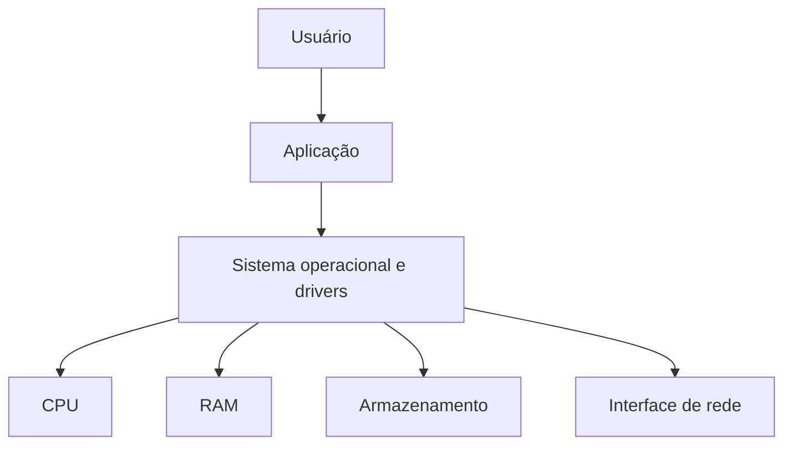
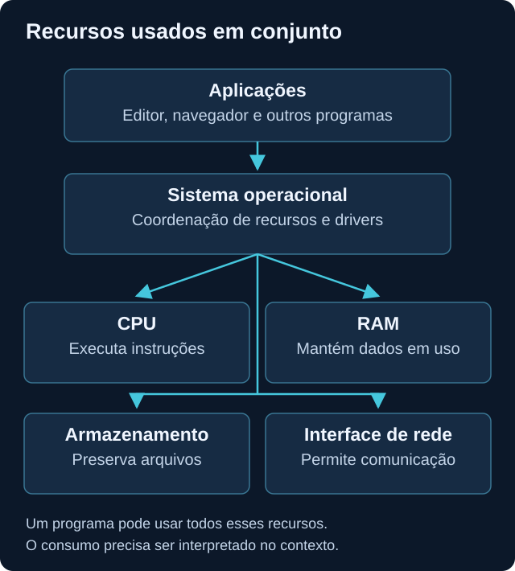

# Hardware

<!-- markdownlint-configure-file {"MD033": {"allowed_elements": ["details", "summary"]}} -->

[← Página principal](../README.md) · [↑ Índice do módulo](README.md)

## Por que começar pelo hardware?

Um computador lento pode estar com falta de memória, armazenamento ocupado ou uma aplicação fazendo trabalho intenso. Saber diferenciar esses sinais evita tratar toda mudança como incidente de segurança e ajuda a dimensionar o laboratório sem comprometer o computador principal.

Hardware é o conjunto de componentes físicos. O sistema operacional coordena seu uso para que várias aplicações possam funcionar. Você não precisa estudar eletrônica para começar: precisa entender a função de cada recurso, como observá-lo e quais limites ele impõe.

## Componentes e funcionamento

### CPU: executar instruções

A CPU executa instruções dos programas, como calcular, comparar valores e movimentar dados. O sistema operacional distribui tempo de execução entre as threads dos processos. **Processo** é uma instância de programa em execução; **thread** é uma sequência de execução dentro dele.

Um núcleo, ou core, é uma unidade de execução da CPU. Alguns processadores apresentam mais de um processador lógico por núcleo, permitindo compartilhar recursos do núcleo entre threads de hardware. Isso não equivale a duplicar seu desempenho. Threads de software e processadores lógicos são conceitos relacionados, mas diferentes.

O percentual de utilização mostra quanto da capacidade de processamento foi usada no intervalo medido. Atualizações, compactação de arquivos e navegação podem elevar esse valor. Em uma investigação, interessa saber **qual processo**, por quanto tempo e durante qual atividade. CPU alta sozinha não prova atividade maliciosa.

### RAM: dados em uso

RAM é memória volátil: seu conteúdo depende de energia para permanecer disponível. O sistema mantém nela partes de programas e dados necessários à execução. Um processo usa memória para instruções, estruturas de dados e resultados temporários; parte desse conteúdo pode ser compartilhada com outros processos.

**Memória virtual** é a forma como o sistema organiza espaços de endereçamento para os processos. Ela não é apenas uma extensão da RAM em disco. Quando necessário e configurado, páginas podem ser transferidas para arquivo de paginação ou swap. Essa movimentação pode aumentar a espera por disco; adicionar swap não transforma armazenamento em RAM com o mesmo desempenho.

Uma parte da memória pode servir de cache e ser reaproveitada. Por isso, pouca memória totalmente livre não significa, isoladamente, que o sistema está sem capacidade. Observe memória disponível, consumo dos processos e sintomas ao longo do tempo.

Em segurança, a análise de memória pode revelar estado de processos e outros dados que não persistem no disco. É uma atividade especializada: não vamos coletar dumps neste módulo. Desligar uma máquina altera ou perde evidências voláteis, por isso decisões reais de preservação exigem procedimento e autorização.

### Armazenamento: manter arquivos

HDD usa componentes mecânicos e discos magnéticos. SSD usa memória flash, sem partes móveis, e costuma responder mais rapidamente a acessos aleatórios. Ambos mantêm dados sem depender de energia contínua, dentro dos limites de integridade do dispositivo.

O **sistema de arquivos** organiza arquivos, diretórios e metadados no volume. Aplicações leem e escrevem dados por mecanismos oferecidos pelo sistema operacional. Espaço livre e velocidade de acesso são medidas diferentes: um disco pode ter espaço e estar ocupado atendendo muitas operações.

Logs, configurações, documentos e executáveis dependem de armazenamento. Disco cheio pode impedir novos registros ou causar falhas em aplicações e agentes. Um arquivo permanecer no disco é persistência de dados; em segurança, persistência também pode descrever mecanismos para manter acesso ou execução. Não confunda os dois sentidos.

### Interface de rede

A interface de rede, também chamada NIC, permite comunicação com outras máquinas. Pode ser física, como Ethernet ou Wi-Fi, ou virtual, como um adaptador de VM. Interface presente não garante conexão funcional: endereço, rota, DNS e serviço também importam. Esses elementos serão aprofundados em [Redes](../02-Redes/README.md).

### BIOS, UEFI e periféricos

BIOS e UEFI são formas de firmware envolvidas na inicialização. O firmware prepara componentes e participa da seleção do caminho de boot que carrega o sistema. A ordem de inicialização define quais dispositivos ou entradas são tentados. Aqui basta reconhecer esse papel, sem alterar firmware ou opções de segurança.

Teclado, mouse, monitor, impressora e unidades externas são exemplos de periféricos. Eles fornecem entrada, saída ou armazenamento adicional, normalmente com suporte de drivers. Um dispositivo conectado também pode mudar o comportamento observado; registre o contexto antes de concluir que existe um problema de software.

## Como as camadas se relacionam



No uso comum, aplicações solicitam recursos por interfaces do sistema operacional, em vez de controlar livremente o hardware. O desenho simplifica essa mediação; os recursos são usados em conjunto, não em uma sequência obrigatória.



## Onde isso aparece em Cybersecurity?

| Recurso | Relação com análise defensiva |
| --- | --- |
| CPU | Contextualizar picos, entender capacidade do endpoint e carga dos agentes. |
| RAM | Compreender estado volátil, consumo e limites de observação de processos. |
| Disco | Verificar disponibilidade para logs, arquivos e evidências. |
| Rede | Identificar a interface usada e preparar a análise de comunicação. |
| Recursos do host | Dimensionar VMs e perceber quando um laboratório prejudica a coleta. |

## Exemplo: o computador ficou lento

Comece registrando quando o sintoma apareceu e o que estava aberto. Compare com um momento de uso normal.

| Observação | Hipótese a verificar | O que ainda não permite concluir |
| --- | --- | --- |
| CPU alta em um processo conhecido | Atualização ou tarefa pesada em andamento. | Que o consumo seja malicioso. |
| Memória disponível baixa e muita paginação | A carga pode ultrapassar a RAM útil. | Que um único processo explique tudo. |
| Disco muito ativo | Leituras, gravações ou paginação podem causar espera. | Que o disco esteja cheio. |
| Pouco espaço livre | Logs e aplicações podem falhar ao gravar. | Qual arquivo causou o crescimento. |
| Processo de nome desconhecido | É preciso verificar origem, função e contexto. | Que o nome desconhecido seja malware. |

Não encerre processos apenas para testar a hipótese. Neste exercício, a atividade é observar e explicar.

## Prática segura: inventário e observação

Faça no seu computador ou VM. Não publique nomes pessoais, números de série ou inventários corporativos.

### Windows

1. Abra o **Gerenciador de Tarefas** e observe CPU, memória e disco nas abas Processos e Desempenho. Compare repouso com a abertura normal de um editor.
2. Abra **Informações do Sistema** pelo menu Iniciar, ou execute `msinfo32`. Localize processador, RAM e modo BIOS, sem mudar configurações.
3. Em PowerShell comum, execute as consultas abaixo:

```powershell
Get-CimInstance Win32_Processor | Select-Object Name, NumberOfCores, NumberOfLogicalProcessors
Get-CimInstance Win32_ComputerSystem | Select-Object TotalPhysicalMemory
Get-Volume | Select-Object DriveLetter, FileSystem, SizeRemaining, Size
```

A primeira consulta identifica CPU, núcleos e processadores lógicos; a segunda mostra RAM física em bytes; a terceira mostra volumes, sistema de arquivos, capacidade e espaço restante. Disponibilidade e permissão podem variar por versão. Se um comando falhar, registre o erro e use a interface gráfica, sem elevar privilégios automaticamente.

### Linux

```bash
lscpu
free -h
df -h
lsblk
```

| Comando | O que observar |
| --- | --- |
| `lscpu` | Arquitetura, CPUs lógicas e topologia exposta ao sistema. Em uma VM, são recursos virtuais. |
| `free -h` | Memória e swap em unidades legíveis. Confira `available`, não apenas `free`. |
| `df -h` | Espaço usado e livre nos sistemas de arquivos montados, não taxa de atividade do disco. |
| `lsblk` | Dispositivos de bloco, partições e pontos de montagem; não mede desempenho. |

Ferramentas e colunas variam entre distribuições. Se algo não estiver instalado, registre a limitação. Consulte a [explicação de `free`](https://man7.org/linux/man-pages/man1/free.1.html) para interpretar memória disponível.

## O que observar e registrar

Monte uma tabela com recurso, capacidade, condição da medição e limitação percebida. Compare duas observações com a mesma ferramenta. Para planejar VMs, reserve recursos para o host e considere requisitos dos sistemas convidados; não some toda a RAM física como se estivesse disponível ao laboratório.

## Checkpoint de conhecimento

Tente responder antes de abrir a explicação. Use um exemplo do seu próprio laboratório.

### 1. Qual é a diferença entre RAM e armazenamento?

<details>
<summary>Ver resposta</summary>

RAM mantém dados em uso e é volátil. Armazenamento mantém arquivos entre reinicializações. Ambos podem guardar partes de dados de um processo, mas têm funções e características de acesso diferentes.

</details>

### 2. Por que um processo usa CPU e memória?

<details>
<summary>Ver resposta</summary>

Ele precisa executar instruções e manter código e dados acessíveis. Um editor aberto pode ocupar memória mesmo enquanto usa pouca CPU, pois está esperando interação.

</details>

### 3. Por que disco cheio pode afetar a coleta de logs?

<details>
<summary>Ver resposta</summary>

O sistema, aplicação ou agente pode precisar gravar registros e filas locais. Sem espaço, novos registros podem falhar, ser descartados ou ficar indisponíveis, conforme a implementação.

</details>

### 4. Como hardware ajuda a investigar lentidão?

<details>
<summary>Ver resposta</summary>

Ele permite separar capacidade de processamento, pressão de memória, atividade de disco e espaço livre. Isso orienta hipóteses e evita concluir que todo sintoma tem a mesma causa.

</details>

### 5. Pouca memória livre e CPU alta provam um ataque?

<details>
<summary>Ver resposta</summary>

Não. Cache, atualizações e tarefas legítimas podem explicar esses sinais. Compare memória disponível, processo responsável, duração, horário e atividade esperada.

</details>

## Mini desafio

Observe os recursos disponíveis e proponha um orçamento para uma VM Windows e uma Linux, mesmo que só possa executar uma de cada vez. Explique qual recurso provavelmente limitaria o plano e como você verificaria isso. Entrega: tabela de dimensionamento e justificativa, sem dados pessoais.

## Resumo

CPU executa, RAM mantém dados em uso, armazenamento preserva arquivos e a interface de rede permite comunicação. Medidas de consumo precisam de contexto e de uma janela de observação.

[Próximo tópico → Sistemas operacionais](sistemas-operacionais.md)
