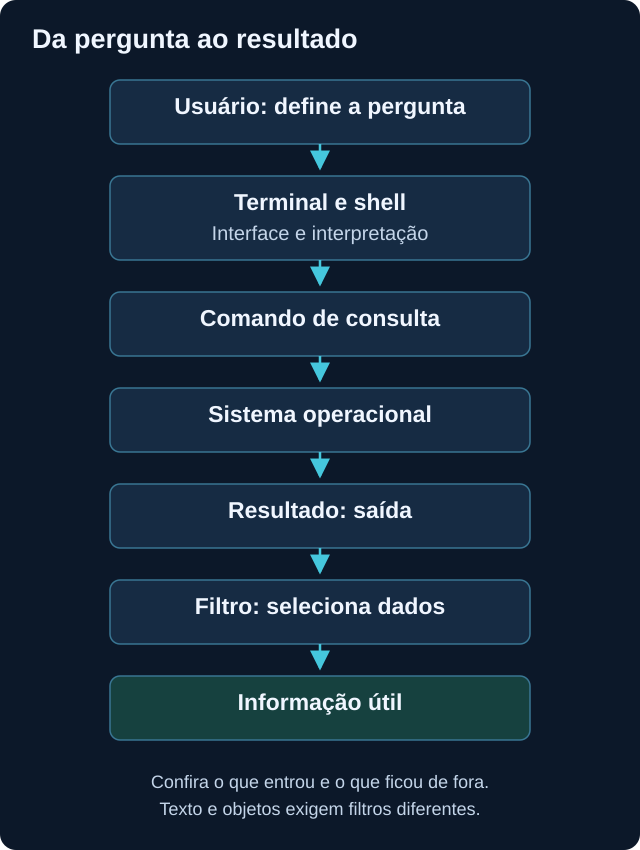
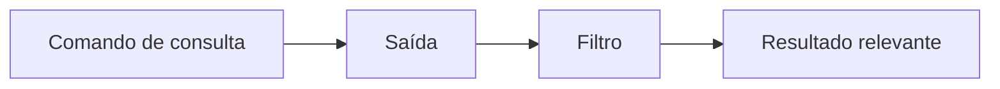

# Linha de comando

<!-- markdownlint-configure-file {"MD033": {"allowed_elements": ["details", "summary"]}} -->

[← Página principal](../README.md) · [↑ Índice do módulo](README.md)

## Por que o terminal importa?

O terminal permite consultar o sistema, filtrar informação e repetir uma sequência de trabalho. Em segurança, isso ajuda a examinar arquivos, processos e resultados sem depender apenas de interfaces gráficas. Neste módulo, vamos usar consultas e um arquivo de exercício próprio.

Você não precisa decorar centenas de comandos. Precisa entender onde está, qual recurso está consultando, com qual identidade e o que espera receber como resultado.

## Terminal, shell e comando

**Terminal** é a interface pela qual você interage. **Shell** é o interpretador que entende a linguagem usada. Um terminal pode hospedar shells diferentes. No Windows, CMD e PowerShell têm sintaxes distintas; no Linux, Bash é uma das opções comuns.

Um comando combina nome, argumentos e, às vezes, opções. O mesmo texto pode ter outro significado em um shell diferente. Confira o tipo indicado acima de cada exemplo antes de copiar.



## Conceitos para não trabalhar no escuro

| Conceito | Exemplo de pergunta |
| --- | --- |
| Diretório atual | Em qual pasta este comando vai procurar? |
| Caminho absoluto | Estou indicando a localização desde a raiz ou unidade? |
| Caminho relativo | Este caminho depende da pasta atual? |
| Identidade e permissão | Minha conta pode ler esse recurso? Preciso mesmo acessar outro? |
| Entrada | O comando recebe argumentos, teclado, arquivo ou saída de outro comando? |
| Saída | O resultado é texto, objetos, erro ou uma combinação? |
| Filtro | Qual condição seleciona apenas o que quero observar? |
| Variável | Qual nome guarda um valor que vou reutilizar? |
| Ajuda | Onde confiro opções e efeitos antes de executar? |

No Windows, `C:\Users\...` é um caminho absoluto; `./anotacoes.txt` é relativo. No Linux, `/home/...` é absoluto e `./anotacoes.txt` também é relativo. `..` representa o diretório pai. Caminhos com espaços normalmente precisam de aspas. Não use caminhos de exemplo como se fossem os da sua máquina.

## Windows: CMD e PowerShell

CMD é um interpretador tradicional com comandos como `dir`, `cd` e `type`. PowerShell usa cmdlets como `Get-ChildItem`, oferece ajuda estruturada e passa **objetos** entre muitos de seus comandos. Um objeto tem propriedades, como nome e PID de um processo.

No CMD, `cd` sem argumento mostra o diretório atual; `dir` lista seu conteúdo e `whoami` consulta a identidade. Não suponha que comandos, variáveis e pipes funcionem exatamente como em PowerShell.

### Consultas em PowerShell

| Comando | Função e observação |
| --- | --- |
| `Get-Location` | Mostrar o diretório atual. |
| `Get-ChildItem` | Listar itens da pasta atual. Não implica listar todos os arquivos do computador. |
| `Get-Process` | Consultar processos visíveis à sessão. |
| `Get-Service` | Consultar serviços no Windows. |
| `Get-Help Get-ChildItem` | Consultar ajuda de um cmdlet. O detalhe disponível depende da instalação da ajuda. |
| `Get-Content -LiteralPath ./anotacoes.txt` | Ler um arquivo de texto próprio; o arquivo precisa existir. |
| `Select-String -LiteralPath ./anotacoes.txt -Pattern 'erro'` | Selecionar linhas que correspondem ao padrão. |

`-LiteralPath` evita interpretar caracteres do caminho como curingas. `Select-String` usa expressões regulares por padrão; `-SimpleMatch` pode ser usado quando você quer procurar um texto literal.

## Linux: navegar, consultar e ler

| Comando | Função |
| --- | --- |
| `pwd` | Mostrar o diretório atual. |
| `ls` | Listar itens; `ls -l` acrescenta metadados básicos. |
| `cd ..` | Mudar a sessão para o diretório pai; não move nem apaga arquivos. |
| `cat ./anotacoes.txt` | Exibir o conteúdo de um arquivo pequeno. |
| `less ./anotacoes.txt` | Ler por páginas; pressione `q` para sair. |
| `grep 'erro' ./anotacoes.txt` | Selecionar linhas pelo padrão, sensível a maiúsculas por padrão. |
| `ps` | Consultar processos; opções mudam o conjunto e os campos mostrados. |
| `whoami` e `id` | Consultar identidade e grupos. |
| `head -n 5 ./anotacoes.txt` | Mostrar as primeiras cinco linhas. |
| `tail -n 5 ./anotacoes.txt` | Mostrar as últimas cinco linhas. |

Algumas ferramentas podem não estar instaladas em distribuições mínimas. Não é necessário instalar tudo para entender o fluxo. Observe também que `grep` trabalha com texto e, por padrão, interpreta um padrão; `grep -F` procura texto literal.

## Pipeline: reduzir a saída sem perder a pergunta



O caractere `|` conecta a saída de um comando à entrada do seguinte. Em shells como Bash, o fluxo comum é texto em bytes. Entre cmdlets PowerShell, o fluxo normalmente contém objetos; ao chamar programas externos, o comportamento pode ser diferente.

### Exemplo PowerShell

```powershell
Get-Process | Where-Object { $_.Id -eq $PID } | Select-Object Id, ProcessName
```

`Get-Process` consulta processos. `Where-Object` mantém aquele cujo `Id` é o PID da sessão PowerShell atual. `$_` representa cada objeto recebido; `$PID` é uma variável automática, que deve ser apenas consultada. `Select-Object` seleciona propriedades. A consulta encontra a própria sessão sem presumir um nome de processo.

### Exemplo Linux

```bash
ps -eo user,pid,comm | grep -F -- "$(whoami)"
```

`ps` emite usuário, PID e nome de comando. `$(whoami)` fornece o nome atual e `grep` mantém linhas que contenham esse texto. É um **filtro textual ilustrativo**, não uma seleção exata de dono: pode haver correspondência em outra coluna ou truncamento do usuário. Para consultar processos da identidade atual com precisão, prefira `ps -u "$(id -u)" -o user,pid,comm`.

## Variáveis e redirecionamento

Variáveis evitam repetir valores, mas a sintaxe depende do shell. Em PowerShell, `$arquivoEstudo = './anotacoes.txt'` cria uma variável e `Get-Content -LiteralPath $arquivoEstudo` a utiliza. Em Bash, `arquivo_estudo='./anotacoes.txt'` e `cat "$arquivo_estudo"` cumprem esse papel. As aspas preservam o valor como um argumento.

Redirecionar muda o destino da saída. `>` normalmente grava em um arquivo, substituindo o conteúdo se ele já existir; `>>` acrescenta. Isso altera dados, mesmo quando o comando original era de consulta. Codificação, tipos de saída e fluxo de erros variam entre shells e versões. Nesta prática, leia os resultados na tela e registre notas pelo editor, sem redirecionar sobre arquivos existentes.

## Encontrar o comando certo

> Entender a pergunta e consultar a ajuda é mais útil do que decorar comandos sem conhecer seus efeitos.

Use `Get-Help Get-Process -Examples` no PowerShell. No Linux, consulte `man ps` e `ls --help`; `man` normalmente usa um paginador que fecha com `q`. `--help` é uma convenção comum, não uma opção universal. A ajuda local pode estar incompleta; nesse caso, consulte a documentação oficial da ferramenta e da versão.

## Onde isso aparece em Cybersecurity?

Linha de comando apoia administração, consulta de telemetria, investigação e resposta. Repetibilidade ajuda a explicar como uma conclusão foi obtida. Um filtro também pode esconder contexto, então registre a fonte, o comando e o período observado, e compare uma amostra antes e depois de filtrar.

Executar como administrador amplia o alcance dos erros. Use conta comum, leia o comando completo e confirme seu efeito antes de executar. Não copie comandos desconhecidos só porque uma mensagem de erro apareceu. Permissão insuficiente pode ser uma limitação válida da sua consulta.

## Prática: ler e filtrar um arquivo de estudo

### Etapa 1

No seu diretório pessoal, crie pelo gerenciador de arquivos uma pasta nova chamada `estudo-fundamentos`, sem reutilizar uma pasta com dados importantes.

### Etapa 2

Abra o terminal nessa pasta e confirme com `Get-Location` ou `pwd`.

### Etapa 3

Pelo editor de texto, crie `anotacoes.txt` com as três linhas fictícias abaixo. Confirme que o editor não adicionou outra extensão.

```text
info: editor aberto
erro: arquivo de exemplo nao encontrado
info: caminho revisado
```

### Etapa 4

Leia o arquivo com `Get-Content -LiteralPath ./anotacoes.txt` ou `cat ./anotacoes.txt`.

### Etapa 5

Filtre por `erro` com `Select-String` ou `grep`, conforme a tabela. Compare o resultado com o arquivo inteiro.

### Etapa 6

Execute a consulta de processos do seu shell e observe nome e PID. Nenhum processo deve ser interrompido.

## O que observar

Se o arquivo não for encontrado, confira pasta atual, grafia, extensão e caminho antes de mudar permissões. Se o filtro retornar vazio, examine maiúsculas, padrão e entrada. Registre o erro e a explicação encontrada; não invente um resultado esperado como se ele tivesse sido observado.

## Checkpoint de conhecimento

Tente responder antes de abrir a explicação. Use um exemplo do seu próprio laboratório.

### 1. Por que o mesmo caminho relativo pode funcionar em uma sessão e falhar em outra?

<details>
<summary>Ver resposta</summary>

Ele é resolvido a partir do diretório atual. Sessões em pastas diferentes podem procurar arquivos diferentes, mesmo usando o mesmo texto.

</details>

### 2. Qual diferença importa entre o pipeline PowerShell e o de texto?

<details>
<summary>Ver resposta</summary>

Objetos permitem filtrar propriedades diretamente; texto exige interpretar a saída. Um filtro textual pode corresponder à coluna errada, por isso é preciso conhecer o formato.

</details>

### 3. Como uma consulta pode acabar alterando um arquivo?

<details>
<summary>Ver resposta</summary>

O redirecionamento pode gravar sua saída sobre um arquivo existente. O efeito da linha inteira precisa ser revisto, não apenas o primeiro comando.

</details>

### 4. Um resultado vazio comprova ausência do processo ou evento?

<details>
<summary>Ver resposta</summary>

Não. O filtro pode estar errado, a fonte pode ser incompleta ou o processo pode ter terminado. Compare a entrada e conheça as limitações da consulta.

</details>

### 5. O que fazer quando um comando retorna acesso negado?

<details>
<summary>Ver resposta</summary>

Conferir identidade, recurso e objetivo. Usar ajuda e recursos do próprio usuário; elevar privilégios somente se houver necessidade e autorização, não como solução automática.

</details>

## Mini desafio

Localize o processo da sua sessão pelo terminal, selecione nome e PID e explique cada etapa. Depois filtre uma linha do arquivo de estudo e registre como a saída mudou. Entrega: comandos usados, resultado anonimizado e uma limitação de cada filtro.

## Resumo

Terminal é uma interface; shell interpreta a linguagem. Caminhos, identidade, entrada, saída e filtros determinam o resultado. Ajuda e leitura cuidadosa são parte da prática, não sinal de falta de conhecimento.

[Próximo tópico → Virtualização](virtualizacao.md)
