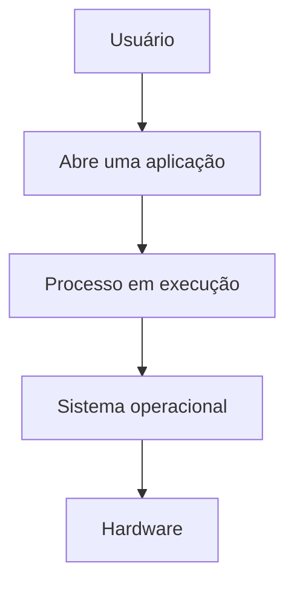
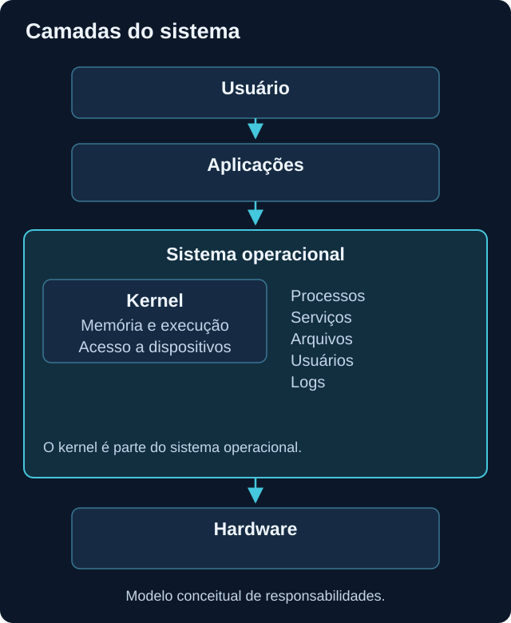
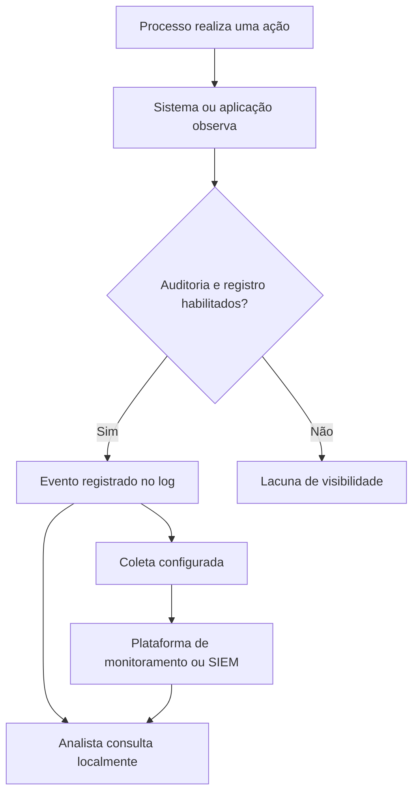

# Sistemas operacionais

<!-- markdownlint-configure-file {"MD033": {"allowed_elements": ["details", "summary"]}} -->

[← Página principal](../README.md) · [↑ Índice do módulo](README.md)

## Por que isso importa?

O sistema operacional administra recursos e oferece serviços para as aplicações. É nele que processos executam, contas recebem permissões, arquivos são organizados e parte dos eventos é registrada. Para investigar o que aconteceu em uma máquina, precisamos reconhecer essas peças antes de interpretar um alerta.

## O que o sistema operacional gerencia

### Kernel e aplicações

O **kernel** é o núcleo do sistema operacional. Ele participa do gerenciamento de memória, do agendamento de execução e do acesso a dispositivos. Drivers permitem a interação com hardware. O sistema operacional também inclui outros componentes e serviços; ele não se resume ao kernel.

Aplicações usam interfaces do sistema para abrir arquivos, solicitar memória ou comunicar-se. Essa separação permite controlar recursos e privilégios. O diagrama representa uma visão simplificada, não o caminho exato de cada instrução.





### Programa, processo e relação pai e filho

Um **programa** é um conjunto de instruções, normalmente armazenado em arquivos. Um **processo** é uma instância em execução, com memória, threads e contexto de segurança. Abrir o mesmo programa pode criar mais de um processo.

O **PID** identifica um processo durante sua existência. Ele pode ser reutilizado depois que o processo termina, por isso um número isolado não identifica uma execução para sempre. Registre também host e horário, quando disponíveis.

Um processo pode iniciar outro: chamamos o iniciador de **processo pai** e o iniciado de **processo filho**. Abrir um editor pelo terminal pode produzir essa relação, embora aplicações existentes e intermediários possam alterar o fluxo esperado. O pai pode terminar antes do filho; uma lista atual não substitui o histórico de criação.

Cada processo executa sob um contexto de identidade e privilégios. Saber o nome do executável não basta: interessa qual conta o iniciou, o que ele poderia acessar e em que situação. Ser executado por uma conta administrativa também não significa que toda execução esteja elevada ou possua todos os privilégios possíveis.

### Serviços

Serviços executam funções administradas pelo sistema, muitas vezes em segundo plano e sem uma sessão interativa de usuário. Podem iniciar automaticamente, manualmente ou por um gatilho, conforme a configuração. No Linux, é comum encontrar daemons gerenciados pelo systemd, mas nem toda distribuição usa systemd.

O serviço possui uma configuração; um ou mais processos realizam seu trabalho quando ele está em execução. Alguns processos hospedam vários serviços. Portanto, serviço e processo não são sinônimos.

A conta utilizada influencia quais recursos o serviço pode acessar. Em uma investigação, alterações na configuração, falha de inicialização e execução sob privilégios inesperados merecem contexto. Um serviço parado também pode estar corretamente configurado para só iniciar quando necessário.

### Usuários, sessões e permissões

Uma **conta** representa uma identidade. Uma **sessão** mantém o contexto de uma interação autenticada. Uma mesma conta pode ter várias sessões ou executar tarefas sem alguém diante do computador.

Usuários comuns normalmente têm acesso limitado ao seu contexto. Administradores podem realizar mudanças mais amplas, com mecanismos de elevação que variam entre sistemas. **Permissões** definem operações permitidas sobre recursos, como ler ou alterar um arquivo. Identidade, grupos, políticas e contexto de execução influenciam o acesso efetivo.

Uma mensagem de acesso negado é um sinal para verificar usuário, caminho e permissão esperada. Não é motivo automático para executar tudo como administrador ou mudar controles de acesso.

### Sistema de arquivos

| Elemento | Como interpretar |
| --- | --- |
| Arquivo | Unidade de dados, como documento, configuração ou executável. |
| Diretório | Organização de arquivos e outros diretórios. |
| Caminho | Localização absoluta ou relativa de um recurso. |
| Extensão | Convenção no nome, como `.txt`; sozinha não garante o conteúdo real. |
| Metadados | Informações como tamanho, permissões e horários, conforme o sistema de arquivos. |

Horários de arquivo ajudam a formular uma cronologia, mas não são uma prova isolada de autoria ou intenção. Cópia, sincronização e ferramentas podem afetá-los. Memória e armazenamento também se relacionam: um programa armazenado no disco precisa ter partes de seu código e dados acessíveis para executar.

## Logs: uma ponte para investigação

Um evento registra uma ocorrência conforme o provedor e a configuração. Um log reúne registros que podem ser consultados. O sistema operacional e as aplicações produzem diferentes tipos de logs; campos, formatos e retenção variam.



Nem toda ação gera o evento esperado. Política de auditoria, configuração da aplicação, filtros, retenção, permissões e falhas de gravação alteram o que fica disponível. Gerar um evento e coletá-lo são etapas distintas: ele pode existir localmente e não chegar ao destino.

Uma pesquisa vazia exige conferir fonte, período, fuso e configuração antes de concluir que nada aconteceu. Nesta etapa, o objetivo é entender o registro original; consultas e correlações mais avançadas ficam para outros módulos.

## Windows e Linux: conceitos semelhantes, interfaces diferentes

| Conceito | Windows | Linux |
| --- | --- | --- |
| Usuário atual | `whoami` | `whoami` e `id` |
| Processos | Gerenciador de Tarefas, `Get-Process` | `ps aux` |
| Serviços | Serviços, `Get-Service` | `systemctl` em sistemas com systemd |
| Arquivos | Explorador, `Get-ChildItem` | Gerenciador de arquivos, `ls` |
| Logs | Visualizador de Eventos | Journal do systemd e arquivos de log, conforme a distribuição |
| Informações do sistema | `Get-ComputerInfo` | `uname -a`, que informa principalmente kernel e arquitetura |

As ferramentas não têm saídas equivalentes campo a campo. Familiaridade com uma ajuda a formular perguntas na outra, mas é preciso conferir sua documentação.

## Onde isso aparece em Cybersecurity?

Processos e relações pai/filho ajudam a reconstruir execução. Serviços e seus privilégios ajudam a entender atividade contínua. Contas e permissões delimitam acesso. Arquivos mostram configurações e dados persistidos. Logs fornecem registros para investigar, dentro dos limites da auditoria disponível.

### Começando a pensar como analista

Antes de classificar uma atividade, pergunte: qual processo executou? Quem executou? Quando? Qual foi o pai? Quais privilégios estavam disponíveis? Algum log registrou isso? Essas perguntas retornarão nos módulos avançados.

## Exemplo: um serviço não iniciou

Pode haver dependência indisponível, conta sem acesso a um arquivo, configuração inválida ou falta de espaço. Observe estado, configuração e logs próximos ao horário do erro. Compare o que deveria acontecer com o que foi registrado, sem reiniciar serviços ou ampliar permissões como primeira tentativa. Nem todo comportamento diferente é malicioso.

## Prática segura: observar identidade, processos e serviços

### Windows

Execute em PowerShell comum:

```powershell
whoami
Get-Process | Select-Object Id, ProcessName, CPU, WorkingSet64
Get-Service | Select-Object Status, Name, DisplayName
Get-ComputerInfo | Select-Object OsName, OsVersion, OsArchitecture
```

`whoami` mostra a identidade atual; `Get-Process` lista processos; `Get-Service` mostra estado e identificação de serviços; `Get-ComputerInfo` consulta informações do sistema. **CPU é tempo acumulado de processador em segundos, não percentual instantâneo.** WorkingSet64 representa memória física residente em bytes e não todo o espaço virtual do processo.

Para identificar o usuário, abra a aba Detalhes do Gerenciador de Tarefas e exiba a coluna Nome de usuário. Se não puder consultar um processo protegido, marque a informação como indisponível. A lista básica de `Get-Process` não informa, por si só, o usuário de todos os processos. Consulte a [referência de Get-Process](https://learn.microsoft.com/en-us/powershell/module/microsoft.powershell.management/get-process).

### Linux

```bash
whoami
id
ps aux
systemctl list-units --type=service --no-pager
uname -a
```

`id` acrescenta identificadores de usuário e grupos. `ps aux` oferece uma visão momentânea de processos com usuário e PID; `systemctl` lista unidades de serviço em sistemas com systemd; `uname -a` descreve o kernel e a plataforma. Se systemd não existir, use o gerenciador de serviços documentado pela distribuição, sem instalar um substituto só para o exercício.

Para observar relação pai/filho, use `ps -eo user,pid,ppid,comm`. PPID é o identificador do pai apresentado naquele momento. Essa consulta não reconstrói sozinha relações históricas.

## O que observar e registrar

Escolha processos de aplicações que você reconhece. Registre horário, nome, PID, usuário quando acessível e função provável. Diferencie função confirmada de hipótese. Para um serviço, registre nome e estado, sem alterar sua configuração. Não publique uma listagem inteira de máquina corporativa.

## Checkpoint de conhecimento

Tente responder antes de abrir a explicação. Use um exemplo do seu próprio laboratório.

### 1. Um programa e um processo são a mesma coisa?

<details>
<summary>Ver resposta</summary>

Não. O programa contém instruções; o processo é uma instância em execução. Duas execuções do mesmo programa podem ter identidades, PIDs e dados diferentes.

</details>

### 2. Por que PID sem horário pode ser insuficiente?

<details>
<summary>Ver resposta</summary>

O sistema pode reutilizar o PID após o encerramento. Para relacionar dados, precisamos também de host, tempo e, quando disponível, um identificador estável daquela execução.

</details>

### 3. Todo processo em segundo plano é um serviço?

<details>
<summary>Ver resposta</summary>

Não. Um programa pode executar em segundo plano sem estar cadastrado como serviço. Serviço é uma função gerenciada com configuração e ciclo de vida próprios.

</details>

### 4. Acesso negado significa que você deve usar administrador?

<details>
<summary>Ver resposta</summary>

Não. Primeiro confira identidade, caminho e necessidade real do acesso. O controle pode estar funcionando corretamente, e a prática pode continuar com recursos do próprio usuário.

</details>

### 5. Uma ação sem log comprova que ela não aconteceu?

<details>
<summary>Ver resposta</summary>

Não. Pode faltar auditoria, retenção, permissão de consulta ou coleta. Uma conclusão depende de conhecer a cobertura disponível.

</details>

### 6. O que muda ao conhecer o processo pai?

<details>
<summary>Ver resposta</summary>

A relação ajuda a contextualizar como uma execução começou. Ainda é necessário considerar intermediários, término do pai, identidade e horário; o pai isolado não determina intenção.

</details>

## Mini desafio

Escolha três processos do seu ambiente e preencha: nome, PID, usuário, função, horário e como verificou a função. Observe um serviço conhecido sem modificá-lo. Entrega: tabela curta e uma explicação da diferença entre processo e serviço.

## Resumo

O sistema operacional conecta recursos, execução e identidade. Investigar exige relacionar processos, serviços, permissões, arquivos e registros, reconhecendo o que não foi observado.

[Próximo tópico → Linha de comando](linha-de-comando.md)
