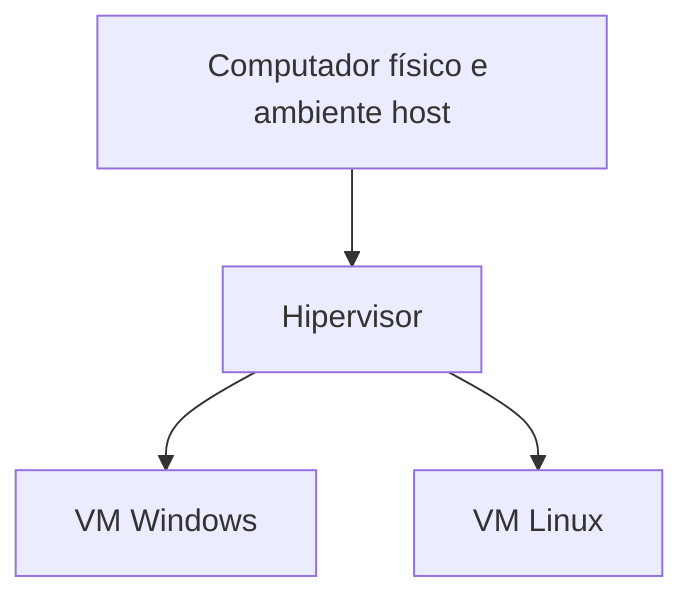
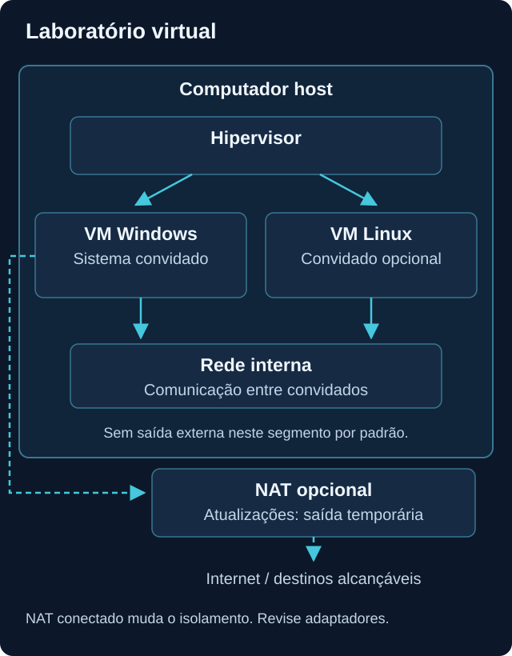
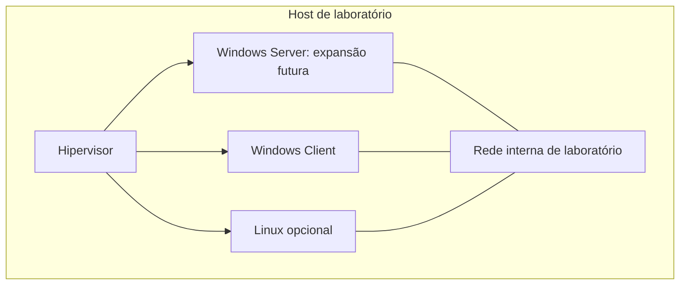

# Virtualização

<!-- markdownlint-configure-file {"MD033": {"allowed_elements": ["details", "summary"]}} -->

[← Página principal](../README.md) · [↑ Índice do módulo](README.md)

## Por que usar um laboratório virtual?

Uma VM permite estudar outro sistema, gerar eventos e testar configurações sem transformar o computador principal em ambiente de experimentos. Também facilita repetir um cenário e retornar a um estado conhecido. Essa separação depende da configuração e não garante isolamento absoluto.

## Vocabulário essencial

| Termo | Significado |
| --- | --- |
| Máquina física | Computador com CPU, RAM, armazenamento e interfaces reais. |
| Host | Ambiente físico que fornece recursos às VMs; em soluções de desktop, também inclui o sistema anfitrião. |
| Guest ou convidado | Sistema operacional que executa dentro da VM. |
| Máquina virtual | Ambiente com recursos virtuais apresentados ao convidado. |
| Hypervisor ou hipervisor | Camada que cria e gerencia a execução de VMs. |

Há hipervisores que executam diretamente sobre a máquina e soluções integradas ou instaladas no sistema do host. O laboratório inicial pode usar VirtualBox ou uma alternativa compatível com seu hardware e sistema. Confira a arquitetura do processador: uma imagem para x86 não deve ser presumida compatível com ARM sem suporte específico.

As VMs são ambientes irmãos. A VM Linux não depende de executar dentro da VM Windows.

## Recursos: o host continua precisando trabalhar

| Recurso | Decisão de planejamento |
| --- | --- |
| CPU virtual | Reservar capacidade para o host; adicionar vCPUs não garante ganho. |
| RAM | Considerar o consumo simultâneo das VMs e dos programas do host. |
| Disco virtual | Planejar crescimento, atualizações, logs e espaço para snapshots. |
| Rede | Escolher quem poderá se comunicar com a VM e por qual interface. |

Um disco virtual dinamicamente alocado pode ocupar pouco espaço no início e crescer até o limite configurado. O espaço anunciado dentro da VM não garante que o host tenha capacidade física para sustentá-lo. Comece com uma VM se os recursos não permitirem duas em paralelo.

## Snapshot, backup e clone

**Snapshot** registra um ponto de retorno da VM, podendo incluir discos, configuração e memória conforme o produto e a opção usada. Retornar a ele descarta mudanças posteriores naquele estado. Isso é útil antes de um exercício, mas pode eliminar arquivos e evidências que ainda não foram copiados.

**Backup** é uma cópia recuperável mantida conforme uma estratégia de proteção. Snapshots costumam depender da VM, de discos base ou do mesmo armazenamento: se esse conjunto falhar, o ponto de retorno pode não servir. Por isso, snapshot não substitui backup.

**Clone** cria outra VM a partir de uma existente. Um clone completo e um clone vinculado têm dependências diferentes. Revise identidades, nomes, endereços e estado antes de colocar cópias na mesma rede; não clone sistemas de produção para este laboratório.

## Redes de VM

Os nomes abaixo usam o modelo comum de produtos como VirtualBox. Outros hipervisores adotam nomes e comportamentos distintos. Firewall, roteamento, interfaces extras e configurações de encaminhamento também alteram a conectividade.

| Tipo | Internet | Comunicação com host | Comunicação com LAN | Uso em laboratório |
| --- | --- | --- | --- | --- |
| NAT | Geralmente permite saída, se o host tiver conexão. | Acesso iniciado pela VM pode existir; host iniciando conexão costuma exigir configuração adicional. | Saída para destinos alcançáveis pode existir, inclusive LAN; entrada não é direta por padrão. | Atualizar a VM de forma controlada. Não equivale a isolamento da LAN. |
| Bridge | Depende da rede física. | Pode existir como entre máquinas da rede, sujeita a controles. | VM participa da LAN, conforme rede e filtros. | Integração intencional com uma rede autorizada; não é a opção inicial deste lab. |
| Host Only | Sem saída externa por padrão. | Prevista entre host e VMs dessa rede. | Sem caminho direto por padrão. | Comunicação com o host, sabendo que ele também fica acessível. |
| Internal Network | Sem saída externa por padrão. | Sem interface direta do host nessa rede no modelo VirtualBox. | Sem caminho direto por padrão. | Experimentos entre VMs conectadas à mesma rede interna. |

Uma interface NAT não promete proteção contra acesso da VM a dispositivos que o host alcança. NAT por VM e NAT Network também podem diferir na comunicação entre convidados. Consulte o [manual de redes do VirtualBox](https://docs.oracle.com/en/virtualization/virtualbox/7.2/user/networkingdetails.html) para a versão utilizada.

Rede interna não configura automaticamente todos os endereços em todos os produtos. Se não houver DHCP, as VMs podem precisar de endereçamento coerente, assunto do próximo módulo. Ver duas placas conectadas ao mesmo nome de rede não prova que os sistemas já conseguem comunicar-se.

## Arquitetura de estudo

A rede interna reduz a conectividade externa. O caminho NAT é opcional e deve ser removido ou desconectado antes de exercícios que dependam de uma rede sem saída. Com duas interfaces, a VM pode estar na rede interna e ainda alcançar destinos externos; documente cada adaptador.

Windows Server é uma expansão para futuros estudos, não um pré-requisito para este exercício. O desenho não inclui saída externa nessa rede interna.

## Onde isso aparece em Cybersecurity?

Virtualização permite instalar agentes, observar logs, testar coleta e repetir cenários em ambiente próprio. Separar estudos do sistema principal reduz impacto de erros, mas pastas compartilhadas, área de transferência, USB, rede e falhas do software podem atravessar essa separação. Este módulo usa apenas atividades benignas, sem malware ou técnicas ofensivas.

## Exemplo: VM sem conectividade

Antes de concluir que existe uma falha, confira o objetivo. Em rede interna sem roteador, a ausência de Internet pode ser exatamente o resultado desejado. Se a VM deveria atualizar por NAT, confira adaptador conectado, endereço, rota, DNS e conexão do host. Não mude para bridge nem desabilite firewall apenas para fazer um teste funcionar.

## Lab inicial: uma VM e um ponto de retorno

O roteiro não provisiona nada automaticamente. Use mídias oficiais, licenças adequadas e um hipervisor compatível. Registre versões reais quando executar.

1. Faça inventário do host usando a página de Hardware. Reserve CPU, RAM e armazenamento para ele; consulte os requisitos oficiais do convidado escolhido.
2. Desenhe o laboratório com uma VM Windows e uma Linux opcional. Identifique o modo de cada adaptador antes de criar as VMs.
3. Instale a primeira VM com imagem oficial. Use NAT somente quando necessário para instalação e atualizações. Não crie encaminhamento público de RDP ou SSH.
4. Atualize o sistema pelas ferramentas normais. Evite habilitar integrações com arquivos do host sem necessidade. Mantenha mecanismos de segurança ativos.
5. Desligue normalmente a VM e crie um snapshot identificado como estado inicial. Registre data, versão e estado da rede.
6. Inicie a VM e crie, dentro dela, um arquivo de texto descartável chamado `teste-retorno.txt`. Não adicione nenhum outro trabalho que precise preservar.
7. Desligue a VM normalmente e restaure o snapshot. Confirme que o arquivo posterior não existe. Essa é a alteração deliberada do teste, restrita ao estado descartável da VM.
8. Com a VM desligada, selecione a rede interna para os próximos exercícios. Confirme que não ficou outra interface de saída conectada. Ter Internet indisponível nesse estado é esperado.

Se não houver recursos para executar uma VM agora, faça o diagrama e o dimensionamento. Marque o exercício como planejado, sem relatar restauração como realizada.

## O que observar e registrar

Registre recursos alocados, modo de rede, nome do snapshot, o que foi preservado e o que foi revertido. Não compartilhe imagens completas de disco. Teste recuperação de arquivos importantes por uma estratégia de backup separada, fora deste exercício de snapshot.

## Checkpoint de conhecimento

Tente responder antes de abrir a explicação. Use um exemplo do seu próprio laboratório.

### 1. Quem é o host e quem é o guest?

Ver resposta

O host fornece os recursos da máquina física; o guest é o sistema dentro da VM. O guest enxerga recursos virtuais, que continuam dependendo do host.

### 2. Por que um snapshot não é um backup suficiente?

Ver resposta

Ele pode depender da VM original e do mesmo armazenamento. Uma falha nessa base pode comprometer todos os snapshots. Backup exige cópia recuperável e estratégia própria.

### 3. Uma VM em NAT está isolada da rede local?

Ver resposta

Não necessariamente. Ela pode iniciar conexões para destinos alcançáveis pela saída do host, inclusive a LAN. NAT altera o caminho da comunicação; não é uma garantia de isolamento.

### 4. Por que uma rede interna pode não ter Internet?

Ver resposta

Ela conecta convidados no segmento virtual sem fornecer automaticamente um caminho externo. Essa ausência pode ser o objetivo do laboratório, não um defeito.

### 5. O que verificar antes de restaurar um snapshot?

Ver resposta

Se a VM é a de laboratório, qual estado será restaurado e quais mudanças serão perdidas. Preserve separadamente qualquer trabalho necessário antes da reversão.

### 6. Uma VM com rede interna e NAT continua sem saída externa?

Ver resposta

Não. A interface NAT pode oferecer saída. O isolamento depende do conjunto de adaptadores, rotas, compartilhamentos e configurações, não só do nome de uma rede.

## Mini desafio

Desenhe host, hipervisor, convidados e rede antes de criar qualquer VM. Informe recursos propostos e quando NAT será usado. Se executar o teste de snapshot, registre o resultado real da restauração do arquivo descartável; se não executar, mantenha o status planejado.

## Resumo

VMs compartilham recursos do host e permitem experimentos controlados. Rede, integrações e recuperação exigem planejamento. Snapshot facilita retorno de estado, mas não substitui backup nem garante isolamento.

[Próximo tópico → Git e GitHub](git-github.md)
