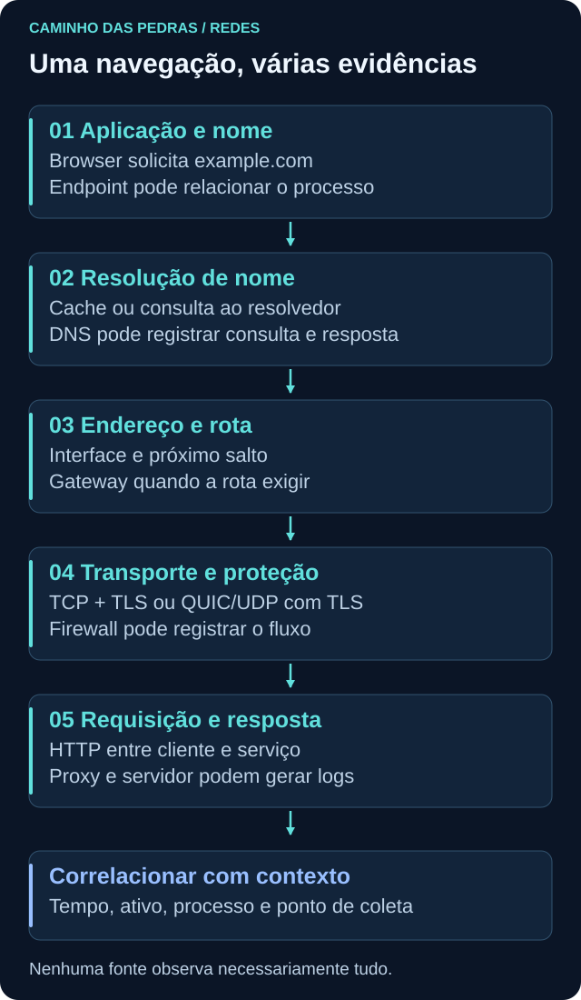
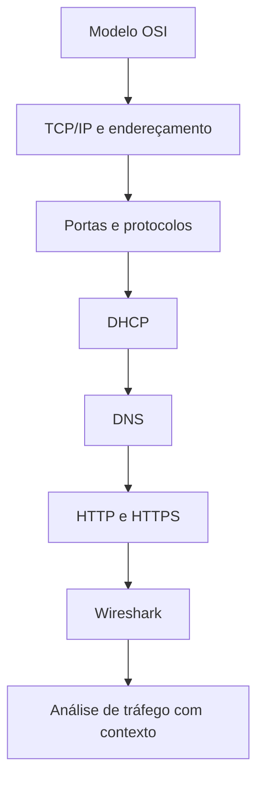
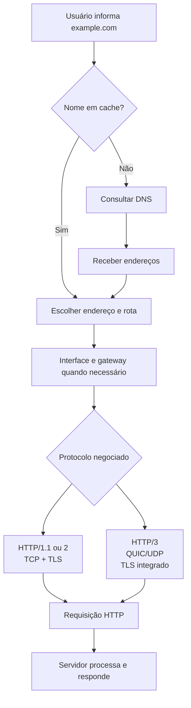
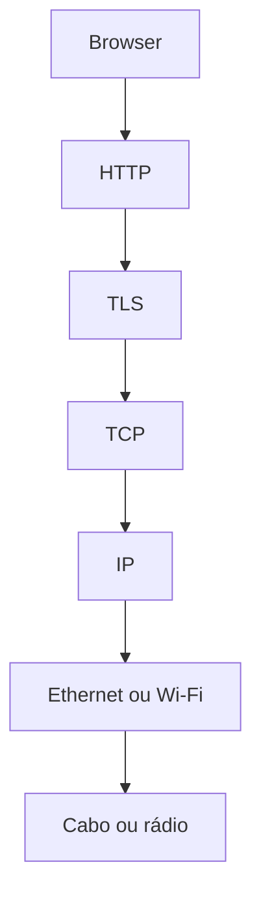
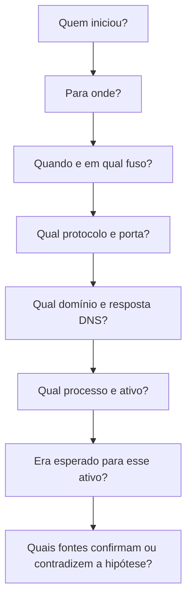
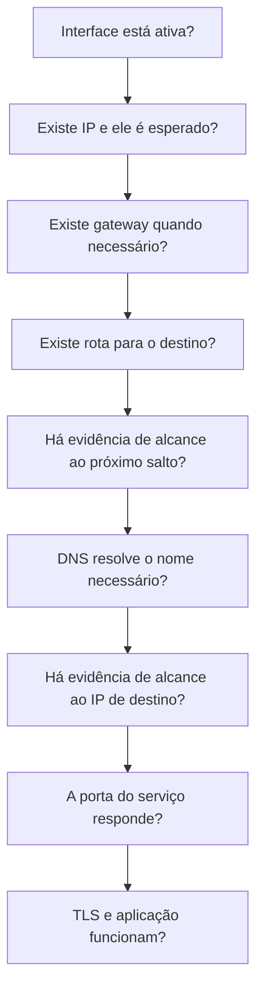

# 02 Redes

<!-- markdownlint-configure-file {"MD033": {"allowed_elements": ["details", "summary"]}} -->

[← Tópico anterior](../01-Fundamentos/README.md) · [↑ Índice do módulo](README.md) · [Página principal](../README.md) · [Próximo tópico →](modelo-osi.md)

Um computador pode executar um processo localmente. Quando esse processo começa a se comunicar, a rede passa a fazer parte da investigação: surgem destinos, nomes, portas, horários e respostas que precisam ser relacionados ao que ocorreu no sistema.

> Antes de investigar uma comunicação suspeita, você precisa entender como uma comunicação normal acontece.

Este módulo constrói essa base para Cybersecurity, SOC, Blue Team, SIEM, Detection Engineering e Threat Hunting. Você vai aprender a reconstruir uma atividade e a reconhecer o que ainda não sabe. Um IP isolado, uma porta ou uma conexão não provam atividade maliciosa. Contexto importa.



## O que você vai aprender

| Etapa | Conceitos | Entrega de estudo |
| --- | --- | --- |
| [Modelo OSI](modelo-osi.md) | Camadas, encapsulamento e perguntas de diagnóstico | Cinco problemas classificados com justificativa |
| [TCP/IP](tcp-ip.md) | IPv4, IPv6 introdutório, máscara, CIDR, gateway, rota, MAC, ARP, TCP, UDP e NAT | Mapa da configuração do próprio laboratório |
| [Portas e protocolos](portas-protocolos.md) | Origem, destino, serviço, processo e socket | Associação de conexões próprias com processos |
| [DHCP](dhcp.md) | Configuração automática, DORA e concessão | Linha do tempo fictícia de atribuição de IP |
| [DNS](dns.md) | Registros, resolvedor, cache, TTL e DNS cifrado | Comparação de respostas com horário e limitações |
| [HTTP e HTTPS](http-https.md) | Requisição, resposta, métodos, status e TLS | Ficha de uma requisição no navegador |
| [Wireshark](wireshark.md) | Interfaces, captura, filtros e análise de tráfego | Três observações de tráfego próprio |



## Como estudar e preparar o ambiente

Tenha a base do [módulo 01](../01-Fundamentos/README.md): processos, arquivos, terminal e virtualização. Use o próprio computador de laboratório ou uma VM pessoal, sem contas corporativas e sem atividades de terceiros. Consulte saídas localmente; publique apenas tabelas sintéticas revisadas.

Leia um tópico, desenhe o fluxo com suas palavras, faça a prática e responda ao checkpoint. Anote sistema, interface, horário com fuso, comando, observação, hipótese e limite. Não há necessidade de instalar servidores, mudar rotas, desativar controles ou escanear redes. O Wireshark será usado apenas na última etapa, com captura curta e autorizada.

Nos desenhos, `192.168.1.0/24` representa uma rede privada fictícia. `192.0.2.0/24`, `198.51.100.0/24`, `203.0.113.0/24` e `2001:db8::/32` são espaços de documentação. Não são destinos para testar conectividade. Consultas reais a `example.com` podem retornar outros endereços: os exemplos não afirmam qual é seu IP atual.

## Como uma comunicação acontece

O fluxo abaixo descreve uma navegação nova, com resolução de nome quando necessária. Conexões e respostas DNS podem ser reutilizadas. Há outras arquiteturas, inclusive proxies, VPNs e aplicações com resolvedor próprio.



DNS também precisa de conectividade para alcançar um resolvedor remoto. O desenho separa assuntos para facilitar o estudo, não representa todas as operações em uma ordem universal. HTTP/3 utiliza QUIC sobre UDP; não possui handshake TCP. A negociação TLS faz parte do estabelecimento de QUIC. [RFC 9114](https://www.rfc-editor.org/rfc/rfc9114.html).

## Da aplicação até o cabo ou rádio



Esta é uma simplificação de HTTPS com HTTP/1.1 ou HTTP/2. Cada nível acrescenta informações para a entrega. Em HTTP/3, o trecho de transporte usa QUIC sobre UDP, com proteção baseada em TLS. No destino, os protocolos interpretam as informações recebidas até entregar os dados à aplicação.

## Redes na visão de Cybersecurity

| Conceito | Como ajuda | Limite da informação |
| --- | --- | --- |
| IP | Localizar origem e destino no ponto observado | Não identifica sozinho uma pessoa |
| Porta | Levantar hipótese sobre o serviço | Porta convencional não confirma aplicação |
| DNS | Relacionar nomes, respostas e horários | Consulta não prova conexão posterior |
| TCP | Examinar estabelecimento, estados e encerramento | Conexão estabelecida não prova sucesso da aplicação |
| UDP | Observar datagramas e protocolos que os utilizam | Ausência de handshake TCP é comportamento normal |
| HTTP | Examinar requisições e respostas quando visíveis | Status isolado não determina intenção |
| TLS | Entender proteção e negociação criptográfica | Cifrado não significa benigno |
| DHCP | Associar concessão, dispositivo e intervalo | É preciso contexto de identidade e relógios |
| ARP | Examinar vizinhança IPv4 local | Não revela o MAC do servidor remoto através de roteadores |
| Roteamento | Verificar próximo salto e interface | Caminho de ida pode diferir do de volta |
| Wireshark | Examinar pacotes no ponto de captura | A captura pode ser incompleta |

## Começando a pensar como analista



Acrescente: a comunicação saiu da rede local? Qual gateway foi usado? A conexão foi estabelecida? Houve resposta e encerramento? O conteúdo estava cifrado? Quais dados faltam? Esse raciocínio será reutilizado em SOC, SIEM, Detection Engineering e Threat Hunting, sem depender de uma ferramenta específica.

### Não decore apenas portas

Reconhecer algumas portas acelera a leitura, mas não substitui investigação. Ao encontrar `443`, pergunte por processo, destino, domínio, certificado quando visível, volume, frequência e contexto. Uma atualização legítima e uma comunicação indevida podem usar a mesma porta. A identificação do protocolo também precisa de evidência.

## Cenário completo: uma navegação

Considere uma VM pessoal abrindo um site de teste. Este é um cenário fictício, não uma captura real:

1. O sistema já possui configuração de rede válida.
2. DHCP pode ter fornecido endereço, máscara, gateway, DNS e prazo da concessão.
3. O usuário informa um domínio no navegador.
4. A aplicação obtém endereços via cache ou resolução DNS.
5. O sistema consulta as rotas para escolher interface e próximo salto.
6. Pacotes saem pela interface; em uma LAN IPv4, ARP pode resolver o MAC do próximo salto.
7. O gateway encaminha para outra rede quando a rota o exige.
8. TCP ou QUIC estabelece a comunicação adequada ao protocolo escolhido.
9. Para HTTPS, TLS protege o transporte, integrado a QUIC no HTTP/3.
10. HTTP leva a requisição da aplicação.
11. O servidor responde; a conexão pode continuar disponível para outras requisições.
12. Diferentes componentes podem registrar partes dessa atividade, se a coleta estiver habilitada.

### Como um analista enxergaria isso?

> Nenhuma fonte de log enxerga necessariamente tudo.

| Fonte | Visão possível | O que pode faltar |
| --- | --- | --- |
| Endpoint ou EDR | Processo, usuário e conexão, conforme coleta | Conteúdo HTTP ou atividade fora do sensor |
| DNS | Nome consultado, cliente, resposta e horário | Processo e conteúdo da página |
| Firewall | Origem, destino, portas, ação e eventualmente estado | Caminho HTTP cifrado e processo local |
| Proxy | Informações das requisições que intermedeia | Tráfego que não passa por ele; conteúdo TLS sem inspeção |
| Servidor | Requisições recebidas e resultado da aplicação | Tentativas bloqueadas antes de chegar |
| Wireshark | Pacotes visíveis na interface e no intervalo | Tráfego de outro ponto ou conteúdo cifrado |
| SIEM | Eventos efetivamente enviados e processados | Tudo que não foi coletado, enviado ou retido |

Essas limitações também existem em cloud e ferramentas de monitoramento. Não aprofundaremos produtos aqui. Antes de cruzar registros, confira fuso, sincronização dos relógios, intervalo, retenção e posição do sensor.

### Correlação: relacionar partes da mesma atividade

Exemplo inteiramente sintético, com horários no mesmo fuso:

```text
10:00:01 DNS       lab-01 consulta example.com → 203.0.113.10
10:00:02 Endpoint  navegador no lab-01 → 203.0.113.10:443 TCP
10:00:02 Firewall  192.168.1.20:52341 → 203.0.113.10:443 permitido
10:00:03 Servidor  requisição recebida no serviço de teste
```

Essa resposta DNS é inventada para o exercício. A proximidade temporal e os endereços apoiam uma hipótese, mas não são uma prova automática de que todos os registros pertencem à mesma requisição. Um IP pode hospedar vários domínios; NAT ou proxy podem alterar a origem vista pelo servidor. Busque também porta de origem, mapeamento NAT, identificação do ativo e identificador de requisição quando existir.

## Quando a rede não funciona



São perguntas, não um script que muda configurações. Teste uma hipótese por vez e registre a evidência. Um ping sem resposta pode significar filtragem de ICMP, não host desligado. DNS resolver, ICMP responder, porta TCP aceitar e aplicação funcionar são resultados diferentes. Os comandos e limites estão em [TCP/IP](tcp-ip.md).

Troubleshooting e investigação compartilham o ciclo: observar, criar hipótese, testar, coletar evidência, eliminar possibilidades e documentar. Comece pelo sintoma mais específico disponível, sem atribuir toda falha à rede ou toda anomalia a um ataque.

## Comandos para consulta rápida

| Windows | Para observar |
| --- | --- |
| `ipconfig /all` | Interfaces, endereços, DNS e concessão quando disponível |
| `Get-NetIPConfiguration` | Configuração IP por interface |
| `Get-NetRoute` e `route print` | Rotas e próximos saltos |
| `Get-NetTCPConnection` | Endereços, portas, estado e PID local |
| `Get-NetUDPEndpoint` | Endpoints UDP locais e PID |
| `Resolve-DnsName example.com` | Resposta DNS para o nome |
| `Test-NetConnection example.com -Port 443` | Tentativa de conexão TCP ao serviço |
| `arp -a` | Cache de vizinhos IPv4 |
| `tracert example.com` | Respostas intermediárias ao diagnóstico |

| Linux | Para observar |
| --- | --- |
| `ip addr` | Endereços, prefixos e interfaces |
| `ip route` | Rotas IPv4; use `ip -6 route` para IPv6 |
| `ip neigh` | Vizinhos e estado da resolução local |
| `ss -tulpen` | Sockets em escuta e endpoints UDP |
| `ss -tnp` | Conexões TCP e processo quando permitido |
| `dig example.com` ou `nslookup example.com` | Resposta DNS |
| `ping -c 4 example.com` | Poucas tentativas ICMP, com limites de interpretação |
| `traceroute example.com` | Respostas a sondas ao longo do caminho |

Disponibilidade e permissões variam conforme sistema, distribuição e pacotes instalados. Comandos de consulta local não alteram configurações; consultas DNS, ping, traceroute e teste de porta geram tráfego. Use somente os destinos de teste indicados ou o próprio laboratório autorizado.

## Glossário rápido

| Termo | Significado neste módulo |
| --- | --- |
| IP | Endereço de interface em um contexto de rede |
| MAC | Endereço de enlace usado no segmento local |
| Porta | Número usado por TCP ou UDP para distinguir endpoints |
| Protocolo | Regras e formato de uma comunicação |
| DNS | Sistema distribuído de nomes e registros |
| DHCP | Protocolo de distribuição de configuração de rede |
| Gateway | Próximo salto para destinos alcançados por um roteador |
| Rota | Regra que orienta a escolha do caminho de saída |
| TCP | Transporte com conexão e fluxo de bytes confiável e ordenado |
| UDP | Transporte de datagramas sem garantias de entrega e ordem próprias |
| HTTP | Protocolo de aplicação para requisições e respostas |
| HTTPS | HTTP com proteção criptográfica de transporte |
| TLS | Protocolo para negociar proteção, integridade e autenticação |
| Packet | Pacote, frequentemente uma unidade IP neste contexto |
| Frame | Quadro de enlace que carrega dados no segmento |
| Socket | Abstração do sistema para comunicação; pode ter endereço e porta |
| NAT | Tradução de endereços e, em algumas modalidades, portas |
| Firewall | Controle de comunicação por regras e contexto |
| Proxy | Intermediário de determinadas comunicações de aplicação |
| PCAP | Formato de arquivo de captura; o termo também aparece genericamente para capturas |

## Mini desafio e entrega do módulo

Desenhe uma navegação do seu laboratório e crie uma tabela sintética com uma observação de configuração IP, uma consulta DNS e uma conexão. Para cada linha, registre qual fonte poderia sustentá-la e o que ela não prova. Não é necessário ter firewall, EDR ou SIEM instalado: explique conceitualmente a contribuição dessas fontes.

- [ ] Distingo IP, MAC, porta, processo e serviço.
- [ ] Explico destino local, gateway e rota default.
- [ ] Diferencio resolução DNS, transporte, TLS e resposta HTTP.
- [ ] Relaciono DHCP e horário sem atribuir identidade apenas pelo IP.
- [ ] Sei escolher interface e distinguir os dois tipos de filtro.
- [ ] Documento limitações e removo dados sensíveis antes de publicar.

## Checkpoint

Responda antes de abrir cada explicação. O objetivo é justificar a próxima pergunta, não apenas lembrar um termo.

<details>
<summary>Um domínio resolveu, mas o site não abriu. O que falta investigar?</summary>

Verifique endereço escolhido, rota, alcance do serviço, negociação TLS e resposta HTTP. A resolução responde à pergunta sobre o nome, não garante as etapas seguintes.

</details>

<details>
<summary>Um alerta contém apenas um IP. Que contexto você buscaria?</summary>

Horário e fuso, origem e destino, portas, protocolo, ativo, concessão DHCP, NAT, processo, domínio e comportamento esperado. Diferencie cada observação de uma hipótese.

</details>

<details>
<summary>Um firewall registrou permitido. O usuário recebeu a página?</summary>

Não é possível concluir só com essa ação. O tráfego foi permitido naquele ponto, mas pode falhar no retorno, no TLS ou na aplicação. Procure outras fontes.

</details>

<details>
<summary>Não existe consulta DNS no intervalo capturado. O nome não foi usado?</summary>

Pode ter havido cache, consulta anterior, resolvedor próprio ou DNS cifrado. A janela e o ponto de captura limitam a conclusão.

</details>

<details>
<summary>Dois dispositivos aparecem com o mesmo IP público. São o mesmo ativo?</summary>

Não necessariamente. NAT pode compartilhar o endereço. Para distinguir atividades, procure portas traduzidas, horários e registros internos.

</details>

<details>
<summary>O que você pode entregar sem publicar uma captura sensível?</summary>

Um desenho próprio e uma tabela sintética com perguntas, método, observações generalizadas e limitações. Não inclua PCAP bruto, tokens, cookies, credenciais ou dados corporativos.

</details>

## Resumo e próximo passo

Você já tem um roteiro para perguntar quem fala com quem, como e com quais evidências. Comece por [Modelo OSI](modelo-osi.md). Depois de concluir toda a sequência, siga para [03 Linux e Windows](../03-Linux-e-Windows/README.md): entender a comunicação prepara você para investigar os processos, serviços, usuários, autenticações e eventos que os sistemas geram.

[← Tópico anterior](../01-Fundamentos/README.md) · [↑ Índice do módulo](README.md) · [Página principal](../README.md) · [Próximo tópico →](modelo-osi.md)
