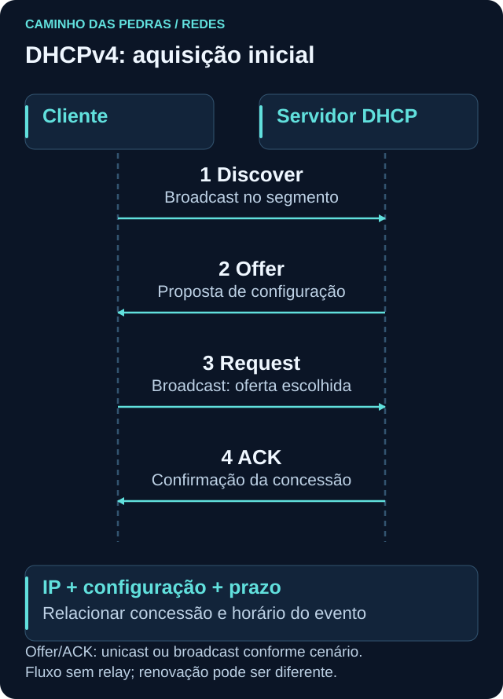
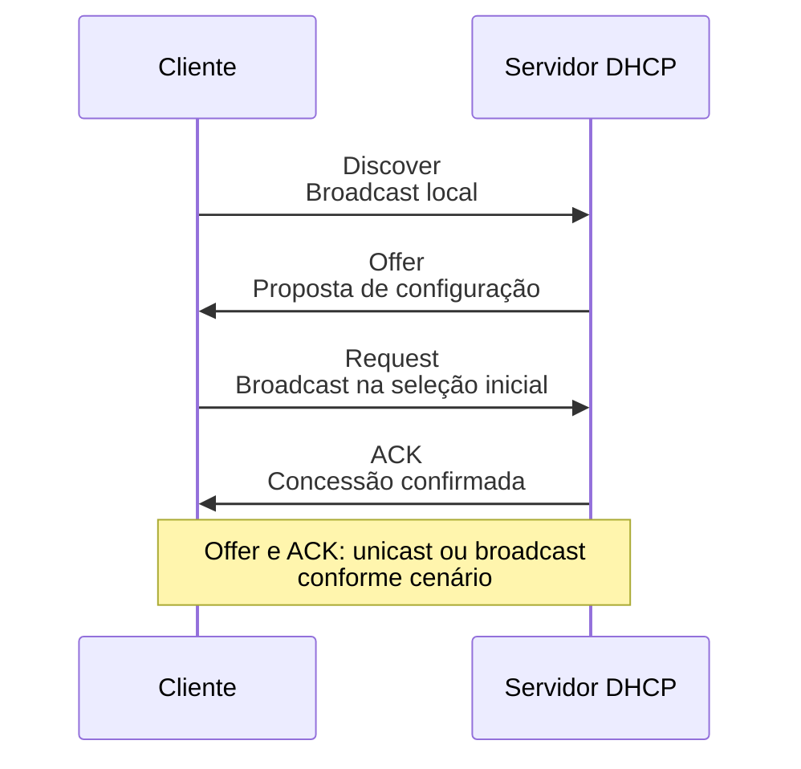

# DHCP

<!-- markdownlint-configure-file {"MD033": {"allowed_elements": ["details", "summary"]}} -->

[← Tópico anterior](portas-protocolos.md) · [↑ Índice do módulo](README.md) · [Página principal](../README.md) · [Próximo tópico →](dns.md)

## Por que isso importa

Imagine configurar manualmente endereço, máscara, gateway e DNS em cada dispositivo que chega a uma rede. Além do trabalho repetitivo, endereços duplicados e parâmetros inconsistentes seriam fáceis de introduzir. DHCP permite distribuir configuração de forma coordenada.

Para quem investiga, o benefício vai além da configuração: a concessão ajuda a responder **quem possuía determinado IP naquele horário?** Ainda será preciso relacionar dispositivo, identidade, endpoint e contexto.

## O que o DHCP fornece

No DHCPv4, um cliente solicita parâmetros a um servidor autorizado. O servidor pode fornecer IP, máscara de sub-rede, gateway, servidores DNS e prazo de concessão, além de outras opções. Nem toda opção precisa estar presente; a configuração efetiva depende do ambiente. Uma reserva pode fazer um cliente receber repetidamente o mesmo IP.

| Informação | Para que serve | O que observar |
| --- | --- | --- |
| Endereço IPv4 | Endereçar a interface | Se pertence à rede esperada |
| Máscara | Identificar o prefixo local | Se corresponde à configuração da rede |
| Gateway | Encaminhar para outras redes | Se existe quando necessário |
| DNS | Indicar resolvedores | Quais estão configurados |
| Lease | Definir concessão temporal | Início, validade e renovações quando visíveis |

DHCP não é obrigatório para todo host: configuração estática também existe. Encontrar um IP não prova que ele veio de DHCP. Esta página explica DHCPv4. DHCPv6 tem mensagens e funcionamento próprios; IPv6 também pode usar SLAAC, e o gateway IPv6 normalmente é aprendido por anúncios de roteador.

## DORA: aquisição inicial em quatro momentos



| Mensagem | Quem envia | Intenção |
| --- | --- | --- |
| Discover | Cliente | Procurar servidores disponíveis |
| Offer | Servidor | Oferecer uma configuração |
| Request | Cliente | Solicitar a oferta escolhida |
| Acknowledge, ACK | Servidor | Confirmar a concessão |



No caso inicial comum, o cliente ainda não tem endereço utilizável e usa broadcast para descobrir o serviço. Pode receber mais de uma oferta e selecionar uma. O Request de seleção também informa aos servidores qual oferta foi escolhida. Offer não é a confirmação final. No DHCPv4, o servidor usa UDP 67 e o cliente UDP 68. [RFC 2131](https://www.rfc-editor.org/rfc/rfc2131.html).

Broadcast local não atravessa roteadores como uma mensagem comum de ponta a ponta. Um relay DHCP configurado pode encaminhar solicitações entre cliente e servidor em redes diferentes. O desenho omite esse intermediário para mostrar o caso simples; não conclua que o servidor precisa estar sempre no mesmo segmento.

## Lease: um endereço dentro de um intervalo

Uma concessão autoriza o uso por determinado período. O cliente pode renová-la antes do vencimento; renovação normalmente não repete todo o DORA de aquisição inicial. O endereço pode continuar o mesmo por bastante tempo ou voltar a ser atribuído a outro cliente conforme o ambiente.

Exemplo inteiramente fictício, com horários no mesmo dia e fuso:

| Intervalo | IP | Dispositivo de laboratório |
| --- | --- | --- |
| 09:00 a 11:00 | `192.168.1.20` | lab-a |
| 13:00 a 15:00 | `192.168.1.20` | lab-b |

Um evento das 10:00 seria investigado no contexto de lab-a; um das 14:00, no de lab-b. A tabela não comprova quem operou o dispositivo. Horários de concessão, renovações, reservas, logs disponíveis e sincronização dos relógios precisam ser confirmados em uma investigação real.

**IP + horário + DHCP + identidade + endpoint + contexto** oferece uma base muito melhor que apenas o endereço. MAC ou identificador do cliente também não provam identidade pessoal e podem variar.

## Prática segura: observar a configuração existente

Use apenas o dispositivo pessoal ou VM de laboratório. Não crie servidor DHCP em rede compartilhada, não libere concessões e não force mudanças para produzir uma captura.

Windows:

```powershell
ipconfig /all
```

Escolha a interface ativa. Procure DHCP habilitado, endereço, máscara, gateway, servidores DNS, servidor DHCP e horários da concessão, quando mostrados. Adaptadores virtuais ou desconectados podem ter informações diferentes. Registre a interface junto dos dados.

Linux:

```bash
ip addr
ip route
```

Esses comandos mostram endereço, prefixo e rota, mas não necessariamente servidor DHCP e validade. Com NetworkManager, `nmcli device show` pode apresentar opções recebidas. Em sistemas com systemd-resolved, `resolvectl status` mostra informações DNS. Disponibilidade, formato e detalhes de concessão variam conforme cliente e distribuição; ausência desses campos na saída não prova que DHCP está desativado.

## Troubleshooting sem modificar a rede

| Observação | Hipótese a verificar | Próxima evidência |
| --- | --- | --- |
| Interface sem endereço esperado | Link, associação ou configuração falhou | Estado da interface e configuração do cliente |
| IPv4 link-local em `169.254.0.0/16` | Pode ter ocorrido autoconfiguração por falta de concessão | Estado DHCP e histórico; o endereço sozinho não prova a causa |
| IP válido, sem acesso externo | Gateway, rota ou política podem diferir do esperado | Tabela de rotas e testes pontuais autorizados |
| Nome não resolve | DNS fornecido ou usado pode estar inadequado | Configuração efetiva e consulta ao nome de teste |

Não troque DNS ou IP “para ver se melhora” antes de registrar o estado. Alterações podem ocultar a causa e interromper outras atividades.

## Pensamento de analista

Quem possuía o IP no horário do evento? Qual servidor emitiu a concessão? O relógio dos registros está alinhado? O identificador do cliente corresponde ao inventário e à telemetria do endpoint? Há IP estático, reserva ou NAT? DHCP pode apoiar a atribuição a um dispositivo, mas não documenta cada conexão que ele fez.

Em SOC e SIEM, registros de concessão podem enriquecer a linha do tempo. Sem esses dados, escreva que a atribuição histórica permanece incerta, mesmo que o endereço esteja atribuído a uma máquina agora.

## Mini desafio

Identifique os parâmetros que seu cliente de laboratório permite consultar. Marque como “não disponível nesta fonte” o que não aparecer. Depois crie uma linha do tempo fictícia com duas concessões não sobrepostas do mesmo IP e um evento em cada intervalo. Explique quais outras fontes usaria para confirmar ativo e usuário. Publique apenas a versão sintética, sem nomes internos ou identificadores reais.

## Checkpoint

Responda antes de abrir cada explicação. O objetivo é justificar a próxima pergunta, não apenas lembrar um termo.

<details>
<summary>Receber Offer significa que o endereço já foi confirmado?</summary>

Não. Offer é uma proposta. No fluxo inicial, o cliente solicita a oferta escolhida e o servidor confirma com ACK.

</details>

<details>
<summary>Uma renovação precisa sempre mostrar as quatro mensagens DORA?</summary>

Não. O fluxo DORA descreve a aquisição inicial comum. Uma renovação pode trocar Request e ACK sem repetir a descoberta.

</details>

<details>
<summary>Um IP estava em uma máquina ontem e está em outra hoje. Isso é possível?</summary>

Sim. Concessões podem expirar e endereços serem reutilizados. A investigação deve relacionar o evento ao intervalo correto.

</details>

<details>
<summary>ip addr mostrou um endereço, mas não mostrou lease. Ele é estático?</summary>

Não é possível concluir. Essa ferramenta não apresenta necessariamente os detalhes do cliente DHCP; consulte a fonte adequada à distribuição.

</details>

<details>
<summary>O servidor DHCP está em outra sub-rede. O desenho DORA está errado?</summary>

O desenho simplifica o caso local. Um relay configurado pode intermediar a comunicação entre redes.

</details>

<details>
<summary>Uma concessão identifica quem realizou uma ação?</summary>

Ela ajuda a associar endereço e cliente naquele intervalo. Usuário, processo e intenção exigem outras fontes e contexto.

</details>

## Resumo e próximo passo

DHCP fornece configuração e contexto temporal. Em [DNS](dns.md), acompanhe como nomes se tornam respostas que orientam a conexão.

[← Tópico anterior](portas-protocolos.md) · [↑ Índice do módulo](README.md) · [Página principal](../README.md) · [Próximo tópico →](dns.md)
