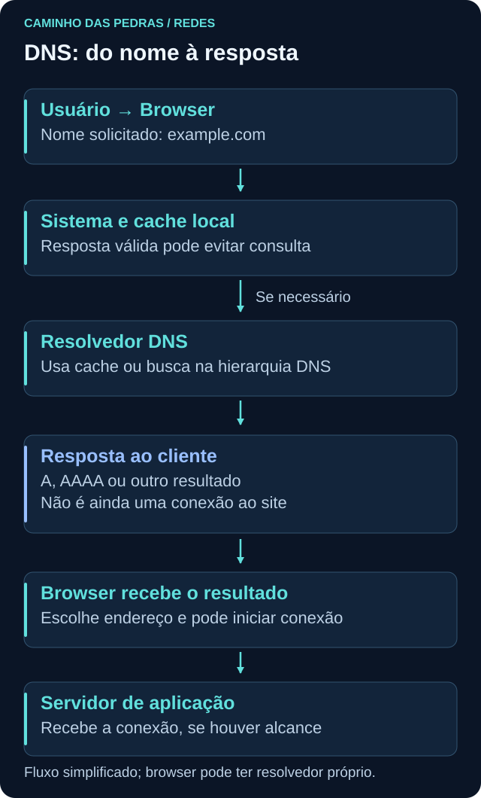
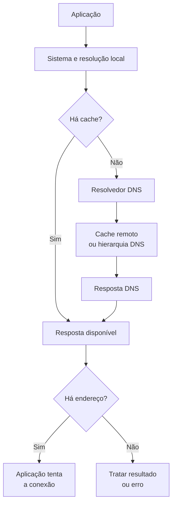

# DNS

<!-- markdownlint-configure-file {"MD033": {"allowed_elements": ["details", "summary"]}} -->

[← Tópico anterior](dhcp.md) · [↑ Índice do módulo](README.md) · [Página principal](../README.md) · [Próximo tópico →](http-https.md)

Como o computador sabe para qual IP deve enviar uma conexão quando você digita um nome como `example.com`?

## Por que isso importa

A aplicação precisa obter um endereço antes de se conectar por IP a um serviço identificado por nome. DNS é um sistema distribuído de nomes e registros que participa dessa descoberta. Para o Blue Team, relacionar consulta, resposta, cliente e horário ajuda a reconstruir a atividade, sem confundir “consultou” com “acessou”.

## Como a resolução funciona

A aplicação pode pedir resolução ao sistema operacional. Caches locais podem responder; caso contrário, um resolvedor recursivo configurado pode buscar a informação, usando seu próprio cache ou consultando a hierarquia DNS. Servidores raiz, de domínio de topo e autoritativos têm papéis diferentes. O resolvedor não precisa visitar todos eles em toda consulta.





O fluxo é simplificado. Browsers podem ter cache e resolvedor próprios; arquivo hosts e regras locais podem participar da resolução. DNS pode retornar vários endereços, aliases ou nenhum endereço. A escolha de IPv4 ou IPv6 depende do cliente e do ambiente. DNS não transporta a página do site nem estabelece a conexão HTTP.

## Registros que você precisa reconhecer

| Tipo | O que representa | Como ajuda na leitura |
| --- | --- | --- |
| A | Endereço IPv4 | Candidato a destino IPv4 |
| AAAA | Endereço IPv6 | Candidato a destino IPv6 |
| CNAME | Alias para outro nome | A resolução pode continuar por outro nome |
| MX | Servidor de e-mail e preferência | Não é o servidor web necessariamente |
| NS | Servidor autoritativo de uma zona | Indica responsabilidade pelos dados da zona |
| TXT | Texto associado ao nome | Pode transportar políticas e verificações de serviços |

Não espere todos os tipos em todo domínio. Um TXT não é código a executar. Um nome pode ter respostas diferentes conforme tipo, horário, resolvedor e localização. Conceitos e tipos são descritos nas [RFC 1034](https://www.rfc-editor.org/rfc/rfc1034.html) e [RFC 1035](https://www.rfc-editor.org/rfc/rfc1035.html).

## TTL e cache

TTL indica por quanto tempo um registro pode permanecer em cache, em segundos. Um valor menor numa consulta repetida pode refletir tempo restante no cache, não alteração do servidor. Mudanças na origem podem levar tempo para aparecer onde ainda há respostas válidas armazenadas.

Compare consultas preservando nome, tipo, resolvedor e horário. Uma resposta diferente não prova manipulação: balanceamento, CDN e atualização legítima também produzem variações. Ausência de consulta de rede pode ser compatível com uma resposta em cache. Também há cache de respostas negativas, não apenas de endereços encontrados.

### Resultado DNS não é sucesso da aplicação

`NXDOMAIN` indica que o nome consultado não existe segundo a resposta recebida. Uma resposta sem registro do tipo pedido não é necessariamente NXDOMAIN. Timeout significa que a ferramenta não obteve resposta no prazo, sem determinar sozinho a causa. `SERVFAIL` indica falha no processamento da resolução, também com causas distintas.

## Prática no Windows

Em PowerShell no próprio laboratório:

```powershell
Resolve-DnsName example.com
Resolve-DnsName example.com -Type A
Resolve-DnsName example.com -Type AAAA
nslookup example.com
ipconfig /displaydns
```

Observe nome, tipo, endereço, TTL quando mostrado e servidor consultado quando informado pela ferramenta. `ipconfig /displaydns` lê o cache do sistema e pode conter nomes pessoais; não publique a saída. A consulta do browser pode seguir um caminho diferente da ferramenta. Não limpe o cache apenas para “forçar” o resultado do exercício.

## Prática no Linux

```bash
dig example.com
dig example.com A
dig example.com AAAA
nslookup example.com
```

Em `dig`, observe `status`, a seção `ANSWER`, TTL, `SERVER` e tempo da consulta. O comando padrão costuma pedir A. `dig` e `nslookup` dependem dos pacotes instalados na distribuição; se um não existir, use a ferramenta disponível e documente a limitação. Essas consultas geram tráfego ao resolvedor configurado, mas não abrem uma sessão web com o domínio.

Para comparação pontual de registros, consulte também `example.org` usando a mesma ferramenta. Faça poucas consultas manuais, sem laços nem geração de volume. Não espere os valores numéricos dos diagramas: são exemplos inventados.

| Campo da ficha | O que anotar na versão privada |
| --- | --- |
| Momento | Data, hora e fuso |
| Origem | Dispositivo de laboratório |
| Consulta | Nome e tipo |
| Contexto | Ferramenta e resolvedor quando conhecido |
| Resposta | Código, registros e TTL disponíveis |
| Limite | Cache, caminho do browser e informações ausentes |

## DNS cifrado e visibilidade

DNS over TLS (DoT) protege DNS usando TLS. DNS over HTTPS (DoH) transporta consultas e respostas DNS via HTTPS. Um observador intermediário pode enxergar a comunicação com o resolvedor, mas não os nomes dentro do canal protegido. Endpoint, aplicação ou resolvedor podem ter outras informações, dependendo de coleta e configuração.

Isso muda os limites de monitoramento, não a obrigação de usar as políticas do ambiente. Não é necessário alterar configurações de DNS para este exercício. As referências são [RFC 7858](https://www.rfc-editor.org/rfc/rfc7858.html) e [RFC 8484](https://www.rfc-editor.org/rfc/rfc8484.html).

## DNS em Cybersecurity

Domínio recém observado no ambiente, frequência elevada, volume incomum ou concentração de consultas em um endpoint podem justificar perguntas. “Novo para este sensor” não significa “registrado recentemente no mundo”. Domínio raro não significa malicioso; muitas consultas também não provam ataque.

Uma instalação, atualização, erro de aplicação, telemetria ou comportamento de cache podem mudar o padrão. Compare com a função do ativo, histórico e processo quando outra fonte o informar. Um log do resolvedor pode mostrar como cliente um encaminhador, não a estação original.

### Pensamento de analista

Qual endpoint consultou? Qual nome e tipo? Quando, por qual resolvedor e com qual resposta? Houve repetição? Existe conexão posterior para algum dos endereços retornados? Qual processo é conhecido na telemetria do endpoint? A consulta pode ter sido antecipação do browser sem visita efetiva? Registre a hipótese com seu grau de sustentação.

## Troubleshooting e mini desafio

Resolva A e AAAA de `example.com` e `example.org`, anote TTL quando disponível e repita uma vez após um pequeno intervalo. Compare sem esperar que os valores mudem obrigatoriamente. Se não houver AAAA, anote ausência daquele tipo, não indisponibilidade geral do domínio.

Crie duas hipóteses para “resolveu, mas não conectou” e duas para “browser abriu, mas não há consulta nesta captura”. Use rota, transporte, cache e DNS cifrado para justificar as próximas evidências. Entregue tabela sintética, não histórico completo de navegação.

## Checkpoint

Responda antes de abrir cada explicação. O objetivo é justificar a próxima pergunta, não apenas lembrar um termo.

<details>
<summary>Consultar um domínio prova que o usuário abriu a página?</summary>

Não. Pode ser resolução antecipada, atividade de fundo ou consulta sem conexão posterior. Correlacione com endpoint e aplicação.

</details>

<details>
<summary>TTL menor na segunda resposta prova problema?</summary>

Não. Pode representar tempo restante de uma resposta em cache. Compare contexto e registros antes de concluir.

</details>

<details>
<summary>A retornou endereço, mas AAAA não. O domínio deixou de existir?</summary>

Não. Tipos diferentes podem ter resultados diferentes. Ausência de AAAA não elimina um A válido.

</details>

<details>
<summary>O domínio é raro no SIEM. Ele é necessariamente recém-criado e malicioso?</summary>

Não. A novidade pode ser apenas para a coleta ou janela consultada. Frequência, função do ativo e outras fontes precisam ser avaliadas.

</details>

<details>
<summary>O filtro dns não mostrou a consulta do browser. O que pode explicar?</summary>

Cache, resolvedor próprio, DoH ou DoT, interface errada ou janela incompleta. O filtro de DNS convencional não revela automaticamente o conteúdo cifrado.

</details>

<details>
<summary>O resolvedor respondeu, mas TCP falhou. O que você investigaria?</summary>

Endereço escolhido, família IP, rota, alcance da porta, política e caminho de retorno. A falha pode estar depois da resolução.

</details>

## Resumo e próximo passo

DNS relaciona nomes a respostas em um contexto e momento. Em [HTTP e HTTPS](http-https.md), acompanhe a requisição que pode acontecer depois dessa resolução.

[← Tópico anterior](dhcp.md) · [↑ Índice do módulo](README.md) · [Página principal](../README.md) · [Próximo tópico →](http-https.md)
