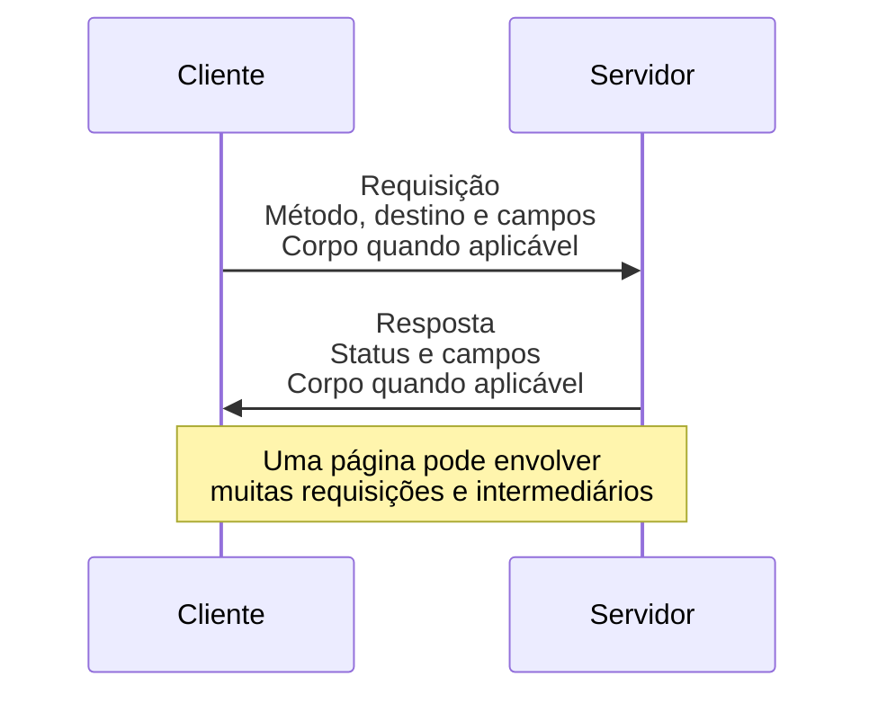
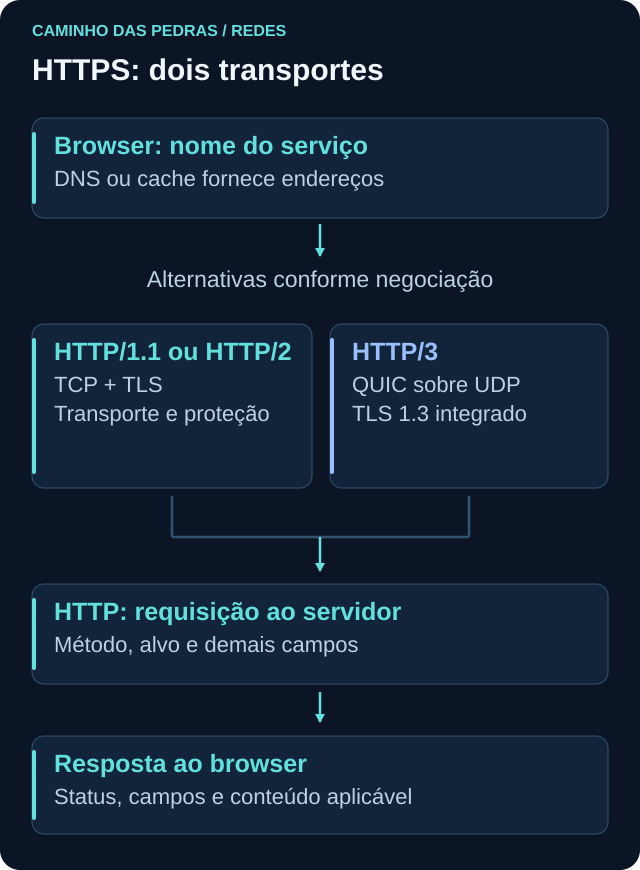

# HTTP e HTTPS

<!-- markdownlint-configure-file {"MD033": {"allowed_elements": ["details", "summary"]}} -->

[← Tópico anterior](dns.md) · [↑ Índice do módulo](README.md) · [Página principal](../README.md) · [Próximo tópico →](wireshark.md)

## Por que isso importa

HTTP é um protocolo de aplicação. Ele define a semântica de requisições e respostas, permitindo que cliente e servidor expressem o recurso desejado, a operação e o resultado. HTTPS é HTTP transportado com proteção criptográfica usando TLS.

HTTPS protege o transporte, mas não garante que o conteúdo seja benigno ou que o destino mereça sua confiança. Um site pode ter certificado válido e ainda apresentar conteúdo enganoso. Para investigar, separe proteção do canal, identidade autenticada e comportamento da aplicação.

## Requisição e resposta

O cliente envia uma **request** e recebe uma **response** do servidor ou de um intermediário. Um navegador normalmente faz várias requisições para montar uma página, possivelmente para vários nomes. Elas não precisam criar uma nova conexão a cada vez.



| Elemento | Significado | Exemplo sintético |
| --- | --- | --- |
| Método | Intenção da operação | `GET` |
| Host ou autoridade | Nome do serviço solicitado | `example.com` |
| Path | Caminho do recurso | `/` |
| Headers | Campos de metadados | `Content-Type: text/html` |
| Body | Corpo com conteúdo, quando aplicável | HTML na resposta |
| Status code | Resultado comunicado na resposta | `200` |

Exemplo textual simplificado de HTTP/1.1, sem dados reais:

```http
GET / HTTP/1.1
Host: example.com
Accept: text/html
```

Resposta ilustrativa:

```http
HTTP/1.1 200 OK
Content-Type: text/html

<p>Página de laboratório</p>
```

Esses trechos mostram apenas os campos relevantes para leitura, não uma mensagem completa para implementar um servidor. HTTP/2 e HTTP/3 têm representação no fio diferente, incluindo campos como `:method` e `:authority`; a semântica continua reconhecível no DevTools. URLs, caminhos e parâmetros também podem conter dados sensíveis.

## Métodos: intenção não é autorização

| Método | Semântica principal | Cuidado ao interpretar |
| --- | --- | --- |
| GET | Pedir representação de um recurso | Uma consulta pode aparecer em logs mesmo sem corpo |
| HEAD | Pedir metadados como em GET, sem corpo de resposta | Ausência de corpo é esperada |
| POST | Pedir processamento do conteúdo enviado | Não significa sempre criar um registro |
| PUT | Criar ou substituir o estado do recurso alvo conforme a interface | Não é apenas um sinônimo de POST |
| DELETE | Pedir remoção da associação do recurso alvo | Não prova apagamento físico nem sucesso |

O servidor decide autorização e execução. Aqui você observará navegação comum, sem enviar PUT ou DELETE para serviços públicos. Métodos e semântica são definidos na [RFC 9110](https://www.rfc-editor.org/rfc/rfc9110.html).

## Status: o que a resposta informa

| Grupo | Leitura inicial | Exemplos |
| --- | --- | --- |
| 1xx | Informação intermediária | `100 Continue` |
| 2xx | Requisição tratada com sucesso conforme o código | `200 OK` |
| 3xx | Redirecionamento ou outra ação relacionada à representação | `301`, `302`; `304` trata validação de cache |
| 4xx | Requisição não atendida por condição atribuída ao cliente | `400`, `401`, `403`, `404` |
| 5xx | Falha do servidor ou de intermediário no atendimento | `500`, `503` |

`301` indica redirecionamento permanente e `302`, temporário. `400` aponta uma requisição que não pôde ser processada por erro do cliente. `401` solicita autenticação válida; `403` indica recusa de atendimento, sem ser sinônimo de “login incorreto”. `404` significa recurso não encontrado ou não exposto como existente. `500` é erro interno; `503`, indisponibilidade do serviço naquele contexto.

Uma resposta `200` não prova que o conteúdo é legítimo. Uma sequência de `404` pode resultar de links quebrados. Um `503` pode vir de proxy ou balanceador. Relacione método, alvo, frequência, componente que respondeu e expectativa da aplicação.

## TLS, certificado e negociação

TLS negocia parâmetros e chaves para proteger confidencialidade e integridade da comunicação. No cenário web usual, o servidor apresenta certificado; o cliente verifica aspectos como nome solicitado, validade e cadeia de confiança. O certificado ajuda a autenticar o serviço para aquele nome, não certifica que todo conteúdo é seguro.

A negociação pode falhar por nome incompatível, relógio incorreto, cadeia não confiável ou outras condições. Registre a mensagem de erro e investigue; não ignore avisos nem desative a validação para “resolver” o exercício. A referência de TLS 1.3 é a [RFC 8446](https://www.rfc-editor.org/rfc/rfc8446.html).



| Cenário | Transporte e proteção |
| --- | --- |
| HTTP/1.1 sem HTTPS | Uso usual de TCP, sem proteção TLS |
| HTTPS com HTTP/1.1 ou HTTP/2 | TCP e TLS |
| HTTP/3 | QUIC sobre UDP, com TLS 1.3 integrado ao estabelecimento |

Não coloque HTTP/3 sobre TCP no desenho mental. A sequência não é idêntica em todas as versões, e conexões podem ser reutilizadas. Veja [RFC 9114](https://www.rfc-editor.org/rfc/rfc9114.html).

## O que diferentes fontes podem mostrar

O DevTools participa do ambiente do cliente e pode mostrar requisições HTTPS já interpretadas pelo navegador. Uma captura passiva de pacotes normalmente não mostra método, path e corpo HTTP dentro do canal cifrado. Um firewall pode registrar IP, porta e decisão; um proxy pode conhecer mais campos conforme modo de operação. Não assuma que todos dispõem do mesmo conteúdo.

Certificados e outros detalhes TLS também não ficam necessariamente visíveis em toda captura, especialmente em versões modernas. Não é preciso exportar chaves ou descriptografar tráfego para concluir este módulo.

## Prática: DevTools em uma página de teste

Use o próprio laboratório e `https://example.com`, sem autenticar em contas pessoais. Os nomes dos menus variam por navegador.

1. Abra as ferramentas de desenvolvedor e selecione **Network** ou **Rede**.
2. Acesse a página de teste ou recarregue uma vez para registrar a navegação.
3. Selecione a requisição do documento principal.
4. Observe método, status, domínio, path, tamanho, tempo e protocolo quando a coluna existir.
5. Confira se tamanho indica bytes transferidos, tamanho do recurso ou resposta de cache. São medidas diferentes.
6. Consulte as informações de segurança ou conexão do navegador para nome, validade e emissor do certificado quando disponíveis.
7. Registre apenas os campos não sensíveis necessários à ficha de estudo e encerre a observação.

Não copie cookies, tokens, cabeçalhos Authorization, dados pessoais ou o conjunto completo de headers. Não exporte HAR nem use “Copy as cURL” para publicar a requisição: esses formatos podem carregar credenciais e outros dados. Nesta prática, uma anotação sintética basta.

Exemplo de ficha fictícia:

| Campo | Anotação |
| --- | --- |
| Método e alvo | GET, example.com, `/` |
| Resultado | 200, apenas como exemplo |
| Protocolo | Registrar o efetivamente exibido, sem presumir h2 ou h3 |
| Tempo e tamanho | Valores observados, com unidade e indicação de cache |
| Interpretação | Documento respondeu; legitimidade exige outro contexto |

## Pensamento de analista

Qual método, host e caminho? Qual status e componente respondeu? Houve redirecionamento? O conteúdo veio de cache? A aplicação tentou novamente? Qual processo e usuário estão associados quando outra fonte permite saber? Uma requisição não deve ser julgada só por método ou código.

Em SOC, proxy, servidor e endpoint podem oferecer partes dessa resposta. Se só há uma conexão cifrada na captura, descreva essa visibilidade limitada em vez de inventar URL ou conteúdo.

## Mini desafio

Observe o documento principal e, se existir, uma segunda requisição da página de teste. Compare método, status, tamanho, duração e protocolo. Se houver apenas uma, registre isso. Explique por que o DevTools mostra detalhes que podem não aparecer em um PCAP cifrado e por que sucesso TLS não avalia intenção do conteúdo.

## Checkpoint

Responda antes de abrir cada explicação. O objetivo é justificar a próxima pergunta, não apenas lembrar um termo.

<details>
<summary>O cadeado ou certificado válido prova que o site é benigno?</summary>

Não. Ele indica aspectos da proteção e autenticação do canal conforme a validação do cliente. Conteúdo e intenção exigem avaliação separada.

</details>

<details>
<summary>GET recebeu 404. A conexão falhou necessariamente?</summary>

Não. Houve resposta HTTP de algum componente. Investigue recurso, endereço solicitado e origem da resposta.

</details>

<details>
<summary>POST significa sempre criação e DELETE prova apagamento?</summary>

Não. POST pede processamento definido pelo recurso, e DELETE expressa uma solicitação. Resposta e aplicação determinam o resultado efetivo.

</details>

<details>
<summary>Uma captura HTTPS não mostra o path, mas o DevTools mostra. Por quê?</summary>

O navegador é um endpoint da comunicação e interpreta os dados. O observador passivo vê o canal cifrado sem necessariamente ter acesso ao conteúdo.

</details>

<details>
<summary>HTTP/3 deve mostrar SYN, SYN/ACK e ACK de TCP?</summary>

Não. HTTP/3 usa QUIC sobre UDP. O estabelecimento e a proteção estão organizados nesse protocolo, sem handshake TCP.

</details>

<details>
<summary>Um 503 prova ataque contra o servidor?</summary>

Não. Pode haver manutenção, sobrecarga ou falha em um intermediário. Correlacione horário, impacto, componente e outros registros.

</details>

## Resumo e próximo passo

HTTP explica o pedido e a resposta; TLS protege o canal. Em [Wireshark](wireshark.md), observe o que fica visível nos pacotes e reconheça as lacunas da captura.

[← Tópico anterior](dns.md) · [↑ Índice do módulo](README.md) · [Página principal](../README.md) · [Próximo tópico →](wireshark.md)
