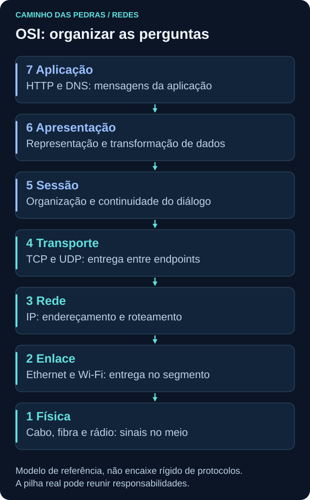
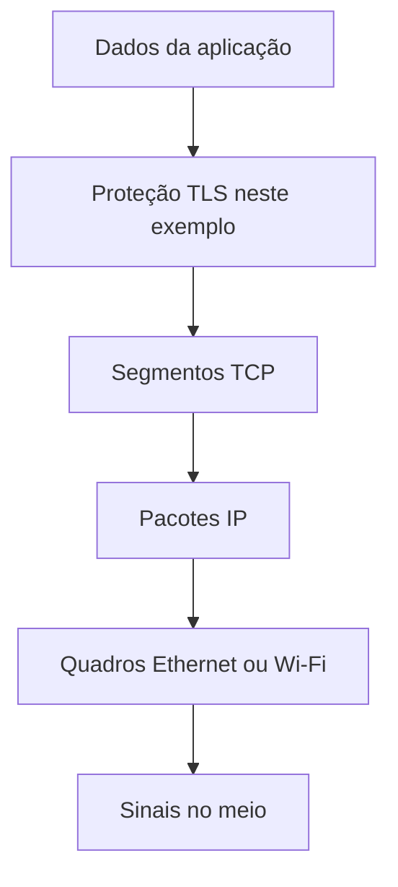

# Modelo OSI

<!-- markdownlint-configure-file {"MD033": {"allowed_elements": ["details", "summary"]}} -->

[← Tópico anterior](README.md) · [↑ Índice do módulo](README.md) · [Página principal](../README.md) · [Próximo tópico →](tcp-ip.md)

## Por que isso importa

“Não consigo acessar um site” é um sintoma, não um diagnóstico. Pode haver um cabo desconectado, DNS sem resposta, uma rota inadequada ou um erro da aplicação. O modelo OSI organiza perguntas para reduzir o espaço de investigação.

OSI é um modelo de referência com sete camadas. Ele separa responsabilidades para facilitar projeto, comunicação entre equipes e diagnóstico. Não é uma sequência de sete programas que todo pacote percorre literalmente. A pilha TCP/IP real não corresponde perfeitamente às suas fronteiras.

## As sete camadas

| Camada | Função | Exemplos ou responsabilidades | Pergunta de troubleshooting |
| --- | --- | --- | --- |
| 7 Aplicação | Define a comunicação entre aplicações | HTTP, DNS | A aplicação responde como esperado? |
| 6 Apresentação | Trata representação dos dados | Codificação, serialização, transformação | As partes interpretam o formato corretamente? |
| 5 Sessão | Organiza diálogo e continuidade | Controle conceitual de início, retomada e término | O diálogo é mantido ou interrompido? |
| 4 Transporte | Entrega entre endpoints | TCP, UDP | O transporte e a porta esperados são alcançados? |
| 3 Rede | Endereça e encaminha entre redes | IPv4, IPv6, roteamento | Existe rota para o destino? |
| 2 Enlace | Entrega quadros no segmento | Ethernet, Wi-Fi, endereços MAC | A comunicação local funciona? |
| 1 Física | Leva sinais pelo meio | Cabo, fibra, rádio | Existe conectividade física? |

### 1. Física: há um meio funcionando?

O sinal precisa chegar à outra ponta. Observe estado do link, conexão do cabo ou qualidade do rádio, usando indicadores do sistema e equipamentos sob sua responsabilidade. Um cabo com mau contato pode produzir desconexões intermitentes. Em segurança, disponibilidade e acesso físico também importam; isso não torna cada oscilação um incidente.

### 2. Enlace: como entregar no segmento?

Ethernet e Wi-Fi organizam a entrega local em quadros. Observe interface, MAC, erros de enlace e vizinhança local quando disponível. Um dispositivo ligado ao segmento errado pode ter link ativo e ainda não alcançar o destino esperado. Segmentação e controle de acesso ao meio ajudam a contextualizar a comunicação. Um MAC não é uma identidade humana nem permanece como endereço de enlace de ponta a ponta através dos roteadores.

### 3. Rede: qual caminho usar?

IP e roteamento permitem encaminhar pacotes entre redes. Observe endereço, prefixo, tabela de rotas e próximo salto. Uma rota default ausente pode afetar destinos externos e manter comunicações locais funcionando. Em segurança, regras por rede e pontos de observação influenciam o que aparece nos registros.

### 4. Transporte: os endpoints conseguem conversar?

TCP e UDP usam portas. Observe origem, destino e, no TCP, estado e sinais de estabelecimento. SYN repetidos sem resposta podem refletir perda, filtragem, destino indisponível ou visibilidade incompleta. Não conclua ataque nem bloqueio específico sem evidência adicional. TCP estabelecido também não garante que o serviço de aplicação respondeu corretamente.

### 5. Sessão: o diálogo continua?

Pense conceitualmente em coordenação e continuidade do diálogo. Observe reconexões, interrupções e mensagens da aplicação. Uma sessão que expira pode exigir nova autenticação mesmo com rede funcionando. Em implementações modernas, essas responsabilidades podem estar na aplicação ou em bibliotecas; uma sessão autenticada de um site não é uma correspondência obrigatória e exclusiva com a camada 5.

### 6. Apresentação: os dados fazem sentido para os dois lados?

Representação, codificação e transformação permitem interpretar dados. Um cliente que espera um formato diferente do recebido pode falhar apesar de a transferência funcionar. Validação de formato e proteção criptográfica se relacionam a essas preocupações, mas não coloque TLS rigidamente em uma única caixa OSI. Observe erros de decodificação e negociação no componente responsável.

### 7. Aplicação: o serviço entregou o esperado?

HTTP e DNS definem mensagens compreendidas pelas aplicações. Observe consultas, respostas, métodos e códigos de status quando visíveis. Um HTTP 503 indica que o cliente recebeu uma resposta de erro do serviço ou de um intermediário, não que toda a rede está desconectada. Em segurança, acesso, frequência e contexto das requisições ajudam a formular hipóteses.

## Encapsulamento sem decorar nomes

Uma requisição precisa ser transportada. No exemplo de HTTPS sobre TCP, os dados HTTP são protegidos por TLS, transportados em TCP, encaminhados em IP e enviados em quadros de enlace. O quadro é convertido em sinais no meio. Na recepção, cada protocolo interpreta sua parte.

Não espere correspondência de um para um: uma requisição pode ocupar vários segmentos, e um segmento pode carregar partes de diferentes dados da aplicação. Em outro transporte, como QUIC, a organização muda. O ganho do modelo é saber qual pergunta cada nível ajuda a responder.

## Prática: “não consigo acessar um site”

Use uma VM pessoal e `https://example.com`. Não provoque falhas mudando configurações. Leia as perguntas e registre o que conseguir observar:

| Verificação | Evidência possível | Interpretação cuidadosa |
| --- | --- | --- |
| Existe conexão física ou virtual? | Interface conectada nas configurações do sistema | Link ativo não garante acesso à internet |
| Tenho endereço esperado? | `ipconfig /all` ou `ip addr` | Uma interface pode ter vários endereços |
| Tenho gateway e rota? | `route print` ou `ip route` | Gateway só é necessário para os destinos que dependem dele |
| DNS resolve? | `nslookup example.com` | Resolver não significa abrir o site |
| A porta TCP responde? | `Test-NetConnection example.com -Port 443` no Windows | Não testa HTTP/3 nem sucesso da aplicação |
| TLS funciona? | Ausência de erro de certificado e conexão no navegador | Não ignore avisos nem desative validação |
| A aplicação responde? | Status na aba Network do DevTools | Um erro HTTP já é uma resposta em nível de aplicação |

Os comandos são detalhados nas próximas páginas. No Linux, apenas observe as etapas para as quais possui ferramentas; não substitua um teste ausente por uma conclusão positiva.

## Pensamento de analista

Pergunte onde a falha foi observada e onde não foi. Se um único site falha, compare com a hipótese de falha geral da interface. Se há resposta HTTP, registre o status e quem pode tê-lo gerado. Se não há resposta, diferencie ausência real de tráfego de ausência de coleta. Logs de Windows, Linux, firewall ou endpoint podem confirmar partes diferentes dessa história.

## Mini desafio

Escolha a camada ou responsabilidade por onde começaria, justificando a escolha, para cinco situações: cabo desconectado; gateway incorreto; SYN sem resposta; representação de dados incompatível; HTTP 403. Depois escreva uma evidência que mudaria sua hipótese em cada caso. Uma resposta possível é começar em física, rede, transporte, apresentação e aplicação, respectivamente. Isso orienta a investigação, não encerra o diagnóstico.

## Referência

A [arquitetura de protocolos de hosts da RFC 1122](https://www.rfc-editor.org/rfc/rfc1122.html) ajuda a comparar a implementação TCP/IP com modelos conceituais. Não é necessário ler a especificação inteira para seguir o módulo.

## Checkpoint

Responda antes de abrir cada explicação. O objetivo é justificar a próxima pergunta, não apenas lembrar um termo.

Link ativo e site indisponível: a camada física está descartada para sempre?

Não. O link ativo é uma observação pontual. Perda intermitente ainda pode existir, mas a próxima hipótese deve considerar IP, rota, nome, transporte e aplicação.

Receber HTTP 403 significa que a porta está fechada?

Não. Algum componente HTTP respondeu. Investigue autorização, política e origem da resposta, sem confundir isso com ausência de conexão.

SYN repetidos provam bloqueio no firewall?

Não. Podem existir perda, servidor indisponível, caminho de retorno diferente ou captura incompleta. Busque registros em outro ponto.

Em qual camada exata sempre fica TLS?

O encaixe não é universal. TLS participa de proteção e negociação e se integra de formas diferentes às pilhas. É melhor explicar sua função e os protocolos envolvidos.

Um erro de formato após receber dados sugere começar onde?

Na representação dos dados e na aplicação. Confirme o formato esperado e recebido antes de responsabilizar o roteamento.

Como o modelo evita conclusões precipitadas de segurança?

Ele separa perguntas e evidências por responsabilidade. Uma falha passa a ter hipóteses verificáveis em vez de ser automaticamente tratada como comprometimento.

## Resumo e próximo passo

OSI organiza o raciocínio. Agora veja os mecanismos concretos de endereçamento, caminho e transporte em [TCP/IP](tcp-ip.md).

[← Tópico anterior](README.md) · [↑ Índice do módulo](README.md) · [Página principal](../README.md) · [Próximo tópico →](tcp-ip.md)
