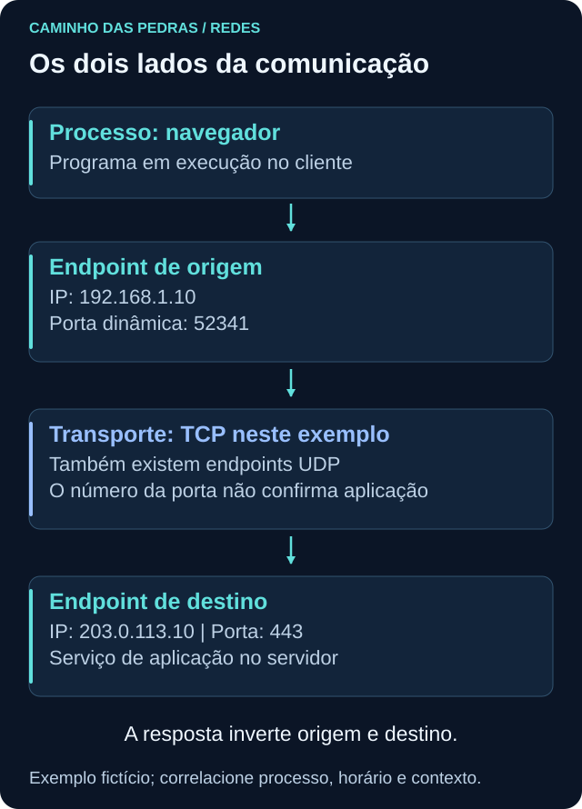
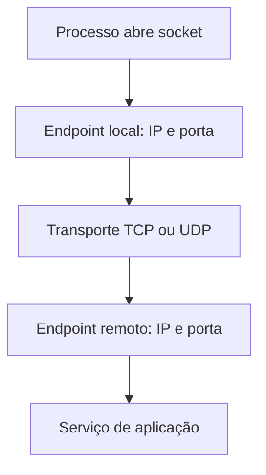

# Portas e protocolos

<!-- markdownlint-configure-file {"MD033": {"allowed_elements": ["details", "summary"]}} -->

[← Tópico anterior](tcp-ip.md) · [↑ Índice do módulo](README.md) · [Página principal](../README.md) · [Próximo tópico →](dhcp.md)

## Por que isso importa

“O IP acessou a porta 443” ainda deixa várias perguntas abertas. Qual era a origem, qual era o destino, quem iniciou, qual transporte foi usado e qual processo estava envolvido? Uma investigação útil separa esses conceitos antes de interpretar o evento.

## IP, porta, protocolo, serviço e processo

| Conceito | Papel | Exemplo fictício |
| --- | --- | --- |
| IP | Endereço de interface no contexto observado | Cliente `192.168.1.20` |
| Porta | Identificador numérico de endpoint TCP ou UDP | Destino `443` |
| Protocolo | Regras da comunicação | TCP no transporte; HTTP na aplicação |
| Serviço | Função disponibilizada | Servir páginas web |
| Processo | Programa em execução que usa o sistema | Navegador no cliente ou servidor web no destino |

O processo navegador pode abrir uma conexão para um servidor, mas “443” não é o nome do processo. Um serviço pode atender várias conexões e uma aplicação pode usar portas alternativas. O número sozinho não confirma qual protocolo de aplicação está nos dados.



## Porta de origem e porta de destino

```text
Cliente 192.168.1.10:52341 → Servidor 203.0.113.10:443, TCP
Resposta 203.0.113.10:443 → Cliente 192.168.1.10:52341, TCP
```

Este exemplo usa um servidor de documentação, não um destino para conexão real. O cliente normalmente recebe uma porta dinâmica de origem e procura a porta em que o serviço atende. A resposta inverte os endpoints. A faixa de portas efêmeras depende do sistema e da configuração; não memorize uma faixa como se fosse universal.

O mesmo número pode existir em TCP e UDP sem representar o mesmo endpoint. NAT pode traduzir a porta vista externamente. Ao investigar, preserve ambos os lados e o ponto de observação, em vez de anotar apenas “porta 443”.

## Socket e conexão

Socket é uma abstração do sistema operacional para comunicação. Para sockets de rede TCP/UDP, **protocolo + IP + porta** descreve um endpoint de forma introdutória. Uma conversa costuma ser descrita pela combinação de protocolo, IP e porta de origem, IP e porta de destino, frequentemente chamada de tupla de cinco elementos.

Isso não atribui identidade eterna: a mesma combinação pode ser reutilizada em outro horário. No TCP, estado e tempo ajudam a separar conexões. No UDP, não há estabelecimento TCP, e ferramentas podem agrupar datagramas em “fluxos” por convenção. Um endpoint UDP local não informa, por si só, todos os destinos usados.



## Portas convencionais como ponto de partida

| Serviço | Porta convencional | Transporte e observação |
| --- | --- | --- |
| DNS | 53 | UDP e TCP |
| HTTP | 80 | TCP, uso convencional sem TLS |
| HTTPS | 443 | TCP para HTTP/1.1 e HTTP/2; UDP com QUIC para HTTP/3 |
| SSH | 22 | TCP |
| RDP | 3389 | TCP e UDP conforme cenário |
| SMB direto | 445 | TCP |
| Kerberos | 88 | TCP e UDP |
| LDAP | 389 | TCP; UDP para usos específicos como CLDAP |
| LDAPS | 636 | TCP, LDAP protegido por TLS desde o início |

LDAP comum não deve ser confundido com CLDAP, a variante sem conexão. Também existe proteção TLS negociada em LDAP por mecanismos como StartTLS; não trate 389 como prova automática de ausência de proteção. A tabela descreve usos, não uma lista de regras de firewall a aplicar.

Confira atribuições no [registro de serviços da IANA](https://www.iana.org/assignments/service-names-port-numbers/service-names-port-numbers.xhtml) e usos de Active Directory na [documentação Microsoft](https://learn.microsoft.com/en-us/troubleshoot/windows-server/active-directory/config-firewall-for-ad-domains-and-trusts). Registro de porta e tráfego efetivamente observado são coisas diferentes.

> Mais importante do que decorar uma lista inteira é saber investigar qual processo está usando determinada porta e qual comunicação está acontecendo.

## Prática no Windows: conexões e processos próprios

Abra `https://example.com` no navegador do laboratório. Em PowerShell, consulte:

```powershell
Get-NetTCPConnection | Select-Object LocalAddress, LocalPort, RemoteAddress, RemotePort, State, OwningProcess
Get-NetUDPEndpoint | Select-Object LocalAddress, LocalPort, OwningProcess
```

O primeiro comando lista informações TCP; o segundo, endpoints UDP locais. `OwningProcess` é o PID local naquele instante. Um navegador pode ter vários processos e reutilizar conexões, por isso nem toda linha é da aba que acabou de abrir.

Para relacionar até cinco conexões TCP estabelecidas a nomes de processo:

```powershell
Get-NetTCPConnection -State Established |
    Select-Object -First 5 LocalAddress, LocalPort, RemoteAddress, RemotePort, OwningProcess,
        @{Name='ProcessName'; Expression={
            (Get-Process -Id $_.OwningProcess -ErrorAction SilentlyContinue).ProcessName
        }}
```

Esse comando apenas consulta. O processo pode terminar entre as leituras ou estar inacessível, deixando o nome vazio. PID pode ser reutilizado ao longo do tempo; registre horário. Não publique a saída completa, pois pode revelar serviços, destinos e aplicativos pessoais.

Um teste pontual para o serviço de exemplo:

```powershell
Test-NetConnection example.com -Port 443
```

Observe `TcpTestSucceeded`. Ele testa TCP, não UDP, QUIC ou o conteúdo da aplicação. Não use isso para testar listas de máquinas de terceiros.

## Prática no Linux: escuta e conexões são visões distintas

```bash
ss -tulpen
ss -tnp
```

No primeiro comando, `-t` e `-u` selecionam TCP e UDP, `-l` limita a sockets em escuta ou endpoints correspondentes, `-p` pede processos, `-e` acrescenta detalhes e `-n` mantém números. **Essa consulta não é uma lista de todas as conexões TCP estabelecidas.** Use a segunda para observar conexões TCP e processo quando permitido.

Observe endereços locais, pares remotos, estado e informações de processo. Algumas informações exigem permissões adicionais e podem ser omitidas. Não é necessário elevar privilégios para concluir o exercício: documente o que ficou indisponível. Consulte a referência de [ss](https://man7.org/linux/man-pages/man8/ss.8.html).

## O que observar e o que não concluir

Uma escuta em `127.0.0.1` ou `::1` é de loopback. Uma escuta em `0.0.0.0` ou `::` costuma indicar associação ampla à família de endereços, mas alcance externo ainda depende de configuração, comportamento dual stack, firewall e rotas. Esses endereços especiais não são alvos sugeridos para testes.

Uma porta em escuta não prova exposição à internet. Uma conexão estabelecida não prova transferência de um arquivo. Tráfego para 443 pode ser legítimo ou indevido. Confronte a observação com a função do ativo e as fontes disponíveis.

## Pensamento de analista

Qual processo abriu a conexão? Qual era o usuário, quando disponível em outra fonte? Qual IP e porta pertencem ao cliente? O domínio é conhecido? Há certificado visível? Volume e frequência são compatíveis com a atividade? O serviço usa uma porta alternativa documentada? Separe o que os comandos mostram do que dependeria de logs ou captura.

## Mini desafio

Associe três conexões ou endpoints do próprio computador aos processos que conseguir consultar. Se houver menos, registre essa limitação. Monte uma tabela sintética com origem, destino quando conhecido, transporte, estado, processo e uma pergunta ainda aberta. Não encerre processos nem modifique serviços para produzir um resultado.

## Checkpoint

Responda antes de abrir cada explicação. O objetivo é justificar a próxima pergunta, não apenas lembrar um termo.

<details>
<summary>A porta 443 apareceu. Isso prova HTTPS benigno?</summary>

Não. A porta sugere um uso convencional; é preciso verificar protocolo, processo, destino e contexto. Mesmo HTTPS válido não garante conteúdo benigno.

</details>

<details>
<summary>A resposta veio de 443 para 52341. As portas estão erradas?</summary>

Não. São os endpoints invertidos da resposta no exemplo. A porta dinâmica do cliente continua identificando seu lado da comunicação.

</details>

<details>
<summary>ss -tulpen não mostrou a conexão do navegador. Por quê?</summary>

A opção -l seleciona escutas, não todas as conexões estabelecidas. Consulte ss -tnp e considere também conexão reutilizada, encerrada ou uso de QUIC/UDP.

</details>

<details>
<summary>Get-NetUDPEndpoint não mostra RemoteAddress. Falta uma conexão TCP?</summary>

Não. A ferramenta apresenta endpoints UDP locais. Para destinos de datagramas, seria necessária outra fonte adequada, como captura própria ou telemetria de endpoint.

</details>

<details>
<summary>Um PID identificado ontem garante o mesmo processo hoje?</summary>

Não. PIDs podem ser reutilizados. Relacione horário, início do processo e demais atributos quando disponíveis.

</details>

<details>
<summary>Uma escuta em todas as interfaces prova que o serviço está aberto na internet?</summary>

Não. Firewall, rotas, tradução e arquitetura determinam o alcance. A escuta descreve a associação local do socket.

</details>

## Resumo e próximo passo

Portas ganham significado junto de transporte, direção, processo e tempo. Em [DHCP](dhcp.md), veja como a configuração e a concessão ajudam a situar um endereço no tempo.

[← Tópico anterior](tcp-ip.md) · [↑ Índice do módulo](README.md) · [Página principal](../README.md) · [Próximo tópico →](dhcp.md)
