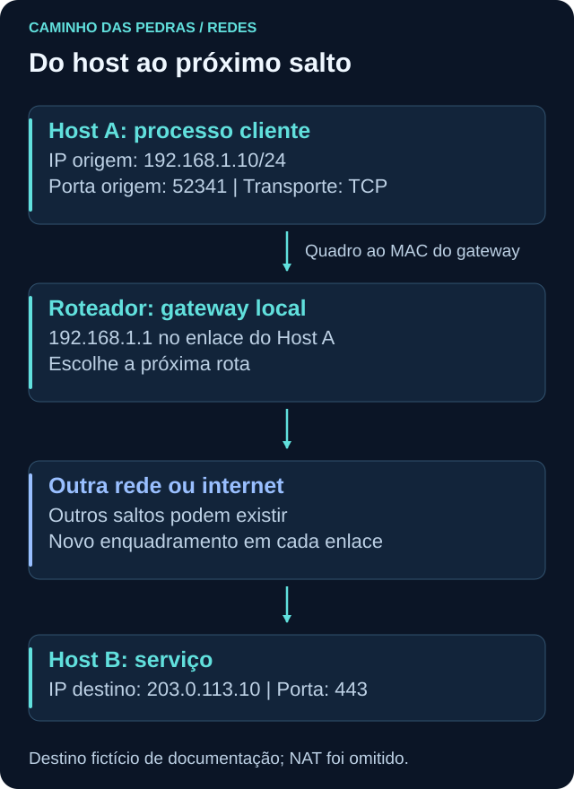
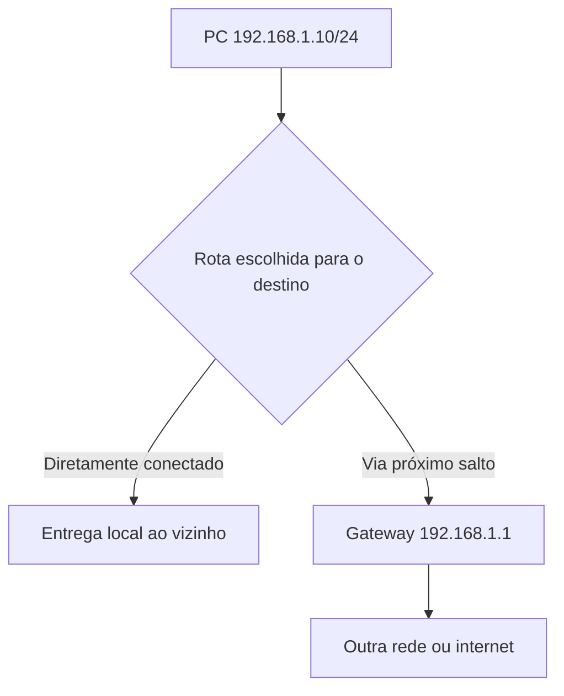
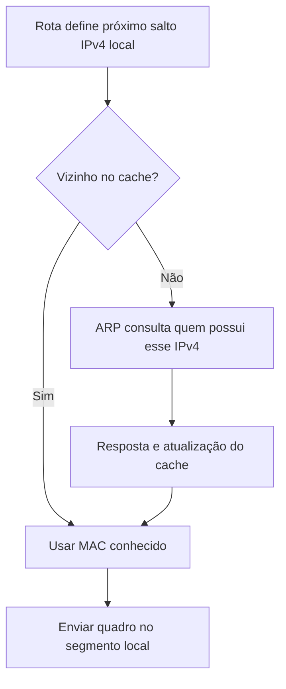
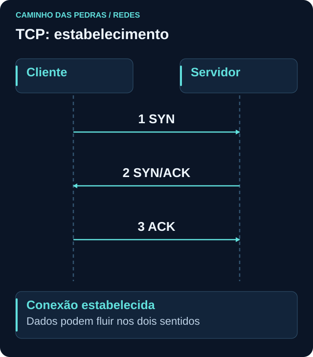
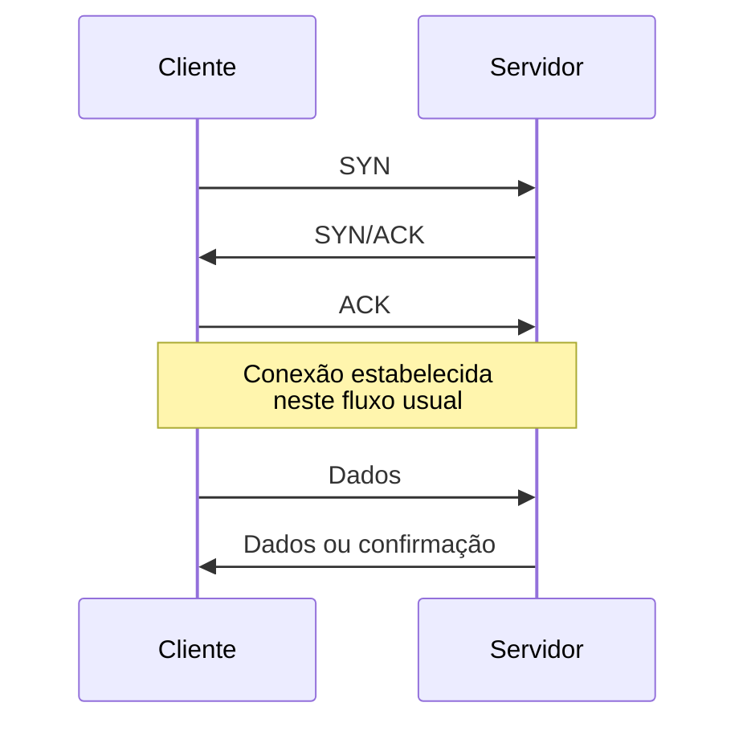
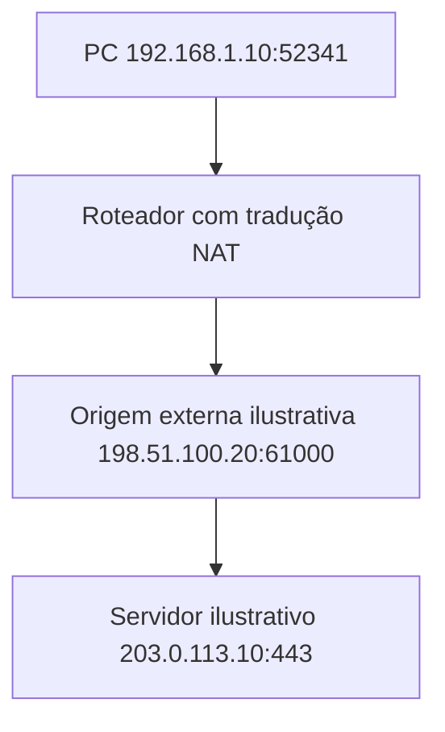

# TCP/IP

<!-- markdownlint-configure-file {"MD033": {"allowed_elements": ["details", "summary"]}} -->

[← Tópico anterior](modelo-osi.md) · [↑ Índice do módulo](README.md) · [Página principal](../README.md) · [Próximo tópico →](portas-protocolos.md)

## Por que isso importa

Um registro de conexão costuma conter endereços, portas e protocolo. Para interpretá-lo, você precisa saber qual interface enviou os pacotes, qual caminho foi escolhido e o que significa haver ou não uma resposta. TCP/IP é a família de protocolos que sustenta grande parte dessas comunicações.

Na visão didática de quatro camadas, temos aplicação, transporte, internet e acesso à rede. IP cuida do endereçamento e encaminhamento; TCP e UDP oferecem formas diferentes de transporte. Nem todo pacote IP contém TCP ou UDP: ICMP é um exemplo importante para diagnóstico.



## IPv4: endereço de uma interface

IPv4 usa 32 bits, normalmente escritos como quatro números de 0 a 255 separados por pontos. Em `192.168.1.10`, cada número representa oito bits. O endereço faz sentido junto do prefixo e do contexto de rede.

Um IP identifica uma interface naquele contexto, não uma pessoa de forma permanente. Um computador pode ter Wi-Fi, Ethernet, VPN e interfaces virtuais, cada uma com endereços. O endereço pode mudar com o tempo; redes distintas podem reutilizar o mesmo IP privado; NAT pode reunir vários ativos sob um endereço externo. A atribuição de uma atividade exige horário e outras evidências.

### Privado, público e outros usos

| Faixa privada IPv4 | Intervalo abrangido |
| --- | --- |
| `10.0.0.0/8` | `10.0.0.0` a `10.255.255.255` |
| `172.16.0.0/12` | `172.16.0.0` a `172.31.255.255` |
| `192.168.0.0/16` | `192.168.0.0` a `192.168.255.255` |

Endereços privados podem ser reutilizados em redes internas e não são roteados globalmente na internet pública. Um endereço público globalmente roteável pode ser alcançável conforme rotas e políticas, não automaticamente. “Não privado” também não significa “público utilizável”: existem faixas especiais, como loopback e endereços de documentação. As faixas privadas são definidas na [RFC 1918](https://www.rfc-editor.org/rfc/rfc1918.html).

### Máscara e prefixo CIDR

Em `192.168.1.10/24`, `/24` indica que os primeiros 24 dos 32 bits representam o prefixo de rede. Nesse caso, a máscara equivalente é `255.255.255.0`. Os oito bits restantes distinguem posições dentro daquela sub-rede.

| Papel no exemplo tradicional `192.168.1.0/24` | Valor |
| --- | --- |
| Endereço de rede | `192.168.1.0` |
| Faixa usual de hosts | `192.168.1.1` a `192.168.1.254` |
| Broadcast da sub-rede | `192.168.1.255` |
| Gateway possível, se configurado assim | `192.168.1.1` |
| Host de laboratório | `192.168.1.10/24` |

O gateway não precisa terminar em `.1`; esse é apenas um costume em alguns ambientes. A reserva de rede e broadcast descrita aqui vale para esse exemplo IPv4 tradicional, não é uma regra para toda combinação de prefixo, como enlaces `/31`, nem para IPv6.

Com essa configuração e rotas usuais, `192.168.1.20` está no mesmo segmento lógico. Já `203.0.113.10`, endereço reservado usado no desenho, precisaria de outra rota. O sistema consulta sua tabela, não decide apenas olhando o primeiro número do IP.

## Gateway e roteamento

O gateway é um próximo salto. Para enviar a outras redes, o host pode entregar o pacote a uma interface de roteador alcançável localmente. Esse roteador consulta suas próprias rotas e continua o encaminhamento. Um destino local diretamente conectado normalmente dispensa gateway.



Uma tabela de rotas relaciona **prefixo de destino**, **próximo salto**, **interface de saída** e informações de preferência, como métricas. Entre rotas elegíveis, um prefixo mais específico normalmente tem prioridade. Políticas, VPNs e várias tabelas podem acrescentar decisões que não veremos em profundidade aqui.

| Destino ilustrativo | Próximo salto | Significado |
| --- | --- | --- |
| `192.168.1.0/24` | Diretamente conectado | Entrega pela interface da LAN |
| `0.0.0.0/0` | `192.168.1.1` | Rota default IPv4 quando nenhuma mais específica corresponde |

A rota default não é uma garantia de conectividade. O próximo salto, o caminho de retorno e as políticas também precisam permitir a comunicação. Uma VPN pode introduzir rotas mais específicas ou alterar a saída esperada.

### Consultar sem alterar

Windows, em PowerShell:

```powershell
ipconfig /all
route print
Get-NetIPConfiguration
Get-NetRoute
```

Linux:

```bash
ip addr
ip route
ip -6 route
```

Observe endereço e prefixo por interface, gateway, DNS e rotas default. Em `Get-NetRoute`, compare `DestinationPrefix`, `NextHop`, `InterfaceIndex` e `RouteMetric`; a preferência também pode depender da métrica da interface. No Linux, `default via ... dev ...` indica um próximo salto e dispositivo. `ip addr` e `ip route` não mostram, por si só, a configuração completa de DNS.

## MAC e ARP: entregar ao próximo salto local

MAC é um endereço de enlace, comum em Ethernet e Wi-Fi. Pode ser alterado ou aleatorizado; não é um documento de identidade do dispositivo. IP orienta o encaminhamento entre redes. MAC participa da entrega no segmento local.

ARP relaciona um IPv4 local a um endereço de enlace. Se o destino IP está fora da rede local e a rota usa o gateway, o host busca o MAC do gateway, não o MAC do servidor distante. O pacote IP segue em um quadro destinado ao próximo salto. Ao rotear, o equipamento remove o enquadramento recebido e usa outro no próximo enlace.



Consulta no Windows:

```powershell
arp -a
```

Consulta no Linux:

```bash
ip neigh
```

Identifique interface, vizinho, endereço de enlace e estado quando disponível. Cache vazio pode significar ausência de comunicação recente; uma entrada antiga não prova presença atual. `ip neigh` também pode mostrar vizinhos IPv6. Não tente manipular vizinhos de outras máquinas.

## IPv6: uma primeira leitura

IPv6 possui endereços de 128 bits, escritos em grupos hexadecimais. `2001:db8:1::10/64` é um exemplo reservado para documentação. `::` abrevia grupos de zeros uma única vez no endereço. Uma interface pode ter vários IPv6 com escopos e tempos de vida diferentes.

IPv6 não usa broadcast nem ARP. A descoberta de vizinhos usa Neighbor Discovery, baseado em ICMPv6. Endereços link-local, geralmente iniciados por `fe80:`, servem ao enlace e podem exigir indicação da interface. A rota default é `::/0`. Configuração pode envolver SLAAC e DHCPv6; o roteador padrão é normalmente aprendido por Router Advertisements, não pelo DORA de DHCPv4.

Dual stack significa utilizar IPv4 e IPv6. Uma aplicação pode escolher um endereço AAAA e comunicar por IPv6 mesmo que você esteja olhando apenas rotas ou filtros IPv4. Os fundamentos do protocolo estão na [RFC 8200](https://www.rfc-editor.org/rfc/rfc8200.html), e a descoberta de vizinhos na [RFC 4861](https://www.rfc-editor.org/rfc/rfc4861.html).

## TCP: conexão e fluxo confiável

TCP oferece um fluxo de bytes ordenado. Números de sequência permitem acompanhar posições no fluxo; confirmações indicam o que foi recebido; retransmissões podem recuperar perdas. Há controle de fluxo e de congestionamento. Essas funções não garantem que a aplicação será bem-sucedida nem que a comunicação nunca falhará.

No estabelecimento usual, o cliente envia **SYN**, o servidor responde **SYN/ACK** e o cliente envia **ACK**. SYN participa da sincronização; ACK confirma recebimento. Depois, os endpoints podem trocar dados nos dois sentidos.





Estados como `LISTEN`, `SYN-SENT`, `ESTABLISHED` e `TIME-WAIT` ajudam a interpretar momentos diferentes. `LISTEN` indica espera por conexões; `SYN-SENT`, uma tentativa em andamento; `ESTABLISHED`, transporte estabelecido; `TIME-WAIT`, uma etapa normal posterior ao fechamento ativo em casos usuais. Nenhum estado, sozinho, confirma malícia.

**FIN** sinaliza que um lado terminou de enviar dados. O outro confirma e pode encerrar seu próprio sentido depois. **RST** interrompe ou rejeita uma conexão em situações como porta sem serviço ou estado inválido; não representa necessariamente ataque. Um fechamento simplificado pode ser FIN, ACK, FIN, ACK, mas segmentos podem combinar flags e a ordem observada pode variar. A referência de TCP é a [RFC 9293](https://www.rfc-editor.org/rfc/rfc9293.html).

## UDP: datagramas com outras responsabilidades

UDP entrega datagramas sem handshake TCP e sem garantir, por si só, entrega, ordem ou retransmissão. Se essas características forem necessárias, outra camada pode implementá-las. Não é “melhor” ou “pior” universalmente: a escolha depende da aplicação.

DNS usa UDP em muitos cenários e também TCP. Voz, vídeo em tempo real e alguns protocolos de streaming podem usar UDP, mas há streaming sobre HTTP/TCP. QUIC funciona sobre UDP e implementa suas próprias conexões, confiabilidade e segurança. Portanto, dizer “UDP não tem handshake TCP” não equivale a dizer que nenhuma aplicação sobre UDP estabelece uma sessão.

## NAT e ponto de observação

NAT traduz endereços. Na modalidade frequentemente chamada PAT ou NAPT, também traduz portas, permitindo que várias máquinas compartilhem um endereço externo. O registro antes da tradução pode mostrar a origem privada; depois dela, pode mostrar outra origem.



Os endereços externos acima são reservados para documentação, não IPs públicos operacionais. Em uma investigação real, correlacione horário, protocolo, portas e mapeamentos. NAT não é sinônimo de firewall nem uma garantia de segurança. Pode haver mais de uma tradução no caminho.

## Firewall e proxy

Um firewall controla comunicações com base em regras e contexto, podendo considerar estado e informações de aplicação conforme a implementação. Seus logs podem mostrar decisão e tuplas de rede. Uma ação “permitido” não prova que a requisição terminou.

Um proxy pode intermediar comunicações de aplicação, recebendo uma conexão e criando outra. O servidor pode enxergar o proxy como origem. Os registros podem acrescentar contexto de requisição, mas dependem da configuração e da visibilidade sobre TLS. Não assumimos inspeção de conteúdo cifrado neste módulo.

## Diagnóstico: DNS, ICMP, porta e aplicação

ICMP transporta mensagens de controle e diagnóstico. Ping usa Echo Request e Echo Reply para testar respostas ICMP. Uma falha pode refletir filtragem, perda ou política; um host pode servir uma aplicação sem responder a ping.

Windows, poucas tentativas para o domínio de teste:

```powershell
ping -n 4 example.com
tracert example.com
Test-NetConnection example.com -Port 443
```

Linux:

```bash
ping -c 4 example.com
traceroute example.com
```

Esses comandos geram tráfego. `tracert` e `traceroute` dependem de respostas intermediárias a sondas com limites de saltos; implementações podem usar tipos diferentes de sonda. Asteriscos não provam que a aplicação está bloqueada naquele salto. Balanceamento, filtros, ausência de resposta e assimetria tornam o resultado uma visão parcial, não um mapa perfeito da infraestrutura.

Em `Test-NetConnection`, observe o endereço resolvido, a interface de origem e `TcpTestSucceeded`. Sucesso significa que o teste TCP conseguiu estabelecer a conexão naquele momento. Não verifica a página HTTP, a confiabilidade do conteúdo, a validade TLS ou QUIC/UDP. [Documentação Microsoft](https://learn.microsoft.com/en-us/powershell/module/nettcpip/test-netconnection).

| Resultado | O que sustenta | O que não garante |
| --- | --- | --- |
| DNS respondeu | O nome produziu uma resposta naquele contexto | Serviço acessível |
| Ping respondeu | Houve resposta ICMP | Porta e aplicação funcionando |
| TCP conectou | Transporte TCP foi estabelecido | TLS e requisição válidos |
| HTTP respondeu | Um componente produziu resposta HTTP | Conteúdo legítimo ou operação bem-sucedida |

## Onde TCP/IP aparece em Cybersecurity?

Firewall, conexões de endpoint, EDR, IDS e IPS, proxy, SIEM, cloud e análise de tráfego registram aspectos dessa pilha. Procure origem, destino, protocolo, portas, duração quando disponível e ponto de observação. Um IDS pode ter visto só um lado do fluxo; o endpoint pode relacionar a conexão a um processo; o firewall pode observar endereços já traduzidos.

## Prática e mini desafio

No próprio laboratório, faça uma ficha com interface, IP, prefixo ou máscara, gateway, DNS e rota default. Use os comandos de leitura da página. Para DNS no Linux, `resolvectl status` pode ajudar quando o sistema usa systemd-resolved; em outros sistemas, a configuração depende do gerenciador de rede. Não confunda um resolvedor local intermediário com o servidor DNS final.

Escolha um destino local conhecido e o domínio de teste. Explique qual próximo salto espera para cada um, sem enviar tráfego a endereços fictícios dos desenhos. Compare a expectativa com as rotas. Execute apenas um teste de cada tipo necessário e registre resultados inclusive quando inconclusivos.

### Pensamento de analista

Quem iniciou? Qual origem, destino, protocolo e porta? A conexão se estabeleceu? Qual duração foi observada? Há caminho de retorno? O IP era desse ativo naquele horário? Alguma tradução ou VPN muda a leitura? Se não houver evidência de encerramento, registre essa ausência sem inventar um motivo.

## Checkpoint

Responda antes de abrir cada explicação. O objetivo é justificar a próxima pergunta, não apenas lembrar um termo.

<details>
<summary>192.168.1.10/24 quer falar com 192.168.1.20. Precisa sempre de gateway?</summary>

Na configuração simples apresentada, o destino é diretamente conectado. A entrega usa a interface local e resolução de vizinho. A tabela efetiva e políticas continuam sendo a autoridade.

</details>

<details>
<summary>O gateway precisa terminar em .1?</summary>

Não. Precisa ser um próximo salto válido e alcançável conforme a configuração. .1 foi apenas a escolha do exemplo.

</details>

<details>
<summary>Qual MAC aparece como destino do quadro para um servidor em outra rede?</summary>

No primeiro enlace Ethernet usual, o MAC do próximo salto, frequentemente o gateway. O MAC do servidor remoto não é obtido por ARP através dos roteadores.

</details>

<details>
<summary>Ping falhou, mas TCP 443 conectou. Isso é contraditório?</summary>

Não. ICMP e TCP podem receber tratamento diferente. O teste TCP ainda não garante TLS ou HTTP funcionando.

</details>

<details>
<summary>UDP significa que nenhum protocolo acima dele pode ser confiável?</summary>

Não. UDP não fornece essas garantias, mas protocolos acima podem implementá-las. QUIC é um exemplo.

</details>

<details>
<summary>O firewall externo mostra uma origem diferente do endpoint. O que verificar?</summary>

Ponto de captura, NAT, proxy, VPN, horário e portas. A diferença pode ser arquitetural; correlacione os mapeamentos antes de concluir que são atividades diferentes.

</details>

## Resumo e próximo passo

Endereço e rota explicam a entrega entre redes; TCP e UDP explicam o transporte. Em [Portas e protocolos](portas-protocolos.md), relacione esse fluxo aos serviços e processos.

[← Tópico anterior](modelo-osi.md) · [↑ Índice do módulo](README.md) · [Página principal](../README.md) · [Próximo tópico →](portas-protocolos.md)
