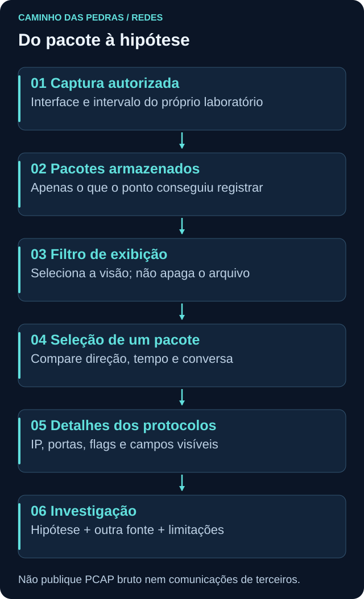
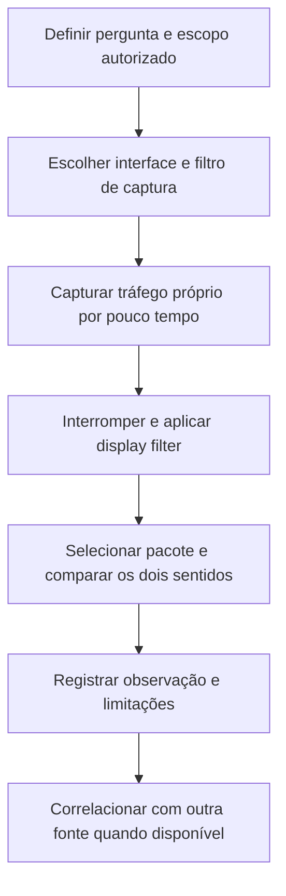

# Wireshark

<!-- markdownlint-configure-file {"MD033": {"allowed_elements": ["details", "summary"]}} -->

[← Tópico anterior](http-https.md) · [↑ Índice do módulo](README.md) · [Página principal](../README.md) · [Próximo tópico →](../03-Linux-e-Windows/README.md)

## Por que isso importa

Wireshark permite examinar tráfego visível em um ponto de captura e interpretar protocolos. Ele ajuda a confrontar hipóteses com pacotes: houve consulta DNS, tentativa TCP, resposta ou negociação TLS? É uma ferramenta de observação, não uma prova automática de causa ou intenção.

Neste módulo, capture apenas tráfego do seu próprio laboratório, com autorização. Não há varredura, interceptação de terceiros ou exploração de serviços.

## Captura de pacotes: o que está sendo observado

A interface é o ponto de entrada da captura. O arquivo contém unidades observadas nesse ponto, frequentemente chamadas de pacotes de forma geral. Em Ethernet, o **frame** é o quadro de enlace; dentro dele pode existir um **pacote IP**, que por sua vez carrega TCP, UDP ou outro protocolo.

| Campo ou área | Como ler |
| --- | --- |
| Timestamp | Horário ou tempo relativo conforme configuração |
| Origem e destino | Endereços interpretados naquela camada |
| Protocolo | Classificação feita pelos dissectors do Wireshark |
| Tamanho | Comprimento registrado, não necessariamente tamanho de um arquivo da aplicação |
| Lista de pacotes | Visão resumida e ordenada |
| Detalhes | Árvore de campos do pacote selecionado |
| Bytes | Representação dos dados capturados, que pode ser sensível |

Registre fuso e formato de tempo antes de correlacionar com logs. O protocolo exibido depende do que a ferramenta conseguiu interpretar; não trate a coluna como uma identificação infalível de toda aplicação.



## Escolher a interface

| Interface | Quando pode ser relevante | Possível engano |
| --- | --- | --- |
| Ethernet | Saída pela conexão cabeada | Selecionar um adaptador sem tráfego |
| Wi-Fi | Saída pela rede sem fio | Esperar enxergar todos os dispositivos da rede |
| Interface de VM | Rede virtual do laboratório | Confundir tráfego do host com tráfego do guest |
| Loopback | Comunicação com o próprio sistema | Procurar ali uma navegação que sai por outra interface |

Prefira capturar dentro de uma VM pessoal de laboratório, no adaptador usado por ela, sem aplicações pessoais ou corporativas ativas. Uma interface própria ainda pode receber broadcast ou multicast de outros dispositivos. Capturar nela não significa que tudo o que aparece foi originado por você. Restrinja o exercício aos seus endpoints e revise o conteúdo antes de qualquer compartilhamento.

VPN, NAT e interfaces virtuais podem mudar o que cada ponto mostra. Capture no ponto que corresponde à pergunta. Não ative espelhamento de porta nem modo monitor para coletar terceiros.

## Capture filter e display filter

| Tipo | Momento | Efeito | Sintaxe ilustrativa |
| --- | --- | --- | --- |
| Capture filter | Antes de iniciar | Decide o que será armazenado | `host 192.168.1.10` |
| Display filter | Durante a leitura | Decide o que será exibido do que já existe | `ip.addr == 192.168.1.10` |

Substitua `192.168.1.10` pelo IP da própria VM de laboratório. Não use o exemplo para observar máquinas alheias. Um filtro de captura limitado ao próprio host ajuda a reduzir tráfego não relacionado, mas também pode excluir broadcasts úteis, como partes de DHCP. Se a VM usa IPv6, o filtro precisa considerar o endereço IPv6 autorizado relevante. Prefira observar um fluxo específico e documentar a limitação a coletar tudo indiscriminadamente.

Filtro de exibição não apaga nem anonimiza o restante do arquivo. Quem receber a captura poderá remover o filtro e ver os outros pacotes. Filtro de captura não recupera dados excluídos depois: para outra pergunta seria necessária uma nova captura autorizada. As sintaxes são diferentes. Consulte [filtros de captura](https://www.wireshark.org/docs/wsug_html_chunked/ChCapCaptureFilterSection.html) e [filtros de exibição](https://www.wireshark.org/docs/wsug_html_chunked/ChWorkDisplayFilterSection.html).

## Primeira captura segura

### Etapa 1: delimitar o laboratório

Use uma VM pessoal preparada no módulo 01, com acesso de saída permitido para o teste. Feche aplicações desnecessárias e não faça login em serviços. Identifique interface e endereço pelos comandos de [TCP/IP](tcp-ip.md). Instale o Wireshark apenas por fonte oficial se ainda não estiver disponível; permissões e componente de captura dependem do sistema. Não desative controles do sistema para fazê-lo funcionar.

### Etapa 2: iniciar a coleta curta

Escolha a interface da VM e configure o filtro de captura com o endereço próprio que pretende observar. Inicie a captura antes de gerar o tráfego. Se não houver permissão, interrompa o exercício e registre a limitação do ambiente, sem tentar contornar políticas.

### Etapa 3: gerar somente tráfego próprio

Abra `https://example.com` e faça uma consulta manual em terminal:

```text
nslookup example.com
```

Se `nslookup` não existir, use `Resolve-DnsName example.com` no Windows ou `dig example.com` no Linux, conforme disponibilidade. Anote o momento e interrompa a captura logo após o teste. Não mantenha coleta durante outras atividades.

### Etapa 4: filtrar e fazer perguntas

Os itens abaixo são **display filters**. Aplique um por vez no campo de filtro de exibição:

```text
dns
tcp
udp
http
tls
tcp.flags.syn == 1
ip.addr == 192.168.1.10
```

O último endereço é ilustrativo: substitua exclusivamente por um IP do laboratório autorizado. `ip.addr` seleciona IPv4; para um endereço IPv6 próprio, use `ipv6.addr == 2001:db8::10` substituindo o valor fictício pelo observado. Não espere tráfego para o endereço de documentação.

| Filtro | Pergunta | Limite |
| --- | --- | --- |
| `dns` | Há DNS interpretável na captura? | Cache e DNS cifrado podem impedir que apareça |
| `tcp` | Quais segmentos TCP foram vistos? | Nem toda navegação usa TCP |
| `udp` | Há datagramas UDP? | Pode incluir DNS, QUIC e outros protocolos |
| `http` | Há HTTP interpretável por esse dissector? | Não revela automaticamente HTTPS, HTTP/2 ou HTTP/3 |
| `tls` | Há TLS reconhecido? | Não expõe automaticamente a requisição cifrada |
| `tcp.flags.syn == 1` | Há segmentos com SYN? | Inclui SYN inicial e SYN/ACK |
| `ip.addr == ...` | Qual tráfego IPv4 envolve esse endereço? | Seleciona origem ou destino; não atribui processo |

Para isolar o SYN inicial usual, pode-se usar `tcp.flags.syn == 1 && tcp.flags.ack == 0`. Observe depois os endpoints invertidos no SYN/ACK e a confirmação seguinte. Não chame qualquer ACK posterior de “terceiro pacote” sem reconstruir a conversa.

### Etapa 5: explicar o que faltou

Se a navegação reutilizou uma conexão, o handshake pode ter ocorrido antes da captura. Se usou HTTP/3, pode haver QUIC/UDP em vez de TCP. Se resolveu por cache ou DoH, o filtro `dns` pode ficar vazio. Não desligue proteções para obter um resultado “bonito”.

Para uma tentativa TCP explícita, opcionalmente execute no Windows do laboratório `Test-NetConnection example.com -Port 443` durante uma nova coleta curta. Isso pode produzir um handshake TCP, mas não inicia uma requisição HTTPS completa nem garante negociação TLS. Caso TCP ou TLS não apareçam, a entrega pode documentar essa ausência e suas hipóteses.

## Follow Stream

Ao selecionar um pacote da própria comunicação de laboratório, **Follow Stream** pode reunir dados de um fluxo suportado em uma visão mais fácil de ler. O recurso não torna TLS legível por mágica e não garante que a captura contenha toda a conversa. Não o use para inspecionar comunicações de terceiros. Veja a [documentação do recurso](https://www.wireshark.org/docs/wsug_html_chunked/ChAdvFollowStreamSection.html).

## O que o Wireshark não mostra necessariamente

| Limitação | Consequência |
| --- | --- |
| Interface ou posição de captura | Outro segmento ou interface pode ter o tráfego relevante |
| Arquitetura, roteamento e NAT | Você pode ver só um sentido ou endereços traduzidos |
| Criptografia | Conteúdo e parte dos metadados podem não estar disponíveis |
| Filtro de captura | Pacotes excluídos nunca entraram no arquivo |
| Tempo de início e fim | DNS, handshake ou encerramento podem estar fora da janela |
| Perda na coleta ou recursos do host | Nem tudo que transitou foi necessariamente registrado |
| Visibilidade do endpoint | Um PCAP comum não informa automaticamente processo e usuário |

Offload de rede no host também pode produzir diferenças entre a representação capturada e os quadros no fio, como avisos de checksum que precisam de contexto. Um aviso isolado não demonstra ataque nem corrupção real no enlace.



## Privacidade faz parte da análise

PCAP e PCAPNG podem conter nomes internos, endereços, cookies, tokens, credenciais, dados pessoais e conteúdo de aplicações. Tráfego cifrado também revela metadados. Não publique capturas brutas sem revisão, não coloque tráfego corporativo real no repositório e não capture terceiros sem autorização.

Um filtro na tela ou uma tarja no screenshot não modifica o arquivo original. Para este módulo, entregue uma tabela sintética e um desenho próprio. Se salvar uma captura local, mantenha-a restrita ao laboratório e fora do Git. O objetivo é demonstrar raciocínio, não expor comunicação real.

## Pensamento de analista

Qual pergunta motivou a coleta? Em qual interface e intervalo? Quem parece iniciar a conversa? Há resposta? O que o filtro excluiu? Quais protocolos foram reconhecidos? Há evidência de processo em outra fonte? A hipótese continua válida se a captura estiver incompleta?

## Mini desafio

Tente identificar uma consulta DNS própria, um estabelecimento TCP e uma negociação TLS da navegação de teste. Para cada item, anote filtro, horário relativo, direção e o que foi observado. Se um não aparecer, explique possibilidades como cache, QUIC, conexão reutilizada ou escopo de captura. Não invente pacotes para completar a lista.

Conclua com três observações e duas limitações. Uma delas deve explicar por que a captura sozinha não permite afirmar intenção maliciosa. Esse cuidado será importante ao trabalhar com alertas de IDS, firewall e SIEM.

## Checkpoint

Responda antes de abrir cada explicação. O objetivo é justificar a próxima pergunta, não apenas lembrar um termo.

<details>
<summary>Aplicar display filter remove segredos do PCAP?</summary>

Não. Ele só muda a exibição. O restante continua no arquivo e pode ser visto ao remover o filtro.

</details>

<details>
<summary>Capturar na interface própria garante que todos os pacotes são seus?</summary>

Não. Broadcast e multicast de outros dispositivos podem chegar ali. Delimite o laboratório, filtre a coleta e revise o que foi armazenado.

</details>

<details>
<summary>tcp.flags.syn == 1 retorna apenas o primeiro SYN do cliente?</summary>

Não. Também inclui SYN/ACK, pois a flag SYN está presente. Para o SYN inicial usual, combine SYN igual a 1 com ACK igual a 0.

</details>

<details>
<summary>A página abriu, mas não há DNS nem handshake TCP. O que pode explicar?</summary>

Cache ou DNS cifrado podem explicar DNS ausente. Conexão reutilizada, QUIC/UDP, janela ou interface incorreta podem explicar o handshake ausente.

</details>

<details>
<summary>Follow Stream mostra automaticamente o conteúdo HTTPS?</summary>

Não. Ele organiza dados disponíveis de um fluxo suportado, mas não elimina a criptografia nem recupera pacotes ausentes.

</details>

<details>
<summary>Um pacote mostra IP e porta. Como descobrir o processo?</summary>

Um PCAP comum não associa automaticamente processo. Correlacione com telemetria de endpoint ou consulta local no mesmo período, respeitando reutilização de PID e de conexões.

</details>

## Resumo e próximo passo

Você observou a comunicação e seus limites sem depender de conclusões por porta ou IP isolado. Revise a entrega no [índice de Redes](README.md) e siga para [03 Linux e Windows](../03-Linux-e-Windows/README.md), aprofundando as fontes de processos, serviços, usuários e eventos.

[← Tópico anterior](http-https.md) · [↑ Índice do módulo](README.md) · [Página principal](../README.md) · [Próximo tópico →](../03-Linux-e-Windows/README.md)
