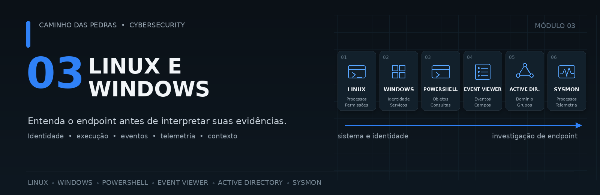
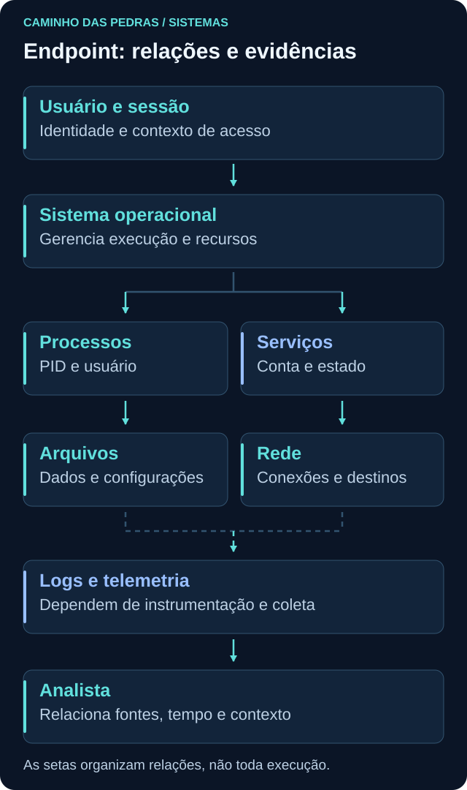
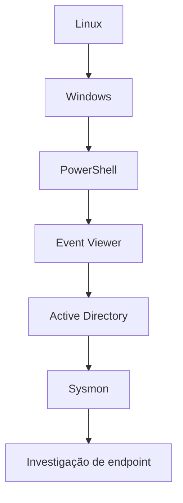
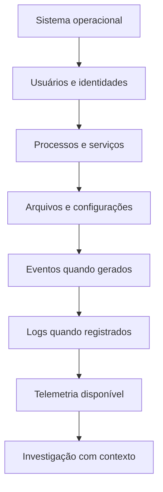
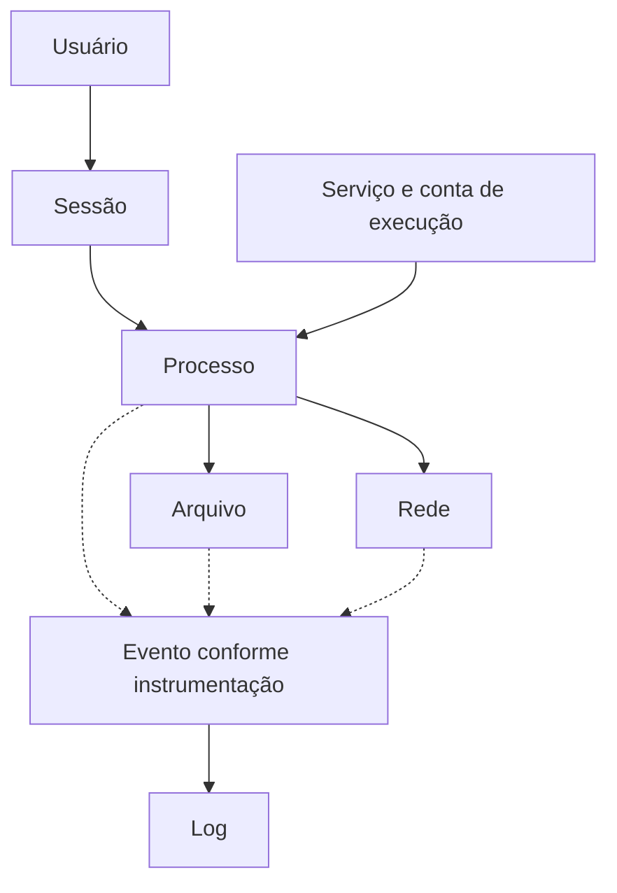
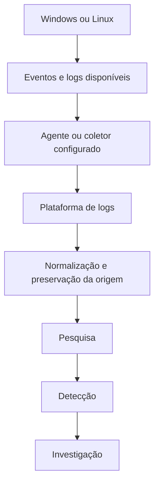

# 03 Linux e Windows

<!-- markdownlint-configure-file {"MD033": {"allowed_elements": ["details", "summary"]}} -->

[← Tópico anterior](../02-Redes/README.md) · [↑ Índice do módulo](README.md) · [Página principal](../README.md) · [Próximo tópico →](linux.md)

Sistemas operacionais são uma das principais fontes de evidência em uma investigação. É dentro de um endpoint que uma conta inicia uma sessão, um programa vira processo, um serviço usa privilégios e uma aplicação acessa arquivos ou abre conexões. Entender essas relações permite formular perguntas melhores sobre o que aconteceu.

> Para investigar um sistema, primeiro precisamos entender como esse sistema funciona normalmente.

Antes de considerar um processo suspeito, entenda sua função. Antes de avaliar uma autenticação, diferencie conta, sessão, grupo e privilégio. Antes de pesquisar um evento no SIEM, descubra quem poderia tê-lo produzido e se a coleta estava preparada para recebê-lo.

Este módulo é uma introdução à administração, observação e investigação defensiva. Não pretende substituir uma formação completa em administração nem um procedimento formal de resposta a incidentes.

## O que você vai aprender

| Assunto | Por que importa para Cybersecurity |
| --- | --- |
| Linux | Permite interpretar processos, permissões, serviços e fontes de log comuns em servidores |
| Windows | Ajuda a relacionar identidades, execução, configurações e auditoria de endpoints |
| Usuários | Dão contexto sobre a identidade usada em uma atividade |
| Grupos | Participam da concessão de acesso e precisam ser considerados na autorização |
| Permissões | Descrevem operações permitidas sobre recursos, como arquivos |
| Privilégios | Autorizam capacidades administrativas que não se resumem a uma permissão de arquivo |
| Processos | Representam programas em execução e seus contextos de usuário e tempo |
| Serviços | Explicam atividades de fundo, inicialização e contas de execução |
| Arquivos | Fornecem caminho, conteúdo e metadados que precisam ser interpretados com cuidado |
| Logs | Guardam registros do que componentes decidiram e conseguiram registrar |
| PowerShell | É uma ferramenta legítima para consultar e administrar o sistema com objetos |
| Event Viewer | Permite examinar eventos Windows e seus campos antes da normalização em um SIEM |
| Active Directory | Organiza identidade, computadores, grupos e políticas de domínio |
| Autenticação | Verifica uma identidade e produz contexto diferente da decisão de autorização |
| Sysmon | Acrescenta telemetria de atividade conforme versão e configuração |
| Telemetria | É o conjunto de dados observados e disponibilizados para análise, com cobertura limitada |

## Caminho do módulo

| Página | Entrega sugerida |
| --- | --- |
| [Linux](linux.md) | Ficha de um processo legítimo e suas fontes de contexto |
| [Windows](windows.md) | Ficha de processo, identidade e eventual serviço ou conexão |
| [PowerShell](powershell.md) | Consultas de leitura com explicação dos objetos selecionados |
| [Event Viewer](event-viewer.md) | Campos de um evento e limites de interpretação |
| [Active Directory](active-directory.md) | Desenho de domínio fictício e comparação de identidades |
| [Sysmon](sysmon.md) | Relação entre criação de processo, pai e telemetria disponível |

Use a base de [Fundamentos](../01-Fundamentos/README.md) e [Redes](../02-Redes/README.md). Trabalhe em VM pessoal ou sistema autorizado, registrando versão, horário e fuso. Os exercícios principais consultam informações; o de Sysmon inclui iniciar um processo benigno no laboratório. A proposta de domínio AD é apenas um plano de evolução, não um ambiente criado por este material.

## Do funcionamento à investigação

Essa é uma organização de estudo, não uma cadeia obrigatória de execução. Um serviço não precisa ser criado depois de cada arquivo e uma atividade não produz necessariamente um evento. Pense em relações: usuário e sessão dão contexto ao processo; o processo pode acessar arquivo ou rede; um serviço pode manter processos de fundo; componentes e sensores podem registrar parte dessas ações.

Uma **sessão** reúne contexto de interação ou autenticação; pode ser interativa, de rede ou de serviço. O usuário de um processo pode diferir da pessoa diante da tela. Identificar apenas “quem está logado” não explica automaticamente quem executou cada atividade.

## Como um analista enxerga um endpoint

Comece por perguntas verificáveis:

- Quem utiliza a máquina e qual conta executou o processo observado?
- Qual é o PID, quando o processo iniciou e qual processo o criou?
- Qual caminho e linha de comando aparecem na fonte disponível?
- Há evidência de acesso a um arquivo ou apenas de sua existência?
- Qual serviço está ativo e sob qual conta ele executa?
- Quais grupos, permissões e privilégios participam daquele contexto?
- Existe conexão associada ao processo no mesmo intervalo?
- Qual evento foi gerado, por qual provedor, em qual host e horário?
- O comportamento é compatível com a função daquele ativo?
- Houve mudança em relação ao estado conhecido? Que fonte sustenta isso?

PID pode ser reutilizado. Nome de arquivo pode se repetir. Uma linha de comando pode conter informação sensível. A leitura do estado atual não reconstrói, sozinha, o passado. Relacione fonte, entidade e tempo antes de concluir.

### Ferramenta legítima não é diagnóstico de ataque

PowerShell, CMD, Bash e Python têm usos legítimos. PsExec também pode fazer parte de administração autorizada. O nome da ferramenta não encerra a análise: investigue quem executou, onde, quando, como, por quê e qual comportamento ocorreu. Aqui não serão ensinadas técnicas de abuso dessas ferramentas.

## Windows e Linux: perguntas semelhantes, implementações diferentes

| Conceito ou pergunta | Windows | Linux |
| --- | --- | --- |
| Processos | Task Manager, `Get-Process`, consultas CIM | `ps aux`, `ps -ef`, `pstree` quando disponível |
| Serviços | Services, `Get-Service` | `systemctl` em sistemas com systemd |
| Quem sou? | `whoami`, `whoami /groups` | `whoami`, `id`, `groups` |
| Quais contas existem? | `Get-LocalUser` quando disponível; ferramentas locais | `getent passwd` consulta a base configurada de contas |
| Logs | Event Viewer e `Get-WinEvent` | Journal e arquivos de log conforme configuração |
| Rede | `Get-NetTCPConnection` | `ss`, com opções adequadas à pergunta |
| Arquivos | Explorer, `Get-ChildItem`, `Get-Item` | Shell, `ls`, `stat` |
| Permissões | ACL, proprietário, grupos e contexto do token | Proprietário, grupo, bits de modo e controles adicionais |
| Shell | PowerShell e CMD | Bash e outras shells |
| Filtrar texto | `Select-String` | `grep` |

`getent passwd` é uma consulta; o comando `passwd` sozinho serve a outra finalidade, como alteração de senha. `id` descreve uma identidade, não enumera todos os usuários. Listar contas não informa quem está com sessão aberta. As páginas individuais explicam os limites dessas consultas.

O pipeline de cmdlets do PowerShell costuma transportar objetos com propriedades; ferramentas Unix tradicionais costumam trocar texto. Linux também pode ter ACLs, capabilities e controles como SELinux ou AppArmor. A comparação serve para orientar perguntas, não para afirmar que os sistemas têm a mesma arquitetura.

## Uma atividade, várias fontes

Considere uma atividade administrativa autorizada e fictícia:

| Etapa | Fonte possível | Limitação |
| --- | --- | --- |
| Usuário faz logon | Security 4624 no host que cria a sessão | Depende de auditoria; tipo de logon importa |
| Usuário inicia PowerShell | Security 4688 ou Sysmon 1 | Criação de processo não mostra todos os comandos posteriores |
| PowerShell executa uma consulta | Logs de PowerShell, conforme configuração | Conteúdo do script pode não ter sido registrado |
| Um processo abre conexão | Sysmon 3, endpoint ou firewall | Sensor e filtros definem cobertura e associação ao processo |
| A aplicação consulta um recurso | Logs da aplicação ou servidor | Só o componente responsável sabe o resultado semântico |

Essas linhas são possibilidades de observação, não evidências reais nem promessa de que todos os eventos existirão. Para correlacionar, alinhe host, identidade, horário, PID com início do processo e ProcessGuid quando disponível. Uma consulta PowerShell local como `Get-Date` não precisa gerar conexão de rede.

### Windows Event Log e Sysmon se complementam

| Aspecto | Eventos nativos no Windows Event Log | Sysmon |
| --- | --- | --- |
| Fonte | Componentes Windows e seus provedores | Provedor Microsoft-Windows-Sysmon |
| Objetivo | Operação, aplicações e auditoria conforme canal | Telemetria adicional de atividade |
| Processo | Security 4688 com auditoria adequada | Event ID 1 conforme cobertura do sensor |
| Armazenamento | Canais como System, Application e Security | Canal próprio dentro do Windows Event Log |
| Uso | Administração e investigação | Correlação, detecção e hunting |

Windows Event Log é a infraestrutura que recebe eventos de diferentes provedores. Sysmon utiliza essa infraestrutura; não é um substituto dela nem de todos os eventos de autenticação e administração.

## Visibilidade: o que falta também precisa ser explicado

> Ausência de evento não significa automaticamente ausência de atividade.

Antes de interpretar um resultado vazio, verifique auditoria, versão, fonte monitorada, filtros, permissão de leitura, intervalo e retenção. Também pode haver coleta incompleta, perda de eventos ou parser que não extraiu o campo corretamente. Um evento pode existir no host e não chegar ao SIEM; pode chegar, mas não ser encontrado pela consulta escolhida.

Não altere políticas ou apague registros durante uma análise para “testar”. Neste módulo, documente as lacunas. Mudanças de auditoria em um laboratório futuro exigem planejamento e validação próprios.

## Telemetria até o SIEM

Essa visão simplifica arquiteturas que podem processar dados em ordens diferentes. Futuramente, eles poderão ser pesquisados em Wazuh, Elasticsearch, Microsoft Sentinel, Splunk ou QRadar, conforme os conectores e a coleta implantados. SOC, Detection Engineering, Incident Response e Threat Hunting dependem da qualidade e dos limites dessas fontes. O produto não cria retroativamente um evento que o host nunca registrou.

## Como a experiência de suporte ajuda

| Situação comum | Base que pode ser desenvolvida |
| --- | --- |
| Usuário não consegue acessar | Identidade, autenticação e permissão |
| Serviço não inicia | Estado, dependências, processo e conta de execução |
| Computador lento | Processos, recursos e comparação com o comportamento esperado |
| Aplicação não funciona | Logs e sequência de operações |
| Problema de domínio | Active Directory, DNS e relógios |
| Problema de rede | Endpoints, conexões e portas |

Troubleshooting treina o ciclo hipótese, teste, evidência e revisão. É uma base útil, mas atuar em suporte não prepara automaticamente alguém para todas as responsabilidades de segurança. Investigação também exige escopo, preservação, contexto e comunicação de incertezas.

## Mini cenário: comportamento estranho no computador

Um usuário relata lentidão e uma janela que não reconhece. Em um exercício no próprio laboratório:

1. Identifique a conta e a sessão relacionadas ao relato.
2. Identifique a máquina, versão e finalidade do ativo.
3. Observe processos e horários de início disponíveis.
4. Observe serviços e contas de execução.
5. Consulte conexões e procure relação temporal com processos.
6. Registre horário, fuso e eventual diferença entre relógios.
7. Consulte eventos na janela do relato, sem presumir cobertura completa.
8. Relacione processo pai e filho, evitando confundir PIDs reutilizados.
9. Compare com manutenção, atualização e uso esperado.
10. Documente observações, hipóteses, limitações e próxima evidência necessária.

Isso é um exercício de raciocínio, não um procedimento completo de resposta a incidentes. Em um caso real, siga o processo da organização. Não encerre processos, apague arquivos ou mude serviços apenas porque parecem desconhecidos.

## Mini desafio e entrega

Escolha um processo legítimo do laboratório e preencha uma ficha: host fictício, sistema, usuário, PID, início, pai quando conhecido, serviço relacionado quando houver, conexão quando houver, fonte de log e limite da observação. Acrescente uma explicação benigna e uma pergunta que ainda não consegue responder.

Publique somente a versão sintética. Logs, linhas de comando, caminhos de usuário, transcrições e XML podem conter dados pessoais, nomes internos ou segredos. Não coloque saídas brutas de sistemas reais no repositório.

- [ ] Diferencio conta, sessão, grupo, permissão e privilégio.
- [ ] Diferencio executável, processo e serviço.
- [ ] Relaciono processo, usuário e tempo sem tratar PID como identidade permanente.
- [ ] Sei encontrar fontes de log e explicar por que um evento pode faltar.
- [ ] Distingo consulta de estado atual de registro histórico.
- [ ] Reconheço usos legítimos das ferramentas administrativas.

## Checkpoint

Tente justificar suas respostas com uma observação e uma limitação antes de abrir a explicação.

Um processo pertence a SYSTEM. Isso significa que uma pessoa entrou com essa conta?

Não. SYSTEM é uma identidade interna usada por componentes e serviços. É preciso entender o tipo de execução e o contexto, não atribuir automaticamente uma sessão humana.

O mesmo PID apareceu em dois dias. É o mesmo processo?

Não necessariamente. O sistema pode reutilizar PIDs. Relacione host, início, intervalo e identificadores de processo persistidos pela telemetria quando disponíveis.

Uma atividade deve aparecer igualmente em todas as fontes?

Não. Cada componente registra aspectos diferentes, conforme configuração e cobertura. Event Viewer, Sysmon, firewall e aplicação têm visões complementares.

Não encontrei 4625 no SIEM. Nenhuma autenticação falhou?

A ausência pode decorrer de auditoria, coleta, filtros, retenção, parser, permissão ou consulta. Verifique a origem e o caminho do dado antes de concluir.

PowerShell executou no endpoint. Isso já caracteriza incidente?

Não. Administração legítima usa PowerShell. Investigue identidade, comando, origem, horário, comportamento e finalidade.

Get-LocalUser ou getent passwd mostram quem está logado?

Essas consultas descrevem contas disponíveis, não todas as sessões ativas. Sessões e identidades em execução exigem fontes específicas.

Qual é a diferença entre uma observação e uma conclusão?

A observação descreve o que a fonte mostrou, com horário e limite. A conclusão relaciona evidências e contexto; deve indicar o que ainda permanece incerto.

## Resumo e próximo passo

Após os seis tópicos, avance para [04 Segurança da Informação](../04-Seguranca-da-Informacao/README.md). Com infraestrutura, redes e sistemas compreendidos, você poderá organizar risco, ameaça, vulnerabilidade, controles, confidencialidade, integridade, disponibilidade, identidade, hardening e criptografia.

[← Tópico anterior](../02-Redes/README.md) · [↑ Índice do módulo](README.md) · [Página principal](../README.md) · [Próximo tópico →](linux.md)
