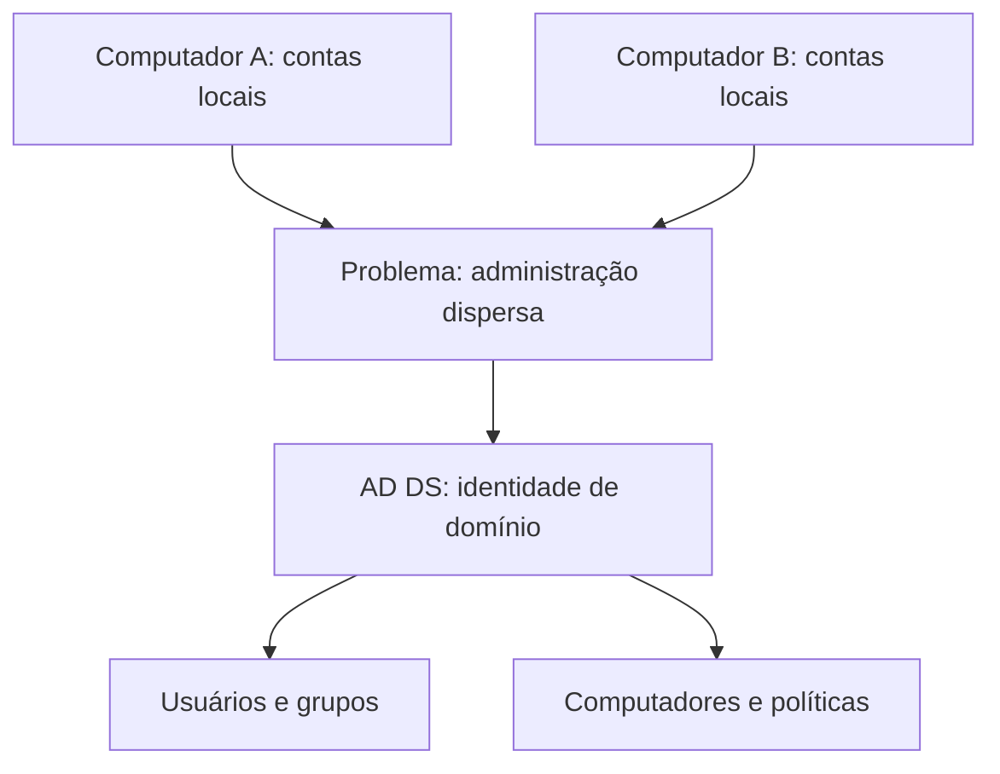
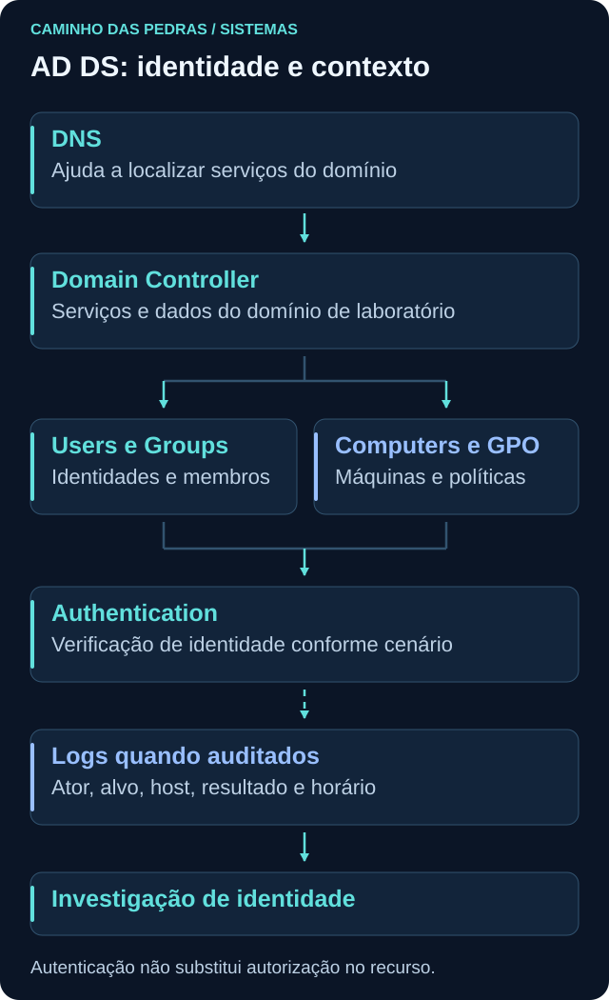
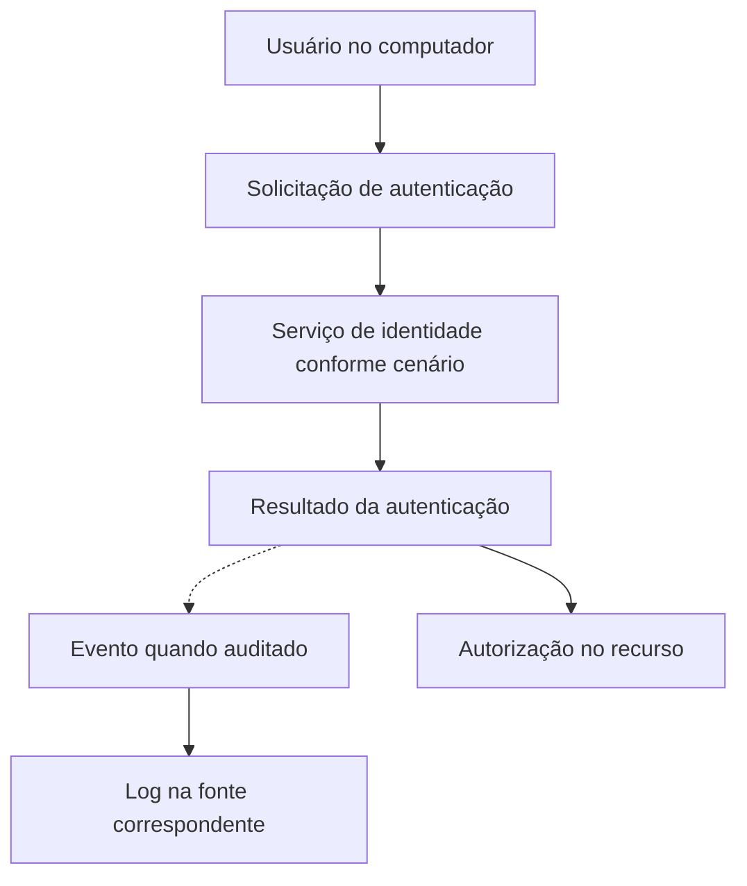
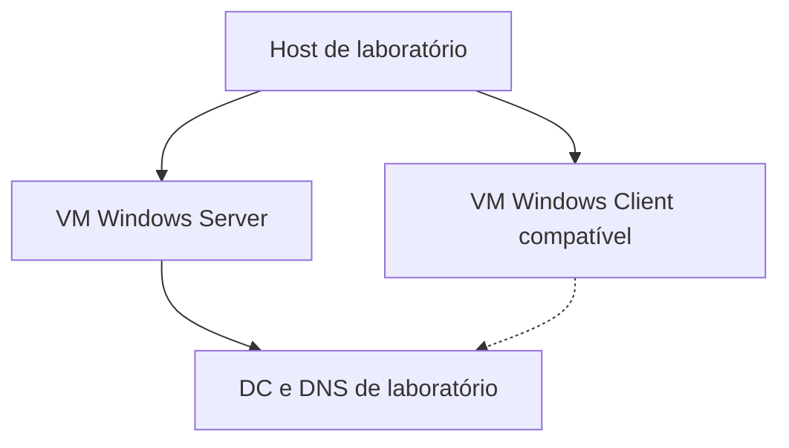

# Active Directory

<!-- markdownlint-configure-file {"MD033": {"allowed_elements": ["details", "summary"]}} -->

[← Tópico anterior](event-viewer.md) · [↑ Índice do módulo](README.md) · [Página principal](../README.md) · [Próximo tópico →](sysmon.md)

## Por que empresas usam diretórios

Com poucas máquinas isoladas, cada uma pode manter suas contas locais. Conforme o ambiente cresce, criar usuários, atribuir acesso e manter configurações em cada computador se torna difícil de coordenar. Contas com o mesmo nome podem ter senhas e permissões diferentes, sem representar a mesma identidade.

Active Directory Domain Services, **AD DS**, oferece um diretório para organizar identidades, computadores, grupos e políticas em domínios. Isso facilita administração, mas torna as mudanças de identidade e de privilégio especialmente importantes para segurança.



Centralizar não elimina automaticamente contas locais nem faz todas as aplicações usarem o domínio. Microsoft Entra ID é um serviço distinto de identidade em nuvem, não simplesmente um controlador de domínio hospedado. Nesta página, “AD” se refere ao AD DS. [Visão geral oficial de AD DS](https://learn.microsoft.com/en-us/windows-server/identity/ad-ds/get-started/virtual-dc/active-directory-domain-services-overview).



## Conceitos que organizam o ambiente

| Conceito | Significado introdutório | Relevância defensiva |
| --- | --- | --- |
| Domain | Domínio que organiza objetos e identidades em um contexto de diretório | Delimitar a autoridade de uma conta |
| Domain Controller, DC | Servidor que mantém serviços e dados do domínio | Localizar autenticações e mudanças processadas ali |
| Forest | Floresta com um ou mais domínios que compartilham esquema e configuração | Compreender o contexto maior sem confundir tudo com uma única máquina |
| Organizational Unit, OU | Contêiner para organizar objetos, delegar administração e apoiar escopo de GPO | Entender onde uma mudança e uma política se aplicam |
| User | Objeto de conta de usuário | Identificar conta afetada e seu ciclo de vida |
| Computer | Objeto de conta de computador | Reconhecer que máquinas também têm identidade |
| Group | Conjunto de membros; grupos de segurança podem receber permissões | Interpretar concessões e mudanças de acesso |
| Group Policy, GPO | Conjunto de configurações para usuários e computadores | Conhecer configurações esperadas e sua aplicação |

Um domínio pode ter vários DCs, que replicam dados conforme a arquitetura. Não espere que qualquer evento de auditoria ocorrido em um DC seja automaticamente copiado para o log de todos os outros. Replicação do diretório e coleta de logs são processos diferentes.

Uma OU não é um grupo de segurança: colocar um usuário em uma OU não o torna membro de um grupo nem concede, por si só, acesso a um arquivo. Grupos também têm tipos e escopos; não é necessário aprofundá-los para entender a distinção básica.

## Conta local e conta de domínio

```text
PC01\alan  → conta local mantida por PC01
LAB\alan   → conta do domínio fictício LAB
```

O nome “alan” se repete, mas a autoridade e os identificadores são diferentes. No exemplo, a conta local não vira a conta de domínio por ter o mesmo nome. Ingressar um computador no domínio também não converte automaticamente cada conta local em conta do AD.

| Pergunta | Conta local | Conta de domínio |
| --- | --- | --- |
| Onde é administrada? | Na base local da máquina, no cenário comum | No diretório do domínio |
| Qual escopo indica o nome? | `PC01\alan` | `LAB\alan` |
| O mesmo nome em outra máquina é a mesma identidade? | Não necessariamente; cada autoridade importa | O domínio e o identificador precisam corresponder |
| Onde observar criação? | Security da máquina que cria a conta local | Security do DC que processa a criação, conforme auditoria |

Credenciais em cache podem permitir certos logons de domínio sem contato imediato com o DC. Isso não cria uma nova conta local equivalente nem garante acesso a recursos de rede. Autenticação em domínio também não significa que cada arquivo acessado provoque um novo pedido de senha ao DC.

## Autenticação e autorização

**Autenticação** verifica uma identidade usando o mecanismo apropriado. **Autorização** decide quais operações aquela identidade pode realizar sobre um recurso, considerando grupos, permissões e políticas.

Uma pessoa pode autenticar corretamente e receber acesso negado a uma pasta. Não há contradição: a identidade foi aceita, mas a operação não foi permitida. Um administrador de uma máquina também não é automaticamente administrador de todos os recursos do domínio.



O fluxo é conceitual, não um diagrama de pacotes Kerberos ou NTLM. Cache, sessões existentes e mecanismos específicos podem mudar as interações. O recurso ainda precisa avaliar acesso após o contexto de identidade ser estabelecido.

## Kerberos, NTLM e LDAP: funções diferentes

**Kerberos** é um protocolo importante de autenticação em AD DS. Em uma visão introdutória, o cliente obtém tickets de um serviço de distribuição de chaves e os utiliza para autenticar acesso a serviços. Não envia uma nova senha em texto a cada recurso. Identidade do serviço, disponibilidade do domínio e relógios coerentes fazem parte do contexto operacional. [Visão geral de Kerberos](https://learn.microsoft.com/en-us/windows-server/security/kerberos/kerberos-authentication-overview).

**NTLM** é outra família de mecanismos de autenticação encontrada em ambientes Windows, conforme compatibilidade, configuração e cenário. Encontrar referência a NTLM em um log não explica sozinho por que foi utilizado. Aqui não veremos técnicas de abuso nem alterações de política.

**LDAP** é um protocolo de consulta e interação com serviços de diretório. Pode ser usado para obter ou modificar objetos conforme autorização. Não é sinônimo de AD DS, de Kerberos ou de “banco de senhas”. Proteção do canal e autorização continuam relevantes, como visto em [Portas e protocolos](../02-Redes/portas-protocolos.md).

## DNS faz parte do funcionamento do domínio

DNS ajuda clientes a localizar serviços de domínio, inclusive por registros SRV. “Consigo resolver um site público” não prova que o computador consegue descobrir um DC. O cliente precisa usar uma resolução capaz de encontrar os registros adequados ao domínio.

Em um laboratório futuro, o DC pode também hospedar o DNS do domínio, mas AD DS e DNS são papéis distintos. Trocar o DNS do cliente por qualquer resolvedor público pode quebrar a descoberta dos serviços internos. Não faça essa mudança como tentativa automática de corrigir logon. Leia [DNS e AD DS](https://learn.microsoft.com/en-us/windows-server/identity/ad-ds/plan/dns-and-ad-ds) e relembre [DNS no módulo 02](../02-Redes/dns.md).

## Group Policy: configuração com escopo

GPOs podem definir configurações de computador e usuário, com exemplos defensivos como auditoria, parâmetros de segurança e configuração do sistema. Políticas de senha também têm escopo e regras próprios; não basta imaginar que qualquer GPO ligada a qualquer OU determina a senha de todas as contas do domínio.

No AD DS, GPOs podem ser vinculadas a sites, domínios e OUs. Grupos de segurança podem participar de filtragem e permissões, mas não são o local onde se vincula uma GPO da mesma forma que uma OU. Herança, precedência e filtros influenciam a política efetiva. Ter uma GPO definida não prova que ela foi aplicada com sucesso ao host. [Visão geral de Group Policy](https://learn.microsoft.com/en-us/windows-server/identity/ad-ds/manage/group-policy/group-policy-overview).

Para investigar, diferencie intenção de configuração e resultado observado. Por exemplo: a política deveria habilitar uma auditoria, mas o evento necessário existe na máquina e no intervalo estudados?

## Identidade em Cybersecurity

Criação de conta, mudança de grupo, alteração de privilégio, autenticação, uso de conta administrativa e modificação de objetos são atividades relevantes. Todas também podem fazer parte de administração legítima. Pergunte por solicitação aprovada, ator, alvo, horário, escopo e resultado.

O 4720 pode sustentar que uma conta de usuário foi criada no escopo indicado, conforme o evento. Ele não prova que houve uso indevido nem que a nova conta recebeu privilégios. O [Lab 02](../12-Labs-Praticos/02-EventID-4720/README.md) trata especificamente de conta local. Event Viewer explica a leitura de [ator e alvo](event-viewer.md).

No futuro, atividades de identidade podem ser relacionadas ao MITRE ATT&CK quando o comportamento e o contexto sustentarem esse mapeamento. Um número de evento ou criação autorizada de conta não devem receber automaticamente o rótulo de técnica adversária. Esta página não faz mapeamento obrigatório.

## Prática atual: observar e desenhar

No Windows de laboratório, consultas opcionais de leitura:

```powershell
whoami
Get-CimInstance -ClassName Win32_ComputerSystem |
    Select-Object Name, Domain, PartOfDomain
```

`PartOfDomain` ajuda a identificar associação ao domínio AD DS. Quando não há associação, `Domain` pode representar o grupo de trabalho. Esse resultado não identifica sozinho o tipo da conta usada em cada processo nem descreve toda modalidade de associação à identidade em nuvem.

Desenhe PC01, uma conta local e uma conta fictícia de domínio. Explique qual autoridade mantém cada identidade e onde buscaria um evento de criação. Se a máquina não pertence a um domínio, isso é suficiente: não é necessário ingressá-la em nada para concluir o exercício.

## Laboratório futuro de AD DS

Esta é uma possibilidade de evolução, **não uma atividade executada automaticamente**. Planeje uma rede virtual isolada do ambiente doméstico compartilhado e de qualquer domínio corporativo, sem exposição de serviços à internet. Use mídias oficiais, recursos compatíveis e licenciamento adequado.



Use apenas um nome fictício reservado para teste, como `lab.example.test`, e o nome curto `LAB`. Em uma execução futura planejada, as atividades seriam:

1. Preparar as VMs e registrar versões, rede e pontos de recuperação.
2. Criar o domínio exclusivamente de laboratório no Windows Server.
3. Configurar a resolução de nomes do cliente para os serviços desse laboratório.
4. Ingressar um Windows Client cuja edição suporte domínio AD DS.
5. Criar uma conta de teste sem privilégios administrativos desnecessários.
6. Autenticar no cliente e observar onde os eventos aparecem, conforme auditoria.
7. Comparar conta local e de domínio, grupos e resultado de autorização.

Não conecte esse DC a um domínio existente, não reutilize credenciais reais e não aplique GPOs a máquinas fora do laboratório. Esta página apresenta objetivos e limites, não um passo a passo de implantação completa.

## Pensamento de analista e mini desafio

Um usuário de teste foi criado. Qual autoridade mantém a conta? Quem realizou a ação? Qual objeto foi criado? Qual DC ou host registrou o evento? Há mudança de grupo posterior? Existe justificativa administrativa? A ausência de um evento em outro DC significa apenas que você consultou uma fonte diferente?

Entregue um desenho do domínio futuro, uma tabela comparando `PC01\alan` e `LAB\alan` e dois exemplos: autenticação aceita com acesso autorizado; autenticação aceita com acesso negado ao recurso. Explique quais registros seriam úteis em cada caso sem fabricar evidências reais.

## Checkpoint

Tente justificar suas respostas com uma observação e uma limitação antes de abrir a explicação.

<details>
<summary>PC01\alan e LAB\alan são a mesma identidade por terem o mesmo nome?</summary>

Não. Pertencem a autoridades distintas e têm identificadores e escopos diferentes. O nome curto sozinho não identifica a conta.

</details>

<details>
<summary>Ingressar uma máquina no domínio converte suas contas locais?</summary>

Não automaticamente. Associação do computador ao domínio e criação ou migração de contas são operações distintas.

</details>

<details>
<summary>Autenticação bem-sucedida garante acesso a qualquer pasta?</summary>

Não. O recurso ainda avalia autorização com permissões, grupos e políticas aplicáveis.

</details>

<details>
<summary>Uma OU e um grupo são intercambiáveis?</summary>

Não. OU organiza objetos e permite delegação e escopo de GPO; grupos de segurança reúnem membros para concessão de acesso e outros usos de segurança.

</details>

<details>
<summary>Resolver example.com prova que a descoberta do DC funciona?</summary>

Não. O domínio depende de registros DNS apropriados, inclusive de serviço. Resolução pública não demonstra acesso à zona e aos registros internos necessários.

</details>

<details>
<summary>A criação de usuário no AD deve aparecer no Security de todos os DCs?</summary>

Não se deve presumir isso. A operação é auditada no DC que a processa conforme configuração; replicação de objetos não replica automaticamente os eventos de auditoria entre canais locais.

</details>

<details>
<summary>O 4720 confirma que a conta criada foi usada de forma maliciosa?</summary>

Não. Ele registra criação. Justificativa, ator, escopo, mudanças de acesso e uso posterior precisam ser investigados em outras evidências.

</details>

## Resumo e próximo passo

Identidade centralizada acrescenta contexto e responsabilidade à investigação. Em [Sysmon](sysmon.md), relacione essa identidade à criação de processos e a outras atividades observadas no endpoint.

[← Tópico anterior](event-viewer.md) · [↑ Índice do módulo](README.md) · [Página principal](../README.md) · [Próximo tópico →](sysmon.md)
