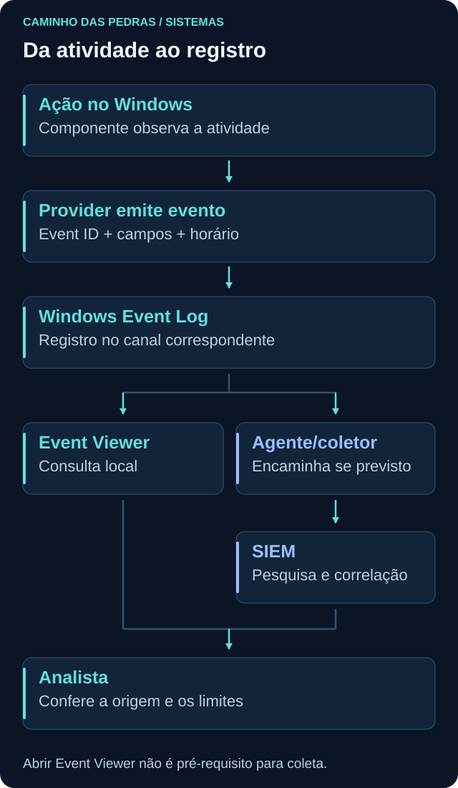
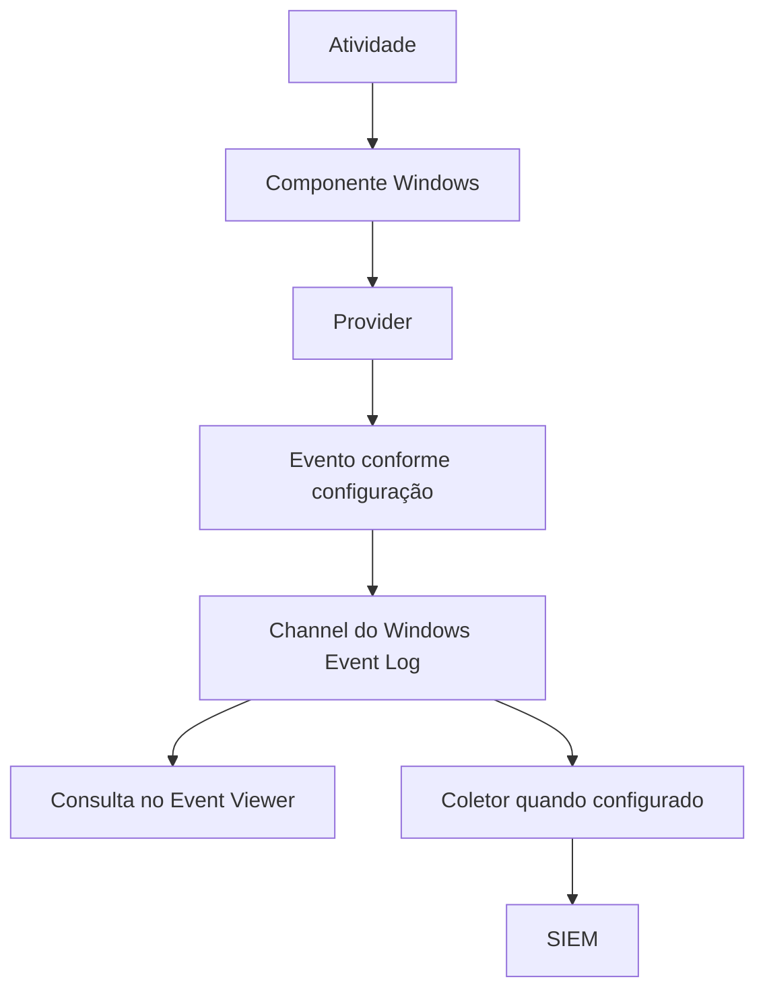

# Event Viewer

<!-- markdownlint-configure-file {"MD033": {"allowed_elements": ["details", "summary"]}} -->

[← Tópico anterior](powershell.md) · [↑ Índice do módulo](README.md) · [Página principal](../README.md) · [Próximo tópico →](active-directory.md)

## Por que isso importa

O Event Viewer, ou Visualizador de Eventos, é uma interface para consultar registros do Windows Event Log. Ele não é a origem de toda atividade nem liga automaticamente toda auditoria. Um componente produz um evento, e a infraestrutura o registra em um canal quando as condições necessárias estão presentes.

Antes de procurar um número em um SIEM, entenda o registro original. Provider, channel, horário, host e campos específicos dizem muito mais do que o Event ID sozinho.

## O que compõe um evento

| Informação | Como usar |
| --- | --- |
| Timestamp | Situar a ocorrência; distinguir horário do evento de ingestão no SIEM |
| Provider | Identificar o componente que definiu e emitiu o evento |
| Channel | Identificar onde o evento foi registrado |
| Event ID | Reconhecer o tipo dentro daquele provedor |
| Version | Interpretar o esquema de campos correspondente |
| Level | Ler a classificação técnica do provedor, não a severidade de um incidente |
| Computer | Saber qual host aparece como origem do registro |
| User, quando aplicável | Contexto informado pelo evento, com semântica própria |
| Campos específicos | Identificar ator, alvo, processo, origem e resultado conforme o tipo |
| EventRecordID | Localizar o registro no contexto do canal e host |

O mesmo número pode existir em provedores diferentes. EventRecordID também não é um identificador global entre todos os computadores. Um campo de usuário no cabeçalho não substitui a interpretação de `SubjectUserName` e `TargetUserName` no payload. O nível “Information” pode conter dados relevantes para segurança sem representar um erro do sistema.

## Canais e ferramentas

| Local | Conteúdo típico |
| --- | --- |
| Windows Logs → Application | Eventos de aplicações e componentes registrados nesse canal |
| Windows Logs → System | Eventos de componentes do sistema, drivers e serviços |
| Windows Logs → Security | Eventos de auditoria de segurança conforme política efetiva |
| Applications and Services Logs | Canais específicos de componentes e aplicações |
| Microsoft-Windows-Sysmon/Operational | Eventos do provedor Sysmon, quando instalado e configurado |

Os nomes exibidos podem estar traduzidos. Canais podem ter políticas de retenção e permissões distintas. Não encontrar o canal Sysmon é diferente de abrir um canal existente sem encontrar eventos na janela desejada.





O Event Viewer e o coletor são consumidores possíveis do registro. Abrir a interface não é pré-requisito para o agente encaminhar eventos.

## Quatro Event IDs para começar

Os números abaixo se referem ao provedor **Microsoft-Windows-Security-Auditing**, no canal **Security**. Auditoria efetiva, versão, retenção e permissões influenciam o que estará disponível.

| ID | Atividade registrada | Condição de auditoria relevante |
| --- | --- | --- |
| [4624](https://learn.microsoft.com/en-us/previous-versions/windows/it-pro/windows-10/security/threat-protection/auditing/event-4624) | Criação de sessão de logon bem-sucedida | Audit Logon, sucesso |
| [4625](https://learn.microsoft.com/en-us/previous-versions/windows/it-pro/windows-10/security/threat-protection/auditing/event-4625) | Falha de logon | Audit Logon, falha; contexto pode envolver outras subcategorias |
| [4688](https://learn.microsoft.com/en-us/previous-versions/windows/it-pro/windows-10/security/threat-protection/auditing/event-4688) | Criação de processo | Audit Process Creation, sucesso |
| [4720](https://learn.microsoft.com/en-us/previous-versions/windows/it-pro/windows-10/security/threat-protection/auditing/event-4720) | Criação de conta de usuário | Audit User Account Management, sucesso |

Nenhum deles classifica automaticamente a atividade como maliciosa. Um 4624 pode corresponder a uma rotina legítima, um 4625 a erro de digitação, um 4688 a uma aplicação comum e um 4720 a provisionamento aprovado.

### 4624: qual sessão foi criada?

O 4624 aparece no computador em que a sessão de logon é criada, não necessariamente no controlador de domínio. Examine conta de destino, escopo da conta, tipo de logon, horário e origem quando informada. Não trate o `Subject` como se fosse sempre a pessoa que acabou de entrar.

Alguns tipos úteis: `2` representa interação local, `3` acesso de rede e `10` interação remota via Remote Desktop no cenário correspondente. Um logon de rede não significa automaticamente que alguém abriu uma área de trabalho remota. Campos de IP podem estar vazios, usar marcador ou loopback conforme o contexto.

### 4625: o que falhou e onde?

O 4625 registra uma falha de logon no computador em que a tentativa ocorreu. Observe conta alvo, domínio ou máquina, `LogonType`, `Status`, `SubStatus` e origem quando disponível. A razão exibida é uma pista a interpretar, não a confirmação de uma campanha de ataque.

Uma falha isolada pode ocorrer por senha incorreta, conta indisponível ou configuração de uma aplicação. Relacione frequência, intervalo, ativo e impacto. O [Lab 01, Event ID 4625](../12-Labs-Praticos/01-EventID-4625/README.md), oferece uma tentativa manual controlada em VM; leia seus pré-requisitos antes de executá-lo. Esta página não pede gerar falhas em contas reais.

### 4688: criação não é todo o comportamento do processo

O evento permite investigar um processo recém-criado quando a auditoria necessária está habilitada. A inclusão de command line depende de política adicional; não presuma esse campo preenchido. Criador e identidade alvo podem ter diferenças conforme a versão do evento e o contexto.

PIDs podem aparecer em hexadecimal em eventos Security e em decimal em ferramentas de processo. Normalize a representação antes de correlacionar, e use host e tempo. Um comando de inicialização não mostra automaticamente todos os arquivos lidos, conexões feitas ou comandos interativos posteriores.

### 4720: ator, conta criada e escopo

Pergunte quem solicitou a criação, qual conta foi criada, onde e quando. Campos `Subject...` descrevem o contexto que realizou a ação; `Target...` descrevem a nova conta. Uma conta local criada em uma estação deve ser investigada no escopo daquela máquina. Uma conta de domínio criada no AD DS gera contexto no controlador de domínio que processa a operação, conforme auditoria.

O [Lab 02, Event ID 4720](../12-Labs-Praticos/02-EventID-4720/README.md), trata de conta local descartável em VM que não é controlador de domínio. Não transforme esse exercício em criação de conta corporativa. A página de [Active Directory](active-directory.md) aprofunda a distinção.

## XML: nomes de campos antes do parser

Na aba **Details/Detalhes**, a visão XML ajuda a separar metadados de `System` e dados específicos de `EventData`. O texto da mensagem pode variar por idioma; os nomes estruturados ajudam a conferir a extração realizada por um SIEM.

O trecho abaixo é **sintético e abreviado**, apenas para leitura de estrutura. Não é um evento coletado nem uma representação completa de todos os campos do 4720:

```xml
<Event xmlns="http://schemas.microsoft.com/win/2004/08/events/event">
  <System>
    <Provider Name="Microsoft-Windows-Security-Auditing" />
    <EventID>4720</EventID>
    <TimeCreated SystemTime="2026-01-15T14:00:00Z" />
    <Channel>Security</Channel>
    <Computer>PC01</Computer>
  </System>
  <EventData>
    <Data Name="SubjectUserName">operador-lab</Data>
    <Data Name="TargetUserName">usuario-teste</Data>
    <Data Name="TargetDomainName">PC01</Data>
  </EventData>
</Event>
```

O sufixo `Z` indica UTC. A interface pode converter para o fuso local na apresentação. O parser precisa preservar a diferença entre ator e alvo, além de horário e host. Campo ausente no evento não pode ser reconstruído com certeza apenas pela normalização.

## Prática de leitura no próprio laboratório

1. Abra Event Viewer e escolha um evento já existente em System ou Application ao qual tenha acesso.
2. Registre provider, canal, Event ID, versão, computador e horário.
3. Leia a mensagem geral e compare com os campos XML.
4. Identifique uma observação sustentada e uma conclusão que o evento não permite.
5. Se já executou os labs 01 ou 02, compare o evento correspondente no Security com o roteiro.
6. Não limpe o canal, não altere retenção e não exporte EVTX/XML bruto para o repositório.

No PowerShell do Windows:

```powershell
Get-WinEvent -ListLog *
```

Isso consulta canais e metadados, não todos os registros de todos os canais. Alguns podem negar acesso ou estar indisponíveis. Para uma busca simples, conforme as permissões do laboratório:

```powershell
Get-WinEvent -FilterHashtable @{
    LogName = 'Security'
    Id = 4625
} -MaxEvents 10
```

O filtro pede até dez eventos desse ID no Security. Não é uma contagem de todas as falhas nem garantia de que existirão dados. Para uma janela específica, acrescente `StartTime` e `EndTime` à hashtable. Observe a diferença entre acesso negado, canal ausente e nenhum evento correspondente.

Para consultar o XML de um evento acessível de System:

```powershell
$labEvent = Get-WinEvent -LogName 'System' -MaxEvents 1
if ($labEvent) {
    $labEvent.ToXml()
}
```

O XML exibido pertence ao seu host e pode conter dados sensíveis. Use-o apenas localmente. Não suponha que os campos sejam idênticos entre esse evento de System e os exemplos de Security. Veja [Get-WinEvent](https://learn.microsoft.com/en-us/powershell/module/microsoft.powershell.diagnostics/get-winevent).

## Ponte para o SIEM

O coletor seleciona canais e eventos, transmite dados e pode aplicar filtros. A plataforma pode extrair campos e normalizar nomes. Compare um registro na origem e no destino usando host, provider, canal, horário e identificador de registro quando disponível. Diferencie horário da atividade, horário do registro e horário de ingestão.

Se a conta alvo foi colocada na coluna de ator pelo parser, uma consulta pode produzir uma narrativa errada mesmo com o evento original correto. Em Detection Engineering, conhecer o campo real é parte da qualidade da detecção, não apenas um detalhe de sintaxe.

## Pensamento de analista e mini desafio

Escolha um evento do próprio laboratório. Explique o que ocorreu segundo aquele provider, quem ou o que é o alvo, em qual host e horário, e que configuração tornou o registro possível. Se não houver usuário, não preencha por suposição.

Monte uma tabela sintética com os campos essenciais e compare “evento registrado” com “interpretação do analista”. Para 4625, descreva uma explicação benigna; para 4720, diferencie ator e conta criada. Se nenhum desses existir, faça a leitura de outro evento disponível e registre a limitação.

## Checkpoint

Tente justificar suas respostas com uma observação e uma limitação antes de abrir a explicação.

<details>
<summary>Event ID 1 de qualquer provedor é Sysmon Process Create?</summary>

Não. O número precisa ser interpretado junto do provider, canal e versão. Um mesmo ID pode significar outra coisa em outra fonte.

</details>

<details>
<summary>4624 de tipo 3 prova que alguém abriu uma sessão de área de trabalho remota?</summary>

Não. Tipo 3 representa logon de rede. Tipo de logon, conta e contexto precisam ser lidos antes de interpretar a interação.

</details>

<details>
<summary>O campo de IP vazio em 4625 prova ausência de origem?</summary>

Não. O contexto e o mecanismo de logon influenciam os campos disponíveis. Registre a lacuna e procure outras fontes em vez de inventar um endereço.

</details>

<details>
<summary>Habilitar auditoria de criação garante command line no 4688?</summary>

Não. A inclusão de linha de comando depende de política adicional e do contexto suportado. Confira o evento efetivamente gerado.

</details>

<details>
<summary>No 4720, quem é Subject e quem é Target?</summary>

Subject representa o contexto que realizou a criação; Target representa a conta criada. Confundir os dois atribui a ação à entidade errada.

</details>

<details>
<summary>O evento existe no host, mas não no SIEM. O que verificar?</summary>

Seleção do canal, agente, filtros, transporte, retenção, parser, atraso e consulta. Ausência no destino não invalida automaticamente o registro na origem.

</details>

<details>
<summary>Level Information significa que o evento é irrelevante para segurança?</summary>

Não. Level é classificação do provedor, não uma avaliação completa de risco. Eventos informativos podem ser essenciais para correlação.

</details>

## Resumo e próximo passo

Eventos têm origem, estrutura e limites. Em [Active Directory](active-directory.md), amplie o contexto de identidade para além das contas de uma máquina isolada.

[← Tópico anterior](powershell.md) · [↑ Índice do módulo](README.md) · [Página principal](../README.md) · [Próximo tópico →](active-directory.md)
