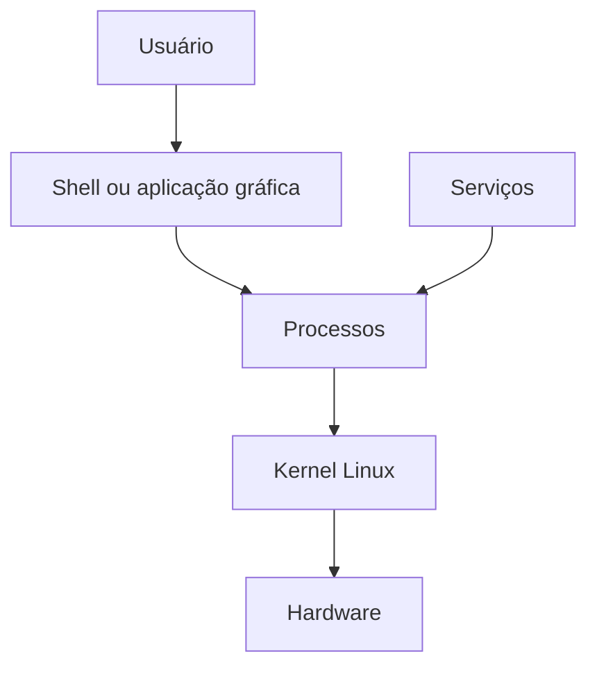
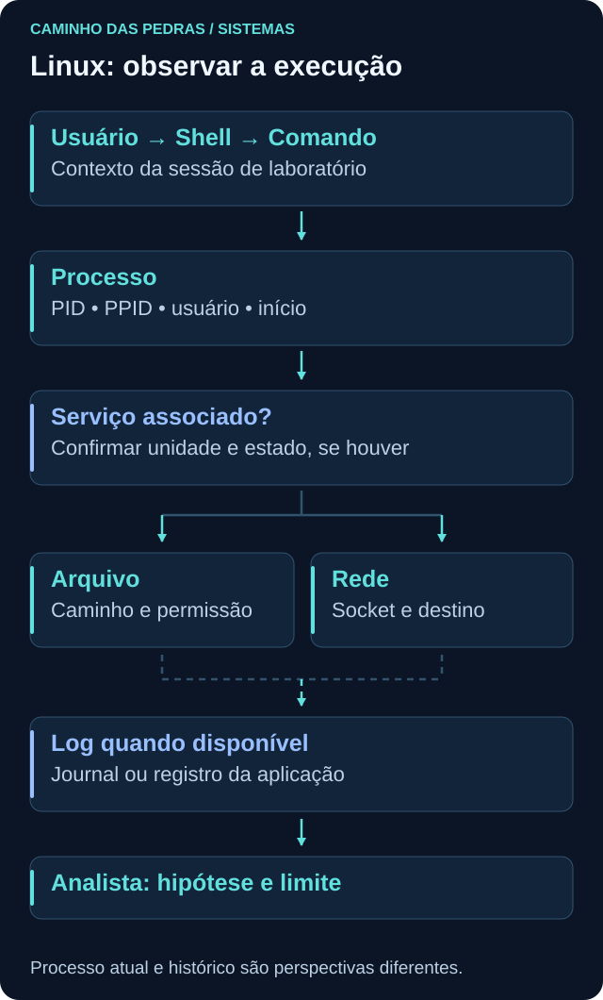
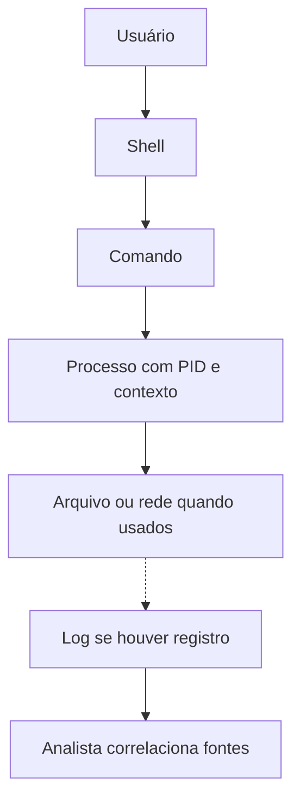

# Linux

<!-- markdownlint-configure-file {"MD033": {"allowed_elements": ["details", "summary"]}} -->

[← Tópico anterior](README.md) · [↑ Índice do módulo](README.md) · [Página principal](../README.md) · [Próximo tópico →](windows.md)

## Por que isso importa

Um serviço indisponível, um processo desconhecido ou uma falha de acesso precisam ser interpretados no contexto do sistema. Em Linux, usuário, permissões, processo, unidade de serviço e logs são pontos de partida para essa leitura defensiva.

O objetivo aqui é observar e explicar um host. Não é necessário administrar todas as distribuições nem alterar permissões para começar uma investigação.

## Estrutura geral e distribuições

Linux é o kernel. Uma distribuição reúne kernel, bibliotecas, ferramentas e escolhas de configuração. Ubuntu, Debian, Red Hat Enterprise Linux, Rocky Linux e Fedora são exemplos. Nenhuma lista de diretórios ou comandos descreve todas as instalações de forma idêntica: pacotes, logs e gerenciadores de serviço podem variar.



A shell é um programa que interpreta comandos, não uma camada obrigatória entre toda aplicação e o kernel. Serviços também executam como processos, frequentemente sem uma pessoa interagindo no terminal. O desenho organiza responsabilidades, sem detalhar bibliotecas, chamadas de sistema ou drivers.



## Caminhos que ajudam a se localizar

| Caminho | Papel comum | Cuidado na interpretação |
| --- | --- | --- |
| `/` | Raiz da árvore de arquivos | Não é o diretório pessoal de root |
| `/home` | Diretórios pessoais de usuários | Nem toda conta tem diretório aqui |
| `/etc` | Configurações do sistema e serviços | Arquivos podem conter dados sensíveis |
| `/var` | Dados variáveis, como estado e registros | Nem todo conteúdo é log |
| `/var/log` | Local comum de logs | Formato, persistência e existência variam |
| `/tmp` | Arquivos temporários | Não é prova de malícia nem armazenamento permanente |
| `/usr` | Programas, bibliotecas e dados compartilháveis | Não é a pasta pessoal dos usuários |
| `/bin` | Comandos essenciais no arranjo tradicional | Pode ser ligação para `/usr/bin` |
| `/root` | Diretório pessoal usual de root | Diferente de `/`, a raiz do sistema |

Leia a finalidade antes de interpretar o caminho como evidência. Um executável em um diretório conhecido não se torna confiável apenas pela localização. A organização tradicional é descrita no [Filesystem Hierarchy Standard](https://refspecs.linuxfoundation.org/FHS_3.0/fhs/index.html); instalações atuais podem adotar variações.

## Usuários, grupos e privilégios

Uma conta tem um identificador numérico, **UID**, e pode pertencer a grupos identificados por **GID**. Há um grupo primário e podem existir grupos suplementares. Nomes facilitam a leitura, mas a resolução de identidades pode consultar fontes locais ou um diretório.

Root é a identidade com UID 0 no contexto tradicional do sistema. Um usuário comum tem acesso limitado pelas políticas efetivas. `sudo` permite executar uma ação sob outra identidade quando a política autoriza; não é sinônimo de “todo usuário pode ser root”. Namespaces, capabilities e controles adicionais tornam o modelo real mais rico do que apenas “root ou comum”.

```bash
whoami
id
groups
```

`whoami` mostra o nome associado ao usuário efetivo. `id` apresenta UID, GID e grupos no contexto consultado. `groups` lista grupos da sessão ou usuário solicitado. Nenhum dos três reconstrói sozinho quem estava logado ontem.

Para uma visão de sessões registradas, `who` pode ajudar, mas depende de como o ambiente mantém esses registros. `getent passwd` consulta entradas de contas via a configuração NSS; não mostra hashes de senha e pode incluir contas técnicas ou de diretório. A saída ainda pode expor nomes pessoais e internos, portanto não a publique inteira.

## Permissões: ler antes de mudar

```text
-rw-r--r--
```

O primeiro caractere indica um arquivo regular. Os nove seguintes formam três grupos: **owner**, **group** e **others**. No exemplo, o proprietário lê e escreve (`rw-`); membros do grupo correspondente apenas leem (`r--`); os demais também apenas leem (`r--`). O hífen indica ausência daquele bit de permissão.

| Bit | Arquivo regular | Diretório |
| --- | --- | --- |
| `r`, read | Ler conteúdo | Listar nomes das entradas |
| `w`, write | Alterar conteúdo | Alterar entradas, em conjunto com outras condições |
| `x`, execute | Permitir execução conforme formato e contexto | Atravessar ou pesquisar o diretório |

ACLs, opções de montagem e controles como SELinux/AppArmor podem acrescentar restrições. Os bits sozinhos não explicam toda decisão de acesso. `chmod` altera modos e `chown` altera propriedade; não são necessários para a prática de observação.

```bash
pwd
ls -ld .
ls -l
```

Execute em uma pasta própria de estudo. `pwd` mostra a localização; `ls -ld .` descreve o diretório atual; `ls -l` lista entradas com metadados. Não confunda permissão de um arquivo com a dos diretórios necessários para alcançá-lo. Confira a referência de [permissões e verificações de acesso](https://man7.org/linux/man-pages/man7/path_resolution.7.html).

## Processos: identidade, pai e tempo

Um processo é uma instância em execução. **PID** é seu identificador no contexto observado; **PPID** informa o identificador do pai. Usuário e comando ajudam a entender a execução, mas não substituem horário e função do ativo. Processos podem terminar rapidamente e PIDs podem ser reutilizados.

```bash
ps aux
ps -ef
pstree
```

`ps aux`, em implementações comuns como procps, oferece uma visão ampla com usuário, PID, recursos e comando. `ps -ef` usa outro conjunto de opções e costuma mostrar também PPID. `pstree`, quando instalado, organiza uma árvore. Não trate os conjuntos de opções como intercambiáveis em toda implementação. [Manual de ps](https://man7.org/linux/man-pages/man1/ps.1.html).

Na própria shell Bash, uma consulta mais delimitada é:

```bash
ps -p "$$" -o pid,ppid,user,lstart,args
```

`$$` identifica a shell nesse contexto; `-o` escolhe campos. Observe início, usuário e comando. O pai pode já ter terminado, e processos podem ser reparentados. Uma árvore atual não é um histórico completo da criação. Linhas de comando podem conter segredos fornecidos indevidamente por aplicações: não copie saídas brutas para o portfólio.

## Serviços e systemd

Um serviço executa uma função de fundo, como sincronização de horário ou atendimento a uma aplicação. Em muitas distribuições, systemd gerencia unidades e dependências. Uma unidade `.service` descreve um serviço; o serviço pode usar mais de um processo e nem toda unidade é um serviço.

```bash
systemctl status
systemctl list-units --type=service
```

Sem nome de unidade, `systemctl status` mostra o estado geral e informações do gerenciador. A lista de unidades carregadas não equivale a todos os serviços instalados nem apenas aos que estão executando: leia as colunas `LOAD`, `ACTIVE` e `SUB`. Um serviço ativo pode estar em estado `exited` por desenho, sem um processo residente. Use `q` para sair do paginador quando houver um.

Em VM que utilize systemd, um exemplo de consulta pontual é:

```bash
systemctl status systemd-journald.service --no-pager
```

O nome precisa existir no ambiente. Observe estado, PID quando houver e mensagens recentes. Esses comandos não iniciam, param nem desabilitam serviços. Sistemas sem systemd exigem ferramentas do gerenciador usado. [Manual de systemctl](https://man7.org/linux/man-pages/man1/systemctl.1.html).

## Logs: origem, formato e disponibilidade

`/var/log` é um local comum, mas aplicações podem gravar em outros caminhos ou enviar registros ao journal. O journal é um armazenamento estruturado gerenciado por systemd-journald; não é apenas um arquivo de texto para abrir com `tail`. Persistência e rotação dependem da configuração.

```bash
journalctl
journalctl --since today
journalctl --since today -n 30 --no-pager
```

O primeiro consulta o que seu usuário pode ler; o segundo restringe ao início do dia no contexto de horário usado; o terceiro limita a saída a 30 registros. Prefira a consulta delimitada na prática. Observe tempo, unidade, identificador do programa e mensagem, quando presentes. Falta de permissão ou journal vazio não prova que nada ocorreu. [Manual de journalctl](https://man7.org/linux/man-pages/man1/journalctl.1.html).

Para arquivo de texto próprio já existente, substitua o caminho ilustrativo pelo arquivo autorizado:

```bash
tail -n 20 -- "$HOME/lab-observacao/aplicacao.log"
tail -f -- "$HOME/lab-observacao/aplicacao.log"
```

`tail -n 20` lê as últimas linhas. `tail -f` acompanha acréscimos e continua em execução até `Ctrl+C`. O arquivo não é criado por esses comandos; se não existir, registre a limitação. Monitore continuamente apenas arquivos próprios ou autorizados. Logs de autenticação podem estar no journal ou em arquivos específicos da distribuição; não assuma um nome universal.

## Processos, portas e conexões

```bash
ss -tulpen
ss -tnp
```

A primeira consulta inclui TCP/UDP, escutas, detalhes e processos quando acessíveis, mantendo números. Não lista todas as conexões TCP estabelecidas por causa de `-l`. A segunda ajuda a observar conexões TCP atuais. Permissões, término rápido de processos e namespaces podem limitar o que aparece. Consulte também [Portas e protocolos](../02-Redes/portas-protocolos.md).

Uma shell usada apenas para `ps` pode não ter conexão de rede própria. Isso é esperado. A existência de uma escuta não prova alcance externo nem intenção maliciosa.

## Fluxo investigativo e perguntas



Qual usuário efetivo executou? Qual PID e início? Qual PPID e o que se sabe do pai? Qual comando? Há evidência de arquivo acessado ou só uma referência no argumento? Existe serviço associado, conexão e log? O histórico da shell não é uma auditoria completa de execução e não deve ser a única fonte.

Essas perguntas aparecem em SOC, análise de servidores e hunting. Um nome incomum pode pertencer a um pacote legítimo; um processo com root pode ser esperado para um serviço. Procure função e configuração antes de classificar.

## Mini desafio

Escolha a shell pessoal do laboratório ou outro processo legítimo que você reconheça. Registre nome, PID, UID ou usuário, PPID quando disponível, horário de início, função e conexões quando existirem. Se estiver ligado a um serviço, documente unidade e estado; caso contrário, marque “não identificado”, sem inventar associação.

Consulte um pequeno intervalo de logs acessíveis e explique se existe relação demonstrável com o processo. Monte uma ficha sintética com o que foi visto e o que exigiria auditoria adicional. Não use processos corporativos nem altere permissões ou serviços.

## Checkpoint

Tente justificar suas respostas com uma observação e uma limitação antes de abrir a explicação.

<details>
<summary>whoami e who respondem à mesma pergunta?</summary>

Não. whoami identifica o usuário efetivo do contexto atual; who mostra sessões que o sistema registrou e que a ferramenta consegue consultar. Ambos têm limites.

</details>

<details>
<summary>O que -rw-r--r-- permite no exemplo de arquivo?</summary>

O proprietário pode ler e escrever; grupo e demais usuários podem ler. Não há bit de execução. Controles adicionais ainda podem limitar o acesso.

</details>

<details>
<summary>x em um diretório significa executar o diretório?</summary>

Não. Representa permissão de pesquisa ou travessia. Para acessar um arquivo, os diretórios no caminho também participam da verificação.

</details>

<details>
<summary>Um PPID aponta para um PID existente agora. Isso reconstrói o pai histórico com certeza?</summary>

Não. O pai original pode ter terminado, o processo pode ter sido reparentado e o PID pode ter sido reutilizado. Tempo e registros de criação ajudam.

</details>

<details>
<summary>systemctl list-units --type=service mostra só processos ativos?</summary>

Não. Mostra unidades de serviço carregadas conforme o filtro padrão. Estado de unidade e existência de processo residente são coisas distintas.

</details>

<details>
<summary>journalctl sem resultados prova ausência de atividade?</summary>

Não. Permissões, persistência, janela, origem e configuração podem limitar os registros disponíveis. Algumas aplicações usam outras fontes.

</details>

<details>
<summary>Uma shell sem conexão em ss é suspeita?</summary>

Não. Muitos comandos locais não usam rede. Relacione função, tempo e operação esperada antes de interpretar a ausência ou presença de conexão.

</details>

## Resumo e próximo passo

Linux oferece várias perspectivas do mesmo host: identidade, permissões, processos, serviços e registros. Em [Windows](windows.md), faça perguntas semelhantes respeitando as diferenças de arquitetura e ferramentas.

[← Tópico anterior](README.md) · [↑ Índice do módulo](README.md) · [Página principal](../README.md) · [Próximo tópico →](windows.md)
