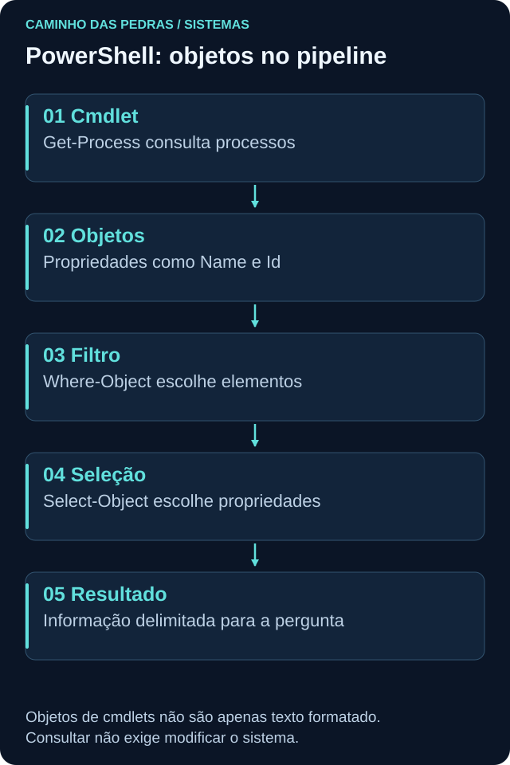
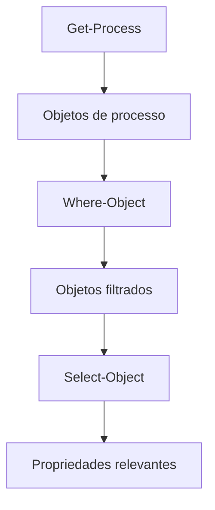

# PowerShell

<!-- markdownlint-configure-file {"MD033": {"allowed_elements": ["details", "summary"]}} -->

[← Tópico anterior](windows.md) · [↑ Índice do módulo](README.md) · [Página principal](../README.md) · [Próximo tópico →](event-viewer.md)

## Por que isso importa

PowerShell existe para administração e automação legítimas. Administradores o utilizam para inventariar processos, consultar serviços, ler eventos e reduzir trabalho repetitivo. Um analista defensivo precisa compreender esse uso normal antes de interpretar sua presença em um alerta.

PowerShell reúne uma shell interativa, uma linguagem e ferramentas de automação. O diferencial de muitos de seus comandos, os **cmdlets**, é produzir objetos com propriedades, em vez de apenas linhas prontas para leitura humana.

## PowerShell, CMD e edições

CMD é outra shell do Windows, com comandos internos e execução de programas. Seus pipelines normalmente trabalham com texto. No PowerShell, cmdlets podem passar objetos tipados pelo pipeline. Isso permite filtrar uma propriedade numérica sem procurar uma posição em uma linha de texto.

Windows PowerShell, normalmente executado por `powershell.exe`, e PowerShell moderno, normalmente `pwsh.exe`, não são a mesma edição. Módulos, plataformas e logs disponíveis podem diferir. PowerShell também existe fora do Windows, mas cmdlets como `Get-WinEvent`, `Get-Service` e consultas NetTCPIP desta trilha são orientados ao Windows.

```powershell
$PSVersionTable
Get-Date
```

O primeiro mostra versão e edição; o segundo retorna data e hora como objeto. Registre fuso ao comparar fontes. Nenhum deles modifica a configuração.

## Pipeline de objetos





O caractere `|` encaminha resultados ao próximo comando. `Where-Object` escolhe quais objetos continuam; `Select-Object` escolhe propriedades ou uma quantidade de objetos. A formatação na tela não representa necessariamente todas as propriedades disponíveis. [Referência de pipelines](https://learn.microsoft.com/en-us/powershell/module/microsoft.powershell.core/about/about_pipelines).

Programas nativos, como `whoami.exe`, normalmente fornecem saída textual ao PowerShell. Não presuma que qualquer comando externo vira um objeto com campos semânticos automaticamente. `Format-Table` é útil para apresentação, mas deve ficar no final quando usado, pois transforma a saída para formatação e dificulta consultas posteriores às propriedades originais.

## Aprender a descobrir antes de copiar

| Grupo | Comandos | Pergunta que ajudam a responder |
| --- | --- | --- |
| Descoberta | `Get-Help`, `Get-Command` | Qual comando existe e quais parâmetros aceita? |
| Estrutura | `Get-Member` | Que tipo de objeto recebi e quais propriedades possui? |
| Sistema | `Get-Process`, `Get-Service` | Quais processos e serviços consigo consultar? |
| Arquivos | `Get-ChildItem`, `Get-Content` | Quais entradas existem e qual texto autorizado posso ler? |
| Seleção | `Where-Object`, `Select-Object` | Quais objetos e campos respondem à pergunta? |
| Organização | `Sort-Object`, `Measure-Object` | Como ordenar ou resumir o resultado? |
| Tempo e eventos | `Get-Date`, `Get-WinEvent` | Qual momento e quais registros delimitam a análise? |

```powershell
Get-Command Get-Process
Get-Help Get-Process -Examples
Get-Process | Get-Member
```

Leia a ajuda correspondente à versão instalada. Ela pode estar incompleta localmente; isso não torna seguro executar um comando desconhecido. A convenção Verbo-Substantivo ajuda, mas sempre confira a finalidade, especialmente antes de comandos que alteram estado.

## Prática 1: observar e selecionar processos

```powershell
Get-Process | Select-Object Name, Id
```

O resultado mantém nome e PID. Para observar apenas o próprio PowerShell e ordenar uma amostra de nomes:

```powershell
Get-Process | Where-Object Id -eq $PID | Select-Object Name, Id, StartTime
Get-Process | Sort-Object Name | Select-Object -First 10 Name, Id
Get-Process | Measure-Object
```

`-eq` significa igualdade; `$PID` é o identificador do PowerShell atual. A ordenação não muda os processos, e a contagem é uma fotografia daquele instante. Se consultar a propriedade `CPU`, lembre que em `Get-Process` ela representa tempo acumulado de CPU em segundos, não percentual instantâneo.

## Prática 2: filtrar serviços em execução

```powershell
Get-Service | Where-Object Status -eq 'Running'
```

O comando seleciona serviços cujo estado observado é Running, sem iniciá-los ou pará-los. Para uma saída mais focada:

```powershell
Get-Service |
    Where-Object Status -eq 'Running' |
    Sort-Object Name |
    Select-Object Name, DisplayName, Status
```

Nome interno e nome de exibição podem ser diferentes. Um serviço parado pode ser esperado se ele atende sob demanda. A consulta não prova qual conta o executa; a página [Windows](windows.md) apresenta `Win32_Service` para esse contexto.

## Prática 3: conexões e propriedades

```powershell
Get-NetTCPConnection |
    Select-Object LocalAddress, LocalPort, RemoteAddress, RemotePort, State, OwningProcess
```

Preserve origem e destino. `OwningProcess` permite procurar o PID local, com atenção ao tempo e à reutilização de identificadores. Esta leitura é TCP, não todo o tráfego da máquina. Se não houver dados, registre o resultado e as permissões disponíveis em vez de inventar uma conexão.

## Prática 4: arquivos próprios e leitura limitada

Na pasta pessoal de estudo, sem percorrer todo o disco:

```powershell
Get-ChildItem -LiteralPath . -File | Select-Object Name, Length, LastWriteTime
```

`-LiteralPath .` usa o diretório atual sem interpretar curingas no caminho. `-File` restringe a arquivos. `Get-Content` lê conteúdo; use apenas um arquivo de texto próprio já existente. O exemplo abaixo requer substituir ou preparar o arquivo pelo fluxo normal de estudo, não o cria:

```powershell
Get-Content -LiteralPath '.\anotacoes-lab.txt' -TotalCount 20
```

Ele lê no máximo 20 linhas. Não use arquivos de credenciais nem publique conteúdo pessoal. Para procurar um trecho em texto autorizado, `Select-String` é uma opção; isso é diferente de selecionar a propriedade de um objeto com `Select-Object`.

## Prática 5: eventos disponíveis

```powershell
Get-WinEvent -ListLog System
Get-WinEvent -FilterHashtable @{
    LogName = 'System'
    StartTime = (Get-Date).AddHours(-1)
} -MaxEvents 5
```

O primeiro consulta metadados do canal. O segundo pede até cinco eventos da última hora. `@{ ... }` é uma hashtable, usada para passar critérios ao provedor da consulta. Falta de permissão, canal indisponível ou janela sem registros pode produzir erro ou nenhum resultado. [Get-WinEvent](https://learn.microsoft.com/en-us/powershell/module/microsoft.powershell.diagnostics/get-winevent).

Nenhum desses exemplos habilita auditoria, muda retenção ou limpa eventos. A interpretação de campos e Event IDs vem em [Event Viewer](event-viewer.md).

## PowerShell como instrumento de investigação

Uma boa consulta nasce de uma pergunta: “qual é o processo?”, “qual estado do serviço?”, “qual conexão pertence ao PID?”, “qual evento está na janela?”. Escolha poucos campos, preserve a origem e registre o horário. Evite coletar tudo por conveniência e depois perder a capacidade de explicar cada coluna.

Não transforme mensagens de erro em silêncio automático: elas podem indicar uma limitação relevante. Um processo encerrado entre consultas é diferente de acesso negado. Execute inicialmente como usuário padrão no laboratório e documente limitações sem tentar contornar políticas.

## Atividade PowerShell e telemetria PowerShell

| Fonte ou mecanismo | O que pode mostrar | O que não se deve presumir |
| --- | --- | --- |
| Criação do processo | Executável, pai e argumentos iniciais conforme fonte | Todos os comandos digitados depois |
| Command line | Parâmetros usados ao iniciar o processo | Conteúdo completo de scripts carregados depois |
| Script Block Logging | Conteúdo de blocos de script processados quando a cobertura está configurada | Que está integralmente habilitado em todo host |
| Module Logging | Atividade de pipeline de módulos selecionados | Cobertura de todos os módulos e comandos |
| Transcription | Registro textual da sessão e saída conforme configuração | Telemetria completa de todo comportamento do host |

Versão, host de execução, política, canal e configuração definem visibilidade. Windows PowerShell e PowerShell moderno podem usar canais distintos. Consulte [logging no Windows](https://learn.microsoft.com/en-us/powershell/module/microsoft.powershell.core/about/about_logging_windows) e [políticas de PowerShell](https://learn.microsoft.com/en-us/powershell/module/microsoft.powershell.core/about/about_group_policy_settings). Não presumimos que todos esses mecanismos estejam habilitados por padrão.

Transcrições e conteúdo de scripts podem guardar segredos, parâmetros e dados pessoais. Precisam de controle de acesso e revisão antes de compartilhar. Aqui apenas estudaremos a finalidade; não mudaremos políticas de logging.

## Pensamento de analista e mini desafio

Qual identidade executou PowerShell? Qual edição e caminho? Qual pai e horário? A linha inicial descreve uma consulta administrativa? Há registro do conteúdo executado ou apenas de criação? Existe chamado, manutenção ou automação aprovada? O que o processo fez depois?

Faça três consultas de leitura: processos, serviços e conexões. Para cada uma, explique o objeto inicial, o filtro aplicado e as propriedades selecionadas. Depois compare o que você sabe por ter executado a consulta com o que um evento de criação de processo permitiria a outro analista saber. Entregue comandos e exemplos sintéticos, sem exportar histórico ou transcrição real.

## Checkpoint

Tente justificar suas respostas com uma observação e uma limitação antes de abrir a explicação.

<details>
<summary>Where-Object e Select-Object fazem a mesma coisa?</summary>

Não. Where-Object filtra quais objetos passam; Select-Object seleciona propriedades ou limita objetos. Um altera o conjunto por condição e o outro a projeção ou quantidade.

</details>

<details>
<summary>Get-Member serve para executar os métodos que aparecem?</summary>

Ele descreve o tipo e seus membros. Ver um método não é autorização para executá-lo, e alguns métodos podem alterar o sistema.

</details>

<details>
<summary>Toda saída de programa nativo vira um objeto com campos de negócio?</summary>

Não. Programas nativos normalmente produzem texto. A estrutura de propriedades dos cmdlets não deve ser presumida para qualquer executável.

</details>

<details>
<summary>Por que um processo PowerShell não é prova de ataque?</summary>

PowerShell é amplamente usado em administração legítima. Identidade, argumentos, contexto, comportamento e finalidade sustentam a análise.

</details>

<details>
<summary>Um evento de criação mostra tudo que foi digitado na sessão?</summary>

Não. Ele pode registrar a linha de inicialização, mas comandos posteriores exigem telemetria específica, com configuração adequada.

</details>

<details>
<summary>Uma consulta Get-WinEvent vazia habilita automaticamente auditoria?</summary>

Não. Ela só consulta o que está disponível. Auditoria, retenção, canal, permissões e janela precisam ser verificados separadamente.

</details>

<details>
<summary>É adequado publicar a transcrição completa para demonstrar o laboratório?</summary>

Não sem revisão rigorosa. Ela pode conter segredos e dados pessoais. Para a entrega, use comandos revisados, dados sintéticos e limites da observação.

</details>

## Resumo e próximo passo

PowerShell ajuda a fazer perguntas precisas ao sistema. Em [Event Viewer](event-viewer.md), examine a estrutura dos registros que essas consultas podem recuperar.

[← Tópico anterior](windows.md) · [↑ Índice do módulo](README.md) · [Página principal](../README.md) · [Próximo tópico →](event-viewer.md)
