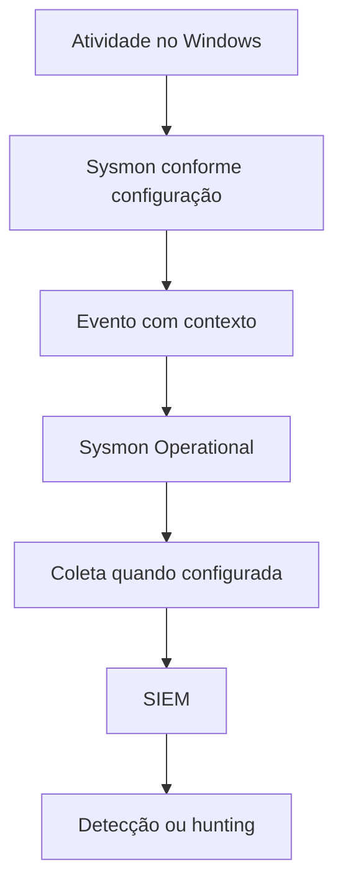
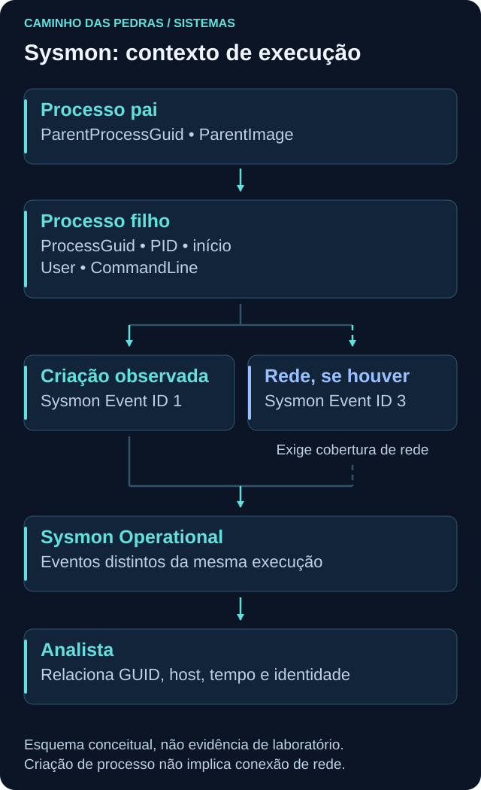
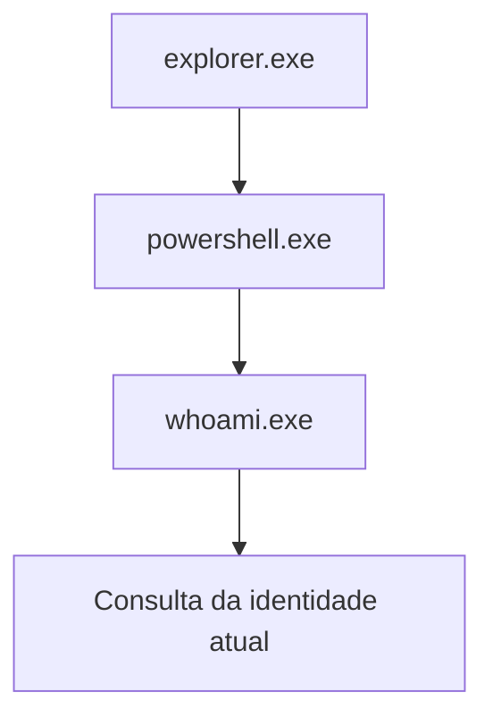

# Sysmon

<!-- markdownlint-configure-file {"MD033": {"allowed_elements": ["details", "summary"]}} -->

[← Tópico anterior](active-directory.md) · [↑ Índice do módulo](README.md) · [Página principal](../README.md) · [Próximo tópico →](../04-Seguranca-da-Informacao/README.md)

## Por que isso importa

Um processo pode existir por poucos segundos e desaparecer antes de uma consulta manual. Um registro de criação ajuda a reconstruir aquele momento. Sysmon, da Microsoft Sysinternals, acrescenta telemetria de atividade do sistema, com contexto útil para relacionar processos e outras operações.

Sysmon não substitui todos os logs do Windows. Seus eventos são complementares à auditoria de autenticação, administração, aplicações e serviços. Esta página trata do Sysmon para Windows e de seu canal no Windows Event Log.

## Atividade não é a mesma coisa que telemetria

**Atividade** é o que ocorre no host. **Telemetria** é a representação que o sensor consegue e está configurado para registrar. Entre as duas existem versão, filtros, configuração, recursos disponíveis, retenção e coleta.



O canal é `Microsoft-Windows-Sysmon/Operational`, com provider `Microsoft-Windows-Sysmon`. Event ID 1 de outro provedor não representa automaticamente criação de processo pelo Sysmon.

A numeração dos eventos desta página foi conferida na [documentação oficial do Sysmon](https://learn.microsoft.com/en-us/sysinternals/downloads/sysmon) em 23/09/2026. Confira também os requisitos da versão que pretende usar no laboratório, sem assumir compatibilidade com qualquer Windows antigo.



## Event ID 1: criação de processo

O Event ID 1, **Process Create**, é a base do [Lab 03, Sysmon Event ID 1](../12-Labs-Praticos/03-Sysmon-EventID-1/README.md). Ele descreve a criação observada e permite relacionar identidade, executável, argumentos e processo pai. Não é um registro de cada instrução executada depois.

| Campo | Pergunta que ajuda a responder | Cuidado |
| --- | --- | --- |
| `UtcTime` | Quando a atividade foi registrada nesse campo? | Interpretar como UTC e comparar com o horário de ingestão |
| `ProcessGuid` | Qual instância de processo está sendo correlacionada? | Preservar o valor e o host de origem |
| `ProcessId` | Qual PID foi observado? | PID pode ser reutilizado |
| `Image` | Qual caminho do executável foi registrado? | Caminho não confirma benignidade |
| `CommandLine` | Como o processo foi iniciado? | Pode conter segredos; não descreve toda execução posterior |
| `CurrentDirectory` | Qual diretório de trabalho foi registrado? | Não prova acesso a todo arquivo daquele diretório |
| `User` | Qual identidade está associada? | Conta técnica não é automaticamente uma pessoa interativa |
| `ParentProcessGuid` | Qual instância de pai foi relacionada? | Precisa de evento e contexto para reconstruir a árvore |
| `ParentProcessId` | Qual PID do pai foi registrado? | Não consultar o mesmo número depois como se nunca mudasse |
| `ParentImage` | Qual imagem do pai aparece? | Nome sozinho não explica finalidade |
| `ParentCommandLine` | Quais argumentos do pai foram registrados? | Conteúdo pode ser sensível ou incompleto na fonte disponível |

Campos e preenchimento devem ser confirmados no esquema da versão instalada e no XML efetivo. Configuração define a cobertura dos tipos de evento, filtros e enriquecimentos disponíveis; não assuma que cada atributo estará preenchido em toda situação. O `ProcessID` no cabeçalho XML de execução do provider não deve ser confundido com `ProcessId` do processo observado no payload.

## Pai e filho: reconstruir a execução

Exemplo **conceitual e benigno**, não uma árvore coletada:



Esse desenho representa uma pessoa abrindo uma shell e consultando a própria identidade. O pai real pode variar conforme o modo de abertura, o terminal e a versão. Não force os dados do laboratório a reproduzir exatamente essa árvore. `whoami.exe` nesse exemplo não precisa abrir uma conexão de rede.

Uma relação pai/filho ajuda a perguntar de onde partiu a execução. Ela não prova a intenção de quem executou, nem demonstra tudo que o filho fez. Compare argumentos, usuário, horário e função do endpoint. Diferencie pai reportado, contexto de criação e inferência do analista.

## ProcessGuid e PID

PID é útil para consultar processos atuais, mas pode ser reutilizado após término. ProcessGuid ajuda a correlacionar a mesma instância nos eventos do Sysmon. Para reconstruir uma árvore, procure o `ProcessGuid` do pai que corresponde ao `ParentProcessGuid` do filho, preservando host e janela temporal.

Exemplo sintético com identificadores simbólicos, não GUIDs reais:

| Momento | Host | PID | Identificador simbólico | Leitura |
| --- | --- | --- | --- | --- |
| 10:00 | PC01 | 4100 | Processo-A | Primeira execução |
| 10:10 | PC01 | 4100 | Processo-B | Outra execução após reutilização do PID |

O mesmo número não torna as duas linhas a mesma execução. Também não junte PIDs iguais de computadores diferentes. Nem todas as fontes possuem ProcessGuid; ao cruzar com Security ou firewall, serão necessários outros campos e limites explícitos.

## Outros eventos para reconhecer

| ID Sysmon | Tipo | Leitura inicial |
| --- | --- | --- |
| 3 | Network connection | Telemetria TCP/UDP associada a processo; depende de habilitação e filtros |
| 5 | Process terminated | Término do processo observado |
| 11 | FileCreate | Criação ou sobrescrita de arquivo observada |
| 12 | RegistryEvent | Criação ou exclusão de objetos do Registry |
| 13 | RegistryEvent | Definição de valor no Registry |
| 14 | RegistryEvent | Renomeação de chave ou valor |
| 22 | DNS query | Consulta DNS observada no contexto do processo |

A referência oficial indica que a coleta de conexões do evento 3 é desabilitada por padrão na configuração padrão descrita. Não interprete a instalação do sensor como habilitação de toda a tabela. DNS query também não é prova de navegação concluída; Network connection não é uma captura do conteúdo da aplicação; FileCreate não registra todo acesso de leitura.

Esses eventos servem a perguntas diferentes. Para saber se uma conta foi criada ou se um logon falhou, mantenha a consulta às fontes de auditoria adequadas, como Security. Sysmon não substitui 4720 ou 4625 por um número equivalente.

## Configuração, cobertura e volume

Antes de instalar ou modificar o sensor em uma VM de estudo, conheça a configuração proposta, requisitos e objetivo. Nesta página, o exercício parte de Sysmon **já preparado no laboratório**, com Process Create incluído e sem filtros que excluam a execução de teste. A preparação está descrita no [Lab 03](../12-Labs-Praticos/03-Sysmon-EventID-1/README.md).

| Escolha | Consequência a avaliar |
| --- | --- |
| Coletar muitos eventos sem uma pergunta | Mais volume, custo, dados sensíveis e trabalho de triagem |
| Coletar poucos eventos ou filtrar demais | Pontos cegos para hipóteses relevantes |
| Coletar no host sem encaminhar o canal | Dados locais que podem não estar no SIEM |
| Normalizar sem preservar contexto | Campos trocados ou perdidos podem prejudicar a correlação |

Detection Engineering começa por definir qual comportamento precisa ser observado e como verificar que a fonte o representa. Configuração deve ser testada com atividade benigna conhecida, tanto para confirmar presença esperada quanto para explicar exclusões. Não modifique um sensor de produção para fazer este exercício.

## Prática: localizar uma criação benigna

### Etapa 1: confirmar o ambiente

Use uma VM pessoal ou autorizada que já tenha Sysmon configurado. Registre versão, configuração utilizada, canal e política de retenção conhecida. Se o canal não existir, não tente tratá-lo como “zero processos”: registre que o pré-requisito não está disponível e consulte o lab para planejar a preparação.

```powershell
Get-WinEvent -ListLog 'Microsoft-Windows-Sysmon/Operational'
```

Esse comando consulta o canal e não instala nem altera o sensor. Falta de permissão de leitura deve ser documentada, não contornada.

### Etapa 2: iniciar o processo de teste

No PowerShell do laboratório, o comando abaixo abre uma nova instância de Windows PowerShell, consulta a data e termina:

```powershell
$labInicio = Get-Date
powershell.exe -NoProfile -Command "Get-Date"
```

`-NoProfile` evita executar personalizações de perfil nesse processo, para manter o exercício simples e reproduzível. Não altera política de execução nem configuração de auditoria. O executável precisa estar disponível no Windows utilizado. O processo filho pode terminar antes de uma consulta manual de processos, justamente por isso o registro histórico é útil.

### Etapa 3: consultar a janela

```powershell
Get-WinEvent -FilterHashtable @{
    LogName = 'Microsoft-Windows-Sysmon/Operational'
    ProviderName = 'Microsoft-Windows-Sysmon'
    Id = 1
    StartTime = $labInicio
} -MaxEvents 20 |
    Select-Object TimeCreated, Id, ProviderName, RecordId, Message
```

Espere alguns instantes se necessário e procure a linha de comando de teste. A consulta limita a saída, portanto não é uma contagem total de execuções. Se houver muitos eventos, refine a janela e confira os campos em vez de atribuir o primeiro resultado ao teste.

### Etapa 4: ler o XML e relacionar

No Event Viewer, abra o evento correspondente e veja `EventData`. Compare Image, CommandLine, User, ProcessGuid e campos do pai. Anote UtcTime e diferencie do horário local mostrado na interface. Não use o PID do processo do provider no cabeçalho como se fosse o PID do filho.

O exercício não precisa gerar rede, arquivo novo ou evento de script. Um Event ID 1 não demonstra a saída de `Get-Date`, nem o conteúdo de comandos que poderiam ser digitados depois em outra sessão. Se houver coleta para SIEM, compare os campos preservados, mas a prática local é suficiente para começar.

## Se o evento não aparecer

Verifique canal, permissão, provider, ID, janela, relógio, atraso, versão, filtros e cobertura de Process Create. Considere retenção e perda de registros. Diferencie sensor ausente, consulta incorreta e evento excluído pela configuração conhecida.

Ausência do Event ID 1 não autoriza concluir que o processo nunca executou. Da mesma forma, sua presença não informa automaticamente intenção maliciosa. Documente o resultado real do laboratório, mesmo quando ele mostrar uma limitação.

## Pensamento de analista e mini desafio

Quem executou? Qual instância e pai foram registrados? O caminho corresponde à ferramenta usada? A command line é compatível com a ação planejada? O evento apareceu no host, no SIEM ou em ambos? Qual diferença de tempo existe? Há evidência de rede ou apenas uma possibilidade teórica?

Execute somente o processo benigno descrito na VM preparada e encontre sua criação. Entregue uma árvore própria com campos sintéticos e uma tabela de quais dados foram observados, ausentes ou não coletados. Explique por que o nome PowerShell não é uma classificação de ameaça.

**Continue pelo [03-Sysmon-EventID-1](../12-Labs-Praticos/03-Sysmon-EventID-1/README.md).** Esta página ensina os conceitos; o laboratório organiza preparação, execução e registro de evidências. Não publique XML bruto, linhas de comando sensíveis ou dados de ambiente corporativo.

## Checkpoint

Tente justificar suas respostas com uma observação e uma limitação antes de abrir a explicação.

<details>
<summary>Sysmon substitui Security, System e Application?</summary>

Não. Ele acrescenta eventos por um provedor e canal próprios dentro da infraestrutura Windows Event Log. Auditoria de identidade, sistema e aplicações continua importante.

</details>

<details>
<summary>Por que ProcessGuid ajuda além do PID?</summary>

Ele permite distinguir instâncias nos eventos do Sysmon mesmo quando o sistema reutiliza PIDs. Preserve host, tempo e os identificadores correspondentes ao correlacionar.

</details>

<details>
<summary>ParentProcessId e o PID de um processo atual com mesmo número provam a mesma origem?</summary>

Não. O pai pode ter terminado e o número pode ter sido reutilizado. Campos históricos e ParentProcessGuid ajudam a reduzir essa ambiguidade.

</details>

<details>
<summary>Event ID 1 mostra todos os comandos posteriores da sessão?</summary>

Não. Ele descreve a criação e seu contexto. Atividade posterior e conteúdo de scripts dependem de outras fontes e configurações.

</details>

<details>
<summary>Sysmon instalado garante eventos de rede?</summary>

Não. A cobertura de Network connection depende da configuração; o evento 3 é desabilitado na configuração padrão descrita pela documentação. Confira o ambiente real.

</details>

<details>
<summary>Sysmon 11 prova que um processo leu um documento?</summary>

Não. FileCreate está relacionado a criação ou sobrescrita observada, não a todo acesso de leitura. A pergunta exige uma fonte apropriada.

</details>

<details>
<summary>O exercício Get-Date não gerou conexão. Deu errado?</summary>

Não. Essa consulta local não precisa de rede. O resultado esperado é a criação do processo benigno quando a cobertura necessária existe, não a geração de todos os tipos de evento.

</details>

## Resumo e próximo passo

Você pode agora relacionar identidade, execução e telemetria com limites explícitos. Revise a entrega no [índice do módulo](README.md) e siga para [04 Segurança da Informação](../04-Seguranca-da-Informacao/README.md), onde essas observações serão organizadas em conceitos de risco e controle.

[← Tópico anterior](active-directory.md) · [↑ Índice do módulo](README.md) · [Página principal](../README.md) · [Próximo tópico →](../04-Seguranca-da-Informacao/README.md)
