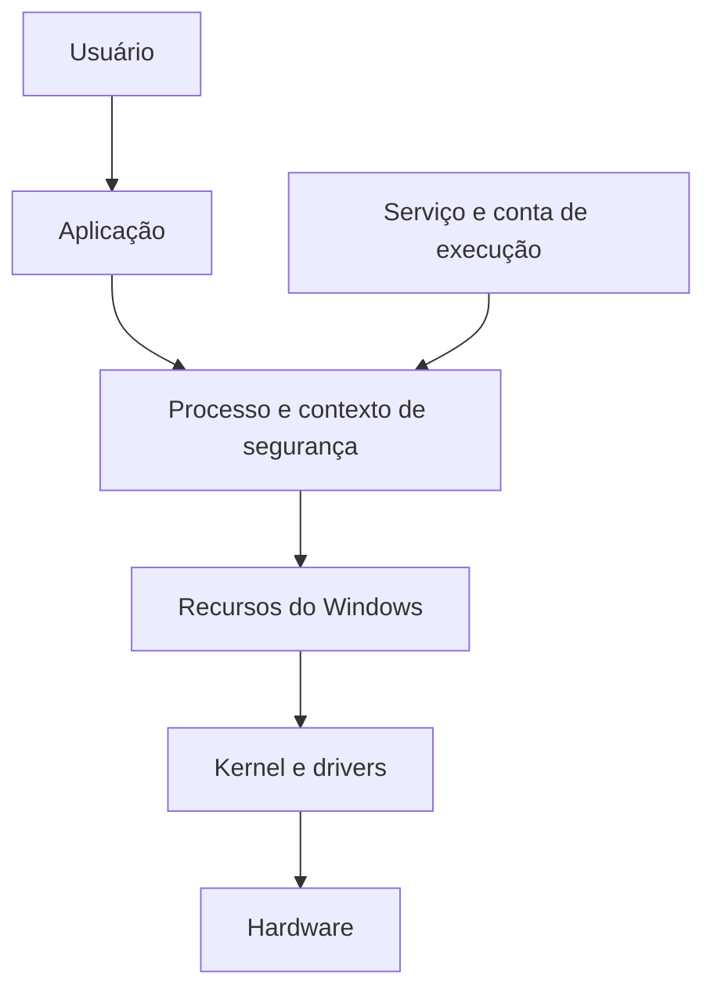
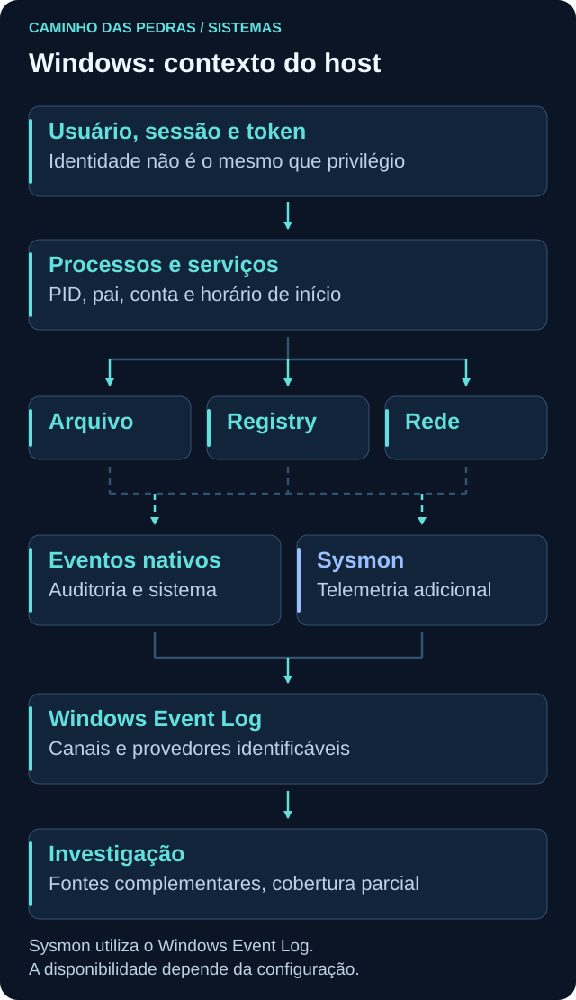

# Windows

<!-- markdownlint-configure-file {"MD033": {"allowed_elements": ["details", "summary"]}} -->

[← Tópico anterior](linux.md) · [↑ Índice do módulo](README.md) · [Página principal](../README.md) · [Próximo tópico →](powershell.md)

## Por que isso importa

Em um endpoint Windows, usuário, processo, serviço, arquivo e conexão formam contexto. Uma janela desconhecida ou um nome de executável não bastam para decidir se há um incidente. O primeiro passo é compreender como aquela atividade se encaixa no funcionamento normal da máquina.

Esta página reúne a base para consultar o sistema sem modificar serviços, permissões ou políticas. Depois, [Event Viewer](event-viewer.md) e [Sysmon](sysmon.md) acrescentam a perspectiva histórica dos eventos.

## Arquitetura conceitual



Aplicações e serviços utilizam recursos do sistema por interfaces fornecidas pelo Windows. Serviços não são uma etapa obrigatória pela qual todo processo passa. Kernel, drivers e componentes em modo usuário cooperam; o desenho omite detalhes internos para destacar identidade e execução.



## Contas, sessões e grupos

| Conceito | Papel | Pergunta investigativa |
| --- | --- | --- |
| Conta local | Identidade mantida no escopo da máquina | Qual computador é a autoridade dessa conta? |
| Conta de domínio | Identidade administrada no AD DS | Qual domínio e qual conta foram usados? |
| Usuário padrão | Atua com direitos limitados pelo contexto | Quais recursos e operações estão autorizados? |
| Administrador | Pode realizar tarefas administrativas conforme token e política | O processo realmente executou elevado? |
| SYSTEM | Identidade interna de alto privilégio local | Qual componente ou serviço justifica seu uso? |
| Conta de serviço | Identidade sob a qual um serviço executa | É local, interna, de domínio ou gerenciada? |

Uma conta pode gerar várias sessões. Uma máquina pode ter sessões interativas, remotas e de serviço ao mesmo tempo. `PC01\alan` e `LAB\alan` são nomes fictícios de identidades diferentes: uma local, outra de domínio. O SID ajuda a distinguir identidades; o nome exibido não conta toda a história.

Grupos locais como **Administrators** e **Users**, cujos nomes podem estar traduzidos no sistema, reúnem membros para atribuir acesso. Grupos de domínio serão estudados em [Active Directory](active-directory.md). Ser membro de um grupo não significa que todo processo esteja usando todas as capacidades possíveis dessa conta.

### Token, integridade e UAC em nível introdutório

O token de acesso carrega identidade, grupos e privilégios associados à execução. Permissão em uma ACL responde sobre acesso a um objeto; privilégio pode autorizar uma capacidade do sistema. Nível de integridade participa de restrições entre contextos, sem substituir ACLs.

UAC ajuda a separar tarefas comuns de ações administrativas. Uma conta administradora pode executar aplicações com um token limitado e elevar uma tarefa quando autorizado. Portanto, “usuário administrador” e “processo elevado” não são equivalentes. SYSTEM também não é apenas outro nome para a conta Administrator. Veja [como o UAC funciona](https://learn.microsoft.com/en-us/windows/security/application-security/application-control/user-account-control/how-it-works).

Consultas de identidade, em terminal do laboratório:

```powershell
whoami
whoami /user
whoami /groups
```

Essas consultas mostram a identidade e aspectos do token do contexto atual, não todas as sessões nem o autor humano de todas as ações da máquina. A aba **Usuários** do Task Manager ajuda a observar sessões interativas visíveis. `Get-LocalUser`, quando o módulo está disponível, lista contas locais, não usuários atualmente conectados. Não crie contas para esta prática.

## Executável e processo

O executável é um arquivo. O processo é uma instância em execução que usa memória, recursos e um contexto de segurança. Vários processos podem vir do mesmo arquivo; um deles pode terminar enquanto outro continua.

| Informação | O que ajuda a explicar | Limite |
| --- | --- | --- |
| PID | Identificador do processo no host | Pode ser reutilizado |
| Parent PID | Identificador registrado para o processo criador | O pai pode já ter terminado |
| Caminho | Local do executável consultado | Localização não prova legitimidade |
| Command line | Argumentos da criação quando disponíveis | Pode conter segredos e não mostra todos os atos posteriores |
| Usuário | Identidade associada à execução | Pode ser conta técnica ou de serviço |
| Início | Situa a execução no tempo | É preciso alinhar fuso e fonte |
| Integridade e privilégios | Contexto de autorização | Nem toda ferramenta mostra esses detalhes |

Task Manager oferece uma visão de processos e usuários; Resource Monitor ajuda a relacionar recursos e rede. [Process Explorer, da Sysinternals](https://learn.microsoft.com/en-us/sysinternals/downloads/process-explorer), é uma opção oficial para ampliar a inspeção, mas não é obrigatório. Não use clones de fontes desconhecidas.

## Consulta delimitada: o próprio PowerShell

Em PowerShell no Windows do laboratório:

```powershell
Get-Process -Id $PID | Select-Object Name, Id, StartTime, Path
Get-CimInstance -ClassName Win32_Process -Filter "ProcessId = $PID" |
    Select-Object Name, ProcessId, ParentProcessId, ExecutablePath, CommandLine, CreationDate
```

`$PID` é a variável automática com o PID do PowerShell atual. Não atribua outro valor a ela. `Get-Process` consulta o processo; CIM consulta campos da classe `Win32_Process`. Observe que o nome da propriedade é `Id` em uma fonte e `ProcessId` na outra. Compare conteúdo e contexto, não apenas rótulos. [Referência de Win32_Process](https://learn.microsoft.com/en-us/windows/win32/cimwin32prov/win32-process).

Alguns campos podem estar vazios por permissões, proteção do processo ou limites da ferramenta. Para outro processo, o PID consultado pode desaparecer ou ser reutilizado entre leituras. Não associe cegamente o Parent PID antigo ao processo que ocupa aquele número agora.

## Serviços: função de fundo, identidade e estado

Serviços são gerenciados pelo Service Control Manager e podem iniciar automaticamente, sob demanda ou por gatilhos, conforme configuração. Executam sob uma conta definida, que influencia acesso a recursos locais e remotos. Não precisam ter uma janela visível.

Processo e serviço não são sinônimos. Um processo pode hospedar vários serviços; um serviço pode envolver processos adicionais. Um serviço parado continua instalado, mesmo sem um processo de execução ativo.

```powershell
Get-Service | Select-Object Name, DisplayName, Status
Get-CimInstance -ClassName Win32_Service |
    Select-Object Name, State, StartMode, StartName, ProcessId
```

`Get-Service` mostra identidade e estado do serviço. Em `Win32_Service`, `StartName` identifica a conta configurada, `StartMode` descreve modo de inicialização e `ProcessId` ajuda a relacionar execução quando existe. PID 0 pode indicar ausência de processo associado; não procure um “processo do serviço” apenas por esse valor. A ferramenta gráfica **Services** oferece outra visão da mesma administração. [Referência de Win32_Service](https://learn.microsoft.com/en-us/windows/win32/cimwin32prov/win32-service).

Na prática, apenas observe. Não reinicie, pare ou desabilite serviços para descobrir sua função.

## Arquivos, NTFS e caminhos

NTFS é um sistema de arquivos comum no Windows. Arquivos e diretórios possuem proprietário, permissões expressas em ACLs e metadados, como horários. O acesso efetivo considera identidade, grupos, herança e políticas. Ser proprietário não significa que toda operação de leitura ou escrita já esteja concedida pela mesma entrada de ACL.

Timestamps representam aspectos como criação e modificação, não uma prova completa de origem. Cópia, restauração, sincronização e comportamento da aplicação podem afetá-los. Um arquivo `.exe` é um candidato a executável, mas extensão, nome, assinatura ou diretório não confirmam sozinhos benignidade.

| Caminho usual | Conteúdo comum |
| --- | --- |
| `C:\Windows` | Componentes e dados do sistema |
| `C:\Windows\System32` | Binários e bibliotecas do sistema |
| `C:\Users` | Perfis e dados de usuários |
| `C:\Program Files` | Aplicações instaladas |
| `C:\ProgramData` | Dados compartilhados de aplicações |

São caminhos usuais, não garantia de volume ou layout em toda instalação. Em Windows de 64 bits, `System32` contém componentes nativos de 64 bits; o nome não deve ser interpretado apenas pelo número. Para investigar, registre o caminho efetivamente observado.

### Metadados do executável em uso

```powershell
$labExe = (Get-Process -Id $PID).Path
if ($labExe) {
    Get-Item -LiteralPath $labExe |
        Select-Object Name, FullName, Length, CreationTimeUtc, LastWriteTimeUtc
    Get-Acl -LiteralPath $labExe | Select-Object Owner, AccessToString
    Get-AuthenticodeSignature -LiteralPath $labExe |
        Select-Object Status, StatusMessage
}
```

A variável guarda o caminho do próprio PowerShell, seja `powershell.exe` ou `pwsh.exe` conforme a edição. O bloco só consulta se encontrou um caminho. `Get-Acl` lê permissões; `Get-AuthenticodeSignature` consulta o estado da assinatura. Um resultado de assinatura válido não avalia a finalidade de toda execução. Não altere arquivo ou ACL.

## Registry: configuração também é contexto

O Windows Registry armazena configurações de sistema, aplicações e usuários. `HKLM` abrevia HKEY_LOCAL_MACHINE, com configuração de máquina; `HKCU` abrevia HKEY_CURRENT_USER e representa o contexto do usuário atual. O mesmo programa em outra conta pode observar um HKCU diferente.

Instalações, atualizações e preferências legítimas modificam Registry. Uma alteração pode interessar a uma investigação quando existe fonte que a registre e contexto para compará-la. Aqui não editaremos chaves nem estudaremos técnicas de persistência.

## Rede e processo no mesmo intervalo

```powershell
Get-NetIPConfiguration
Get-NetTCPConnection |
    Select-Object LocalAddress, LocalPort, RemoteAddress, RemotePort, State, OwningProcess
```

O primeiro ajuda a identificar interfaces e endereços. O segundo descreve TCP e PID proprietário na leitura. Correlacione `OwningProcess` com um processo observado no mesmo momento. A consulta não lista todas as atividades UDP e não recupera conexões já encerradas. O módulo de [Redes](../02-Redes/README.md) explica portas, NAT e visibilidade.

## Pensamento de analista: um processo desconhecido apareceu

Desconhecido para você não significa malicioso. Registre caminho, PID, início, usuário, linha de comando, pai e assinatura quando disponíveis. Há conexão? Existe serviço associado? Qual evento de criação poderia confirmar o histórico? O ativo recebeu atualização ou instalação aprovada? O comportamento é comum para sua função?

Não infira acesso a um arquivo só porque seu caminho está na linha de comando. Não infira execução de um script inteiro apenas porque PowerShell foi iniciado. Separe evidência de criação, execução posterior e resultado da aplicação.

## Prática e mini desafio

Use o próprio PowerShell ou um aplicativo legítimo já aberto no laboratório. Consulte os dados básicos, compare com Task Manager e registre horário em UTC com `(Get-Date).ToUniversalTime().ToString('o')`. Observe se há serviço e conexão relacionados; a resposta “não observado” é válida.

Monte uma ficha com a pergunta, ferramenta, campo, interpretação e limitação. Inclua ao menos um dado que uma consulta atual não permite recuperar. Use nomes sintéticos na entrega e mantenha linhas de comando e saídas reais privadas.

## Checkpoint

Tente justificar suas respostas com uma observação e uma limitação antes de abrir a explicação.

<details>
<summary>Uma conta administradora implica que todo processo está elevado?</summary>

Não. UAC e o token efetivamente utilizado importam. A associação a um grupo não substitui a observação do contexto de execução.

</details>

<details>
<summary>Qual a diferença entre processo e serviço?</summary>

Processo é uma instância em execução. Serviço é uma função gerenciada com configuração de inicialização e identidade. A relação entre eles não precisa ser um para um.

</details>

<details>
<summary>ParentProcessId encontrado agora identifica com certeza o executável do pai original?</summary>

Não. O pai pode ter terminado e seu PID pode ter sido reutilizado. Correlacione horários e registros históricos de criação.

</details>

<details>
<summary>Um executável em System32 com assinatura válida é automaticamente benigno em qualquer uso?</summary>

Não. Caminho e assinatura são elementos de contexto. A intenção e o efeito da execução dependem de argumentos, identidade e comportamento.

</details>

<details>
<summary>HKCU é sempre a configuração da pessoa diante da tela?</summary>

Não. É relativo ao contexto de usuário de quem acessa essa visão do Registry. Serviços e outros processos podem executar sob identidades diferentes.

</details>

<details>
<summary>Get-NetTCPConnection mostra todo o histórico de rede do host?</summary>

Não. É uma consulta de estado TCP atual. Conexões encerradas, UDP e visões de outros pontos exigem outras fontes.

</details>

<details>
<summary>Um campo de caminho vazio em uma consulta prova ocultação maliciosa?</summary>

Não. Permissões, proteção do processo e limitações da ferramenta podem explicar a ausência. Registre o limite e procure uma fonte apropriada.

</details>

## Resumo e próximo passo

No Windows, identidade, execução e recursos precisam ser vistos em conjunto. Em [PowerShell](powershell.md), organize consultas de leitura para transformar essas observações em informações selecionadas.

[← Tópico anterior](linux.md) · [↑ Índice do módulo](README.md) · [Página principal](../README.md) · [Próximo tópico →](powershell.md)
