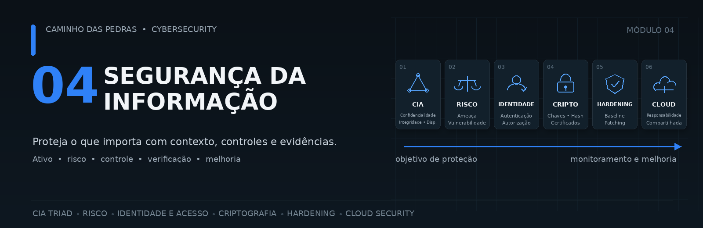
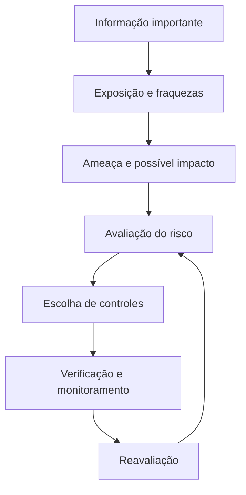
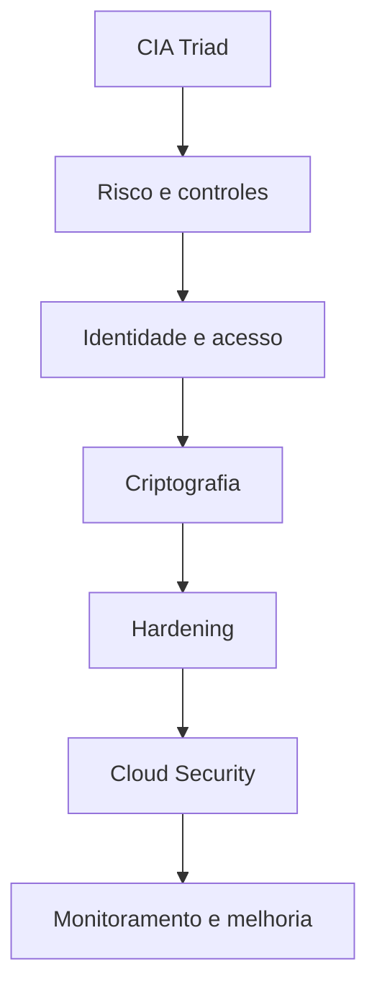
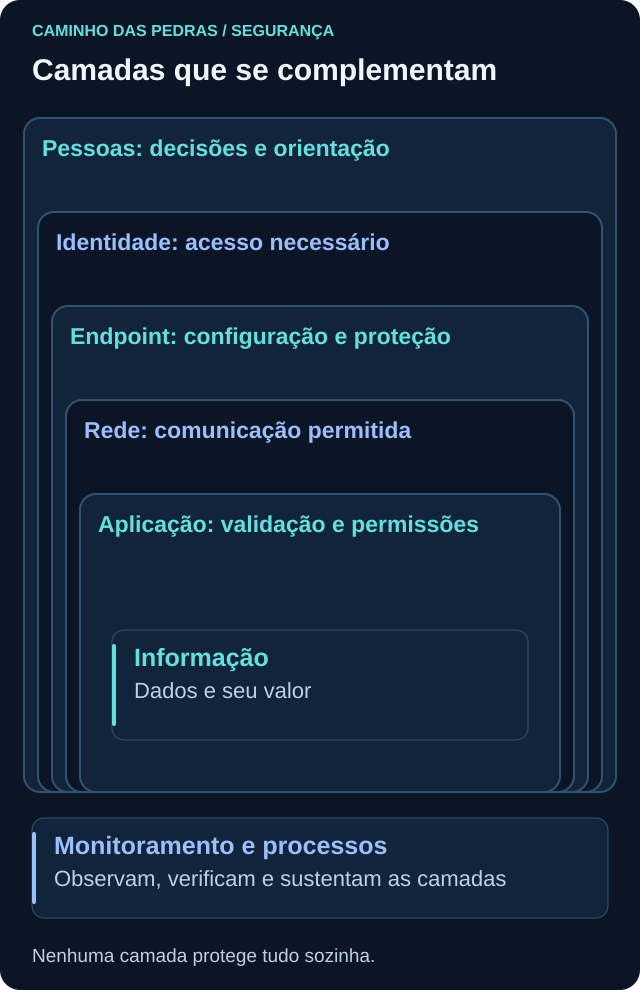
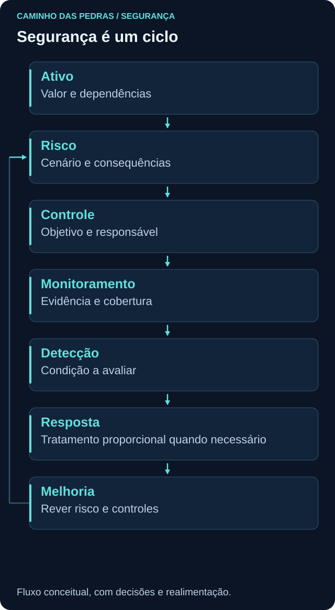
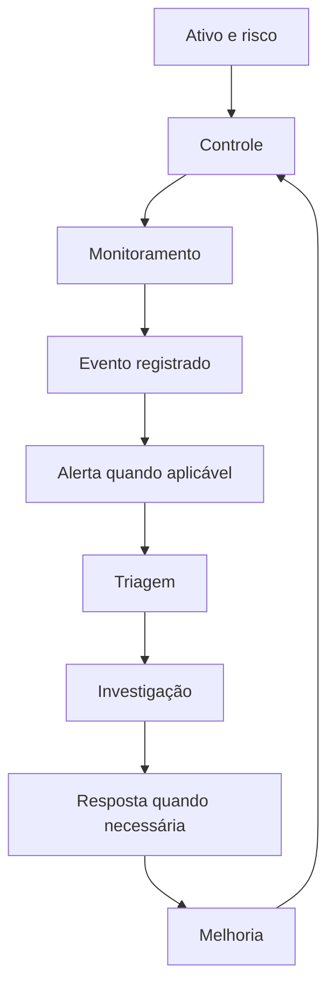

# 04 Segurança da Informação

<!-- markdownlint-configure-file {"MD033": {"allowed_elements": ["details", "summary"]}} -->

[← Tópico anterior](../03-Linux-e-Windows/README.md) · [↑ Índice do módulo](README.md) · [Página principal](../README.md) · [Próximo tópico →](cia-triad.md)

Depois de entender infraestrutura, redes e sistemas, a pergunta muda: **o que precisamos proteger, por que isso tem valor e como verificar se a proteção funciona?** Segurança da Informação procura preservar propriedades da informação e sustentar os objetivos de quem depende dela.

Seu alcance é maior que Cybersecurity. A informação existe em sistemas, arquivos, bancos de dados, endpoints e cloud, mas também em papel, comunicações e na memória das pessoas. Este projeto concentra a prática em ambientes digitais, sem esquecer que pessoas e processos participam de cada decisão.

> Segurança começa pelo ativo e pelo contexto. A ferramenta entra quando sabemos qual problema precisamos resolver.

Pessoas precisam de orientação e responsabilidades. Processos organizam concessão de acesso, mudanças e resposta. Tecnologia implementa parte dos controles. Contexto explica o valor, as dependências e os limites. Bloquear tudo, instalar antivírus, usar firewall, habilitar MFA ou criptografar dados não responde sozinho a todas essas necessidades.

## Segurança como decisão

Pergunte: o que proteger? Contra o quê? Por que importa? Qual seria o impacto? Quais controles já existem? Funcionam no cenário relevante? Que evidência permite verificar isso? A resposta precisa de responsável, critérios e revisão, não apenas de um produto instalado.

Ao longo do módulo, organize seu raciocínio em **ativo, valor, ameaça, vulnerabilidade, exposição, impacto, risco, controle, risco residual e monitoramento**. Essa sequência é um roteiro de perguntas, não uma fórmula nem uma ordem obrigatória de incidentes.

## O que você vai aprender

| Conceitos | Por que importam | Página |
| --- | --- | --- |
| Confidencialidade, integridade e disponibilidade | Identificam qual propriedade precisa de proteção | [CIA Triad](cia-triad.md) |
| Ativo, ameaça, vulnerabilidade e exposição | Descrevem o cenário sem confundir causa, fraqueza e acesso | [Risco](risco-ameaca-vulnerabilidade.md) |
| Impacto, probabilidade, risco e controles | Apoiam prioridades e decisões justificáveis | [Risco](risco-ameaca-vulnerabilidade.md) |
| Autenticação, autorização, IAM, MFA e menor privilégio | Organizam quem pode fazer o quê durante o ciclo da identidade | [Identidade e acesso](autenticacao-autorizacao.md) |
| Criptografia, hash e certificados | Protegem propriedades diferentes, dependendo do mecanismo e das chaves | [Criptografia](criptografia.md) |
| Hardening, baseline e patching | Mantêm configurações adequadas e mudanças verificáveis | [Hardening](hardening.md) |
| Cloud Security e responsabilidade compartilhada | Esclarecem quem protege cada componente de um serviço | [Cloud](cloud-security.md) |

## Segurança em camadas

Defense in Depth usa controles complementares para reduzir dependência de uma única barreira. Orientação às pessoas, identidade, endpoint, rede, aplicação, dados e monitoramento se relacionam. Não são necessariamente camadas físicas em uma sequência de pacotes.

Se uma permissão foi concedida incorretamente, a criptografia em disco não impede automaticamente que a aplicação entregue os dados a esse usuário. Se a prevenção falhar, registros e recuperação podem limitar consequências. Camadas mal configuradas ou dependentes da mesma credencial também podem falhar juntas.

## Controles de segurança

Um controle é uma medida que modifica o risco. **Preventivo** tenta impedir uma ocorrência; **detectivo** ajuda a percebê-la; **corretivo** ajuda a corrigir ou recuperar. A classificação depende do uso e muitos controles têm mais de uma função.

| Controle | Tipo predominante no exemplo | Exemplo e limite |
| --- | --- | --- |
| MFA | Preventivo | Dificulta o uso de uma credencial isolada; não concede autorização correta por si só |
| SIEM | Detectivo | Centraliza e correlaciona eventos; depende de fontes, regras e operação |
| Backup | Corretivo, como apoio à recuperação | Permite restaurar uma cópia adequada; exige testes e proteção das cópias |
| Firewall | Preventivo | Controla comunicações conforme regras; não entende todo risco da aplicação |
| EDR | Vários | Pode detectar, bloquear e apoiar investigação conforme cobertura e configuração |

Um aviso pode ter função **dissuasória**. Um controle **compensatório** reduz risco quando a medida inicialmente prevista não é viável, mas precisa de justificativa e verificação de cobertura. Esses termos descrevem papéis, não certificam eficácia.

Para cada controle, registre objetivo, responsável, escopo, evidência e limite. “MFA habilitado” é estado de configuração; verificar contas cobertas, exceções e autenticações esperadas produz evidência mais útil. Não faça testes de abuso para concluir este módulo.

## Governança em linguagem simples

| Instrumento | Pergunta | Exemplo didático |
| --- | --- | --- |
| Política | Qual direção deve ser seguida? | Contas administrativas devem ser protegidas |
| Padrão | Qual requisito concreto deve ser cumprido? | MFA deve estar habilitado nas contas privilegiadas abrangidas |
| Procedimento | Como executar e verificar? | Passos aprovados para habilitar, testar e recuperar o acesso |
| Diretriz ou guideline | Que orientação ajuda a decidir? | Critérios para escolher um método adequado ao contexto |

Nomes e estruturas variam entre organizações. Também é necessário definir quem aprova exceções e quem aceita risco. Um documento sem aplicação, acompanhamento ou responsáveis não garante proteção.

## Classificação da informação

Uma organização fictícia poderia usar **Pública, Interna, Confidencial e Restrita**. Essas classes não são universais. Elas orientam acesso, armazenamento, compartilhamento, retenção e descarte conforme sensibilidade e impacto.

Uma captura de log pode conter dados pessoais ou segredos, mesmo quando parece apenas material técnico. Classifique o conteúdo antes de publicar. Nos exercícios, use dados sintéticos e nomes fictícios, sem saídas corporativas reais.

## Backup: a pergunta é se conseguimos recuperar

Uma cópia precisa ter escopo, retenção e proteção adequados. Restauração verifica se o conteúdo pode ser recuperado; um teste de recuperação também considera integridade, dependências e tempo aceitável de retorno. Backup está ligado principalmente à recuperação e disponibilidade, mas suas próprias cópias exigem confidencialidade e integridade.

Sincronização ou snapshot isolado não equivale automaticamente a uma estratégia de backup. Exclusões podem ser propagadas e falhas podem atingir original e cópia. Backup nunca testado oferece menos confiança que uma recuperação verificada com critérios definidos.

## Vulnerabilidades, inteligência e evidência

Gestão de vulnerabilidades envolve descobrir, validar, priorizar, corrigir ou mitigar, verificar e monitorar. Identificar uma fraqueza não a corrige. Mitigar pode reduzir exposição sem remover a causa. Aceitar risco requer uma decisão responsável, com justificativa e revisão. Veja o ciclo na [página de risco](risco-ameaca-vulnerabilidade.md).

Threat Intelligence pode acrescentar contexto sobre ameaças, comportamentos, campanhas, infraestrutura e indicadores. Um IoC é uma pista cuja origem, validade e contexto precisam ser avaliados. Uma correspondência isolada não é prova definitiva de comprometimento; o aprofundamento virá nos módulos seguintes.

## Evento, alerta e incidente

| Termo | Leitura inicial |
| --- | --- |
| Evento | Algo aconteceu; pode ou não ter sido registrado |
| Alerta | Uma lógica ou controle chamou atenção para uma condição |
| Incidente | Situação avaliada conforme critérios da organização e tratada como ocorrência de segurança |

Nem todo evento gera alerta. Nem todo alerta confirma incidente. Um incidente pode ser percebido por relato humano, sem alerta automático. Nomenclaturas variam e situações urgentes podem exigir resposta enquanto a análise continua.

## Cenário integrado: servidor de documentos

Considere uma empresa fictícia com documentos de clientes em um servidor. Não use dados reais para reproduzir o cenário.

| Elemento | Raciocínio |
| --- | --- |
| Ativo e valor | Servidor, documentos e serviço de atendimento sustentam a operação |
| CIA | Exposição viola confidencialidade; alteração indevida afeta integridade; parada afeta disponibilidade |
| Ameaças | Acesso indevido, erro humano e falha técnica podem causar dano |
| Vulnerabilidades | Versão com correção pendente e permissões excessivas precisam ser validadas |
| Exposição | Quem alcança o serviço? Que conta consegue acessar os documentos? |
| Risco | Considerar possibilidade e consequências de perda no contexto do atendimento |
| Controles | Patch planejado, firewall, menor privilégio, MFA nos acessos compatíveis, backup e logs |
| Verificação | Conferir versão, matriz de acesso, configuração efetiva, registros e restauração de teste |
| Residual | Erros, falhas e lacunas podem permanecer; definir responsável e próxima revisão |
| Detecção e resposta | Logs e alertas apoiam triagem, investigação e tratamento proporcional |

## Como a experiência de suporte se conecta

| Situação de suporte | Pergunta adicional de segurança |
| --- | --- |
| Usuário sem acesso | Falhou autenticação ou faltou autorização? |
| Permissão incorreta | Quem aprovou e qual é o acesso necessário? |
| Computador desatualizado | Qual fraqueza é aplicável e qual exposição existe? |
| Serviço parado | Qual impacto na disponibilidade e como recuperar? |
| Arquivo alterado | A mudança foi autorizada e existe referência confiável? |
| Máquina exposta | A comunicação é necessária e está monitorada? |
| Conta administrativa compartilhada | Como atribuir ações e reduzir privilégio? |

Suporte ajuda a compreender impacto operacional. Segurança adiciona perguntas sobre risco, controle, exposição e evidência. Restaurar uma função e compreender por que a falha ocorreu são objetivos relacionados, mas diferentes.

## Pensamento de analista e mini desafio

Escolha uma VM ou pasta de laboratório. Descreva valor, proprietário fictício, usuários, dependências e dados. Identifique um cenário de ameaça, a fraqueza, a exposição e as consequências. Proponha um controle, explique como verificá-lo e o que ainda ficaria sem cobertura.

Entregue uma ficha de uma página e uma pergunta ainda sem resposta. Não atribua porcentagens sem base. Os exercícios deste módulo podem ser feitos com desenhos, leitura e arquivos descartáveis; não é necessário contratar cloud nem alterar produção.

## Glossário rápido

| Termo | Significado neste módulo |
| --- | --- |
| Ativo | Algo de valor que precisa ser considerado na proteção |
| Ameaça | Fonte ou circunstância com potencial de dano |
| Vulnerabilidade | Fraqueza que contribui para um evento indesejado |
| Risco | Possibilidade e consequências de perda em um contexto |
| Impacto | Consequência para dados, operação e demais objetivos |
| Controle | Medida destinada a modificar risco |
| CIA | Confidencialidade, integridade e disponibilidade |
| IAM | Gestão de identidades e acessos ao longo do ciclo de vida |
| MFA | Autenticação com fatores de categorias distintas |
| Menor privilégio | Acesso necessário à função, no escopo e tempo adequados |
| Hash | Resumo calculado a partir de dados, sem recuperação reversível |
| Criptografia | Conjunto de técnicas; cifração protege conteúdo com chaves |
| Certificado | Estrutura que associa identidade ou nome a uma chave pública |
| Hardening | Adequação de configuração e redução de exposição |
| Baseline | Estado de referência para comparação |
| Patch | Atualização destinada a corrigir ou modificar software |
| IaaS | Infraestrutura oferecida como serviço |
| PaaS | Plataforma oferecida como serviço |
| SaaS | Software oferecido como serviço |
| Risco residual | Risco que permanece após considerar controles |

## Da Segurança da Informação para o SOC

Esse fluxo organiza responsabilidades, não garante que toda atividade siga todas as etapas. Com infraestrutura, redes, sistemas, identidade, risco e controles, o [módulo 05 SOC e Blue Team](../05-SOC-Blue-Team/README.md) passa a explicar como uma operação usa telemetria para monitorar, detectar, triar, investigar, responder e melhorar.

## Checkpoint

Explique seu raciocínio antes de abrir cada resposta.

**Instalar uma ferramenta resolve qual risco?**

Ver resposta

Só é possível responder depois de identificar ativo, cenário e objetivo do controle. Instalação não comprova cobertura nem eficácia.

**Um firewall e um backup cumprem a mesma função?**

Ver resposta

Nesse exemplo, o firewall previne comunicações não permitidas e o backup apoia recuperação. Ambos têm limites e exigem validação própria.

**Um alerta confirma um incidente?**

Ver resposta

Não. A condição precisa ser analisada segundo contexto e critérios, sem atrasar ações urgentes previstas no processo.

**Uma pasta chamada Pública pode conter qualquer dado?**

Ver resposta

O nome não classifica corretamente o conteúdo por si só. É preciso avaliar a informação e as regras de compartilhamento.

**A restauração funcionou uma vez. Podemos abandonar novos testes?**

Ver resposta

Não. Dados, dependências, retenção e ambiente mudam. A frequência e o escopo dos testes precisam acompanhar essas mudanças.

**Um IoC apareceu em um log. O que falta?**

Ver resposta

Validar fonte, tempo, significado do campo e contexto. Uma correspondência é uma pista, não uma conclusão completa.

**Qual entrega demonstra raciocínio de segurança?**

Ver resposta

Uma explicação que liga valor, ameaça, fraqueza, exposição, impacto, controle, evidência e risco residual, indicando o que ainda é incerto.

## Resumo e próximo passo

Comece por [CIA Triad](cia-triad.md), que define as propriedades que queremos preservar. Ao terminar os seis tópicos, siga para [SOC e Blue Team](../05-SOC-Blue-Team/README.md).

[← Tópico anterior](../03-Linux-e-Windows/README.md) · [↑ Índice do módulo](README.md) · [Página principal](../README.md) · [Próximo tópico →](cia-triad.md)
