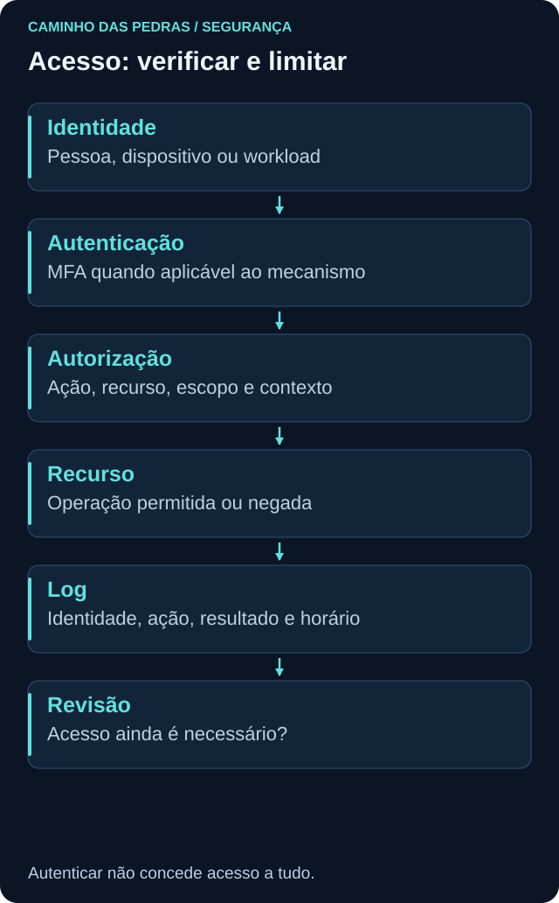
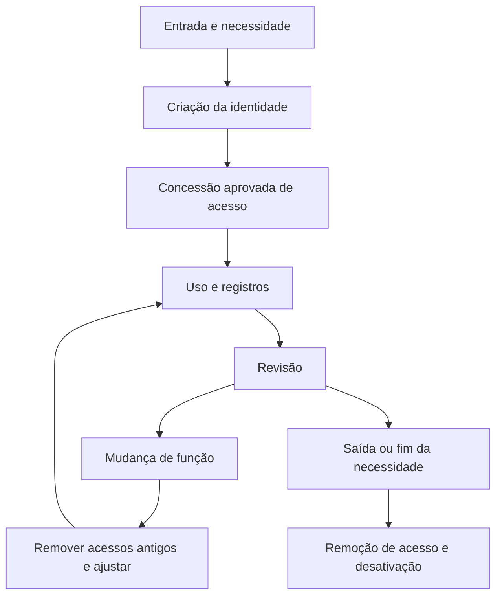

# Autenticação, autorização e IAM

<!-- markdownlint-configure-file {"MD033": {"allowed_elements": ["details", "summary"]}} -->

[← Tópico anterior](risco-ameaca-vulnerabilidade.md) · [↑ Índice do módulo](README.md) · [Página principal](../README.md) · [Próximo tópico →](criptografia.md)

## Por que isso importa

Antes de conceder acesso, precisamos entender quem ou o que o solicita, como essa identidade será verificada e quais ações fazem sentido. Uma autenticação bem-sucedida não torna toda operação autorizada. O acesso também precisa deixar de existir quando sua justificativa termina.

## Identidade: pessoas e sistemas

Identidades podem representar pessoas, dispositivos, aplicações, serviços e workloads. Uma conta é uma representação usada em determinado sistema; não equivale automaticamente a uma pessoa única. Contas compartilhadas dificultam atribuir ações, e contas técnicas também precisam de responsável e ciclo de vida.

Um coletor que envia logs pode precisar escrever em um destino, sem precisar ler todos os dados ou administrar o ambiente. Relembre a distinção entre contas locais e de domínio em [Active Directory](../03-Linux-e-Windows/active-directory.md).

## Autenticação: verificar a identidade apresentada

Autenticação responde, de forma simplificada, “quem é você?”. Tecnicamente, verifica evidências associadas à identidade alegada. A confiança depende do mecanismo, do cadastro, da recuperação e da proteção dos autenticadores.

| Categoria de fator | Exemplo | Observação |
| --- | --- | --- |
| Algo que você sabe | Senha ou PIN | Dois segredos memorizados continuam na mesma categoria |
| Algo que você possui | Autenticador físico ou dispositivo registrado | O sistema precisa verificar a posse pelo mecanismo apropriado |
| Algo que você é | Característica biométrica | Geralmente usada com um autenticador e regras próprias, não como segredo livremente substituível |

## MFA: mais de um fator, com limites

MFA combina fatores de categorias distintas. Senha e pergunta secreta não viram MFA apenas por serem duas etapas. Alguns autenticadores reúnem fatores em um único dispositivo; o desenho do mecanismo importa mais que contar telas.

MFA reduz riscos associados ao uso isolado de uma credencial, mas não corrige permissões excessivas. Sessão já autenticada, configuração inadequada, recuperação fraca e engenharia social continuam relevantes. Métodos também diferem em resistência a phishing. A [NIST SP 800-63B-4](https://pages.nist.gov/800-63-4/sp800-63b.html) distingue autenticadores, fatores e níveis de garantia de autenticação.

No laboratório, documente cobertura, exceções e recuperação. Não faça tentativas de contornar MFA, coletar credenciais ou simular abuso de sessão. Uma conta inacessível por perda de autenticador também cria impacto operacional, por isso a recuperação precisa ser planejada e protegida.

## Autorização: quais ações são permitidas?

Autorização responde “o que essa identidade pode fazer neste recurso e contexto?”. Leitura, alteração, exclusão e administração são ações diferentes. A decisão pode considerar função, grupo, atributos, escopo e condições de acesso.

**Cenário:** uma pessoa autentica com MFA e tenta abrir uma pasta restrita. O sistema pode negar a leitura corretamente, pois autenticação aceita não concede permissão para qualquer arquivo. Também pode haver uma falha de autorização se a permissão concedida for maior que a função exige.

## Accounting e auditoria

O modelo AAA reúne **Authentication, Authorization e Accounting**. Nesse contexto, accounting registra uso e ações para responsabilização, acompanhamento ou outras finalidades operacionais; não se limita ao sentido financeiro da palavra. Auditoria examina registros e controles segundo critérios. Nomenclaturas variam conforme tecnologia e organização.

Um registro útil relaciona identidade, recurso, ação, resultado, horário e origem quando disponíveis. Conta compartilhada, relógio incorreto ou logging incompleto reduzem a capacidade de atribuição. Log informa o que a fonte registrou, não prova automaticamente intenção nem quem estava fisicamente no teclado.

## IAM: ciclo de vida de identidades e acessos

Identity and Access Management reúne processos e tecnologias para criar, usar, revisar e encerrar identidades e acessos. Não é apenas uma tela de login.

Algumas empresas usam **Joiner, Mover e Leaver** para entrada, mudança e saída. O nome não é obrigatório; o cuidado é evitar contas órfãs e acúmulo de acessos. Mudar de setor deve provocar revisão das permissões antigas, não apenas adicionar novas.

Desativar uma conta pode não encerrar imediatamente todas as sessões, tokens e integrações. O procedimento precisa avaliar os mecanismos utilizados, preservar registros necessários e confirmar o resultado. Para serviços e workloads, mudanças de aplicação ou responsável também acionam revisão.

## Menor privilégio

Uma identidade deve possuir apenas os acessos necessários à função, no escopo e pelo tempo adequados. **Consultar logs não implica administrar toda a infraestrutura.** A concessão precisa ser testada contra o trabalho legítimo, com um processo para exceções justificadas.

Separe conceitualmente uso cotidiano e administração. Acesso privilegiado permanente aumenta o efeito possível de um erro ou comprometimento. Remover acesso sem entender dependências também pode interromper um serviço.

## RBAC: organizar acesso por função

Role Based Access Control associa permissões a papéis. A tabela é fictícia; nomes como Reader, Analyst e Administrator não garantem as mesmas permissões entre produtos.

| Papel didático | Leitura de logs do laboratório | Registrar análise | Alterar coleta | Gerenciar usuários |
| --- | --- | --- | --- | --- |
| Reader | Sim, no escopo necessário | Não | Não | Não |
| Analyst | Sim, no escopo necessário | Sim | Não por padrão | Não |
| Administrator | Somente quando necessário à tarefa | Conforme função | Sim, com mudança aprovada | Conforme responsabilidade atribuída |

Uma role pode continuar excessiva. Revise permissões efetivas, herança, grupos, recursos e capacidade de conceder acesso a terceiros. Acesso a logs também pode revelar dados sensíveis, exigindo escopo e tratamento apropriados.

## PAM e Zero Trust

**Privileged Access Management** trata acessos de alto impacto com controles adicionais: aprovação quando necessária, duração limitada, proteção de credenciais, registro de atividade e revisão. PAM é um conjunto de práticas e capacidades, não uma garantia obtida ao comprar uma ferramenta.

**Zero Trust** evita conceder confiança apenas pela localização interna ou pela posse de um equipamento corporativo. Verificar identidade, dispositivo e contexto, limitar privilégio e reavaliar condições ajuda a proteger recursos. Avaliação contínua não significa exigir nova senha a cada clique; a política e os sinais disponíveis determinam as decisões. Veja a [NIST SP 800-207](https://csrc.nist.gov/pubs/sp/800/207/final).

## Prática e pensamento de analista

Desenhe um repositório de logs fictício e três papéis. Para cada permissão, anote recurso, ação, justificativa, aprovador, duração e forma de revisão. Inclua uma identidade técnica que envia logs, distinguindo sua função da pessoa que os consulta.

Pergunte: quem acessou? Como autenticou? O acesso estava autorizado? O privilégio era necessário? Quem aprovou? A conta mudou de função? Há registro suficiente para verificar a ação? Use dados sintéticos e não crie contas administrativas reais para responder.

## Mini desafio

Entregue uma matriz de acesso com leitor, analista e administrador. Simule no papel uma mudança de função e uma saída: marque o que conceder, remover e verificar. Acrescente um teste de acesso permitido e um de acesso negado, ambos planejados para recursos descartáveis de laboratório, sem tentativas de invasão.

## Checkpoint

Explique seu raciocínio antes de abrir cada resposta.

**Uma pessoa autenticou com MFA. Deve receber acesso administrativo?**

Ver resposta

Não. MFA reforça autenticação; autorização e necessidade da função determinam o privilégio.

**Senha e pergunta secreta são dois fatores distintos?**

Ver resposta

Não. Ambas são informações conhecidas. Duas etapas não significam duas categorias de fator.

**Uma aplicação também precisa de ciclo de vida de identidade?**

Ver resposta

Sim. Ela precisa de responsável, permissões proporcionais, proteção de autenticadores e revisão quando a necessidade muda.

**A role se chama Reader. Isso basta para aprovar?**

Ver resposta

Não. Verifique ações e recursos efetivos. Nomes não são padronizados entre produtos e leitura pode incluir conteúdo sensível.

**Um funcionário mudou de setor. Basta somar novos acessos?**

Ver resposta

Não. Revise e remova permissões antigas sem justificativa, considerando dependências e aprovação.

**Há logs. Podemos atribuir toda ação a uma pessoa com certeza?**

Ver resposta

Não automaticamente. Contas compartilhadas, lacunas, contexto de sessão e integridade dos registros afetam a atribuição.

**Estar na rede interna dispensa verificar identidade e privilégio?**

Ver resposta

Não. Localização não é fundamento suficiente para conceder confiança. Acesso deve ser avaliado em relação ao recurso e ao contexto.

## Resumo e próximo passo

Identidade e permissão definem quem pode agir. Em [criptografia](criptografia.md), veja como proteger conteúdo e verificar propriedades dos dados sem confundir os mecanismos.

[← Tópico anterior](risco-ameaca-vulnerabilidade.md) · [↑ Índice do módulo](README.md) · [Página principal](../README.md) · [Próximo tópico →](criptografia.md)
