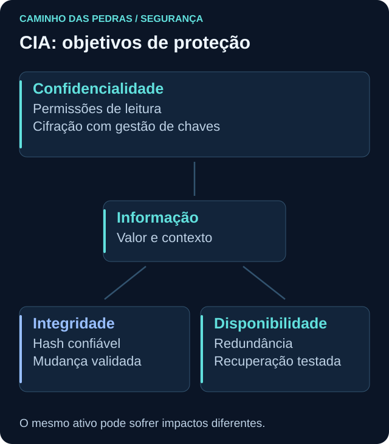
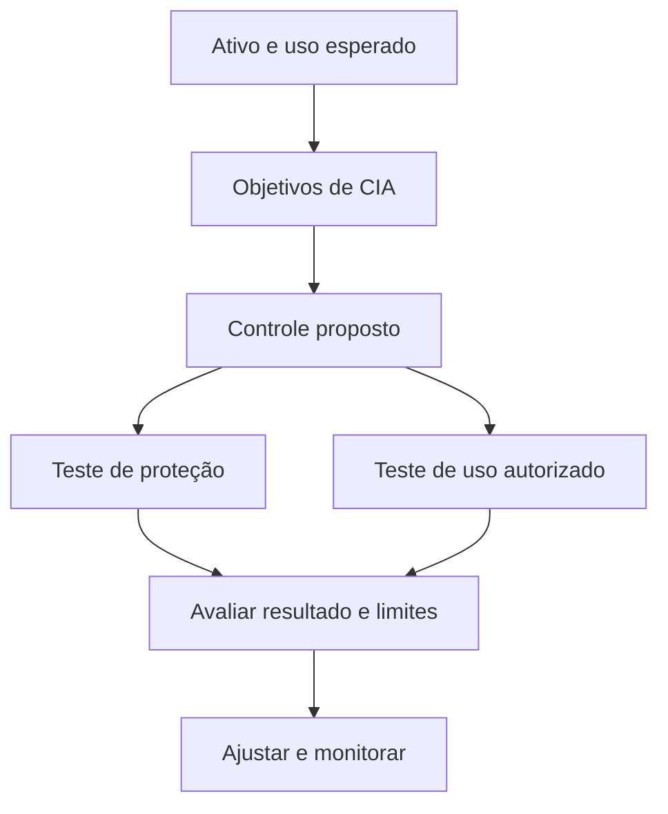

# Confidencialidade, integridade e disponibilidade

<!-- markdownlint-configure-file {"MD033": {"allowed_elements": ["details", "summary"]}} -->

[← Tópico anterior](README.md) · [↑ Índice do módulo](README.md) · [Página principal](../README.md) · [Próximo tópico →](risco-ameaca-vulnerabilidade.md)

## Por que isso importa

“Proteger o sistema” é uma intenção ampla. A tríade CIA ajuda a transformar essa intenção em objetivos que podem ser discutidos e verificados. CIA vem de **Confidentiality, Integrity e Availability**: confidencialidade, integridade e disponibilidade.

Essas propriedades se aplicam à informação e aos serviços que a processam. Não são produtos nem três etapas que precisam acontecer em sequência. O mesmo ativo pode exigir as três, com impactos e prioridades diferentes.

## Confidencialidade: quem pode conhecer a informação?

Confidencialidade busca evitar divulgação ou acesso não autorizado. Uma pessoa conseguir abrir um arquivo não significa que deva ter essa permissão. Compare **quem deveria ler** com **quem efetivamente consegue ler**, incluindo grupos, links de compartilhamento e contas de serviço.

Considere um documento com dados sintéticos de clientes. O atendimento precisa consultar parte do conteúdo; outro setor pode precisar apenas de um resumo. Conceder leitura a todos por conveniência amplia exposição sem necessariamente melhorar a operação.

| Controle | Contribuição | Limite a verificar |
| --- | --- | --- |
| Autenticação | Verifica a identidade apresentada | Não decide todo acesso ao documento |
| Autorização e controle de acesso | Limitam operações a identidades permitidas | Grupos e permissões podem estar excessivos |
| Criptografia | Protege conteúdo no contexto do mecanismo e das chaves | Aplicação autorizada ainda pode revelar dados |
| Classificação | Orienta manuseio e compartilhamento | Rótulo sem aplicação não impede exposição |

Em Cybersecurity, essa análise aparece ao revisar uma pasta, um bucket ou uma consulta ao banco. Pergunte também sobre cópias, exportações e logs, pois a informação não fica apenas no arquivo original.

## Integridade: a informação continua confiável?

Integridade envolve proteção contra alteração ou destruição indevida. Uma mudança autorizada pode ser necessária; o objetivo não é congelar os dados, mas garantir que o resultado corresponda ao processo esperado.

Um arquivo pode continuar secreto e ter seu valor alterado por erro. Portanto, confidencialidade preservada não comprova integridade. Também não basta perguntar se o arquivo existe: quem poderia modificá-lo e como perceberíamos uma mudança?

| Controle ou evidência | Como ajuda | Cuidado |
| --- | --- | --- |
| Hash comparado a referência confiável | Indica se os bytes correspondem à referência | Hash junto do arquivo em fonte não confiável não prova origem |
| Assinatura digital verificada | Sustenta integridade e vínculo à chave do signatário | Exige confiança na chave e proteção da chave privada |
| Controle de mudança e permissões | Restringem e justificam alterações | Aprovação não elimina erros de implementação |
| Versionamento | Permite comparar estados e recuperar versões | Histórico e permissões também precisam de proteção |
| Logs | Ajudam a reconstruir quem fez o quê e quando | Cobertura, retenção e integridade do log importam |

Ao investigar uma configuração alterada, compare conteúdo, autorização e horário. Hash não explica sozinho se uma mudança foi legítima. A [página de criptografia](criptografia.md) mostra uma prática de comparação sem dados reais.

## Disponibilidade: a informação está acessível quando necessária?

Disponibilidade considera acesso confiável e oportuno para o uso autorizado. O significado de “quando necessária” depende do serviço: uma consulta eventual e uma operação contínua não têm o mesmo limite aceitável de interrupção.

Redundância pode reduzir dependência de um componente. Capacidade evita saturação previsível. Monitoramento ajuda a perceber degradação. Manutenção planejada reduz falhas. Backup e recuperação ajudam a voltar a um estado utilizável. Cada medida responde a causas diferentes, e redundância não substitui uma cópia recuperável.

Disponibilidade não significa manter tudo online a qualquer custo. Uma manutenção pode ser necessária, e uma resposta a incidente pode restringir parte do serviço. A decisão deve considerar impacto, alternativas, responsáveis e comunicação.

## Segurança também envolve equilíbrio

| Decisão | Benefício possível | Custo ou risco operacional |
| --- | --- | --- |
| Bloquear todos os acessos a um documento | Reduzir certa exposição | Impedir trabalho autorizado |
| Liberar leitura para qualquer pessoa | Facilitar compartilhamento | Divulgar informação além do necessário |
| Aplicar mudança sem teste | Corrigir mais rapidamente uma fraqueza | Interromper uma aplicação dependente |
| Guardar somente uma cópia criptografada | Reduzir exposição de armazenamento | Perder acesso se a chave ou o arquivo se perder |

Não existe uma escolha universal que maximize tudo sem custo. Controles consomem tempo, recursos e esforço. Defina o requisito, escolha uma medida proporcional e teste também o funcionamento legítimo. Uma restrição que leva usuários a criar cópias informais pode deslocar o risco.

## Cenário: banco de dados de clientes

O banco é fictício. Seus registros sustentam atendimento e faturamento.

| Ocorrência | Propriedade diretamente afetada | Consequência possível | Evidência a procurar |
| --- | --- | --- | --- |
| Dados foram expostos a pessoa sem permissão | Confidencialidade | Divulgação de informações sensíveis | Acessos, exportações e permissões efetivas |
| Endereço ou valor foi alterado indevidamente | Integridade | Entrega errada ou cobrança incorreta | Histórico, mudanças e registros de autoria |
| Serviço ficou indisponível | Disponibilidade | Atendimento interrompido | Saúde do serviço, dependências e recuperação |

Uma ocorrência pode afetar mais de uma propriedade. Excluir registros indevidamente compromete integridade e pode impedir o serviço. Um vazamento não exige que o banco pare de funcionar. Não escolha um único rótulo se os efeitos forem múltiplos.

## Prática e pensamento de analista

Avalie uma pasta de evidências **sintéticas** ou um arquivo de configuração descartável. Leia permissões, identifique quem deveria alterar, veja como versões seriam recuperadas e registre quais dependências permitem o uso. Não publique caminhos pessoais nem altere permissões de uma pasta real para testar.

Pergunte: qual propriedade foi afetada? Que uso é legítimo? Qual referência comprova integridade? Onde está a cópia de recuperação? Quem possui a chave? Uma pessoa autorizada ainda consegue trabalhar depois do controle?

## Mini desafio

Escolha VM, repositório Git, arquivo de configuração ou pasta de laboratório. Preencha três linhas com **objetivo, controle, teste, resultado esperado e limitação**. Por exemplo, para integridade de um arquivo, proponha comparação a uma referência preservada; para disponibilidade, planeje restauração em destino separado.

Não declare que um teste foi executado se apenas o planejou. Termine indicando qual objetivo merece maior atenção naquele ativo e por quê.

## Checkpoint

Explique seu raciocínio antes de abrir cada resposta.

**Um arquivo está criptografado, mas qualquer usuário pode apagá-lo. Está protegido?**

Ver resposta

A cifração não resolve as permissões de exclusão nem a recuperação. Integridade e disponibilidade ainda precisam ser consideradas.

**O banco ficou online durante uma exposição de dados. Qual propriedade foi afetada?**

Ver resposta

Confidencialidade pode ter sido violada sem perda de disponibilidade. É necessário verificar também se houve alterações.

**Dois hashes iguais provam que o autor é confiável?**

Ver resposta

Não. A comparação indica correspondência de conteúdo sob as condições do algoritmo e da referência. Não identifica por si só o autor.

**Ter dois servidores elimina a necessidade de backup?**

Ver resposta

Não. Uma exclusão ou corrupção pode afetar ambos. Redundância e recuperação de versões respondem a problemas diferentes.

**Bloquear todos os usuários é sempre a melhor proteção?**

Ver resposta

Não. Pode inviabilizar o objetivo do serviço. É preciso permitir uso autorizado e reduzir exposição de maneira proporcional.

**Uma alteração autorizada nunca afeta integridade?**

Ver resposta

Pode afetar se produzir resultado incorreto. Autorização, qualidade da mudança e validação do resultado são questões distintas.

**Como comprovar que uma medida não prejudicou o uso legítimo?**

Ver resposta

Defina operações e tempo aceitáveis antes da mudança, execute testes autorizados e compare os resultados. Registre limites e dependências.

## Resumo e próximo passo

CIA ajuda a definir o que preservar. Em [risco, ameaça e vulnerabilidade](risco-ameaca-vulnerabilidade.md), avalie os cenários que podem comprometer esses objetivos.

[← Tópico anterior](README.md) · [↑ Índice do módulo](README.md) · [Página principal](../README.md) · [Próximo tópico →](risco-ameaca-vulnerabilidade.md)
