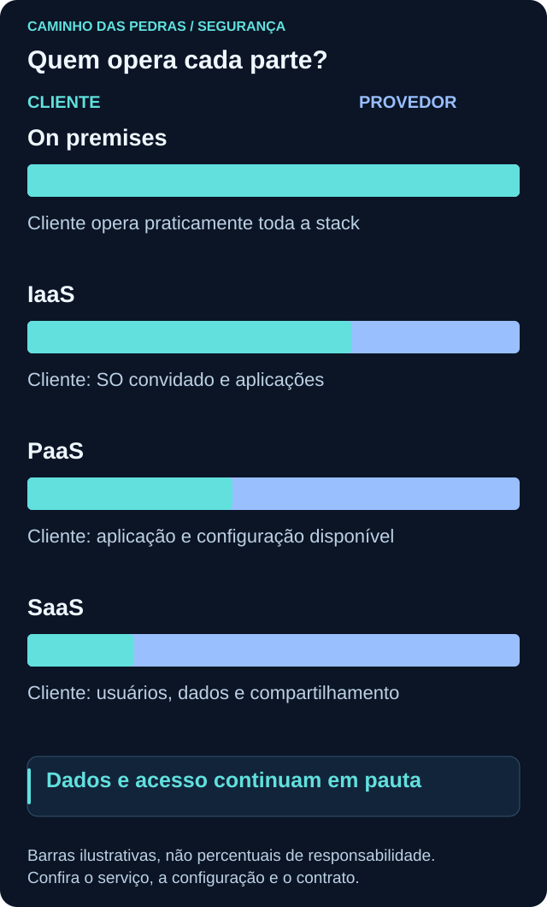
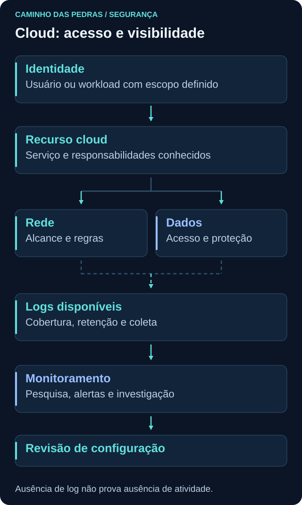
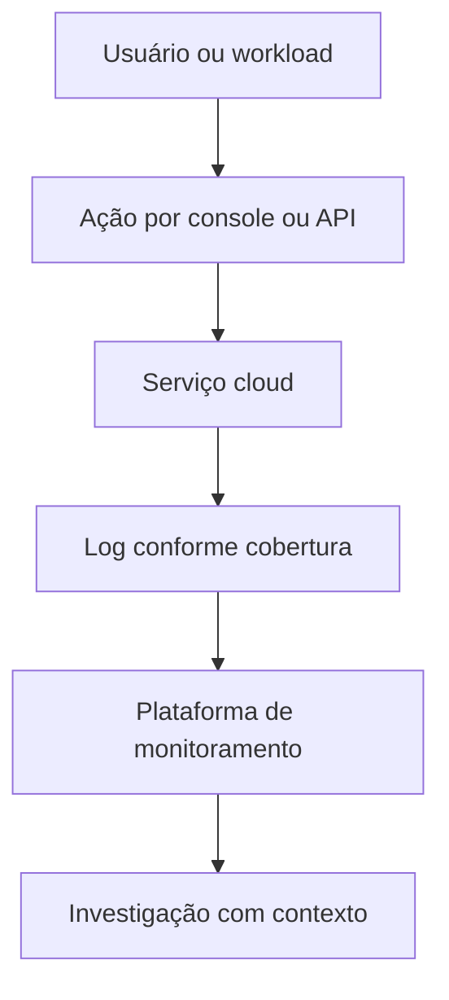

# Cloud Security

<!-- markdownlint-configure-file {"MD033": {"allowed_elements": ["details", "summary"]}} -->

[← Tópico anterior](hardening.md) · [↑ Índice do módulo](README.md) · [Página principal](../README.md) · [Próximo tópico →](../05-SOC-Blue-Team/README.md)

## O que muda na cloud?

Identidade, rede, dados, configuração, logging, monitoramento, vulnerabilidades e acesso continuam importantes. Muda a forma de provisionar, administrar e dividir responsabilidades. Uma ação por console ou API pode alterar recursos rapidamente, e permissões amplas podem atingir muitos serviços.

Cloud não é automaticamente segura ou insegura. A proteção depende do serviço contratado, de suas opções, da configuração do cliente e da operação de ambos. Migrar um problema de autorização para outro ambiente não o resolve por si só.

## Responsabilidade compartilhada

O provedor executa parte das atividades e o cliente mantém outras. **Quem opera um componente** e **quem define requisitos para seus dados** são perguntas diferentes. A tabela é conceitual; contrato e documentação do serviço determinam a divisão exata.

| Modelo | Cliente gerencia mais | Provedor gerencia mais |
| --- | --- | --- |
| On premises | Praticamente toda a stack, diretamente ou por contratos específicos | Não há provedor cloud nesse modelo |
| IaaS | SO convidado, aplicações, dados, identidades e configurações sob seu controle | Infraestrutura física e virtualização do serviço |
| PaaS | Aplicação, dados, identidade e configurações expostas ao cliente | Mais componentes da plataforma, conforme o produto |
| SaaS | Usuários, identidades, dados, compartilhamento e configurações disponibilizadas | Maior parte da aplicação e infraestrutura |

Em IaaS, uma VM normalmente exige gestão do SO pelo cliente. Em um banco gerenciado, parte dessa operação passa ao provedor, mas permissões, dados e opções de acesso continuam exigindo decisões. Em SaaS, compartilhar um documento com quem não deveria lê-lo pode ser um erro do cliente mesmo que toda a infraestrutura esteja operando corretamente.

Compare as descrições oficiais de [AWS](https://aws.amazon.com/compliance/shared-responsibility-model/), [Azure](https://learn.microsoft.com/en-us/azure/security/fundamentals/shared-responsibility) e [Google Cloud](https://cloud.google.com/architecture/framework/security/shared-responsibility-shared-fate). Os modelos ajudam a fazer perguntas; não substituem a documentação de cada serviço.

## Identidade em cloud

Usuários, grupos, roles e políticas determinam ações e recursos acessíveis. Aplicações também atuam por identidades técnicas. Termos como **service principal**, **service account** e **identidade de workload** aparecem em diferentes provedores e não são equivalentes em todos os detalhes.

Uma workload pode receber identidade e credenciais temporárias ou usar federação conforme a plataforma. Isso pode reduzir a necessidade de segredos estáticos, mas exige configuração e permissões corretas. Não coloque credenciais em repositórios, imagens ou exemplos públicos.

Pergunte qual identidade executou a ação, em qual conta, projeto ou assinatura, com qual role e em qual recurso. Permissão para administrar identidades ou políticas merece atenção especial por permitir modificar o acesso de outros. Aplique o ciclo de [IAM](autenticacao-autorizacao.md) também às contas técnicas.

## Configuração incorreta e exposição

| Condição | Risco a avaliar | Verificação defensiva |
| --- | --- | --- |
| Recurso público sem necessidade | Acesso por origens além do escopo | Configuração de exposição e necessidade de negócio |
| Permissões excessivas | Ações de maior impacto por erro ou uso indevido | Permissões efetivas e escopo das roles |
| Armazenamento aberto | Leitura ou alteração não autorizada | Política de acesso e compartilhamento |
| Logs desabilitados ou incompletos | Falta de evidência para triagem | Categorias coletadas e presença de ação benigna conhecida |
| Credenciais mal gerenciadas | Uso por quem não deveria possuir o segredo | Método de autenticação, guarda e ciclo de vida |

“Público” descreve uma forma de alcance, não prova que todos os dados são anônimos. “Privado” também não prova autorização correta. Verifique rede, identidade e ações permitidas em conjunto. Faça isso apenas em recursos próprios ou com autorização, sem procurar armazenamento de terceiros.

## Logging e monitoramento

Logs de administração, acesso a dados, rede e aplicação respondem a perguntas diferentes. Registrar criação de um recurso não implica registrar cada leitura de seus dados. Categorias, habilitação padrão, retenção, atraso, exportação e custos variam por serviço.

Antes de interpretar ausência de evento, verifique escopo, região quando aplicável, janela, permissões, configuração e destino de coleta. Preserve identidade, recurso, ação, resultado e horário. Centralizar dados sem conferir campos ou acesso ao repositório de logs pode criar novos problemas.

## Dados e continuidade

Classificação orienta onde guardar e com quem compartilhar. Criptografia exige entender quem controla as chaves e como recuperar acesso. Retenção e restauração dependem do serviço e do plano contratado; replicação do provedor não significa automaticamente recuperar qualquer exclusão feita pelo cliente.

Defina quais dados e configurações precisam ser recuperados, em quanto tempo e como testar. Uma região ou serviço indisponível pode afetar dependências mesmo quando seu código não mudou. Não prometa continuidade sem avaliar arquitetura e condições do produto.

## Custos: budget não é promessa de bloqueio

Um orçamento normalmente permite acompanhamento e alertas. **Não assuma que o valor configurado interrompe automaticamente o consumo ou a cobrança.** Confira modalidade, escopo, atraso de atualização, destinatários e ações reais do provedor.

A documentação do [Google Cloud sobre budgets](https://cloud.google.com/billing/docs/how-to/budgets), por exemplo, diferencia orçamentos somente de alerta de outros mecanismos disponíveis em condições específicas. O nome “budget” sozinho não comprova um limite rígido. Automação ou recurso de limitação também possui regras e efeitos que precisam ser compreendidos.

No planejamento, considere execução, armazenamento, retenção de logs, ingestão, transferência e recursos associados. Parar uma VM não garante custo zero: discos e outros componentes podem continuar cobrados. Não há necessidade de provisionar recursos para concluir este módulo.

## Planejar um laboratório antes de criar recursos

| Decisão | O que documentar |
| --- | --- |
| Objetivo | Qual pergunta será estudada e que dado sintético será usado |
| Serviço e região | Disponibilidade, requisitos, residência dos dados e dependências relevantes |
| Identidade e permissões | Quem cria, usa, consulta logs e remove o laboratório |
| Rede e dados | Exposição necessária, regras de acesso e proteção de conteúdo |
| Logging e retenção | Eventos esperados, destino, tempo de guarda e verificação |
| Custos | Itens cobrados, orçamento, alertas e acompanhamento |
| Encerramento | Inventário de recursos, dependências, exportações necessárias e plano de exclusão |

Microsoft Sentinel é um exemplo de plataforma que poderá receber telemetria em um laboratório futuro. Antes de criá-lo, planeje conectores, permissões, ingestão, retenção e custos. A lógica de preparação vale também para outras plataformas; o foco aqui é o raciocínio, não a escolha de fabricante.

O plano de exclusão deve identificar exatamente os recursos do laboratório, preservar o que for necessário e confirmar recursos remanescentes e cobrança. Não exclua projetos, assinaturas ou recursos compartilhados para “limpar” um exercício.

## Cenário e pensamento de analista

Uma equipe fictícia guarda relatórios em um serviço de armazenamento gerenciado. O provedor opera a infraestrutura, mas uma política permite leitura além do necessário. A primeira pergunta é sobre classificação, identidade e configuração, não sobre instalar um agente no datacenter do provedor.

Quem possui acesso? O recurso está público? Que ações são permitidas? Quem é responsável por cada componente? Existem registros de leitura ou apenas de administração? Como verificar a correção da política sem expor dados? Qual risco permanece se uma identidade autorizada for usada indevidamente?

## Mini desafio

Escolha conceitualmente um serviço IaaS, PaaS ou SaaS. Consulte sua documentação oficial sem criar recursos. Desenhe identidade, recurso, rede, dados, logs e monitoramento. Marque cliente, provedor e responsabilidades a confirmar.

Entregue uma tabela com cinco decisões do cliente, duas evidências de controle e uma limitação. Inclua região quando aplicável, retenção, orçamento e plano de encerramento. Se usar o cenário de Sentinel, mantenha o exercício no planejamento. Nenhuma conta paga ou implantação é requisito.

## Checkpoint

Explique seu raciocínio antes de abrir cada resposta.

**Em SaaS, o cliente deixa de ter responsabilidade de segurança?**

Ver resposta

Não. Usuários, acessos, dados, compartilhamento e opções disponibilizadas continuam exigindo decisões, conforme o serviço.

**Uma VM em IaaS é atualizada integralmente pelo provedor?**

Ver resposta

Não se deve presumir isso. O SO convidado e as aplicações normalmente são responsabilidade do cliente, salvo serviços contratados que alterem a divisão.

**Recurso privado garante permissões adequadas?**

Ver resposta

Não. Alcance de rede e autorização são controles distintos. Uma identidade interna ainda pode possuir acesso excessivo.

**Um log de criação mostra todas as leituras posteriores?**

Ver resposta

Não. Administração e acesso a dados podem usar categorias diferentes, com habilitação, retenção e custos próprios.

**Budget de alerta garante que o gasto pare no valor definido?**

Ver resposta

Não. Verifique o mecanismo contratado e suas ações reais. Alertas e bloqueio de consumo não são equivalentes.

**Parar uma VM encerra toda cobrança?**

Ver resposta

Não necessariamente. Armazenamento e recursos associados podem continuar existindo e cobrando.

**O que comprova a divisão de responsabilidades de um serviço?**

Ver resposta

A documentação e as condições específicas do serviço, combinadas à configuração e aos processos adotados. Uma tabela genérica é apenas ponto de partida.

## Resumo e próximo passo

Na cloud, os fundamentos permanecem e as responsabilidades precisam ser explícitas. Revise sua ficha de risco no [índice](README.md) e siga para [05 SOC e Blue Team](../05-SOC-Blue-Team/README.md), conectando controles à operação defensiva.

[← Tópico anterior](hardening.md) · [↑ Índice do módulo](README.md) · [Página principal](../README.md) · [Próximo tópico →](../05-SOC-Blue-Team/README.md)
