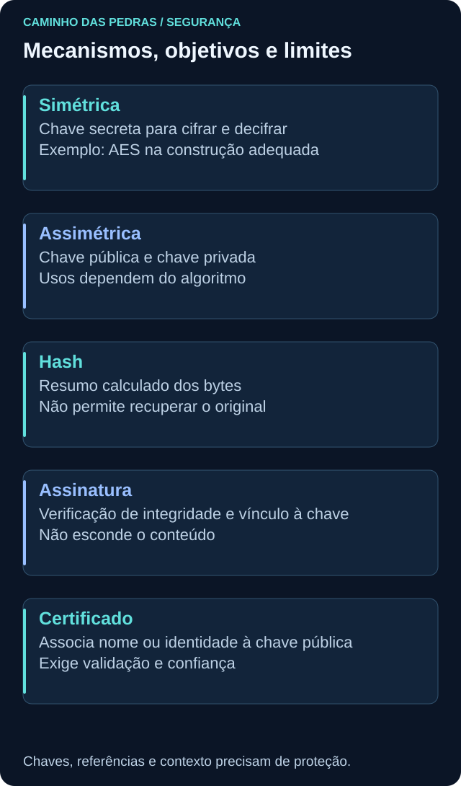
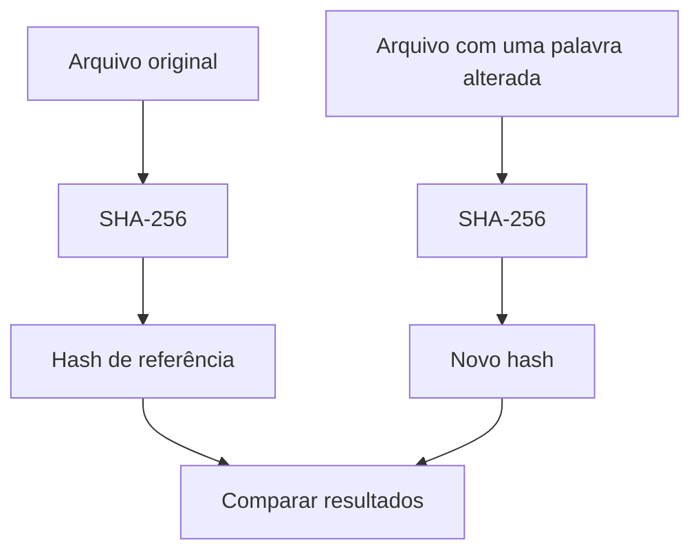
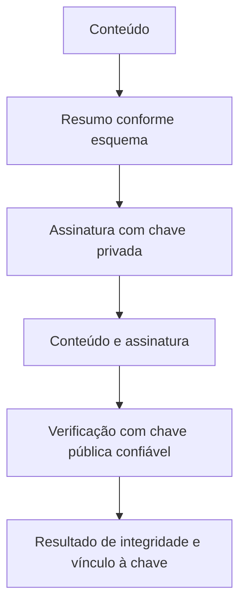

# Criptografia

<!-- markdownlint-configure-file {"MD033": {"allowed_elements": ["details", "summary"]}} -->

[← Tópico anterior](autenticacao-autorizacao.md) · [↑ Índice do módulo](README.md) · [Página principal](../README.md) · [Próximo tópico →](hardening.md)

## Por que isso importa

Um arquivo pode estar em um disco, atravessar uma rede ou ser processado por uma aplicação. Cada situação cria perguntas diferentes sobre leitura, alteração e origem. A criptografia oferece mecanismos para objetivos específicos, mas depende de chaves, implementação, configuração e uso correto.

Em sentido amplo, a área inclui cifração, assinaturas e outras construções. Neste módulo, quando comparamos **hash e criptografia**, distinguimos hash de **cifração reversível com chave**. Um hash criptográfico pertence à área, mas não permite “descriptografar” o conteúdo original.

## Qual propriedade queremos proteger?

| Mecanismo | Objetivo típico | O que não prova sozinho |
| --- | --- | --- |
| Cifração | Confidencialidade do conteúdo | Que o destinatário é confiável ou que os dados não foram alterados |
| Cifração autenticada, no protocolo adequado | Confidencialidade e detecção de alterações | Autorização correta da aplicação |
| Hash comparado a referência confiável | Correspondência dos bytes | Autoria ou benignidade do arquivo |
| Assinatura digital verificada | Integridade e vínculo à chave de assinatura | Verdade do conteúdo ou intenção humana |
| Certificado validado | Associação de nome ou identidade à chave pública | Que todo conteúdo do serviço é seguro |

Não escolha um algoritmo isolado para construir segurança por conta própria. Aplicações devem usar protocolos, bibliotecas e configurações mantidos e apropriados ao objetivo. A [OWASP sobre armazenamento criptográfico](https://cheatsheetseries.owasp.org/cheatsheets/Cryptographic_Storage_Cheat_Sheet.html) discute a escolha de proteção e a gestão de chaves.



## Criptografia simétrica

Na cifração simétrica, a mesma chave secreta é usada para cifrar e decifrar conforme o algoritmo e a construção. **AES** é um exemplo de algoritmo simétrico. Modos de operação e parâmetros fazem parte da segurança; citar AES não descreve uma implementação completa.

Ela costuma ser eficiente para grandes volumes. O desafio é distribuir e proteger a chave: quem a obtém pode ter capacidade de ler os dados. Recuperação, acesso à chave, rotação e descarte precisam acompanhar o ciclo da informação. Perder uma chave pode tornar uma cópia legítima irrecuperável.

## Criptografia assimétrica

Mecanismos assimétricos usam um par relacionado de **chave pública e chave privada**. A pública pode ser distribuída; a privada exige proteção. Conforme o algoritmo, o par pode apoiar assinatura, acordo de chaves ou proteção de segredos.

**RSA** e mecanismos baseados em **ECC** são exemplos conhecidos, mas não são intercambiáveis para qualquer operação. ECC é uma família de técnicas; há algoritmos distintos para assinatura e acordo de chaves. Nem toda chave pode cifrar, assinar e estabelecer segredo do mesmo modo.

Não explique assinatura como “criptografar com a chave privada”. Assinar e cifrar têm objetivos e operações próprios. Sistemas frequentemente combinam mecanismos: usam operações assimétricas para autenticação ou estabelecimento de chaves e cifração simétrica para o tráfego.

## Hash: resumo dos bytes

Uma função de hash recebe dados e produz um resumo de tamanho definido pelo algoritmo. **SHA-256** produz 256 bits, geralmente apresentados como 64 caracteres hexadecimais. Recalcular sobre os mesmos bytes produz o mesmo resultado; mudar conteúdo ou codificação normalmente muda o resumo.



Uma **colisão** ocorre quando entradas diferentes produzem o mesmo hash. Ela é conceitualmente possível porque a saída tem tamanho limitado. Funções criptográficas adequadas tornam inviável, sob as condições esperadas de segurança, encontrar colisões de forma prática. Não trate igualdade como prova matemática absoluta de identidade entre quaisquer entradas.

O ponto mais comum de erro na investigação é outro: **quem protegeu a referência?** Se arquivo e hash vieram de uma mesma fonte adulterada, a comparação pode ser consistente e ainda não comprovar origem legítima. Compare com referência confiável ou verifique uma assinatura apropriada.

## Senhas não são arquivos comuns

Sistemas não devem guardar senhas de autenticação em texto puro. Hashing de senha usa funções apropriadas, parâmetros de custo e um **salt**, valor distinto gerado para cada senha armazenada, para dificultar comparação e pré-computação em larga escala.

Salt não precisa ser secreto e não substitui uma função adequada. Um SHA-256 simples é rápido e não deve ser apresentado como solução completa para armazenar senhas. Funções como Argon2id são projetadas para esse problema; a escolha e os parâmetros devem seguir a aplicação e orientações atuais. Veja a [OWASP Password Storage Cheat Sheet](https://cheatsheetseries.owasp.org/cheatsheets/Password_Storage_Cheat_Sheet.html). Não implementaremos um sistema de autenticação neste módulo.

## Assinatura digital

Um esquema de assinatura usa a chave privada para produzir uma assinatura e a chave pública correspondente para verificar. O hash participa de muitos esquemas, com regras próprias do algoritmo. O diagrama é conceitual, não uma receita de implementação.



A assinatura não oculta o conteúdo. Sua interpretação depende de confiança na chave pública, validade do mecanismo e proteção da chave privada. Uma chave comprometida reduz a confiança na atribuição. Verificação válida também não prova que um documento está correto ou que um programa é benigno.

## Certificado, PKI e HTTPS

Um certificado digital associa uma chave pública a um sujeito ou nome, com informações como emissor, período de validade e usos permitidos. **PKI**, Public Key Infrastructure, reúne certificados, autoridades certificadoras (CA), políticas e processos de emissão, validação e revogação.

Uma cadeia liga o certificado a autoridades intermediárias e a uma âncora de confiança aceita pelo cliente. A validação considera assinatura, nome esperado, validade, usos e regras aplicáveis. Revogação permite sinalizar que um certificado deixou de ser confiável antes do vencimento, mas a consulta e o comportamento variam por cliente e contexto.

Em HTTPS, o cliente valida o certificado do servidor e o protocolo TLS protege a comunicação conforme sua negociação e configuração. Certificado não é a mesma coisa que uma chave privada nem cifra sozinho toda a sessão. Relembre [HTTP e HTTPS](../02-Redes/http-https.md); a [RFC 8446](https://www.rfc-editor.org/rfc/rfc8446) especifica TLS 1.3.

Um site pode ter certificado válido e ainda apresentar conteúdo enganoso. Não ignore avisos de certificado no exercício; documente a condição e confira o endereço.

## Dados em repouso, trânsito e uso

| Estado | Exemplo | Pergunta de proteção |
| --- | --- | --- |
| Em repouso | Arquivo em disco ou cópia de backup | Quem pode obter conteúdo e chaves? |
| Em trânsito | Conexão HTTPS | O canal e a identidade do destino foram validados? |
| Em uso | Aplicação processando informação | Que processo, conta e memória têm acesso? |

Criptografia de disco não impede automaticamente leitura por uma sessão já desbloqueada e autorizada. TLS termina em pontos específicos; depois deles, o dado pode ser processado em claro. Proteção em uso exige controles próprios e não é prometida só por ativar cifração no armazenamento.

## Prática de hash

Em uma **pasta nova e descartável de laboratório**, crie pelo editor um arquivo chamado `arquivo.txt` com a frase fictícia `Registro de teste azul`. Não use um arquivo preexistente de trabalho. Salve e calcule:

Windows, no PowerShell aberto nessa pasta:

```powershell
Get-FileHash .\arquivo.txt -Algorithm SHA256
```

Linux, em uma distribuição que disponibilize o comando:

```bash
sha256sum arquivo.txt
```

1. Registre o primeiro resultado e o algoritmo.
2. No editor, troque somente `azul` por `verde` e salve.
3. Execute novamente a mesma consulta.
4. Compare os resumos e explique a diferença.
5. Calcule uma terceira vez sem editar: o resultado deve corresponder à segunda leitura se os bytes não mudaram.

Os comandos leem o arquivo e não o alteram. A edição manual é a mudança deliberada do exercício. Quebras de linha, espaços e codificação também são bytes; não compare arquivos visualmente iguais de sistemas diferentes supondo conteúdo idêntico. Não fornecemos hashes fixos porque o editor pode salvar esses detalhes de formas diferentes.

## Pensamento de analista e mini desafio

O dado está em trânsito, armazenado ou em uso? Qual propriedade queremos proteger? Onde fica a chave? Quem confia na referência? O mecanismo protege contra alteração ou apenas leitura? Existe recuperação se a chave for perdida?

Entregue a comparação antes/depois de um arquivo sintético e explique por que ela não prova autoria. Acrescente um plano simples para guardar evidências: acesso necessário, proteção de armazenamento, referência de integridade e recuperação. Nunca publique chaves privadas, senhas ou arquivos de ambiente corporativo.

## Checkpoint

Explique seu raciocínio antes de abrir cada resposta.

**Qual a diferença entre hash e cifração?**

<details>
<summary>Ver resposta</summary>

Hash calcula um resumo sem operação de decifração. Cifração transforma conteúdo de forma reversível para quem possui a chave apropriada.

</details>

**A assinatura digital esconde o documento?**

<details>
<summary>Ver resposta</summary>

Não. Ela permite verificar integridade e vínculo à chave de assinatura no contexto de confiança. Confidencialidade exige um mecanismo próprio.

</details>

**SHA-256 simples resolve o armazenamento de senhas?**

<details>
<summary>Ver resposta</summary>

Não. Senhas exigem funções apropriadas, salt e parâmetros de custo; um hash rápido de arquivo não oferece essa proteção completa.

</details>

**O arquivo e o hash vieram do mesmo local desconhecido. A igualdade prova legitimidade?**

<details>
<summary>Ver resposta</summary>

Não. A referência também precisa ser confiável. A igualdade não confirma autor, origem ou benignidade.

</details>

**Certificado válido torna todo site seguro para fornecer dados?**

<details>
<summary>Ver resposta</summary>

Não. A validação ajuda a autenticar o nome e a chave no protocolo. Não avalia honestidade ou segurança de todo o conteúdo.

</details>

**Criptografia em disco protege de qualquer processo após desbloqueio?**

<details>
<summary>Ver resposta</summary>

Não. Processos autorizados podem acessar dados em uso. Permissões, identidade e proteção do endpoint continuam necessárias.

</details>

**Perder a chave de uma cópia criptografada afeta qual objetivo?**

<details>
<summary>Ver resposta</summary>

Pode impedir recuperação e afetar disponibilidade. Proteção e recuperação de chaves fazem parte do planejamento.

</details>

## Resumo e próximo passo

Mecanismos criptográficos precisam de contexto e gestão de chaves. Em [hardening](hardening.md), veja como manter o restante da configuração coerente com o propósito do sistema.

[← Tópico anterior](autenticacao-autorizacao.md) · [↑ Índice do módulo](README.md) · [Página principal](../README.md) · [Próximo tópico →](hardening.md)
