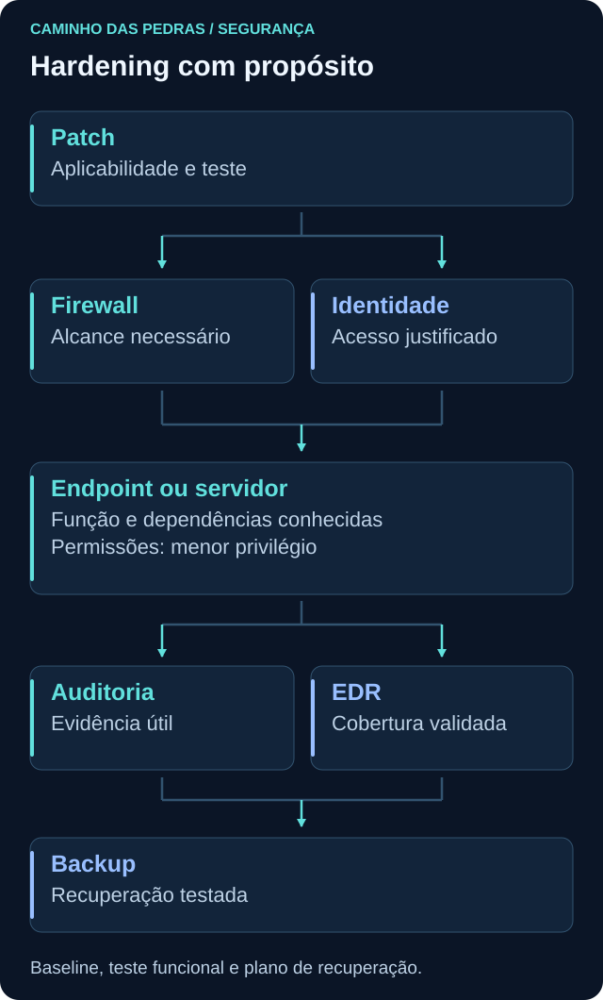
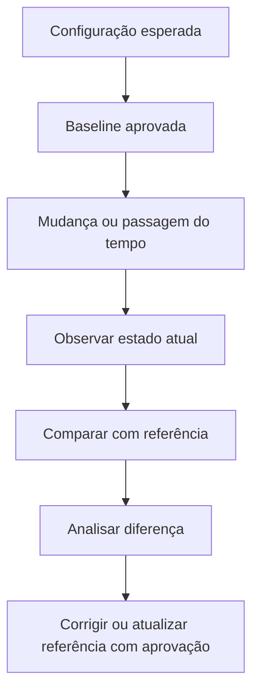
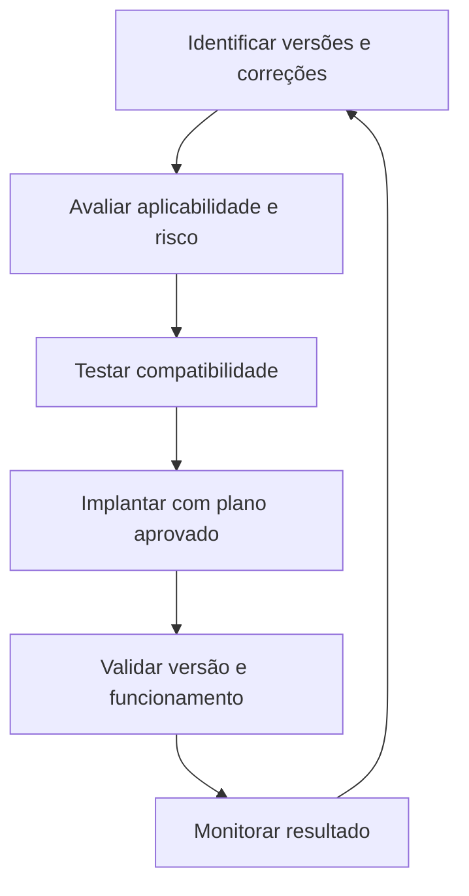

# Hardening

<!-- markdownlint-configure-file {"MD033": {"allowed_elements": ["details", "summary"]}} -->

[← Tópico anterior](criptografia.md) · [↑ Índice do módulo](README.md) · [Página principal](../README.md) · [Próximo tópico →](cloud-security.md)

Hardening significa reduzir exposição e tornar a configuração de um sistema mais adequada ao seu propósito. Isso exige entender a função do ativo, suas dependências e o risco que queremos reduzir. Não se resume a desligar serviços.

## Por que isso importa

Um sistema pode estar funcionando e ainda manter contas sem uso, permissões excessivas ou configurações incompatíveis com sua finalidade. Por outro lado, remover uma função necessária pode interromper uma aplicação. O resultado desejado é proteção verificável com funcionamento autorizado preservado.

## Superfície de ataque

Serviços, portas, aplicações, contas, permissões e funcionalidades são pontos de interação que precisam ser protegidos. Quanto mais componentes desnecessários existirem, maior pode ser a superfície a administrar e monitorar. A quantidade, sozinha, não mede segurança: uma única interface mal protegida pode ter grande impacto.

Pergunte por necessidade e exposição. Um serviço interno essencial pode permanecer, com acesso restrito e atualização adequada. Uma funcionalidade sem propósito pode ser candidata à remoção após avaliação e teste. Nome desconhecido não é justificativa para desabilitar.



## Princípios e verificação

| Medida | Pergunta de aplicação | Evidência útil |
| --- | --- | --- |
| Atualizar | A correção é aplicável e foi testada? | Versão efetiva e teste funcional |
| Remover o desnecessário | Há dependência ou uso legítimo? | Inventário e validação com responsável |
| Aplicar menor privilégio | Cada acesso é necessário? | Permissões efetivas comparadas à função |
| Restringir acesso e configurar firewall | Quais comunicações são necessárias? | Regras e perfil efetivo, com teste autorizado |
| Proteger credenciais | Quem consegue obter ou usar o segredo? | Processo de guarda, acesso e recuperação |
| Habilitar auditoria adequada | Que pergunta exige registro? | Evento esperado presente, com campos e retenção |
| Revisar configurações | O estado divergiu da referência? | Comparação documentada |
| Manter backup | É possível restaurar no prazo necessário? | Teste em destino separado |
| Monitorar e documentar | Quem percebe e trata uma diferença? | Responsável, registro e critério de revisão |

Auditoria deve ser planejada quanto a volume, sensibilidade e coleta. Habilitar tudo não garante que alguém analise os dados. Um firewall ativo não comprova que suas regras permitem apenas o necessário.

## Baseline: estado de referência

Baseline é um estado documentado usado para comparação. Diferencie **estado observado agora** de **configuração esperada e aprovada**. Fotografar uma configuração insegura não a transforma em padrão seguro.

Inclua finalidade da VM, versão, contas, serviços, comunicação necessária, política de atualização, firewall, auditoria, dependências e recuperação. Não registre segredos. A referência precisa de data e revisão para acompanhar mudanças legítimas.



Uma diferença pode ser mudança legítima, falha operacional ou atividade que exige investigação. Em Detection Engineering, saber o esperado ajuda a construir detecções contextualizadas, mas desvio não deve virar automaticamente incidente.

## Patch management



Defina janela, responsável, dependências e forma de recuperação. Nem toda atualização pode ser removida facilmente; o plano pode exigir restauração compatível ou outra estratégia validada. Confirme a necessidade de reinício e o estado final, pois download concluído não significa correção aplicada.

Urgência e teste precisam ser equilibrados pelo risco. Não instale atualizações cegamente em produção, nem use necessidade de teste como justificativa indefinida para manter uma exposição crítica sem mitigação.

## Hardening e disponibilidade

Um serviço parece dispensável, mas a aplicação depende dele para autenticar. Desabilitá-lo pode reduzir uma interface e ao mesmo tempo impedir o atendimento. Antes da mudança, confirme função, dependências e responsável; depois, teste a proteção pretendida **e** as operações legítimas.

Rollback descreve como retornar a um estado utilizável e em quais condições essa decisão será tomada. Snapshot de VM pode ajudar em alguns testes, mas não substitui backup e não garante reversão consistente de todo sistema distribuído. Retornar à versão anterior também pode reintroduzir uma fraqueza que precisa de tratamento.

## Benchmarks como referência

[CIS Benchmarks](https://www.cisecurity.org/cis-benchmarks) e [Microsoft Security Baselines](https://learn.microsoft.com/en-us/windows/security/operating-system-security/device-management/windows-security-configuration-framework/windows-security-baselines) oferecem referências para configurações. Verifique produto, versão, perfil e impacto de cada recomendação.

Não aplique um checklist sem considerar função e compatibilidade. Uma exceção deve ter justificativa, responsável, controle compensatório quando necessário e revisão. Estar conforme uma lista não elimina riscos fora de seu escopo.

## Defense in Depth no host

Patch, firewall, menor privilégio, MFA nos acessos compatíveis, EDR, logs e backup contribuem de formas distintas. Essa relação não é soma matemática de segurança. Uma correção reduz determinada fraqueza, um limite de rede reduz alcance, registros ajudam a investigar e uma cópia recuperável limita certas perdas.

Analise dependências comuns: se a mesma conta administra o original, as cópias e os registros sem separação adequada, uma falha nessa identidade pode afetar várias medidas.

## Prática: observar antes de mudar

Use uma VM própria ou autorizada, com dados sintéticos. O resultado inicial é uma ficha de baseline; não é necessário mudar serviços para concluir.

1. Registre finalidade, sistema, versão e estado observado, distinguindo-o do esperado.
2. Liste serviços e identifique quais têm função conhecida.
3. Liste contas e justifique os acessos, sem coletar senhas.
4. Verifique atualizações pela ferramenta oficial do sistema, incluindo pendências e reinício.
5. Observe firewall, perfil e regras relevantes sem alterá-los.
6. Verifique quais fontes de auditoria existem e que evidência já registram.
7. Escolha um item que poderia ser melhorado e descreva o risco.
8. Justifique a medida e liste dependências e testes funcionais.
9. Planeje recuperação e critério para interromper a mudança.
10. Execute uma mudança somente se for segura, compreendida e autorizada no laboratório; compare antes/depois. Se essas condições faltarem, entregue o plano sem executar.

Consultas opcionais de leitura no Windows, conforme disponibilidade dos módulos:

```powershell
Get-Service | Select-Object Name, Status, StartType
Get-LocalUser | Select-Object Name, Enabled
Get-NetFirewallProfile | Select-Object Name, Enabled, DefaultInboundAction, DefaultOutboundAction
```

No Linux com systemd e ferramentas correspondentes:

```bash
systemctl list-units --type=service --all
getent passwd
```

`list-units` mostra unidades carregadas, não um inventário completo de todos os arquivos de unidade. `getent passwd` consulta a base de contas configurada, não quem está conectado. `Get-LocalUser` não enumera todas as identidades de domínio ou cloud. Um valor de firewall não configurado explicitamente requer interpretação da política efetiva.

Para atualizações, firewall e auditoria no Linux, use a interface ou documentação da distribuição. Este módulo não presume um gerenciador universal nem pede alterar regras. Relembre [Linux](../03-Linux-e-Windows/linux.md), [Windows](../03-Linux-e-Windows/windows.md) e [Event Viewer](../03-Linux-e-Windows/event-viewer.md) para interpretar as observações.

## Pensamento de analista e mini desafio

Essa funcionalidade é necessária? Qual identidade a utiliza? Que exposição será reduzida? Qual impacto existe se for removida? Há rollback? Que registro demonstra o resultado? O teste reproduz o uso relevante?

Entregue um checklist de baseline com **item, esperado, observado, evidência, diferença e ação proposta**. Identifique uma melhoria segura e inclua justificativa, plano de recuperação e testes. Você pode propor proteger melhor uma cópia sintética ou revisar uma permissão de teste; não desative controles de segurança nem serviços aleatoriamente. Diferencie plano de resultado realmente observado.

## Checkpoint

Explique seu raciocínio antes de abrir cada resposta.

**Desabilitar mais serviços significa sempre mais segurança?**

<details>
<summary>Ver resposta</summary>

Não. Necessidade, exposição e dependências importam. Remover uma função essencial pode causar indisponibilidade sem tratar o risco prioritário.

</details>

**A baseline foi coletada hoje. Isso a torna uma configuração segura?**

<details>
<summary>Ver resposta</summary>

Não. Ela pode ser apenas o estado observado. A referência esperada precisa de avaliação e aprovação.

</details>

**Uma atualização foi baixada. A falha já foi corrigida?**

<details>
<summary>Ver resposta</summary>

Não necessariamente. Confirme instalação, versão, reinício quando aplicável e resultado funcional.

</details>

**Uma diferença da baseline é sempre incidente?**

<details>
<summary>Ver resposta</summary>

Não. Pode decorrer de mudança autorizada, erro ou outra causa. Compare registros, autorização e contexto.

</details>

**Um benchmark deve ser aplicado sem exceções?**

<details>
<summary>Ver resposta</summary>

Não cegamente. Analise compatibilidade, escopo e impacto. Exceções precisam de justificativa, responsabilidade e revisão.

</details>

**Snapshot elimina a necessidade de planejar recuperação?**

<details>
<summary>Ver resposta</summary>

Não. Dependências, consistência e falhas fora da VM podem não estar cobertas. Valide como retornar a um estado utilizável.

</details>

**Como saber se hardening funcionou?**

<details>
<summary>Ver resposta</summary>

Verifique a redução de exposição pretendida e o uso legítimo, compare evidências antes/depois e registre o risco residual.

</details>

## Resumo e próximo passo

Hardening mantém o sistema coerente com sua finalidade. Em [Cloud Security](cloud-security.md), aplique os mesmos fundamentos às responsabilidades e configurações de serviços gerenciados.

[← Tópico anterior](criptografia.md) · [↑ Índice do módulo](README.md) · [Página principal](../README.md) · [Próximo tópico →](cloud-security.md)
