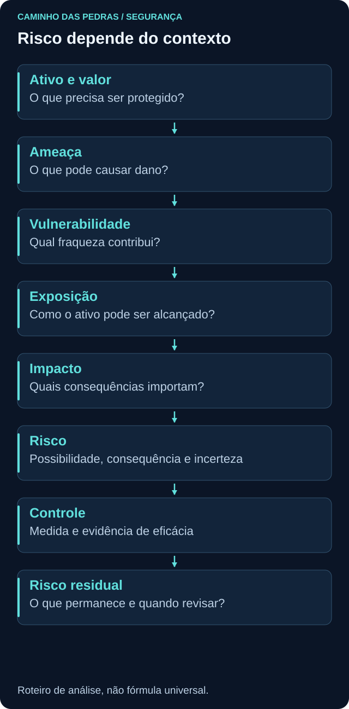
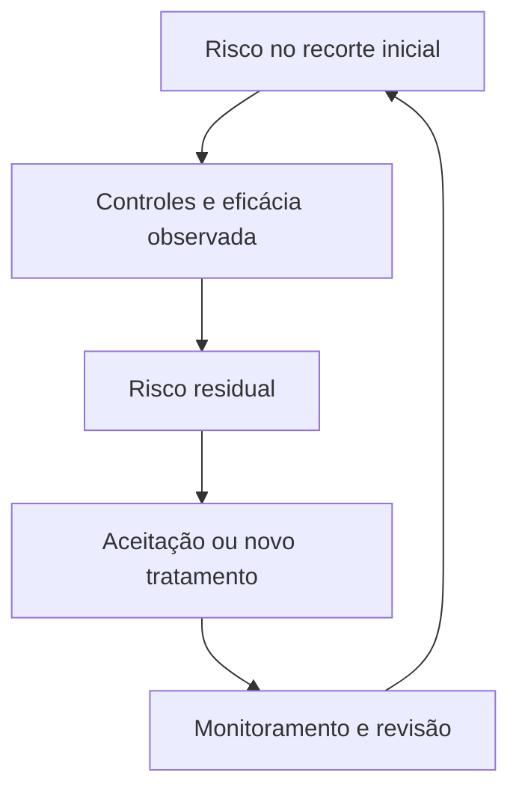
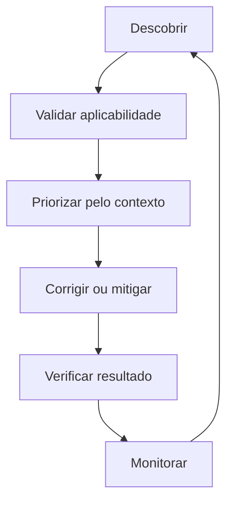

# Risco, ameaça e vulnerabilidade

<!-- markdownlint-configure-file {"MD033": {"allowed_elements": ["details", "summary"]}} -->

[← Tópico anterior](cia-triad.md) · [↑ Índice do módulo](README.md) · [Página principal](../README.md) · [Próximo tópico →](autenticacao-autorizacao.md)

## Por que isso importa

Uma lista de falhas não diz, sozinha, por onde começar. Para decidir, precisamos saber o que tem valor, que eventos poderiam causar dano, quais condições favorecem esses eventos e quais consequências seriam relevantes. Risco é uma avaliação contextual, com incerteza e critérios explícitos.

## Ativo e valor

Ativo é algo de valor que precisa ser considerado na proteção: dados, servidor, endpoint, identidade, aplicação ou serviço. Operação e reputação também podem ser valores afetados, conforme a metodologia. Identifique o que o ativo permite fazer, quem depende dele e quem responde pelas decisões.

Um servidor vazio de laboratório e um servidor de atendimento podem ter o mesmo sistema operacional, mas consequências muito diferentes em caso de perda. Valor não se resume ao preço do equipamento.

## Ameaça, vulnerabilidade e exposição

| Conceito | Pergunta | Exemplo |
| --- | --- | --- |
| Ameaça | O que pode causar dano? | Acesso indevido, erro humano, falha técnica ou evento físico |
| Vulnerabilidade | Qual fraqueza contribui para o evento? | Versão vulnerável, configuração inadequada ou permissão excessiva |
| Exposição | Em que condições a ameaça alcança o ativo? | Serviço acessível publicamente, acesso interno ou dependência compartilhada |

Ameaça não é apenas um ator malicioso. Uma pessoa pode apagar um arquivo por engano, um componente pode falhar ou água pode atingir equipamentos. Software mal configurado pode produzir uma operação danosa; normalmente a configuração inadequada é descrita como **fraqueza**, e o comportamento ou evento resultante como cenário de ameaça. Declare essa distinção para não usar os termos como sinônimos.

Senha fraca, excesso de privilégio, ausência de validação e exposição desnecessária são exemplos de condições a avaliar. Software antigo não prova automaticamente uma vulnerabilidade específica: confirme versão, suporte, correção e aplicabilidade. Vulnerabilidade não significa ataque em andamento.

Exposição não é apenas estar na internet. Usuários locais, redes internas, integrações e mídias também podem criar caminhos. Isolamento de laboratório precisa ser real: rede, pastas compartilhadas, credenciais e dados usados influenciam o limite.

## Impacto e probabilidade

**Impacto** descreve consequências para operação, dados, finanças, reputação, conformidade e disponibilidade. Especifique a consequência: “atendimento sem acesso aos registros durante o período crítico” é mais útil que “impacto alto” sem explicação.

**Probabilidade** trata da possibilidade de ocorrência no horizonte analisado. Depende de ameaças relevantes, exposição, condições técnicas, controles, histórico e qualidade das informações. Não transforme ausência de incidentes conhecidos em certeza de que um evento é improvável.

Uma avaliação qualitativa pode usar categorias definidas pela organização. Uma avaliação quantitativa exige dados e hipóteses defensáveis. Este módulo não atribui porcentagens nem multiplica números arbitrários.

## Risco: reunir o contexto

```text
Ativo + ameaça + vulnerabilidade + exposição + impacto
                         ↓
                 Contexto de risco
```

Essa é uma representação didática, **não uma fórmula universal**. Avaliar risco considera possibilidade e consequências de um evento no contexto do ativo, incluindo incertezas e controles. A [NIST SP 800-30](https://csrc.nist.gov/pubs/sp/800/30/r1/final) é uma referência para avaliação dentro de um processo maior de gestão; não torna toda organização obrigada a usar uma única matriz.



## Risco inerente e residual

Risco **inerente** descreve a avaliação antes de considerar determinados controles, conforme o recorte da metodologia. Risco **residual** é o que permanece depois de considerar os controles e sua eficácia. Declare quais medidas foram incluídas em cada avaliação; “antes” e “depois” sem esse recorte podem esconder comparações incompatíveis.



Um firewall pode reduzir alcance ao serviço sem corrigir sua vulnerabilidade. Uma correção pode remover uma falha e deixar riscos de credenciais ou configuração. Controle planejado ainda não é controle comprovadamente operante.

## Matriz conceitual de probabilidade e impacto

A tabela abaixo organiza a conversa, sem pontuação ou classificação universal. As categorias precisam de critérios e horizonte definidos antes de uso real.

| Probabilidade avaliada | Impacto limitado no cenário | Impacto grave no cenário |
| --- | --- | --- |
| Menor, segundo evidências disponíveis | Verificar se controles e revisão são proporcionais | Considerar recuperação e consequências mesmo com ocorrência menos provável |
| Maior, segundo evidências disponíveis | Avaliar recorrência e efeito acumulado | Dar atenção à decisão de tratamento e à exposição atual |

“Menor” não significa zero. Um impacto grave não deve desaparecer da discussão só porque há poucos dados. Organizações podem usar outras categorias, critérios e formas de agregação. Registre a confiança da avaliação e o que precisa ser confirmado.

## Tratamento de risco

| Opção | O que significa | Exemplo e limite |
| --- | --- | --- |
| Mitigar | Reduzir probabilidade ou impacto | Restringir acesso e corrigir software; risco pode permanecer |
| Evitar | Deixar de realizar a atividade que origina o cenário | Não oferecer um serviço desnecessário; avaliar efeito no negócio |
| Transferir ou compartilhar | Redistribuir parte das consequências ou responsabilidades | Contrato ou seguro; não elimina todas as obrigações e perdas |
| Aceitar | Assumir conscientemente o risco dentro dos critérios aplicáveis | Decisão documentada por responsável competente, com revisão |

Nenhuma opção é sempre superior. Aceitação não é esquecer a correção nem permitir que uma fila vencida decida por omissão. Defina responsável, justificativa, prazo e gatilho de reavaliação. Transferir não torna o dano impossível.

## CVSS: severidade técnica não é todo o risco

O [CVSS da FIRST](https://www.first.org/cvss/) representa características de vulnerabilidades e sua severidade. A [especificação v4.0](https://www.first.org/cvss/v4.0/specification-document) diferencia grupos de métricas; uma nota Base não incorpora sozinha todo o contexto de ameaça, ambiente ou negócio.

Não use “maior CVSS” como sinônimo automático de “maior risco da organização”. Uma falha tecnicamente grave em laboratório isolado pode exigir decisão diferente de outra em um serviço crítico e exposto. Isso não autoriza ignorar notas altas: elas são uma entrada, junto de aplicabilidade, exposição, criticidade e evidência de exploração relevante.

## Cenário: Windows desatualizado com RDP

Suponha uma versão com vulnerabilidade aplicável já confirmada. Nenhuma exploração será executada.

| Elemento | A: VM isolada de laboratório | B: servidor publicamente acessível |
| --- | --- | --- |
| Valor | Estudo com dados sintéticos | Serviço importante com dados de trabalho |
| Exposição | Rede virtual isolada, sem publicação externa | RDP alcançável pela internet |
| Fraqueza | Correção aplicável pendente | Mesma correção pendente |
| Ameaças relevantes | Erro local, falha e acesso pelo ambiente de laboratório | Também tentativas de acesso de origens externas |
| Consequência | Perda de exercício e possível efeito em dependências compartilhadas | Interrupção, perda de dados ou acesso indevido, conforme cenário |
| Decisão a avaliar | Corrigir e confirmar isolamento e recuperação | Priorizar análise da exposição, acesso e correção com plano operacional |

A tabela não calcula automaticamente a prioridade e não afirma que RDP sempre contém uma falha explorável. Evidências adicionais incluem versão afetada, caminho de acesso, autenticação, privilégios, dados e capacidade de recuperação. Uma VM com credenciais reais e pastas do host compartilhadas pode não ter o impacto limitado que seu nome sugere.

## Gestão de vulnerabilidades



Descobrir informa que há algo a examinar. Validar evita tratar inventário incorreto como fato. Corrigir remove a condição relevante; mitigar reduz o risco sem necessariamente remover a fraqueza. Aceitar é uma decisão de tratamento, não um resultado de scanner. Verificar significa confirmar versão ou configuração efetiva e funcionamento esperado, não apenas fechar um chamado.

## Prática, pensamento de analista e mini desafio

Crie um registro simples de risco para uma VM própria, sem varreduras externas. Use inventário e observações locais ou declare um cenário totalmente sintético.

| Campo | O que registrar |
| --- | --- |
| Ativo, valor e responsável | Função, dados fictícios e dependências |
| Cenário | Ameaça, fraqueza e exposição descritas separadamente |
| Impacto | Propriedade CIA e consequência concreta |
| Probabilidade e incertezas | Evidências disponíveis, horizonte e lacunas |
| Controles atuais e propostos | Escopo, responsável e verificação prevista |
| Tratamento e residual | Decisão, limite que permanece e quem a aprova |
| Revisão | Data ou mudança que exige nova análise |

Pergunte: a fraqueza está confirmada? O serviço pode ser alcançado? O dado tem valor fora do laboratório? O controle foi apenas configurado ou verificado? Quem aceita o que permanece? Entregue o registro com uma comparação entre dois contextos e sem pontuação inventada.

## Checkpoint

Explique seu raciocínio antes de abrir cada resposta.

**CVSS alto significa automaticamente o maior risco do negócio?**

<details>
<summary>Ver resposta</summary>

Não. A severidade técnica informa a análise, que também precisa de ativo, exposição, ameaça, impacto, controles e incertezas.

</details>

**Uma vulnerabilidade encontrada confirma ataque?**

<details>
<summary>Ver resposta</summary>

Não. Ela descreve uma fraqueza. Ocorrência e exploração exigem evidências próprias.

</details>

**Um servidor interno está livre de exposição?**

<details>
<summary>Ver resposta</summary>

Não. Identidades locais, integrações e redes internas também podem oferecer caminhos. É preciso verificar o isolamento efetivo.

</details>

**Restringir acesso corrige necessariamente a vulnerabilidade?**

<details>
<summary>Ver resposta</summary>

Não. Pode mitigar o cenário sem remover a causa. Registre a condição pendente e o risco residual.

</details>

**É possível aceitar risco sem apagar a observação técnica?**

<details>
<summary>Ver resposta</summary>

Sim. Aceitação documenta uma decisão responsável; a fraqueza e os critérios de revisão continuam registrados.

</details>

**Transferir risco impede que o serviço pare?**

<details>
<summary>Ver resposta</summary>

Não. Um contrato pode redistribuir consequências, mas não torna o evento impossível nem elimina todo impacto.

</details>

**O controle foi planejado. O residual já pode ser tratado como verificado?**

<details>
<summary>Ver resposta</summary>

Não. Diferencie estimativa após um controle proposto de risco reavaliado com evidência de implantação e eficácia.

</details>

## Resumo e próximo passo

O risco orienta a escolha de medidas. Em [autenticação, autorização e IAM](autenticacao-autorizacao.md), aplique esse raciocínio a identidades e permissões.

[← Tópico anterior](cia-triad.md) · [↑ Índice do módulo](README.md) · [Página principal](../README.md) · [Próximo tópico →](autenticacao-autorizacao.md)
