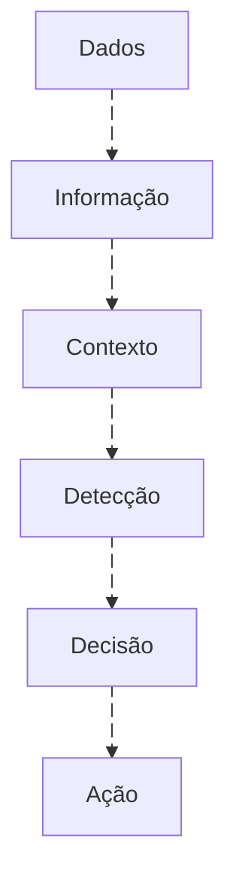
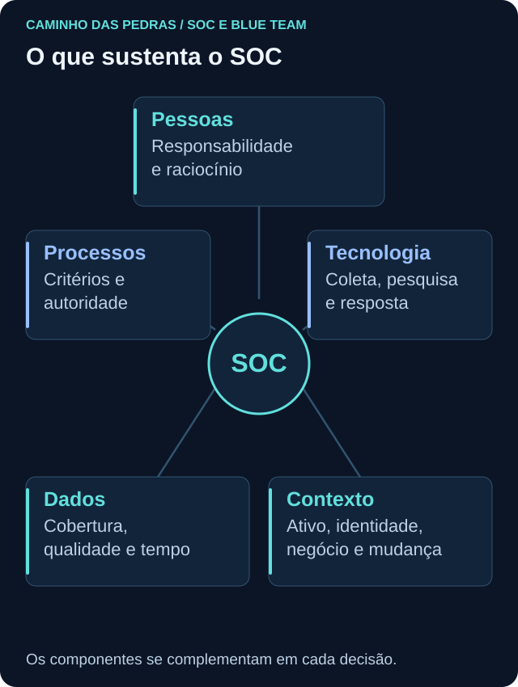
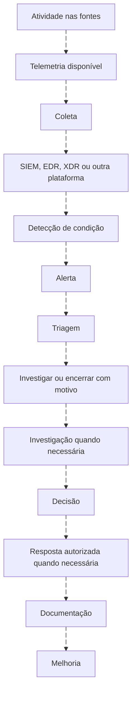
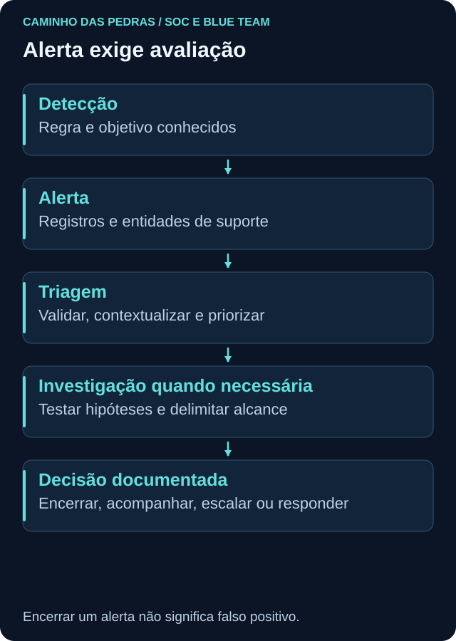
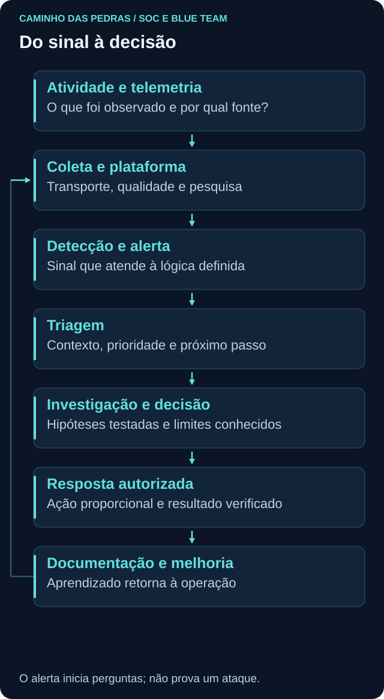

# 05 SOC e Blue Team

<!-- markdownlint-configure-file {"MD033": {"allowed_elements": ["details", "summary"]}} -->

[← Tópico anterior](../04-Seguranca-da-Informacao/README.md) · [↑ Índice do módulo](README.md) · [Página principal](../README.md) · [Próximo tópico →](estrutura-soc.md)

**SOC significa Security Operations Center.** É uma operação que reúne pessoas, processos, tecnologia, dados e contexto para monitorar, analisar e tratar situações de segurança. **Blue Team** abrange atividades defensivas de proteção, monitoramento, detecção, investigação e resposta. Os conceitos se relacionam, mas não são sinônimos: parte do trabalho defensivo pode ocorrer fora do SOC, e a divisão varia entre organizações.

> Como transformar milhões de eventos em poucas decisões que realmente importam?

O volume é uma possibilidade, não um requisito para existir SOC. Em qualquer escala, precisamos reconhecer quais sinais respondem a uma pergunta, qual contexto falta e que ação é justificável. O objetivo não é encontrar algo “suspeito” a qualquer custo nem fechar a fila o mais rápido possível.

## Dos dados à ação



Esse fluxo organiza o raciocínio. Uma detecção também pode iniciar a busca de contexto, e novas evidências podem mudar a decisão. A consulta encontra dados; o analista precisa entender o significado e os limites do resultado.

## O que um SOC faz

Monitoramento, análise de alertas, triagem e investigação fazem parte do trabalho. A operação também mantém comunicação, escalonamento, documentação, acompanhamento de incidentes e melhoria das detecções. Resposta depende da autoridade definida e pode envolver equipes de infraestrutura, identidade, aplicações e responsáveis pelo serviço.

## O que um SOC não é

Uma sala de telas, um dashboard, um antivírus ou um SIEM não constituem sozinhos uma operação defensiva. Uma equipe que apenas fecha alertas sem registrar motivo perde aprendizado e rastreabilidade.

**SOC = pessoas + processos + tecnologia + dados + contexto** é uma representação conceitual, não uma fórmula de maturidade.



## Estrutura do módulo

| Tópico | O que aprenderemos | Entrega |
| --- | --- | --- |
| [Estrutura SOC](estrutura-soc.md) | Papéis, responsabilidades, escalonamento e turnos | Fluxo e nota de handoff |
| [Logs e telemetria](logs.md) | Origem, coleta, tempo, parsing e qualidade | Mapa de fontes e lacunas |
| [SIEM](siem.md) | Pesquisa, correlação, detecção e retenção | Caso de uso com campos necessários |
| [EDR e XDR](edr-xdr.md) | Visibilidade de endpoint e integração entre domínios | Árvore de processos benigna |
| [Triagem](triagem.md) | Contexto, prioridade e próximo passo | Fatos, hipóteses e decisão |
| [Investigação](investigacao.md) | Testar explicações e documentar conclusões | Timeline e relatório proporcional |

A ordem começa pela operação e pelos dados antes de pedir decisões ao analista. Relembre [risco e controles](../04-Seguranca-da-Informacao/README.md) e [fontes de endpoint](../03-Linux-e-Windows/README.md) quando necessário.

## Fluxo completo de um alerta



O desenho é conceitual: SIEM, EDR e XDR não precisam receber todos os mesmos dados nem operar em série. Detecção pode ocorrer localmente no endpoint. Triagem pode encerrar atividade compreendida, escalar por urgência ou abrir investigação. Resposta urgente autorizada pode começar antes de esgotar todas as hipóteses. Documentação acompanha o caso desde o início.



<details>
<summary>Visão estática do SOC como sistema</summary>



</details>

### Animação e compatibilidade

Os fluxos usam IDs nas arestas e `animation: fast`, com retorno lento onde ele representa revisão de hipótese. A sintaxe segue a [documentação do Mermaid](https://mermaid.js.org/syntax/flowchart.html). A versão do renderizador depende do ambiente, como explica o [GitHub](https://docs.github.com/en/get-started/writing-on-github/working-with-advanced-formatting/creating-diagrams).

As imagens SVG são alternativas estáticas independentes da animação. Se o movimento não aparecer em seu leitor ou estiver reduzido por acessibilidade, a sequência e os rótulos continuam suficientes. As setas não indicam duração, velocidade real de coleta ou garantia de resposta.

## Acompanhe seu progresso

**[Abrir checklist interativo do Módulo 05](https://github.com/meloalan/Caminho-das-Pedras-CyberSecurity/issues/new?template=modulo-05-soc-blue-team.md)**

Entre em sua conta do GitHub, abra o modelo, revise e envie sua própria Issue. Depois de criada, as marcações são salvas naquela Issue conforme suas permissões. Nenhum item vem marcado. Checkbox no README não é progresso individual persistente.

O acompanhamento fica público neste repositório. Use somente notas de estudo e exemplos fictícios, sem logs brutos, dados pessoais ou segredos. Quem preferir pode copiar o [template](../.github/ISSUE_TEMPLATE/modulo-05-soc-blue-team.md) para um repositório próprio. Criar a Issue é uma ação do estudante, não um requisito para ler o conteúdo.

## Evento, alerta e incidente

| Termo | Interpretação de trabalho |
| --- | --- |
| Evento | Algo ocorreu; a fonte pode registrar uma representação dessa ocorrência |
| Alerta | Uma lógica ou mecanismo chamou atenção para uma condição |
| Incidente | Situação de segurança avaliada e tratada segundo critérios e processo da organização |

Um produto pode chamar um agrupamento de alertas de “incident” antes de confirmação humana. Não confunda o nome do objeto na plataforma com uma conclusão de comprometimento. Incidentes também podem começar por relato humano sem alerta automático.

```text
100.000 eventos → 1.000 condições relevantes → 100 alertas
                         → 10 investigações → 1 incidente
```

Os números são **inteiramente ilustrativos**, não uma proporção esperada, meta ou benchmark. Não são conjuntos obrigatoriamente distintos: vários alertas podem pertencer à mesma investigação.

## Detecção correta não significa ataque

**True Positive e False Positive dependem da condição definida pela regra e da convenção de classificação.** Se o objetivo é avisar sobre criação de conta, uma criação autorizada pode ter sido detectada corretamente. Se o objetivo declarado é reconhecer criação não autorizada, classificar a mesma atividade requer avaliar autorização.

| Pergunta | Distinção necessária |
| --- | --- |
| A lógica encontrou sua condição? | Correção técnica da detecção |
| A atividade tinha autorização? | Relação com função, solicitação e política |
| Era esperada naquele contexto? | Histórico e mudanças planejadas |
| Existem evidências de comportamento malicioso? | Conclusão de segurança sustentada pelos dados |

True Positive indica que a condição relevante definida foi corretamente identificada. False Positive indica que o disparo não corresponde ao que se pretendia tratar como condição relevante ou ameaça. Algumas equipes usam categorias como positivo benigno para uma condição real e legítima. Documente o significado local. “Encerrado” é estado de trabalho, não sinônimo de falso positivo. Atividade inesperada também pode ser legítima; atividade comum pode exigir atenção se seu contexto mudou.

## Severidade e prioridade

Severidade descreve gravidade atribuída à condição ou regra. Prioridade organiza o atendimento considerando ativo, usuário, privilégio, criticidade, exposição, impacto, urgência e confiança na detecção. Os campos podem ter regras próprias em cada operação.

Falha de autenticação de uma conta descartável em VM e falha de uma conta privilegiada crítica podem compartilhar o Event ID 4625. Antes de priorizar, valide frequência, origem, janela, tipo de logon, histórico e atividades posteriores. Privilégio elevado pode aumentar atenção, mas não transforma cada falha em ataque confirmado.

## Explore o fluxo do SOC

1. Telemetria
2. Detecção
3. Alerta
4. Triagem
5. Investigação
6. Resposta
7. Melhoria

<details>
<summary>1. Telemetria</summary>

Identifique fonte, campos, qualidade, timestamp e cobertura. Uma consulta vazia só tem significado quando sabemos o que poderia ter sido registrado. Veja [logs](logs.md).

</details>

<details>
<summary>2. Detecção</summary>

Defina o comportamento ou condição, a fonte necessária e os limites. Uma regra depende dos campos corretos e de uma janela coerente. Veja [SIEM](siem.md).

</details>

<details>
<summary>3. Alerta</summary>

O alerta é uma entrada para decisão. Preserve regra e versão, entidades, janela e referências dos dados, sem tratar seu título como conclusão.

</details>

<details>
<summary>4. Triagem</summary>

Valide dados, identifique entidades, consulte contexto e determine prioridade e próximo passo. Encerramento precisa de justificativa. Veja [triagem](triagem.md).

</details>

<details>
<summary>5. Investigação</summary>

Teste explicações alternativas, construa timeline e procure evidência que sustente ou enfraqueça cada hipótese. Veja [investigação](investigacao.md).

</details>

<details>
<summary>6. Resposta</summary>

Contenção, coleta adicional e recuperação dependem de escopo, autorização e impacto. Registre a decisão, quem executou e como verificar o resultado.

</details>

<details>
<summary>7. Melhoria</summary>

Transforme achados em correção de coleta, ajuste de regra, revisão de processo ou treinamento. Teste a mudança e preserve histórico.

</details>

## Mini cenário completo: falhas de autenticação

Todos os nomes, horários e quantidades abaixo são **sintéticos**, não evidências de uma empresa. Considere uma única data fictícia e horários UTC.

| Momento | Observação | Próxima pergunta |
| --- | --- | --- |
| 08:30 | Uma regra sinaliza falhas em uma janela anterior | A fonte e o horário de ocorrência estão corretos? |
| 08:32 | O analista identifica conta, host e origem disponível | As entidades foram normalizadas sem misturar contas? |
| 08:34 | Histórico apresenta padrão parecido | Qual atividade explicava o padrão e ainda é aplicável? |
| 08:36 | A pesquisa encontra 4624 posterior às falhas | Conta, host, origem e tipo de logon sustentam a relação? |
| 08:40 | Há hipóteses de senha esquecida, serviço ou uso não autorizado | Que registro de aplicação, mudança ou endpoint discrimina as hipóteses? |
| Após análise | O caso recebe conclusão proporcional | Qual explicação é sustentada e o que permanece desconhecido? |

O sucesso posterior não prova que alguém adivinhou a senha. NAT, contas homônimas, logons distintos e lacunas de coleta podem produzir associações falsas. O [Lab 01](../12-Labs-Praticos/01-EventID-4625/README.md) e o [playbook de autenticação](../playbooks/falhas-autenticacao.md) apoiam o raciocínio, respeitando seus pré-requisitos.

<details>
<summary>Quero investigar este alerta</summary>

Separe fato, hipótese e lacuna. Verifique a mesma identidade com seu domínio ou autoridade, host de destino, período, tipo de logon e origem disponível. Procure mudança autorizada e atividade posterior. Se faltam dados, registre qual fonte seria necessária e quem pode obtê-la, sem declarar benignidade por ausência de evidência.

</details>

### Outro alerta: criação de conta 4720

Quem criou e qual conta foi criada? Era conta local ou de domínio? Em qual host ou DC e horário? Havia mudança autorizada? Quais grupos recebeu e o que aconteceu depois? O 4720 não responde sozinho sobre grupos e uso posterior. O [Lab 02](../12-Labs-Praticos/02-EventID-4720/README.md) trata de conta local de teste e distingue ator e alvo.

## Métricas, fadiga de alertas e melhoria

| Medida | Leitura útil | Limite |
| --- | --- | --- |
| Volume e alertas por caso de uso | Localizar fontes de demanda | Menos alertas pode significar sensor parado |
| Taxa de falsos positivos | Avaliar utilidade com classificação definida | Exige denominador, amostra e critérios consistentes |
| Tempo de triagem e até investigação | Identificar atrasos | Defina início, fim, pausas e contexto |
| Backlog | Acompanhar pendências e idade | Quantidade não revela sozinha o impacto |
| Cobertura e saúde das fontes | Saber o que pode ser observado | Agente online não prova todos os eventos chegando |

MTTD e MTTR, quando usados, precisam de definições explícitas. “Detectar” pode ter marcos distintos, e “responder”, “resolver” e “recuperar” não são o mesmo fim de intervalo. Média baixa isolada não comprova eficiência.

Alert fatigue ocorre quando ruído e demanda repetitiva reduzem atenção e favorecem análise superficial. A solução envolve qualidade de dados, capacidade, priorização e melhoria de detecção. Tuning segue **regra → alertas → análise → ajuste justificado → teste → nova versão**. Examine falsos positivos e possíveis perdas de cobertura; não suprima um usuário inteiro apenas para reduzir a fila.

Uma evolução possível é coletar, visualizar, detectar, investigar, responder, medir e melhorar. Isso não é score universal nem escada rígida. O próximo avanço deve resolver uma limitação observada.

## Ferramentas não substituem raciocínio

Microsoft Sentinel, Elastic, Splunk, QRadar e Wazuh oferecem capacidades com arquiteturas e terminologias diferentes. EDR e XDR acrescentam outras perspectivas. Nenhuma plataforma substitui fundamentos, contexto, hipóteses e documentação.

[MITRE ATT&CK](https://attack.mitre.org/) apoia a descrição de comportamentos. Comece por “qual comportamento quero observar?”, não por “qual Event ID é uma técnica?”. Um mapeamento válido requer contexto. IoCs são indicadores baseados em artefatos observáveis; TTPs descrevem táticas, técnicas e procedimentos. Correspondência em lista de IoCs não comprova comprometimento por si só. O módulo específico de MITRE aprofundará o assunto.

## Pensamento de analista e mini desafio

Escolha o cenário fictício de autenticação e conte o caminho de uma atividade até uma decisão. Identifique fonte, coleta, condição detectada, prioridade, hipótese alternativa, evidência faltante, responsável e próxima ação. Não fabrique uma execução real do laboratório.

Entregue uma ficha curta e registre seu progresso na Issue, se desejar. A [NIST SP 800-61 Rev. 3](https://csrc.nist.gov/pubs/sp/800/61/r3/final) conecta resposta a incidentes à gestão de risco e à melhoria, além da ferramenta de alertas.

## Checkpoint

Explique seu raciocínio antes de abrir cada resposta.

**Um alerta disparou corretamente. Isso prova atividade maliciosa?**

<details>
<summary>Ver resposta</summary>

Não. A condição pode ser real e autorizada. Compare objetivo da regra, contexto e evidências antes de classificar.

</details>

**Um produto criou um incident. O comprometimento está confirmado?**

<details>
<summary>Ver resposta</summary>

Não necessariamente. Pode ser um agrupamento de alertas. A conclusão depende da análise e dos critérios adotados.

</details>

**Fechar a fila mais rápido prova eficiência?**

<details>
<summary>Ver resposta</summary>

Não. É preciso avaliar qualidade, cobertura, impacto e motivo dos encerramentos. Pressa pode ocultar casos mal analisados.

</details>

**Por que prioridade pode diferir da severidade da regra?**

<details>
<summary>Ver resposta</summary>

Ativo, privilégio, exposição, urgência e confiança mudam o contexto operacional do caso.

</details>

**O sucesso 4624 depois de 4625 encerra a explicação?**

<details>
<summary>Ver resposta</summary>

Não. A relação entre entidades e sessões precisa ser validada; várias explicações legítimas ou não continuam possíveis.

</details>

**O checklist do README salva automaticamente o progresso de cada leitor?**

<details>
<summary>Ver resposta</summary>

Não. O progresso individual é registrado na Issue criada pelo estudante, com sua conta e permissões.

</details>

**Qual decisão deve acompanhar uma lacuna de telemetria?**

<details>
<summary>Ver resposta</summary>

Registrar a limitação, avaliar seu impacto na confiança e definir responsável e próximo passo, sem inventar atividade ou ausência.

</details>

## Resumo e próximo passo

Siga para [estrutura SOC](estrutura-soc.md). Ao terminar o módulo, o [06 SIEM na Prática](../06-SIEM-na-Pratica/README.md) aplicará esse ciclo em Wazuh, Splunk, QRadar e Microsoft Sentinel, comparando dados, consultas e decisões entre plataformas.

[← Tópico anterior](../04-Seguranca-da-Informacao/README.md) · [↑ Índice do módulo](README.md) · [Página principal](../README.md) · [Próximo tópico →](estrutura-soc.md)
