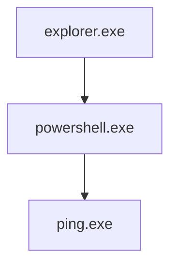
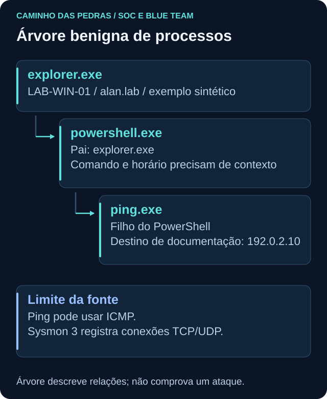

# EDR e XDR

<!-- markdownlint-configure-file {"MD033": {"allowed_elements": ["details", "summary"]}} -->

[← Tópico anterior](siem.md) · [↑ Índice do módulo](README.md) · [Página principal](../README.md) · [Próximo tópico →](triagem.md)

## Por que isso importa

Uma consulta de rede pode mostrar comunicação sem explicar qual processo a iniciou. Telemetria de endpoint pode acrescentar execução, identidade, pai, arquivo e tempo. EDR e SIEM podem contar partes diferentes da mesma história, com lacunas e nomes de campo próprios.

## Endpoint Detection and Response

EDR enfatiza visibilidade, detecção, investigação e resposta em endpoints. Conforme produto, sensor, sistema operacional e configuração, pode observar processos, árvores de execução, arquivos, Registry, conexões, usuário, comportamentos e alertas.

Uma interface que apresenta uma árvore não garante coleta de todo processo ou de toda atividade posterior. Verifique se o sensor estava ativo, se o sistema e o evento são suportados, os filtros e a retenção. Uma estação offline pode enviar dados depois e alterar a ordem de chegada.

## Process tree: relações, não veredito

Exemplo **conceitual e benigno**, não coletado de um ambiente real:



O diagrama é estrutural e não precisa de animação. Uma pessoa pode abrir uma shell e consultar conectividade. O pai real depende do modo de abertura, terminal e versão. Não force uma coleta real a coincidir com o desenho.



| Campo ou relação | Pergunta | Cuidado |
| --- | --- | --- |
| Parent e child | Qual processo criou qual processo? | Pai reportado e contexto precisam ser interpretados |
| Command line | Como o processo foi iniciado? | Pode conter dados sensíveis e não mostra toda ação posterior |
| User | Qual identidade executa? | Conta técnica não equivale à pessoa diante da tela |
| Time | Quando a instância iniciou? | Preservar fuso e distinguir chegada do registro |
| PID e identificador persistido | Qual instância está sendo correlacionada? | PID pode ser reutilizado |
| Network | Há comunicação associada a essa execução? | Depende da cobertura e do tipo de tráfego |

Uma execução de `ping.exe` pode usar ICMP. Não espere que todo sensor de conexões TCP/UDP registre essa atividade como evento de rede. Em particular, Sysmon Event ID 3 não é uma captura genérica de ICMP. O processo pode estar visível sem haver o registro de rede imaginado.

PowerShell tem uso administrativo legítimo. Antes de classificar, procure host, usuário, caminho, command line, pai, tempo, mudança autorizada e atividades relacionadas. Um nome de executável não determina intenção.

## EDR e antivírus

Antivírus costuma estar associado à identificação e prevenção de software malicioso. EDR dá ênfase ao histórico e contexto de atividade, investigação e ações de resposta. Produtos modernos sobrepõem essas capacidades, por isso não use uma fronteira rígida nem conclua cobertura apenas pelo rótulo comercial.

Também não trate Sysmon como EDR completo: ele produz telemetria conforme configuração, mas não representa por si só todo o fluxo de detecção, investigação e resposta de um produto EDR. Relembre [Sysmon](../03-Linux-e-Windows/sysmon.md).

## Extended Detection and Response

XDR busca correlacionar sinais de múltiplos domínios integrados, como email, identidade, endpoint e cloud. A integração pode reunir entidades e sequências que ficariam separadas em ferramentas distintas.

```text
Email + identidade + endpoint + cloud → contexto ampliado
```

Essa é uma relação conceitual, não uma soma de cobertura garantida. Conectores, licenças, permissões, sensores e configurações determinam o que existe. XDR não substitui automaticamente todo uso de SIEM, nem garante visibilidade fora dos domínios integrados.

## SIEM, EDR e XDR

| Tecnologia | Visão principal | Exemplos de dados | Uso comum |
| --- | --- | --- | --- |
| SIEM | Múltiplas fontes | Logs e eventos de várias tecnologias | Pesquisa, correlação e investigação |
| EDR | Endpoint | Processos, arquivos e conexões observadas | Detecção, investigação e resposta no host |
| XDR | Domínios integrados | Endpoint, identidade, email e outros | Correlação e resposta ampliada |

Capacidades podem se sobrepor. Uma ação executada pelo EDR pode gerar registro encaminhado ao SIEM; isso não significa que ambos guardam os mesmos detalhes ou pelo mesmo tempo. Compare fonte, período e identidade antes de tratar divergência como contradição.

## Ações de resposta, em nível conceitual

| Ação | Objetivo possível | Avaliação necessária |
| --- | --- | --- |
| Isolar endpoint | Restringir comunicações para limitar impacto | Dependências, acesso de gestão e autorização |
| Bloquear indicador | Impedir atividade associada no controle aplicável | Escopo, confiança, compartilhamento do indicador e efeito colateral |
| Colocar arquivo em quarentena | Restringir uso de um artefato | Evidência, impacto na aplicação e possibilidade de recuperação |
| Coletar artefatos | Preservar dados para análise | Necessidade, privacidade, integridade e armazenamento protegido |

Isolamento não é sinônimo de desligamento físico; comportamento exato varia pelo produto. Todas as ações precisam seguir autorização e processo, inclusive autoridade previamente delegada. Não execute contenção em host real para completar este módulo. Ações podem modificar evidências ou interromper serviço e devem ser registradas e verificadas.

## Pensamento de analista

O dado veio de qual sensor? A árvore é completa? Pai e filho correspondem à mesma janela e ao mesmo host? A command line foi truncada? O processo terminou e o PID foi reutilizado? O campo de rede cobre o protocolo? O SIEM recebeu somente o alerta ou também a telemetria detalhada?

Um alerta ligado a um indicador externo exige contexto. IP compartilhado, infraestrutura reutilizada e indicador desatualizado podem alterar a interpretação. Correspondência isolada não comprova que a máquina está comprometida.

## Prática e mini desafio

Monte no papel uma árvore benigna com pai, filho, comando fictício, conta sintética, host e horário UTC. Marque o que é observado, inferido ou desconhecido. O [Lab 03](../12-Labs-Praticos/03-Sysmon-EventID-1/README.md) oferece uma prática benigna de criação de processo quando o ambiente estiver preparado; não exige adquirir EDR.

Acrescente uma tabela comparando o que Sysmon, EDR e SIEM poderiam conhecer. Não marque uma integração como implementada sem teste. Para uma hipótese de resposta, descreva qual autorização, impacto e evidência seriam necessários, sem executá-la.

<details>
<summary>Uma resposta possível para o mini desafio</summary>

O desenho explorer → PowerShell → ping mostra uma relação plausível, mas é sintético. A conta e o horário dão contexto; o comando de criação não prova o destino efetivamente alcançado. Para confirmar tráfego, seria necessária uma fonte com cobertura adequada. A ausência de Sysmon 3 não demonstra que ICMP não ocorreu.

</details>

## Checkpoint

Explique seu raciocínio antes de abrir cada resposta.

**EDR e SIEM precisam mostrar exatamente os mesmos registros?**

<details>
<summary>Ver resposta</summary>

Não. Fontes, detalhe, filtros, retenção e coleta variam. Compare o escopo antes de concluir divergência.

</details>

**Uma árvore com PowerShell prova ataque?**

<details>
<summary>Ver resposta</summary>

Não. Identidade, argumentos, host, tempo, pai e finalidade precisam ser analisados.

</details>

**O PID de ontem identifica com certeza o processo atual?**

<details>
<summary>Ver resposta</summary>

Não. PID pode ser reutilizado. Correlacione host, início e identificador persistido quando disponível.

</details>

**Sysmon 3 ausente prova que ping não enviou tráfego?**

<details>
<summary>Ver resposta</summary>

Não. Ping pode usar ICMP, enquanto esse evento trata conexões TCP/UDP. A fonte precisa cobrir a pergunta.

</details>

**XDR elimina automaticamente a necessidade de SIEM?**

<details>
<summary>Ver resposta</summary>

Não. Domínios integrados e capacidades variam. A decisão depende das perguntas, cobertura e arquitetura.

</details>

**Isolar um endpoint é sempre uma ação sem impacto?**

<details>
<summary>Ver resposta</summary>

Não. Pode interromper dependências. Escopo, autorização, efeito e recuperação precisam ser avaliados.

</details>

**Qual é o limite de uma command line?**

<details>
<summary>Ver resposta</summary>

Ela descreve a inicialização registrada, pode estar incompleta ou conter dados sensíveis e não demonstra toda a atividade posterior.

</details>

## Resumo e próximo passo

Com as perspectivas de plataforma compreendidas, siga para [triagem](triagem.md) e organize a primeira decisão sobre um alerta.

[← Tópico anterior](siem.md) · [↑ Índice do módulo](README.md) · [Página principal](../README.md) · [Próximo tópico →](triagem.md)
