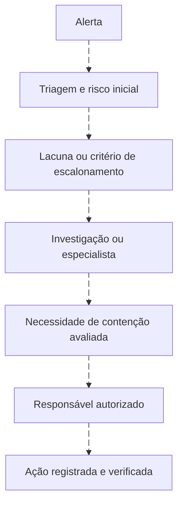

# Estrutura de SOC

<!-- markdownlint-configure-file {"MD033": {"allowed_elements": ["details", "summary"]}} -->

[← Tópico anterior](README.md) · [↑ Índice do módulo](README.md) · [Página principal](../README.md) · [Próximo tópico →](logs.md)

## Por que isso importa

Uma detecção útil pode perder valor se ninguém souber quem atende, quando escalar ou quem autoriza uma ação. Estrutura SOC organiza trabalho, responsabilidade e continuidade. Uma operação pode ser interna, terceirizada, compartilhada ou distribuída; nenhuma dessas formas define sozinha sua qualidade.

## Pessoas, processos, tecnologia, dados e contexto

Pessoas interpretam e decidem. Processos definem critérios, registros e autoridade. Tecnologia coleta e auxilia análise e resposta. Dados representam a atividade observável. Contexto inclui função do ativo, identidade, mudanças e impacto. Uma lacuna em qualquer parte pode comprometer o resultado.

O SOC precisa colaborar com donos de serviço, infraestrutura, rede, identidade e aplicações. Perguntar “essa execução fazia parte da manutenção?” pode ser mais decisivo que repetir uma consulta sem contexto. A confirmação deve ser registrada e confrontada com as evidências disponíveis.

## Funções que podem existir

| Função | Contribuição possível |
| --- | --- |
| Analista | Valida alertas, reúne contexto, documenta e encaminha |
| Investigador | Testa hipóteses, expande escopo e correlaciona evidências |
| Incident responder | Planeja e executa resposta dentro da autoridade definida |
| Detection engineer | Desenvolve, testa, mantém e mede detecções |
| Threat hunter | Procura comportamentos a partir de hipóteses, além da fila de alertas |
| Threat intelligence | Avalia informações sobre ameaças e sua relevância para o contexto |
| Engenharia de segurança | Sustenta integrações, sensores, coleta e controles |
| Gestão | Define prioridades, capacidade, comunicação e responsabilidades |

São funções conceituais, não cargos universais. Uma pessoa pode exercer várias, e uma equipe pode distribuir uma função entre especialistas. Não confunda senioridade com permissão irrestrita para agir.

### L1, L2 e L3

Alguns SOCs usam L1 para triagem inicial, L2 para investigação aprofundada e L3 para especialização ou casos complexos. Outros organizam por domínio, serviço ou equipe sem esses níveis. O que importa é saber quem assume o próximo passo e quais critérios justificam o encaminhamento.

## Escalonamento

Escalar é encaminhar informação e responsabilidade a quem pode decidir ou executar o próximo passo. Pode ocorrer por urgência, impacto, falta de contexto, necessidade técnica ou limite de autoridade. Não precisa esperar uma fila hierárquica completa quando o processo prevê acionamento urgente.

O fluxo não manda conter todo caso. Pode terminar em encerramento justificado, monitoramento ou obtenção de dados. O analista pode recomendar isolamento de um endpoint, mas execução depende de autorização, impacto e procedimento. Autoridade pode ser previamente delegada em um playbook; não é necessário inventar uma nova aprovação para cada ação já autorizada.

## Matriz de responsabilidade

Exemplo didático, a adaptar ao processo real:

| Atividade | Analista | Investigador | Resposta | Gestão |
| --- | --- | --- | --- | --- |
| Triagem | Principal | Apoio | Consulta | Acompanhamento |
| Investigação | Apoio | Principal | Consulta | Acompanhamento |
| Contenção | Consulta | Recomendação | Execução autorizada | Aprovação conforme processo |
| Documentação | Registra sua análise | Consolida evidências | Registra ações | Verifica continuidade |
| Melhoria | Relata lacunas | Sugere testes | Relata impacto | Define responsáveis |

“Principal” não significa trabalhar sozinho. Um caso precisa de responsável identificável, mesmo quando há várias equipes. Transferência só está completa quando o destinatário e o próximo passo estão claros.

## Passagem de turno: preservar o raciocínio

Handoff é a transferência de contexto para quem continuará o trabalho. Uma lista de links e “verificar amanhã” não informa o que foi descoberto, o que falta ou qual risco permanece.

| Informação | O que precisa ficar explícito |
| --- | --- |
| O que aconteceu | Resumo, entidades e janela com fuso |
| O que foi validado | Fatos e referências de evidência |
| O que falta | Lacunas, consultas pendentes e dependências |
| Hipóteses | Explicações possíveis e evidência a favor ou contra |
| Ações | Quem fez, quando, com qual autorização e resultado |
| Risco | Impacto possível e motivo da prioridade |
| Responsável | Pessoa ou função que mantém o caso |
| Próximo passo | Ação concreta, prazo aplicável e gatilho de escalonamento |

Exemplo fictício de nota de passagem de turno

**Caso LAB-005, 15/01/2026, passagem às 10:20 UTC.** Conta `servico.lab`, host `VM-01`, janela 09:00 a 09:15 UTC. A fonte Security contém falhas 4625; a consulta foi comparada ao registro original. Um 4624 posterior foi localizado, mas a relação com a mesma sessão ainda não foi demonstrada.

**Hipóteses:** credencial antiga de aplicação; interação legítima; uso não autorizado. Há repetição temporal, mas isso não discrimina sozinho as hipóteses. Falta o registro da aplicação e a confirmação de mudança pelo responsável fictício pelo laboratório.

**Ações:** apenas consultas de leitura. Nenhum bloqueio ou isolamento realizado. Referências sintéticas E01 e E02 constam no relatório; não representam arquivos reais.

**Risco e continuidade:** prioridade em avaliação por possível dependência de serviço. Responsável de continuidade: função Investigação do exercício. Próximo passo: comparar o histórico da aplicação e validar a chave de correlação. Escalar conforme o processo se aparecerem evidências de uso indevido ou impacto, sem esperar encerrar toda a investigação.

## SLA, SLO e comunicação

SLA costuma representar compromissos de serviço, por vezes contratuais. SLO expressa objetivos mensuráveis de nível de serviço. Definições e relações variam. Tempos de atendimento precisam de critérios de risco, início e fim da contagem, cobertura de horário e responsabilidades, sem números universais inventados.

Registre dependências e pausas conforme o processo. Não altere prioridade apenas para melhorar um indicador. Comunicação deve informar o que se sabe, o que não se sabe, impacto possível e próxima atualização, usando linguagem adequada ao destinatário.

## Playbook e runbook

Um **playbook** pode orientar decisões em um cenário, como falhas de autenticação. Um **runbook** pode detalhar uma tarefa operacional repetível, como consultar a saúde de uma fonte. A nomenclatura não é universal; algumas plataformas usam “playbook” para um fluxo automatizado.

No [playbook de autenticação existente](../playbooks/falhas-autenticacao.md), valide origem, conta, quantidade, janela, sucesso posterior, histórico e criticidade. Documente e escale quando os critérios exigirem. A ordem ajuda a investigar, mas não substitui julgamento nem autorização de resposta.

## Pensamento de analista e mini desafio

Quem é dono do caso? Que informação precisa acompanhar a transferência? Existe autoridade para a ação proposta? O impacto exige urgência? Quem confirma que o próximo turno assumiu? Qual evidência sustenta a classificação atual?

Desenhe um fluxo fictício com entrada, triagem, investigação, responsável autorizado e encerramento. Defina três critérios qualitativos de escalonamento e escreva uma nota de handoff para o cenário 4625. Não estabeleça SLA como padrão universal nem use nomes de pessoas reais.

## Checkpoint

Explique seu raciocínio antes de abrir cada resposta.

**L1, L2 e L3 são obrigatórios em qualquer SOC?**

Ver resposta

Não. São uma forma possível de organizar responsabilidades. O processo real pode distribuir funções de outro modo.

**Escalar significa apenas repassar um link?**

Ver resposta

Não. Inclua contexto, fatos, hipóteses, lacunas, risco, ações e próximo passo, com responsável definido.

**O analista pode isolar qualquer máquina porque recebeu um alerta?**

Ver resposta

Não. A ação exige autoridade operacional, avaliação de impacto e procedimento aplicável, inclusive autorizações já delegadas.

**Uma pessoa pode fazer triagem e engenharia de detecção?**

Ver resposta

Sim. Funções não são cargos universais. É preciso preservar capacidade, revisão e responsabilidade.

**O turno terminou. O caso deixa de ter responsável?**

Ver resposta

Não. A continuidade deve ser explícita, com destinatário e próxima ação. Fim de turno não é encerramento técnico.

**SLA menor garante análise melhor?**

Ver resposta

Não. Prazo precisa ser acompanhado de qualidade, risco, cobertura e critérios de medição.

**Uma confirmação verbal de manutenção encerra qualquer suspeita?**

Ver resposta

Não automaticamente. Registre a confirmação, confira escopo e horário e compare com as evidências observadas.

## Resumo e próximo passo

Com responsabilidades claras, siga para [logs e telemetria](logs.md) e descubra como os sinais chegam à operação.

[← Tópico anterior](README.md) · [↑ Índice do módulo](README.md) · [Página principal](../README.md) · [Próximo tópico →](logs.md)
