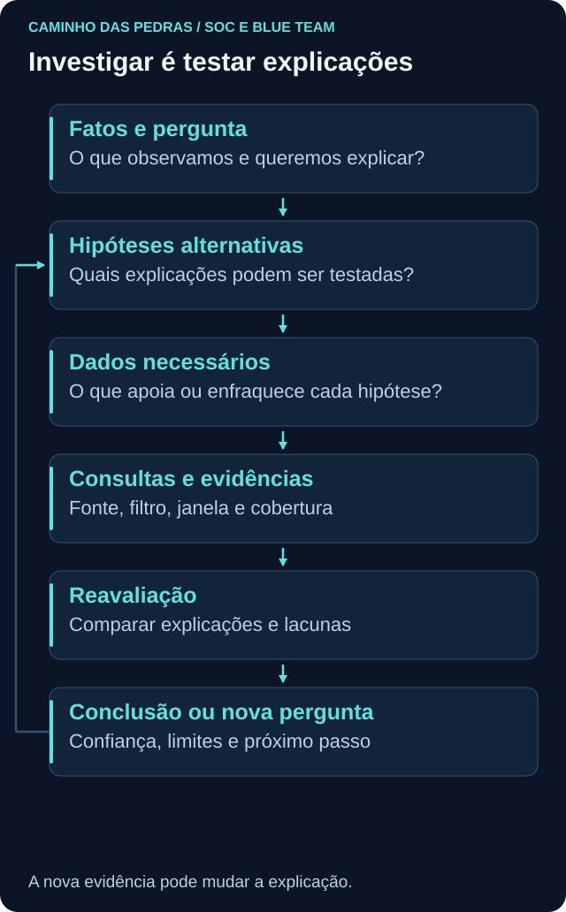
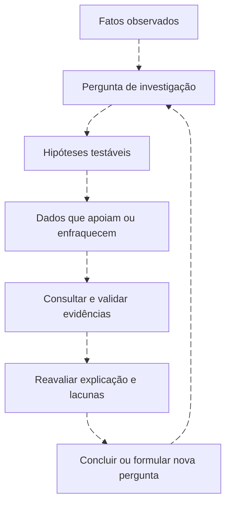
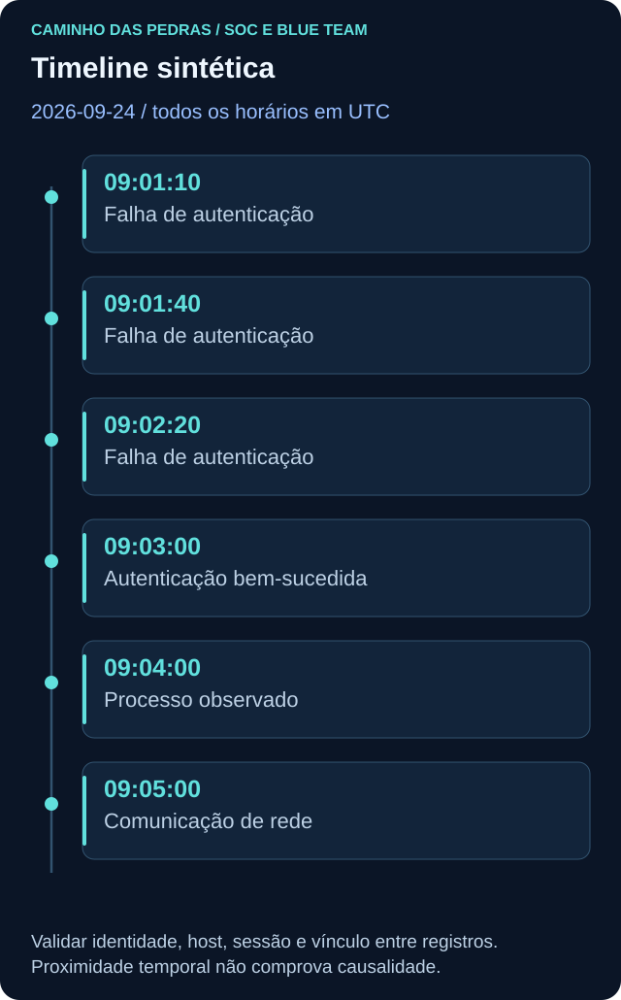

# Investigação: hipóteses, evidências e conclusão

<!-- markdownlint-configure-file {"MD033": {"allowed_elements": ["details", "summary"]}} -->

[← Tópico anterior](triagem.md) · [↑ Índice do módulo](README.md) · [Página principal](../README.md) · [Próximo tópico →](../06-SIEM-na-Pratica/README.md)

## Objetivo

Investigar é responder perguntas por meio de hipóteses testáveis e evidências, atualizando a explicação quando surgem novos dados. Uma ferramenta pode localizar eventos, mas não substitui o raciocínio. A investigação começa com o que foi observado e termina com uma conclusão proporcional ao que foi possível verificar, incluindo limitações e ações pendentes.



## Método que pode ser repetido

1. Defina a pergunta e o escopo inicial: entidade, janela, ambiente e fonte.
2. Registre os fatos disponíveis sem transformar interpretações em observações.
3. Escreva hipóteses alternativas que possam ser testadas.
4. Determine quais dados apoiariam ou enfraqueceriam cada hipótese.
5. Consulte fontes com cobertura compatível, preservando parâmetros e resultados relevantes.
6. Compare explicações, identifique lacunas e ajuste o escopo quando houver motivo.
7. Conclua com confiança qualitativa justificada, ações e limitações.

O método é iterativo. Uma consulta vazia pode levar à verificação de coleta; uma identidade inesperada pode exigir nova pergunta. Não acumule consultas sem dizer o que cada uma pretende resolver.

## Ciclo de investigação



O retorno representa nova pergunta quando necessária. A investigação pode ser encerrada com conclusão documentada quando os critérios do caso forem atendidos. O fluxo não exige investigar indefinidamente nem elimina a necessidade de resposta urgente autorizada em paralelo.

## Exemplo: PowerShell às 14:02

“O registro de criação de processo mostra PowerShell iniciado às 14:02 UTC” é um fato limitado à fonte e ao registro. “O host foi comprometido” é uma conclusão que esse fato isolado não sustenta.

| Hipótese | Dados que podem apoiar | Dados que podem enfraquecer |
| --- | --- | --- |
| Administração autorizada | Mudança compatível, conta esperada, comando e contexto confirmados | Operação fora do escopo aprovado ou identidade inconsistente |
| Aplicação ou tarefa automatizada | Processo pai e tarefa conhecidos, cadência e finalidade verificadas | Pai inesperado ou mudança inexplicada no comportamento |
| Execução não autorizada | Conjunto coerente de ações, identidade e efeitos incompatíveis com o contexto | Evidências verificáveis de finalidade e escopo autorizados |

Uma mudança registrada não inocenta qualquer ação na mesma janela. Uma command line suspeita também precisa ser interpretada no contexto. Use [EDR e XDR](edr-xdr.md) para relembrar árvore, identidade do processo e limites da telemetria.

## Timeline: ordenar antes de explicar

Todos os horários abaixo pertencem a **2026-09-24, em UTC**. O exemplo é sintético e não representa uma ocorrência real.



| Horário UTC | Observação no conjunto fictício | Pergunta aberta |
| --- | --- | --- |
| 09:01:10 | Falha de autenticação para `alan.lab` | Qual origem e tipo de logon? |
| 09:01:40 | Outra falha para `alan.lab` | É a mesma sessão ou mecanismo? |
| 09:02:20 | Nova falha para `alan.lab` | Há outras contas ou duplicatas? |
| 09:03:00 | Autenticação bem-sucedida para `alan.lab` | Existe vínculo verificável com as falhas? |
| 09:04:00 | Processo observado em `LAB-WIN-01` | Qual conta, pai, comando e identificador? |
| 09:05:00 | Registro de comunicação de rede | A fonte permite associar a conexão ao processo? |

Essa sequência ajuda a formular perguntas, mas **correlação não é causalidade**. Não basta dois registros terem o mesmo nome de usuário ou horários próximos. Compare identificadores disponíveis, domínio, host, sessão e limitações das fontes. Use tempo de evento validado; preserve também tempo de ingestão quando necessário para explicar atrasos.

## Pivôs defensivos e controle do escopo

Um pivô é uma consulta orientada por uma entidade encontrada: usuário → hosts → processos → conexões → domínio → outros hosts. É uma trilha possível, não uma obrigação de consultar tudo.

| Pivô | Pergunta | Cuidado |
| --- | --- | --- |
| Usuário para hosts | Onde essa identidade foi observada na janela? | Contas homônimas, domínio e retenção |
| Host para processos | O que foi criado e por qual conta? | Sensor, lacunas, PID reutilizado e identificador persistente |
| Processo para conexões | Quais comunicações estão associadas? | Fonte com vínculo e protocolo coberto |
| Conexão para domínio | Há resolução ou contexto de destino? | IP compartilhado e mudança de resolução |
| Domínio para outros hosts | Outros ativos tiveram atividade relacionada? | Ampliar janela e escopo com justificativa |

Cada ampliação deve registrar motivo, fonte, filtro e janela. Um destino compartilhado não torna todos os seus usuários parte do mesmo caso. Dados pessoais e registros de terceiros devem ficar restritos ao necessário e ao acesso autorizado.

## Evidência positiva e ausência de evidência

Um registro íntegro e contextualizado pode apoiar que determinada atividade foi observada. A ausência de resultado só descreve a consulta e a cobertura disponível. Antes de usá-la para enfraquecer uma hipótese, verifique coleta, auditoria, sensor, atraso, perda, parsing, fuso, filtro e retenção.

“Não encontrei criação de processo na janela pesquisada, mas o sensor estava sem cobertura” é uma limitação, não uma prova de que nada executou. “A fonte estava saudável, cobria o comportamento e a consulta foi validada” torna o resultado negativo mais informativo, sem transformá-lo em certeza universal.

Preserve registros originais sem edição quando possível, e trabalhe em cópias identificadas. Registre origem, momento da coleta, janela, filtros, formato e responsável. Hash pode ajudar a verificar integridade dos bytes de um arquivo, mas não comprova sozinho a veracidade do evento. Armazene evidências em local protegido segundo o processo; não publique logs reais, credenciais, tokens ou dados pessoais no portfólio.

## Como escrever uma conclusão

Use confiança qualitativa com motivo: “A explicação de tarefa autorizada é sustentada por configuração verificada e registros consistentes; a cobertura de rede está incompleta.” Evite percentuais inventados e expressões como “100% seguro”. Se os dados não distinguirem hipóteses, registre resultado inconclusivo e o que falta para avançar.

Uma conclusão útil responde à pergunta inicial, separa o que foi observado do que foi inferido, delimita entidades e período e aponta ações, responsáveis e acompanhamento. Contenção e correção seguem autoridade e impacto avaliados; uma investigação didática não exige executar resposta em ambiente real.

## Modelo reutilizável de caso

Copie para uma nota privada apropriada ou use somente dados sintéticos no portfólio.

```text
Título e identificador:
Data e analista responsável:
Fontes e estado de cobertura:
Entidades e escopo temporal com fuso:
Resumo da pergunta e do alerta inicial:
Fatos observados:
Timeline com referência aos registros:
Hipóteses e critérios para apoiar ou enfraquecer:
Consultas, filtros, parâmetros e resultados relevantes:
Evidências preservadas e localização autorizada:
Conclusão e confiança qualitativa justificada:
Ações realizadas, autoridade e resultado:
Limitações e hipóteses não resolvidas:
Próximos passos, responsável e prazo do processo:
```

No handoff, destaque situação atual, prioridade, pergunta pendente e ação esperada. Não force o próximo analista a reconstruir tudo a partir de prints soltos. O modelo de [estrutura SOC](estrutura-soc.md) complementa essa passagem de responsabilidade.

## Mini desafio

Use a timeline sintética desta página. Produza um caso com duas hipóteses, três consultas descritas em linguagem natural, uma tabela de fatos e inferências, duas lacunas de cobertura e conclusão proporcional. Inclua um pivô justificado e um exemplo de ampliação que você não faria sem evidência adicional. Nenhum evento precisa ser gerado.

<details>
<summary>Exemplo de conclusão e próximo passo</summary>

“Foram descritas falhas e um sucesso de autenticação, seguidos por registros de processo e rede na mesma janela. Ainda não há identificadores suficientes para vincular as atividades. As hipóteses de operação autorizada e uso não autorizado permanecem abertas. Vou validar conta, host, sessão, processo e cobertura de rede, além de consultar o contexto operacional. Não há base para declarar comprometimento ou encerrar como falso positivo apenas pela sequência temporal.”

</details>

## Checkpoint

Explique seu raciocínio antes de abrir cada resposta.

**O que torna uma hipótese testável?**

<details>
<summary>Ver resposta</summary>

Ela descreve uma explicação para a qual podemos indicar dados observáveis que a apoiariam ou enfraqueceriam.

</details>

**PowerShell às 14:02 comprova atividade maliciosa?**

<details>
<summary>Ver resposta</summary>

Não. O registro sustenta a observação de criação de processo nos limites da fonte; finalidade e efeitos exigem contexto.

</details>

**Qual é a função da timeline?**

<details>
<summary>Ver resposta</summary>

Ordenar observações, mostrar lacunas e orientar perguntas. A ordem temporal sozinha não comprova causalidade.

</details>

**O que deve acompanhar um pivô?**

<details>
<summary>Ver resposta</summary>

Pergunta, entidade e identificadores, fonte, janela, filtro e motivo para ampliar ou manter o escopo.

</details>

**Consulta vazia prova ausência de atividade?**

<details>
<summary>Ver resposta</summary>

Não. É necessário avaliar cobertura, qualidade, tempo, retenção e correção da consulta.

</details>

**Como comunicar confiança sem inventar uma porcentagem?**

<details>
<summary>Ver resposta</summary>

Use uma avaliação qualitativa com evidências de suporte, alternativas e limitações explicitadas.

</details>

**Quando uma conclusão inconclusiva é adequada?**

<details>
<summary>Ver resposta</summary>

Quando os dados disponíveis não distinguem as hipóteses relevantes. Registre o que falta e quem deve acompanhar o próximo passo.

</details>

## Resumo e próximo passo

Investigar é testar explicações e registrar limites. No [Módulo 06, SIEM na Prática](../06-SIEM-na-Pratica/README.md), aplique essas perguntas à coleta, pesquisa, regras e investigação em Wazuh, Splunk, QRadar e Sentinel.

[← Tópico anterior](triagem.md) · [↑ Índice do módulo](README.md) · [Página principal](../README.md) · [Próximo tópico →](../06-SIEM-na-Pratica/README.md)
