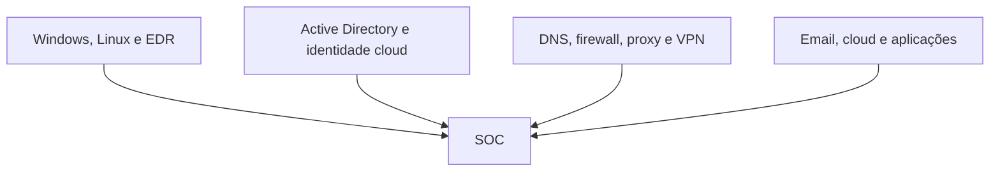
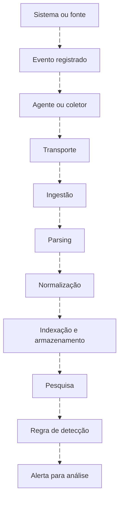
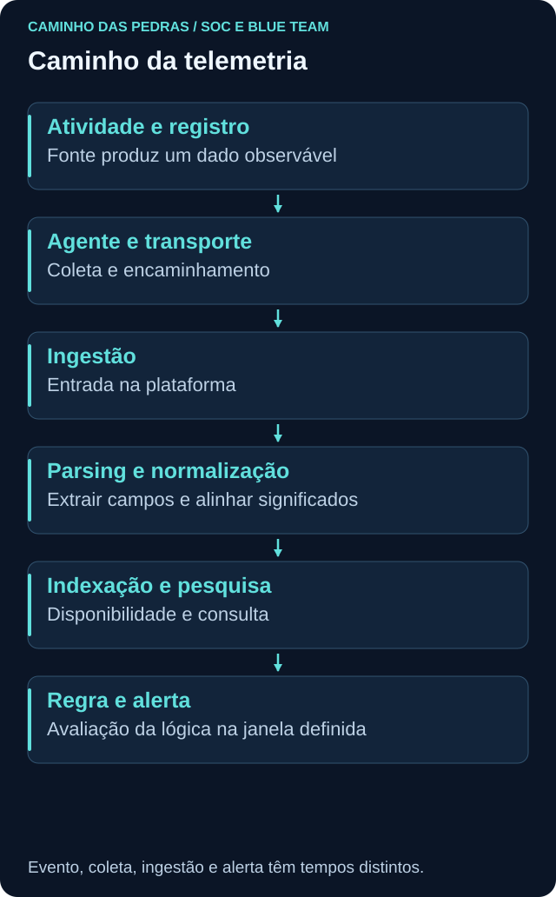

# Logs e telemetria

<!-- markdownlint-configure-file {"MD033": {"allowed_elements": ["details", "summary"]}} -->

[← Tópico anterior](estrutura-soc.md) · [↑ Índice do módulo](README.md) · [Página principal](../README.md) · [Próximo tópico →](siem.md)

## Por que isso importa

Um analista só consegue consultar o que está disponível, e um campo pode representar algo diferente do que seu nome sugere. Antes de escrever uma regra, entenda origem, cobertura, transformação, tempo e acesso aos dados.

**Logs são registros. Telemetria é mais ampla:** pode incluir logs, eventos registrados, métricas e sinais sobre atividades, conexões, processos, endpoint e identidade. A atividade real e sua representação observada não são a mesma coisa. Nenhuma fonte registra tudo.

## Mapa de fontes



Esse mapa estrutural não tem animação: representa categorias, não uma sequência. Cada fonte responde perguntas diferentes, e a cobertura depende de versão, configuração, permissões e integração.

| Categoria | Fontes possíveis | Pergunta que ajudam a responder |
| --- | --- | --- |
| Endpoint | Windows Event Logs, Sysmon, Linux logs, EDR | Quem autenticou, qual processo executou ou que atividade o sensor observou? |
| Identidade | Active Directory, Entra ID ou equivalentes, autenticação e MFA | Qual identidade autenticou, por qual mecanismo e de onde quando informado? |
| Rede | Firewall, DNS, proxy, VPN, IDS e IPS | Qual comunicação foi permitida, nome consultado ou condição detectada? |
| Cloud | Activity logs, audit logs, control plane e workloads | Qual ação administrativa ou acesso a dados foi registrado? |
| Aplicações | Web, banco de dados, SaaS e email | Que operação foi solicitada e qual resultado a aplicação conhece? |

DNS pode registrar um nome consultado, sem provar navegação concluída. Firewall pode registrar tentativa, negação ou fluxo permitido, sem mostrar todo o conteúdo. Proxy pode informar recurso web conforme visibilidade. Sysmon pode relacionar pai e filho, enquanto um log de aplicação explica o resultado funcional. Não use uma fonte como substituta automática de outra.

## Pipeline de logs





A ordem é didática. Algumas arquiteturas fazem parsing ou normalização na consulta; outras detectam antes da indexação. Coleta pode ocorrer por agente, API, encaminhamento ou integração. Transporte entrega dados, mas precisa de controles e monitoramento próprios. Ingestão é entrada na plataforma, não prova de que todos os campos estão corretos.

## Timestamp: qual relógio estamos olhando?

| Momento | Exemplo sintético em 15/01/2026, UTC | Significado |
| --- | --- | --- |
| Evento | 10:00 | Horário que a fonte atribui à ocorrência |
| Coleta | 10:01 | Momento em que o coletor obtém o registro |
| Ingestão | 10:03 | Entrada na plataforma, conforme a definição do campo |
| Alerta | 10:04 | Execução da lógica ou criação do alerta |

Esses campos nem sempre existem separadamente. Confirme a semântica de cada timestamp, sua precisão e origem. Não invente tempo de coleta porque só há evento e ingestão. O atraso pode decorrer de lote, rede, fila, indisponibilidade ou processamento.

**UTC** é uma referência comum. `2026-01-15T10:00:00Z` equivale a `2026-01-15T07:00:00-03:00`. O sufixo e o offset importam: uma interface pode mostrar hora local enquanto a exportação usa UTC. Guarde data completa, fuso e valor original quando relevante. Não subtraia três horas de qualquer log por hábito.

Sincronização de relógio reduz divergências, mas deve ser verificada. Um relógio adiantado pode fazer o evento parecer posterior à ingestão. Ordenar por chegada não reconstrói necessariamente a ordem de ocorrência. Para eventos simultâneos ou com baixa precisão, não invente sequência causal.

## Parsing: extrair campos sem inventar significado

Exemplo **sintético** com endereços reservados para documentação:

```text
src_ip=192.0.2.10 dst_ip=198.51.100.20 dst_port=443 user=alan.lab
```

O parser reconhece a estrutura e extrai campos e tipos: origem, destino, porta e usuário. Nomes reais variam por fonte. Confirme se o endereço é cliente original, proxy ou dispositivo que registrou o evento. Um campo extraído como texto pode exigir tratamento para comparação numérica ou temporal.

Não conclua que a porta 443 torna a atividade segura. O número não prova protocolo real, legitimidade ou resultado da aplicação.

## Normalização: comparar com semântica preservada

| Nome na origem | Campo comum ilustrativo | Cuidado |
| --- | --- | --- |
| `src_ip` | `source.ip` | Confirmar o que a fonte chama de origem |
| `SourceIP` | `source.ip` | Distinguir cliente, NAT e proxy |
| `user` | `user.name` | Preservar autoridade, domínio e função do campo |

Normalização tenta oferecer um modelo consistente. Não é garantido que todo SIEM normalize todas as fontes automaticamente. Pode haver mapeamento explícito, pacote de integração ou parser próprio. Preserve acesso à representação original conforme política, porque a transformação pode perder detalhe.

No 4720, confundir `SubjectUserName` com `TargetUserName` troca quem criou pela conta criada. Um schema comum não deve apagar essa diferença. No 4625, a conta alvo não é automaticamente uma identidade autenticada. Compare com [Event Viewer](../03-Linux-e-Windows/event-viewer.md).

## Regra boa com dado ruim continua sendo problema

| Problema | Consequência | O que verificar |
| --- | --- | --- |
| Campo ausente ou usuário vazio | Correlação incompleta | Registro original, cenário e parser |
| Timestamp incorreto | Ordem e janela erradas | Fuso, relógio e tipo do campo |
| Hostname inconsistente | Um ativo parece vários | Identificador estável e inventário |
| Parser quebrado | Ator, alvo ou resultado interpretados mal | Amostras antes/depois da transformação |
| Atraso de ingestão | Regra perde janela ou alerta tarde | Latência, filas e execução da regra |
| Perda de evento | Histórico incompleto | Fonte, transporte, limites e retenção |
| Duplicação | Contagem e limiar inflados | Identificador do registro e caminhos de coleta |

Uma regra pode executar sem erro de sintaxe e ainda produzir uma narrativa errada. Verifique amostras, taxas de preenchimento, chegada recente e mudanças de esquema. Agente online não comprova todos os canais sendo coletados.

## Cobertura e retenção

> Ausência de log não prova ausência de atividade.

Considere auditoria não habilitada, sensor offline, erro de coleta, filtro, retenção vencida, parser incorreto, problema de ingestão, permissão de consulta ou janela errada. Um evento pode existir no host e faltar no destino. Também pode ter chegado com nome diferente do esperado.

Documente o que a fonte podia observar naquele período. Retenção preserva dados por um prazo conforme política e arquitetura; pesquisar apenas dados recentes pode ocultar um registro ainda disponível em outra camada. Fonte sem cobertura reduz a confiança de uma conclusão negativa.

## Prática e pensamento de analista

Escolha uma atividade benigna, como autenticação manual de laboratório ou criação de processo já documentada. Liste quais fontes poderiam observá-la e qual pergunta cada uma responderia. Se tiver um SIEM preparado, compare um registro local e sua cópia; caso contrário, faça o mapeamento com exemplos sintéticos.

Compare provider, canal, ID, host, horário, identidade, resultado e referência do registro. Distinga campos originais e normalizados. Registre origem, coletor, destino, atraso conhecido e lacunas. Não mude auditoria nem execute ações apenas para gerar volume neste exercício.

<details>
<summary>O que eu verificaria primeiro se uma consulta vier vazia?</summary>

Confirmaria acesso, fonte, janela e fuso. Depois verificaria se a atividade deveria produzir aquele evento, se o registro existe na origem, se foi coletado e como foi indexado. Só então interpretaria a ausência no contexto da hipótese.

</details>

## Mini desafio

Entregue uma tabela com **atividade, fonte, pergunta, campos, timestamp, transformação e limite**. Acrescente um exemplo em que duas fontes contam partes diferentes da mesma história e um erro de parsing que mudaria a conclusão. Use apenas material fictício ou laboratório próprio, sem publicar eventos brutos sensíveis.

## Checkpoint

Explique seu raciocínio antes de abrir cada resposta.

**Log e telemetria são sinônimos exatos?**

<details>
<summary>Ver resposta</summary>

Não. Log é registro; telemetria inclui registros e outros sinais, como métricas e observações de endpoint.

</details>

**Um evento chegou às 10:03. A atividade ocorreu às 10:03?**

<details>
<summary>Ver resposta</summary>

Não necessariamente. Compare tempo de ocorrência, coleta e ingestão conforme os campos realmente disponíveis.

</details>

**Normalizar é apenas renomear qualquer campo de usuário?**

<details>
<summary>Ver resposta</summary>

Não. É necessário preservar semântica, como ator versus alvo e autoridade da conta.

</details>

**O sensor está online. Toda atividade está registrada?**

<details>
<summary>Ver resposta</summary>

Não. Configuração, filtros, cobertura, transporte e retenção ainda podem limitar os dados.

</details>

**Duas linhas iguais sempre representam duas atividades?**

<details>
<summary>Ver resposta</summary>

Não. Pode haver duplicação na coleta. Verifique identificadores e caminhos antes de contar.

</details>

**Um registro de DNS prova visita ao site?**

<details>
<summary>Ver resposta</summary>

Não. Ele pode sustentar uma consulta de nome, mas não confirma conexão nem resultado da aplicação.

</details>

**Que conclusão cabe quando a fonte não cobria o período?**

<details>
<summary>Ver resposta</summary>

Declare que os dados não permitem confirmar ou excluir a atividade por essa fonte. Busque alternativas e registre a limitação.

</details>

## Resumo e próximo passo

Com origem e qualidade compreendidas, avance para [SIEM](siem.md), onde os dados sustentam pesquisa e detecção.

[← Tópico anterior](estrutura-soc.md) · [↑ Índice do módulo](README.md) · [Página principal](../README.md) · [Próximo tópico →](siem.md)
