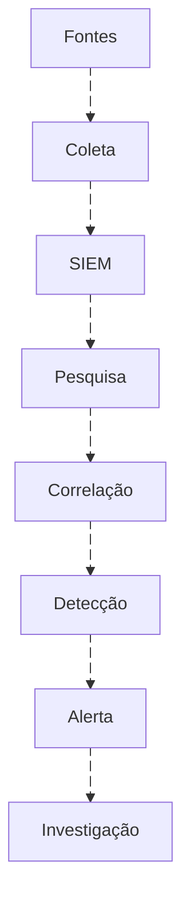
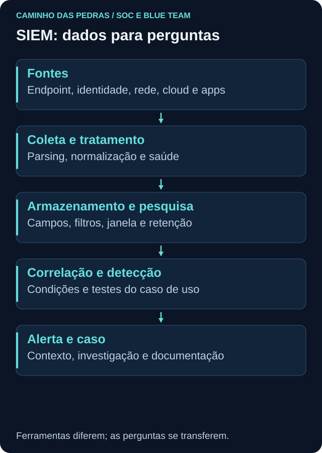

# SIEM

<!-- markdownlint-configure-file {"MD033": {"allowed_elements": ["details", "summary"]}} -->

[← Tópico anterior](logs.md) · [↑ Índice do módulo](README.md) · [Página principal](../README.md) · [Próximo tópico →](edr-xdr.md)

> Primeiro entenda SIEM. Depois aprenda a plataforma.

## Por que isso importa

Security Information and Event Management reúne capacidades para centralizar, armazenar, pesquisar e correlacionar eventos, apoiar detecção, alertas e investigação. Dashboards e gestão de casos podem fazer parte da solução, conforme produto e arquitetura. O SIEM não conhece automaticamente o valor de cada ativo nem reconstrói um evento que nunca foi registrado.

## Da fonte ao caso





O fluxo descreve capacidades, não uma sequência obrigatória de cliques. Regras podem executar automaticamente e pesquisas podem ocorrer antes ou depois do alerta. Correlação relaciona dados por entidades, tempo e condições; proximidade temporal sozinha não estabelece causalidade.

## Cinco exemplos de plataformas, sem ranking

### Elasticsearch e Elastic Stack

Elasticsearch organiza dados em **documentos**, compostos por **campos**, armazenados e pesquisados em **índices** e outras estruturas conforme a arquitetura. Uma consulta pode buscar documentos, filtrar por campo e período, agregar contagens por entidade e analisar mudanças no tempo.

Por exemplo, a pergunta “quais contas tiveram falhas na janela?” exige campos de identidade, resultado e timestamp. Filtros selecionam registros; agregações resumem o conjunto. O resumo precisa de caminho de volta aos eventos que o sustentam. Elasticsearch pode integrar arquiteturas de análise e segurança, mas um mecanismo de busca isolado não define toda uma operação SIEM. Elastic Stack e recursos de Elastic Security acrescentam componentes conforme implantação. Veja [busca e filtros](https://www.elastic.co/docs/explore-analyze/query-filter).

### Microsoft Sentinel

No contexto dos próximos labs, Log Analytics oferece workspace e tabelas para dados consultados por KQL. Analytics rules aplicam lógica de detecção e podem produzir alertas e agrupamentos chamados incidents. A existência desse objeto não confirma automaticamente um incidente de segurança.

Conectores, schema, permissões e retenção precisam ser verificados antes de copiar uma query. O [módulo 06](../06-SIEM-na-Pratica/README.md) compara essa aplicação com outras plataformas; consulte a [visão oficial](https://learn.microsoft.com/en-us/azure/sentinel/overview) para capacidades e terminologia atuais.

### Splunk

Splunk ingere dados e organiza eventos em indexes conforme configuração. Search e SPL permitem filtrar, transformar e correlacionar resultados. Dashboards e alerts apresentam ou acionam condições; soluções de segurança acrescentam capacidades específicas.

Pesquisar o index errado ou sem a fonte relevante pode retornar vazio mesmo quando a atividade ocorreu. O papel de um campo também depende de extração e modelo de dados. Consulte a [documentação sobre busca em indexes](https://help.splunk.com/?resourceId=Splunk_Search_Searchindexes).

### IBM QRadar

QRadar trabalha com events e flows, entre outros dados. Regras podem correlacionar condições e gerar offenses, que organizam informações para análise. Um flow descreve características de comunicação e não equivale necessariamente a uma captura completa de pacotes.

AQL, Ariel Query Language, apoia pesquisas nos dados correspondentes. A classificação de uma offense requer contexto, assim como um alerta em outra plataforma. Veja [events e flows](https://www.ibm.com/docs/en/qsip/7.5.0?topic=overview-qradar-events-flows) e [pesquisas com AQL](https://www.ibm.com/docs/en/qradar-on-cloud?topic=siem-event-flow-searches).

### Wazuh

Wazuh é uma opção útil de laboratório para estudar agentes, eventos, decoders, regras, alertas e monitoramento. Na arquitetura documentada, agente, servidor, indexador e dashboard têm funções distintas. Isso permite acompanhar como o dado é obtido, analisado e apresentado.

É necessário dimensionar recursos, entender a configuração e verificar o que chega ao indexador. A utilidade didática não significa substituir automaticamente qualquer SIEM corporativo nem torna instalações diferentes equivalentes. Consulte a [arquitetura oficial](https://documentation.wazuh.com/current/getting-started/architecture.html) antes de um futuro laboratório.

## Raciocínio acima da sintaxe

```text
Pergunta → fonte necessária → campos → filtro
         → correlação → contexto → conclusão
```

KQL, SPL, AQL e consultas no Elastic têm sintaxes e modelos diferentes. O raciocínio é transferível; as queries não são intercambiáveis. Defina a pergunta antes do operador. Confira significado do campo, tipo, valor ausente, janela, timezone e duplicações.

Uma busca ampla pode descobrir entidades; a próxima consulta deve ser mais específica. Preserve filtros e intervalo no relatório para que outra pessoa reproduza a análise. Resultado sem a consulta e o contexto é difícil de auditar.

## Caso de uso: criação de usuário

**Objetivo didático:** identificar criações de contas e conferir se correspondem ao processo autorizado. Não classificar automaticamente cada criação como ataque.

| Etapa | Decisão |
| --- | --- |
| Fonte | Windows Security, provider Microsoft-Windows-Security-Auditing |
| Evento | 4720, conforme auditoria de gerenciamento de contas |
| Entidades | Ator em Subject, conta criada em Target, autoridade e host |
| Tempo | Ocorrência, janela de busca e atraso de ingestão quando disponível |
| Lógica | Selecionar criação, preservar contexto e relacionar à mudança aprovada |
| Contexto | Conta local ou domínio, função do ativo, responsável e justificativa |
| Verificação | Comparar amostra original, campos extraídos e resultado da consulta |

Conta local exige a fonte da máquina que processa a criação; no domínio, o DC correspondente é relevante. Grupos e uso posterior precisam de outras evidências, não são conclusões garantidas pelo 4720. Veja o [Lab 02](../12-Labs-Praticos/02-EventID-4720/README.md).

<details>
<summary>Contrato de dados mínimo para o caso de uso</summary>

Documente provider, canal, Event ID, computador, timestamp com fuso, identificador do registro no seu escopo, ator e conta alvo com sua autoridade. Defina quais campos são obrigatórios, o que fazer com campos vazios e como detectar falha de extração.

O teste deve localizar uma criação benigna já autorizada no laboratório e não selecionar um evento de tipo diferente. A chegada, a interpretação e o alerta são verificações separadas. Não declare a integração concluída apenas porque o conector aparece instalado.

</details>

## Custo, volume e retenção

Ingerir tudo pode ampliar cobertura, mas também custo, ruído, requisitos de armazenamento, acesso e esforço de análise. Selecione fontes pelo caso de uso, investigação e obrigações aplicáveis. Evite eliminar dado necessário apenas porque ainda não existe uma regra pronta.

Retenção é o período de guarda conforme política e arquitetura. **Hot data** costuma designar dados prontamente pesquisáveis; históricos podem ter outra camada, custo e tempo de recuperação. Os nomes variam. Dado guardado não é necessariamente imediatamente disponível para toda regra.

Defina quanto tempo de histórico a pergunta exige, quem pode consultá-lo e como recuperá-lo. Registre também o limite: uma regra de janela recente não cobre automaticamente ocorrências antigas ou eventos atrasados.

## Tuning com evidência

O ajuste deve começar pela causa: erro de parser, entidade mal normalizada, condição pouco específica ou comportamento legítimo conhecido. Reduzir alertas sem testar cobertura pode ocultar o próprio comportamento desejado.

Mantenha versão da regra, objetivo, amostra sintética de teste, resultado esperado, exceções restritas e critério de revisão. Casos falsos positivos e casos relevantes ajudam a testar o ajuste. O aprofundamento está em [Detection Engineering](../08-Detection-Engineering/README.md).

## Pensamento de analista e mini desafio

Qual pergunta quero responder? A fonte registra isso? Os campos necessários estão presentes? O tempo está correto? A correlação mistura contas ou hosts? A consulta vazia é resultado investigativo ou falha de cobertura?

Escolha o caso 4720 e entregue objetivo, fonte, campos, lógica em linguagem natural, contexto, teste e limitações. Acrescente como verificar chegada e saúde da fonte. Não precisa instalar SIEM ou contratar cloud: um contrato de dados sintético bem definido já demonstra entendimento.

## Checkpoint

Explique seu raciocínio antes de abrir cada resposta.

**Ingerir mais dados sempre melhora a detecção?**

<details>
<summary>Ver resposta</summary>

Não. Cobertura relevante, qualidade, custo e capacidade de análise importam. Volume sem propósito pode dificultar a operação.

</details>

**Índice com eventos significa que o parser está correto?**

<details>
<summary>Ver resposta</summary>

Não. Compare registros originais e campos interpretados, incluindo ator, alvo e tempo.

</details>

**A mesma query funciona em qualquer SIEM?**

<details>
<summary>Ver resposta</summary>

Não. Linguagem, schema e semântica variam. A pergunta e o método podem ser transferidos, a sintaxe precisa ser adaptada.

</details>

**Uma correlação temporal prova causa?**

<details>
<summary>Ver resposta</summary>

Não. Verifique identidade, host, sessão, processo e outras relações. Proximidade no tempo é apenas parte da evidência.

</details>

**4720 confirma que a conta virou administradora?**

<details>
<summary>Ver resposta</summary>

Não. Ele registra criação de conta. Associação a grupos e uso posterior exigem evidências adicionais.

</details>

**Dados históricos guardados estão sempre disponíveis para regras em tempo real?**

<details>
<summary>Ver resposta</summary>

Não. Camada, recuperação, permissões e arquitetura podem impor limites. Documente o que cada regra consulta.

</details>

**Qual teste falta depois de instalar um conector?**

<details>
<summary>Ver resposta</summary>

Verificar chegada de um evento esperado, seus campos e horário, pesquisa, eventual regra e saúde contínua da coleta.

</details>

## Resumo e próximo passo

SIEM reúne perspectivas de várias fontes. Em [EDR e XDR](edr-xdr.md), aprofunde a visibilidade do endpoint e a correlação entre domínios.

[← Tópico anterior](logs.md) · [↑ Índice do módulo](README.md) · [Página principal](../README.md) · [Próximo tópico →](edr-xdr.md)
