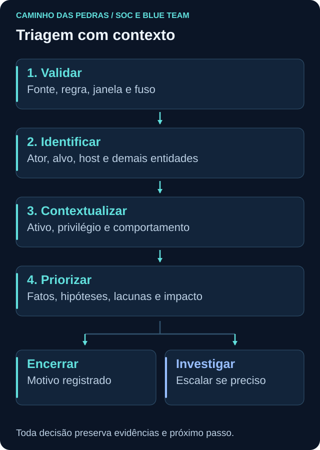
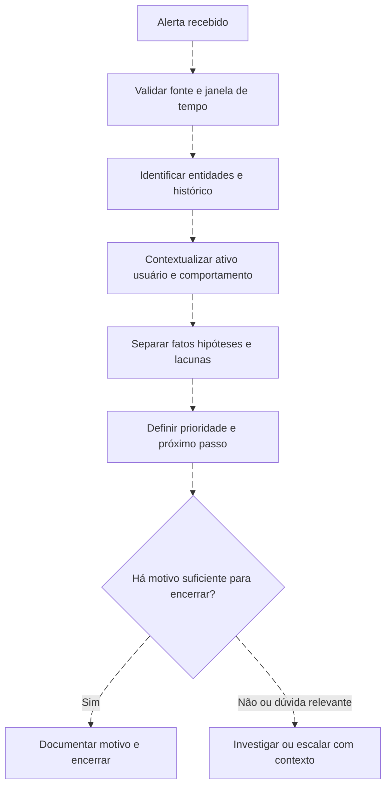

# Triagem: contexto para decidir

<!-- markdownlint-configure-file {"MD033": {"allowed_elements": ["details", "summary"]}} -->

[← Tópico anterior](edr-xdr.md) · [↑ Índice do módulo](README.md) · [Página principal](../README.md) · [Próximo tópico →](investigacao.md)

## Objetivo

Triagem é a avaliação inicial que confirma o significado do alerta, reúne contexto suficiente e define prioridade e próximo passo. Não exige descobrir toda a história nem permite concluir comprometimento apenas porque uma regra disparou. A decisão pode ser encerrar com justificativa, solicitar contexto, acompanhar ou iniciar investigação e escalar conforme o processo.

## As primeiras perguntas

| Pergunta | O que registrar | Por que importa |
| --- | --- | --- |
| O que aconteceu? | Regra, objetivo, comportamento e registros de suporte | O título pode resumir demais |
| Quem aparece? | Ator, conta alvo e tipo de identidade | Uma conta não identifica automaticamente uma pessoa |
| Onde? | Host, serviço, aplicação e domínio de identidade | Define função, alcance e dependências |
| Quando? | Janela, fuso e tempos de evento e ingestão | Evita correlacionar registros incompatíveis |
| Como? | Processo, autenticação, protocolo ou operação registrada | Distingue mecanismo observado de explicação |
| Por que importa? | Ativo, privilégio, exposição e impacto possível | Orienta prioridade e escalonamento |

**Entidades** são os elementos que podem conectar registros: usuário, host, IP, domínio, processo, arquivo, aplicação, mailbox e workload. Um IP pode ser compartilhado; um hostname pode mudar; um nome de conta pode existir em domínios diferentes. Preserve identificadores e contexto antes de unir resultados.

## Fluxo de triagem

Consultar histórico ajuda a formular perguntas, mas “já aconteceu antes” não prova benignidade. Um encerramento anterior pode ter dados insuficientes, escopo diferente ou um erro. Reveja sua justificativa.

## Fato, hipótese e próximo teste

Cenário inteiramente fictício: uma regra encontrou 15 registros 4625 associados a `alan.lab` no host `LAB-WIN-01` em cinco minutos. Os campos originais precisam confirmar conta, origem e janela; contagens podem incluir duplicatas.

| Categoria | Registro adequado |
| --- | --- |
| Fato observado | A consulta retornou 15 registros 4625 na janela e no conjunto pesquisado |
| Hipótese | Um aplicativo pode estar repetindo credenciais antigas |
| Hipótese alternativa | Uma pessoa pode estar digitando uma senha incorreta |
| Outra hipótese | Pode existir tentativa não autorizada contra a conta |
| Teste seguinte | Verificar campos de origem, tipo de logon, cadência, outras contas e contexto de mudança |
| Consulta complementar | Procurar 4624 relacionado, validando host, identidade, tempo e tipo de logon |
| Limite | Um sucesso posterior não comprova ataque nem inocenta toda a atividade anterior |

Não escreva “força bruta confirmada” com base apenas na contagem. O objetivo da regra pode ser detectar repetição de falhas, e esse objetivo pode ter sido atendido mesmo quando a causa é operacional. **Detecção tecnicamente correta, atividade maliciosa e atividade autorizada são avaliações diferentes.** Use as categorias de encerramento definidas no processo e registre o motivo, evitando chamar todo alerta fechado de falso positivo.

## Três situações com 4625

| Situação sintética | O que poderia apoiar a explicação | O que ainda precisa ser verificado |
| --- | --- | --- |
| Senha esquecida | Poucas tentativas interativas e confirmação contextual | Identidade, host, tipo de logon e ausência de outros sinais dentro da cobertura |
| Aplicativo com credencial antiga | Cadência regular após mudança de senha | Serviço responsável, origem e correção confirmada |
| Várias contas a partir de uma origem | Distribuição entre identidades e padrão temporal | NAT, automação legítima, tipo de autenticação e relação entre tentativas |

Essas são hipóteses, não assinaturas conclusivas. IP ausente em certos eventos não invalida toda a análise e não autoriza inventar a origem. O [Lab 01 de falha de autenticação](../12-Labs-Praticos/01-EventID-4625/README.md) permite observar um evento benigno e seus campos em ambiente próprio, sem simular ataques.

## Severidade e prioridade

Severidade descreve gravidade segundo critérios da detecção ou do processo. Prioridade organiza a ordem e urgência do atendimento com contexto. Um alerta de severidade moderada em identidade privilegiada e ativo essencial pode exigir atenção antes de outro com rótulo alto em uma simulação conhecida.

Pergunte: qual ativo e dependência estão envolvidos? A conta é privilegiada? Há atividade em andamento? O alcance está crescendo? Qual impacto é plausível? A fonte é confiável e atual? Existe mudança autorizada? Quem pode confirmar o contexto? Qual é o prazo previsto no processo? Não invente uma pontuação universal nem rebaixe prioridade só porque faltam dados.

## Checklist reutilizável

Use este roteiro em uma nota ou na Issue individual do módulo. Marcar uma caixa só faz sentido quando há uma anotação correspondente.

- [ ] Registrar identificador do alerta e objetivo da regra.
- [ ] Confirmar janela, fuso, fonte e qualidade dos dados.
- [ ] Separar ator, alvo e demais entidades relevantes.
- [ ] Consultar contexto do ativo, usuário e mudanças.
- [ ] Distinguir fatos, hipóteses e lacunas.
- [ ] Justificar prioridade e próximo passo.
- [ ] Registrar responsável, evidências e motivo de encerramento ou escalonamento.

## Mini desafio

Receba os 15 registros fictícios do exemplo como uma descrição, sem gerar tentativas reais. Escreva três fatos possíveis de conferir, três hipóteses e três lacunas. Escolha duas consultas complementares e explique qual hipótese cada uma pode apoiar ou enfraquecer. Termine com prioridade justificada e uma decisão inicial que respeite as incertezas.

Exemplo de decisão proporcional

“Há repetição de falhas no conjunto consultado. Ainda não confirmei a origem nem a função da conta. Vou validar os campos, consultar autenticações relacionadas e obter contexto de mudança. O caso permanece em triagem com responsável definido; não há evidência suficiente para afirmar comprometimento.” Se surgirem indícios de impacto relevante, a prioridade e o escalonamento devem ser reavaliados imediatamente conforme o processo.

## Checkpoint

Explique seu raciocínio antes de abrir cada resposta.

**Qual é a principal entrega da triagem?**

Ver resposta

Uma decisão inicial justificada, com contexto, prioridade, responsável e próximo passo.

**Quinze eventos 4625 confirmam ataque?**

Ver resposta

Não. Confirmam o resultado da consulta quando fonte e contagem foram validadas. A causa exige contexto e testes.

**Qual é a diferença entre ator e alvo?**

Ver resposta

Ator é a identidade ou componente que realizou a operação registrada; alvo é a entidade afetada. Nem todo evento disponibiliza ambos claramente.

**Um 4624 posterior encerra a análise?**

Ver resposta

Não. É preciso validar a relação entre identidades, hosts, origem, tempo e tipo de logon. Proximidade temporal não comprova vínculo causal.

**Todo alerta encerrado foi falso positivo?**

Ver resposta

Não. Pode ser detecção correta de atividade autorizada, duplicata, caso já tratado ou outra categoria prevista no processo.

**Prioridade é apenas o rótulo da regra?**

Ver resposta

Não. Considera gravidade, ativo, identidade, alcance, urgência, confiança e impacto possível.

**Quando escalar com dados incompletos?**

Ver resposta

Quando risco, impacto, urgência ou autoridade necessária exigirem. Declare lacunas e não espere certeza absoluta para comunicar um caso relevante.

## Resumo e próximo passo

Triagem organiza a primeira decisão. A [investigação](investigacao.md) testa explicações, amplia o escopo de forma justificada e produz uma conclusão rastreável.

[← Tópico anterior](edr-xdr.md) · [↑ Índice do módulo](README.md) · [Página principal](../README.md) · [Próximo tópico →](investigacao.md)
