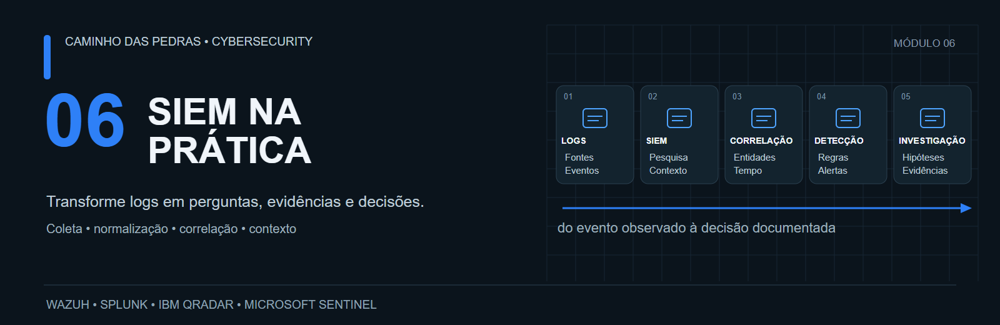
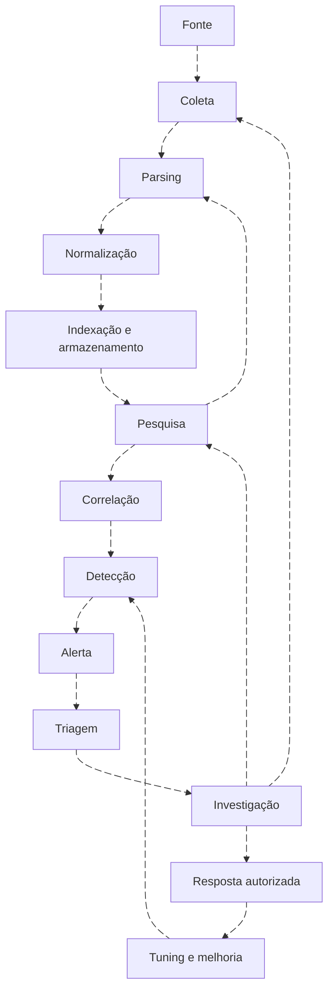
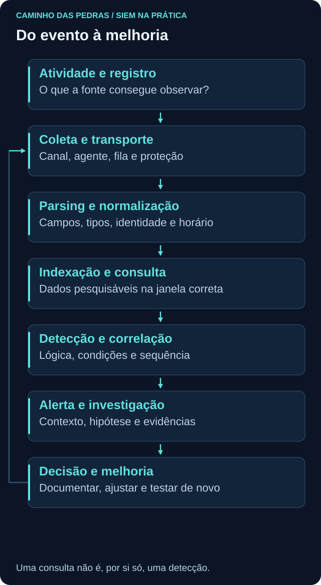

# 06 SIEM na Prática

<!-- markdownlint-configure-file {"MD033": {"allowed_elements": ["details", "summary"]}} -->

[← Tópico anterior](../05-SOC-Blue-Team/README.md) · [↑ Índice do módulo](README.md) · [Página principal](../README.md) · [Próximo tópico →](o-que-e-siem.md)

Wazuh, Splunk, IBM QRadar e Microsoft Sentinel.

> Aprenda SIEM, não apenas uma ferramenta.

Um analista que entende coleta, campos, pesquisa, correlação e investigação consegue transferir seu raciocínio entre plataformas. Saber onde clicar ajuda a operar uma interface; saber qual pergunta fazer permite avaliar se a resposta da interface faz sentido.

Neste módulo, o conceito vem primeiro. As quatro plataformas reaparecem em cada problema: localizar uma falha de autenticação, verificar uma criação de conta, acompanhar um processo ou explicar por que um evento sumiu do pipeline. Você pode usar apenas uma plataforma ou estudar com o conjunto sintético dos labs. Não precisa instalar quatro ambientes.

## O problema que um SIEM tenta resolver

Um login é observado no Windows, a aplicação tem seu próprio log e o firewall registra outra parte da comunicação. Sem uma forma de consultar essas fontes, o analista pode comparar horários errados, confundir ator e alvo ou chamar falta de coleta de ausência de atividade. SIEM oferece capacidades de centralização, tratamento, pesquisa e detecção. A operação ainda precisa de pessoas, contexto e critérios de decisão.

## O caminho do evento

As setas de retorno representam trabalho real: investigar exige nova busca; buscar pode revelar parser quebrado; tuning volta à regra; uma lacuna de investigação pode exigir nova coleta. Documentação acompanha todo o ciclo. Resposta urgente pode ocorrer antes de terminar a investigação, conforme autoridade e impacto.

| Etapa | O que fazemos e por quê | Como validar |
| --- | --- | --- |
| Fonte | Escolher um registro capaz de responder à pergunta | Conferir o evento na origem |
| Coleta | Transportar o registro com identidade e contexto | Comparar origem e destino |
| Parsing | Extrair campos e tipos | Conferir uma amostra bruta |
| Normalização | Alinhar significado entre fontes | Preservar ator, alvo e origem real |
| Armazenamento | Tornar dados acessíveis pelo período necessário | Testar busca recente e histórica |
| Pesquisa | Selecionar registros para uma pergunta | Validar filtros, tempo e amostra |
| Correlação | Relacionar dados com chaves e tempo | Testar relações falsas e duplicatas |
| Detecção | Operacionalizar uma hipótese observável | Testar positivos, negativos e lacunas |
| Alerta | Notificar uma condição com evidências | Garantir contexto e responsável |
| Triagem | Definir prioridade e próximo passo | Registrar motivo e limitações |
| Investigação | Testar explicações alternativas | Buscar apoio e contradição |
| Resposta | Agir de forma proporcional e autorizada | Verificar impacto e resultado |
| Melhoria | Corrigir fonte, regra ou processo | Repetir testes e versionar |

## Quatro plataformas, os mesmos fundamentos

| Plataforma | Onde olhar primeiro | Cuidado essencial |
| --- | --- | --- |
| [Wazuh](wazuh.md) | Agent, manager, indexer e dashboard | Índice de alertas não contém automaticamente todos os eventos |
| [Splunk](splunk.md) | Forwarder, index, sourcetype e campos | Plataforma de dados e Enterprise Security têm escopos distintos |
| [IBM QRadar](qradar.md) | Log source, DSM, Ariel e CRE | QID não é Windows Event ID; offense não é um evento bruto |
| [Microsoft Sentinel](microsoft-sentinel.md) | Conector, DCR quando aplicável, workspace e tabela | SecurityEvent e WindowsEvent exigem consultas diferentes |

A [pedra de Roseta](traduzindo-entre-siems.md) traduz intenções de busca, com contratos de campos explícitos. A [arquitetura](arquitetura-siem.md) compara coleta, normalização, detecção, casos e automação sem forçar equivalências.

## Estrutura do módulo

| Etapa | Conteúdo | Entrega |
| --- | --- | --- |
| Entender | [SIEM](o-que-e-siem.md), [arquitetura](arquitetura-siem.md) | Mapa de componentes e responsabilidades |
| Confiar nos dados | [Pipeline](log-pipeline.md), [coleta](coleta-de-logs.md), [normalização](parsing-normalizacao.md) | Contrato e teste ponta a ponta |
| Perguntar | [Linguagens](query-languages.md), [tradução](traduzindo-entre-siems.md) | Mesma pergunta em quatro mecanismos |
| Conhecer a fonte | [Windows](windows-events.md), [Sysmon e WEF](sysmon-wef.md) | Campos, provedor e limites |
| Detectar | [Engenharia](detection-engineering.md), [correlação](correlation-rules.md), [alertas e casos](alerts-incidents-offenses.md) | Especificação testada de detecção |
| Investigar | [Investigação](investigacao.md), [hunting](threat-hunting.md) | Timeline, hipóteses e conclusão |
| Melhorar e operar | [Tuning](tuning.md), [dashboards](dashboards.md), [saúde](siem-health.md), [custo](retention-and-cost.md) | Ajuste medido e cobertura verificável |
| Aplicar | [Wazuh](wazuh.md), [Splunk](splunk.md), [QRadar](qradar.md), [Sentinel](microsoft-sentinel.md) | Uma arquitetura pequena validada |
| Praticar | [Nove laboratórios](labs/README.md) | Evidências de aprendizado e caso final |

## Jornada prática

Log → Query → Detecção → Alerta → Triagem → Investigação → Tuning.

Não é uma cadeia de equivalências. **Consulta ≠ detecção ≠ alerta ≠ incidente.** Uma consulta pode servir apenas para investigação; para virar regra precisa de janela, frequência, entidades, testes, responsável e tratamento de erros. Um objeto chamado incident ou offense não comprova comprometimento.

## Laboratórios

Comece por [seguir um evento](labs/lab-01-entendendo-o-pipeline.md), faça [primeiras buscas](labs/lab-02-primeiras-consultas.md) e só então avance para autenticação, criação de usuário, processos, regra, tuning, investigação e hunting. O [dataset fictício](labs/dados/cenario-final.jsonl) permite trabalhar offline. Resultados esperados são referências didáticas; resultados obtidos precisam ser registrados por quem executar.

## Checklist de progresso

**[Abrir checklist interativo do Módulo 06](https://github.com/meloalan/Caminho-das-Pedras-CyberSecurity/issues/new?template=modulo-06-siem-na-pratica.md)**

O progresso fica salvo na Issue criada pelo estudante, conforme suas permissões. O README não guarda marcações individuais. Todos os itens começam desmarcados. A Issue deste repositório é pública: use apenas evidências sintéticas, sem logs reais, dados pessoais, credenciais ou tokens. Você também pode copiar o [template](../.github/ISSUE_TEMPLATE/modulo-06-siem-na-pratica.md) para seu próprio repositório.

Como usar exemplos e verificar compatibilidade

Os exemplos de consulta declaram campos e pré-requisitos. Wazuh usa aqui a API do indexer com Query DSL, não WQL da API do servidor. SPL assume uma entrada Windows validada. AQL usa propriedades personalizadas explicitamente definidas. KQL diferencia SecurityEvent e WindowsEvent. Registre versão e schema real antes de adaptar. Nenhum ambiente de SIEM foi provisionado ou executado para produzir este material.

Animações usam a sintaxe nativa do [Mermaid](https://mermaid.js.org/syntax/flowchart.html). SVGs estáticos preservam os fluxos principais caso o leitor não apresente movimento. As setas não indicam latência ou garantia de resposta.

## Checkpoint

**Qual é o primeiro passo ao mudar de SIEM?**

Ver resposta

Identificar fontes, cobertura, schema, janela e pergunta, antes de traduzir operadores.

**Um dashboard com eventos prova uma boa detecção?**

Ver resposta

Não. É necessário validar coleta, lógica, testes e processo de atendimento.

[← Tópico anterior](../05-SOC-Blue-Team/README.md) · [↑ Índice do módulo](README.md) · [Página principal](../README.md) · [Próximo tópico →](o-que-e-siem.md)
