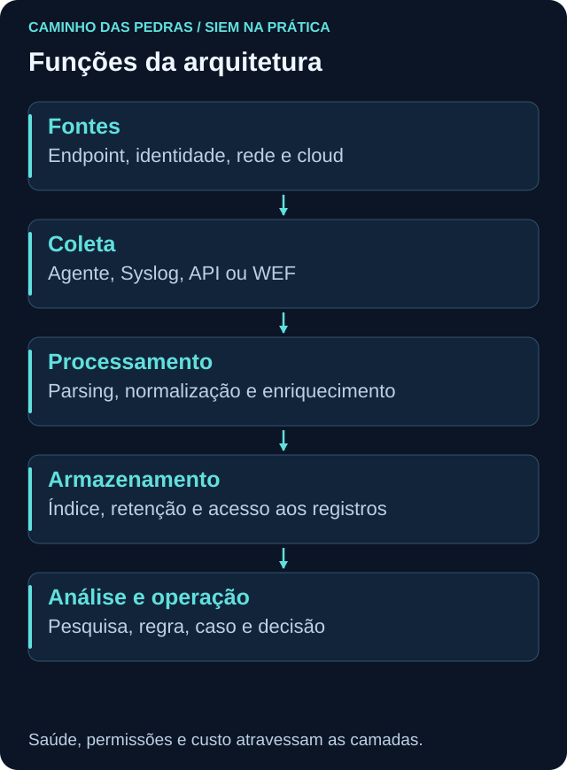
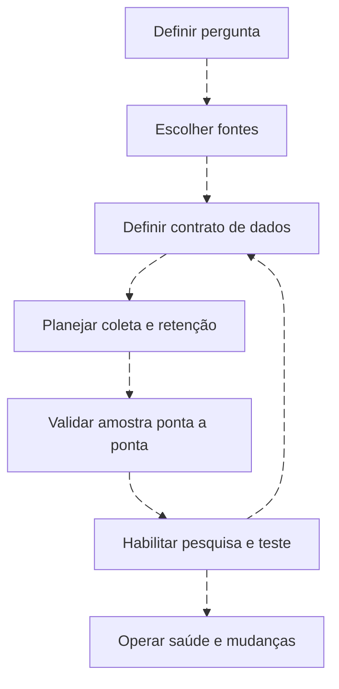

# Arquitetura SIEM e tradução de conceitos

<!-- markdownlint-configure-file {"MD033": {"allowed_elements": ["details", "summary"]}} -->

[← Tópico anterior](o-que-e-siem.md) · [↑ Índice do módulo](README.md) · [Página principal](../README.md) · [Próximo tópico →](log-pipeline.md)

## Separar responsabilidades

Fonte gera dados; coletor os obtém; transporte entrega; processamento extrai e transforma; armazenamento preserva; pesquisa seleciona; detecção avalia condições. Esses papéis podem dividir uma máquina no laboratório ou ocupar vários serviços em produção. Não dimensione uma arquitetura só pelo número de telas.

| Pergunta de arquitetura | Decisão a registrar |
| --- | --- |
| O que queremos observar? | Comportamento, fonte e auditoria |
| Quem pode coletar e consultar? | Identidades, permissões e escopo |
| Como chega e quando? | Agente/API/protocolo, buffers e latência |
| Como se transforma? | Parser, schema, normalização e campos preservados |
| Onde fica? | Índice/tabela, retenção, acesso e recuperação |
| Como detectamos falha? | Inventário esperado, métricas e alerta de saúde |
| Quem mantém? | Responsável, versão, teste e procedimento de mudança |

## Quadro comparativo

| Conceito | Wazuh | Splunk | QRadar SIEM | Sentinel |
| --- | --- | --- | --- | --- |
| Coleta | Agent e integrações | Universal/Heavy Forwarder e inputs | Log source, protocolos, WinCollect e Collector | Data connectors, AMA/DCR quando aplicáveis |
| Processamento | Manager, decoders e rules | Parsing/indexação e extração de campos conforme configuração | DSM e processamento de eventos | Ingestão, transformações e parsers conforme caminho |
| Armazenamento | Indexer, índices de alertas e archives configurados | Indexes | Ariel | Workspace/tabelas no percurso ensinado |
| Pesquisa | API indexer Query DSL e interfaces do dashboard | SPL | AQL | KQL |
| Semântica comum | Campos decodificados e mapeamentos | CIM com add-ons e modelos | Normalização DSM e propriedades | Schemas e ASIM quando implantado |
| Detecção | Rules no manager | Searches/alerts; correlation searches conforme ES | CRE, rules e building blocks | Analytics Rules |
| Sinal | Alert Wazuh | Alert, notable/finding conforme produto e versão | Evento de regra e respostas configuradas | Alert |
| Caso agrupado | Depende de integração/processo | Depende de Enterprise Security e versão | Offense | Incident |
| Automação | Integrações e Active Response | Alert actions e SOAR conforme solução | Rule responses, integrações e SOAR | Automation Rules e playbooks Logic Apps |

AQL não é o editor de CRE. Query DSL do indexer não é uma rule do manager. CIM não é um parser único que corrige qualquer log; ASIM não transforma automaticamente toda tabela. Offense e incident são objetos diferentes, com critérios e ciclos próprios.

## Fluxo e decisões de implantação

Comece pequeno: um endpoint, uma fonte e uma pergunta. Adicionar um segundo coletor antes de saber identificar duplicatas complica a validação. Para alta disponibilidade, planeje buffers, falhas, recuperação e comportamento durante indisponibilidade, conforme os recursos de cada produto.

## Privacidade, acesso e ambientes

Separe laboratório e produção. Dê acesso de leitura aos exercícios de pesquisa e restrinja administração a quem realmente configura a plataforma. Command lines podem conter segredos; relatórios não devem copiar payloads indiscriminadamente. Permissão de ver o dashboard não implica direito de exportar todos os eventos.

## Prática

Escolha uma das quatro plataformas e desenhe cinco papéis: fonte, coletor, processamento, armazenamento e pesquisa. Marque onde ocorre autenticação, onde há buffer, quem pode consultar e como detectar parada da fonte. Depois traduza os papéis para outra plataforma, apontando duas diferenças que impedem uma migração literal.

## Checkpoint

**CIM, ASIM, DSM e decoder são equivalentes?**

Ver resposta

Não. Atuam em diferentes partes do tratamento e da semântica dos dados. Compare finalidade e implementação.

**Uma busca AQL cria uma regra CRE?**

Ver resposta

Não. A busca ajuda a explorar e validar; a regra requer implementação e testes no mecanismo de detecção.

[← Tópico anterior](o-que-e-siem.md) · [↑ Índice do módulo](README.md) · [Página principal](../README.md) · [Próximo tópico →](log-pipeline.md)
