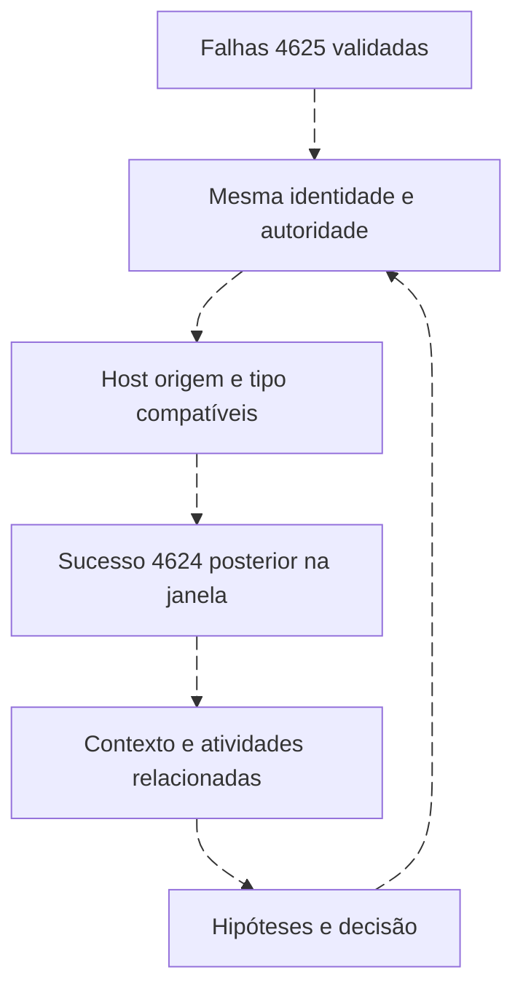

# Correlação: várias falhas seguidas de sucesso

<!-- markdownlint-configure-file {"MD033": {"allowed_elements": ["details", "summary"]}} -->

[← Tópico anterior](detection-engineering.md) · [↑ Índice do módulo](README.md) · [Página principal](../README.md) · [Próximo tópico →](alerts-incidents-offenses.md)

## O comportamento e as hipóteses

Falhas 4625 antes de um sucesso 4624 podem representar erro de digitação, credencial armazenada antiga, serviço, scheduled task, aplicação, password spray, brute force ou outra atividade legítima/não autorizada. Uma sequência é motivo para testar explicações, não um veredito.



## Chave e janela antes de contagem

Use conta+domínio, host alvo, origem e LogonType quando presentes e semanticamente comparáveis. Não una todos os IPs vazios. NAT pode agrupar pessoas diferentes. Sucesso local após falha de rede pode não pertencer ao mesmo mecanismo. Uma falha não herda o Logon ID do sucesso só por proximidade.

O exemplo usa **três falhas nos dez minutos anteriores a um sucesso**, apenas como limiar didático. Não é benchmark. Preserve cada ocorrência e deduplique primeiro quando houver chave confiável. Sobreposição de buscas pode reabrir o mesmo sucesso, exigindo deduplicação operacional.

## KQL: candidatos com condição temporal explícita

```kusto
let Base = SecurityEvent
| where TimeGenerated >= ago(1h)
| where EventID in (4624, 4625)
| where isnotempty(TargetUserName) and isnotempty(TargetDomainName)
    and isnotempty(Computer) and isnotempty(IpAddress) and IpAddress != "-"
    and isnotnull(LogonType)
| project TimeGenerated, EventID, TargetUserName, TargetDomainName,
          Computer, IpAddress, LogonType;
let Falhas = Base | where EventID == 4625 | project-rename Falha=TimeGenerated;
let Sucessos = Base | where EventID == 4624 | project-rename Sucesso=TimeGenerated;
Sucessos
| join kind=inner Falhas on TargetUserName, TargetDomainName, Computer, IpAddress, LogonType
| where Falha < Sucesso and Falha >= Sucesso - 10m
| summarize FalhasAntes=count(), PrimeiraFalha=min(Falha), UltimaFalha=max(Falha)
    by Sucesso, TargetUserName, TargetDomainName, Computer, IpAddress, LogonType
| where FalhasAntes >= 3
```

| Parte | Raciocínio |
| --- | --- |
| Base | Limita tempo e tipos, descartando chaves incompletas explicitamente |
| Falhas/Sucessos | Separa papéis e nomes dos horários |
| Join | Relaciona apenas chaves compatíveis |
| Where temporal | Exige falha estritamente anterior e no lookback escolhido |
| Summarize | Conta candidatos por sucesso e chave, preservando primeiro/último horário |
| Limiar | Seleciona a condição didática, sem classificar ataque |

A consulta tem limites: linhas duplicadas inflam contagem; sucessos distintos com mesmo timestamp/chave podem ser agrupados; o join pode ser caro. Para produção, preserve identificador do registro, trate precisão e duplicatas, avalie cardinalidade e teste dados tardios. Uma hora de busca não cobre falhas fora dessa janela, mesmo que o lookback de um sucesso exija mais história.

## SPL: janela móvel para cada sucesso

Requer os aliases do contrato, `_time` validado como ocorrência e extração numérica de LogonType. Exemplo exploratório, não regra pronta:

```spl
index=windows source="XmlWinEventLog:Security" earliest=-1h latest=now (EventCode=4624 OR EventCode=4625)
| where len(lab_user)>0 AND len(lab_domain)>0 AND len(lab_host)>0
    AND len(lab_source_ip)>0 AND lab_source_ip!="-" AND isnotnull(lab_logon_type)
| sort 0 _time
| streamstats time_window=10m current=f count(eval(EventCode=4625)) AS falhas_anteriores
    by lab_user lab_domain lab_host lab_source_ip lab_logon_type
| where EventCode=4624 AND falhas_anteriores>=3
| table _time lab_user lab_domain lab_host lab_source_ip lab_logon_type falhas_anteriores
```

`sort 0` evita o limite padrão de linhas do sort; `streamstats` mantém contexto anterior por chave; `current=f` não inclui o sucesso atual; o último where seleciona candidatos. Verifique limites de memória/janela de streamstats na implantação. Eventos empatados no timestamp exigem conferência e não demonstram ordem causal. Duplicatas e múltiplos sucessos podem produzir candidatos repetidos.

## Wazuh: dados e regras são camadas diferentes

Use a Query DSL da Roseta para obter 4624/4625, confirme tempo original e ordene a sequência por chave. Para operacionalizar no manager, estude `frequency`, `timeframe`, `if_matched_sid`/`if_matched_group` e campos dinâmicos `same_field`, conforme a versão e os eventos decodificados. O histórico de correlação e o momento em que a regra avalia o evento precisam ser testados com uma sequência completa, não um evento isolado.

Não apresentamos um XML genérico de sequência como se funcionasse em qualquer ruleset. O [Lab 03](labs/lab-03-windows-authentication.md) valida primeiro os dados; o [Lab 06](labs/lab-06-detection-rule.md) implementa a detecção simples 4720. Uma integração externa que correlacione archives é outra arquitetura e precisa declarar seu estado, janela e deduplicação.

## QRadar: candidatos AQL e estado no CRE

Pesquise LabEventID 4624/4625 para conta+domínio, host, origem e LogonType validados. No CRE, crie condição temporal com building blocks de falha e sucesso, respostas e indexação de offense conforme a versão. Teste que o sucesso ocorre depois do conjunto de falhas da mesma chave e que o estado não mistura log sources ou domínios.

Reference sets ajudam a contextualizar identidades/ativos, mas não substituem a sequência temporal. Uma busca AQL agregada por usuário ao longo do dia não comprova ordem. Registre o comportamento observado em testes antes de afirmar equivalência com SPL ou KQL.

## Prática

Monte quatro sequências: falhas seguidas de sucesso, somente falhas, sucesso anterior e conta homônima em outro domínio. Use o dataset e acrescente um registro duplicado apenas em cópia de trabalho. Explique que alteração muda a contagem e como evitar um falso vínculo. Compare também uma origem ausente e outra compartilhada por NAT.

## Referências

- [KQL join](https://learn.microsoft.com/en-us/kusto/query/join-operator): cardinalidade e tipos de combinação.
- [Splunk streamstats](https://help.splunk.com/en/splunk-enterprise/search/spl-search-reference/9.4/search-commands/streamstats): janela e limites do comando.
- [Wazuh rules](https://documentation.wazuh.com/current/user-manual/ruleset/ruleset-xml-syntax/rules.html): estado e campos das regras.

## Checkpoint

**Contar falhas e sucessos por usuário no dia comprova sequência?**

<details>
<summary>Ver resposta</summary>

Não. É preciso ordem, janela e chaves compatíveis, além de cobertura.

</details>

**Mais condições sempre melhoram a regra?**

<details>
<summary>Ver resposta</summary>

Podem reduzir falsos positivos e também excluir casos relevantes. Meça ambos os efeitos.

</details>

[← Tópico anterior](detection-engineering.md) · [↑ Índice do módulo](README.md) · [Página principal](../README.md) · [Próximo tópico →](alerts-incidents-offenses.md)
