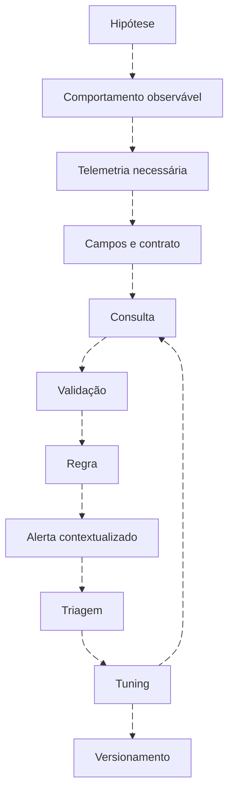
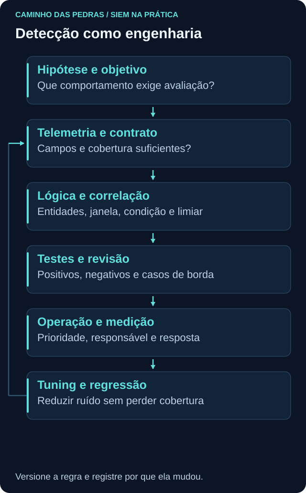

# Detection Engineering: de hipótese a regra mantida

<!-- markdownlint-configure-file {"MD033": {"allowed_elements": ["details", "summary"]}} -->

[← Tópico anterior](sysmon-wef.md) · [↑ Índice do módulo](README.md) · [Página principal](../README.md) · [Próximo tópico →](correlation-rules.md)

## Uma detecção tem uma pergunta e um contrato

“Quero detectar criação de conta” ainda é amplo. Defina qual fonte observa o comportamento, em que escopo, com quais entidades, que condição interessa e qual ação analítica deve acontecer. O rótulo High e um ID ATT&CK não tornam a regra útil.





| Decisão | Pergunta para revisão |
| --- | --- |
| Caso de uso/hipótese | Que problema queremos reconhecer? |
| Condição/threshold | Que observação dispara e por quê? |
| Janela/frequência | Quanto histórico e com que cadência? |
| Entidades | Quem é ator, alvo, host e origem? |
| Severidade/prioridade | Qual gravidade e qual contexto altera urgência? |
| Exceção | Qual combinação é excluída, por quem e até quando? |
| Owner/versão | Quem mantém, testa e recebe falhas? |
| Cobertura | Quais fontes, hosts e cenários ficam de fora? |

## Detecção multisiem: nova conta Windows

**Objetivo:** identificar 4720 e encaminhar criação de conta para avaliação contextual. A criação autorizada deve continuar observável; não é automaticamente ataque. Dados mínimos: tempo, host, provider, SubjectUserName/Domain/SID quando disponível, TargetUserName/Domain/SID, record ID e contexto de autoridade.

Pergunte quem criou, onde, quando, se havia mudança/ticket, quais privilégios a conta recebeu e se autenticou depois. O 4720 sozinho não demonstra adição a grupo, uso posterior ou malícia.

MITRE [T1136.001](https://attack.mitre.org/techniques/T1136/001/) descreve criação de conta local como comportamento adversário quando aplicável. Contas de domínio se relacionam a T1136.002 e exigem outro contexto; não marque todo 4720 como técnica local. **Adicionar MITRE ATT&CK a uma regra não torna automaticamente a detecção boa.**

### Wazuh: regra de laboratório

Exemplo para ruleset Windows que classifique eventos no grupo `windows`, usando campos decodificados `win.*`. Confirme no logtest que o grupo pai e os campos existem. IDs customizados precisam estar livres; não substitua uma regra existente com o mesmo ID.

```xml
<group name="local,windows_account_lab,">
  <rule id="100620" level="5">
    <if_group>windows</if_group>
    <field name="win.system.providerName" type="pcre2">^Microsoft-Windows-Security-Auditing$</field>
    <field name="win.system.eventID" type="pcre2">^4720$</field>
    <description>LAB: criação de conta Windows para revisão contextual</description>
  </rule>
</group>
```

O grupo identifica a família customizada; `if_group` restringe a análise ao pai validado; os dois fields selecionam provedor/ID; nível 5 é uma escolha didática, não padrão universal. Não usa o prefixo `data.` do índice: esse prefixo pertence ao documento indexado, não aos campos decodificados da regra.

Salve no local de regras customizadas apropriado, valide com `wazuh-logtest` e amostras benignas antes de carregar no manager. Verifique limiar de gravação de alertas, regra vencedora e possível duplicidade com conteúdo nativo. Veja [regras customizadas](https://documentation.wazuh.com/current/user-manual/ruleset/rules/custom.html) e [sintaxe](https://documentation.wazuh.com/current/user-manual/ruleset/ruleset-xml-syntax/rules.html).

### Splunk: busca e configuração de alerta

```spl
index=windows source="XmlWinEventLog:Security" EventCode=4720 earliest=-10m latest=now
| table _time EventCode lab_actor lab_user lab_domain lab_host
```

O intervalo de dez minutos é apenas exemplo. Configure frequência, condição de resultado, campos de contexto e deduplicação de registros no alerta. Sobreposição pode reenviar a mesma criação; execução sem sobreposição pode perder dados atrasados. Em ES, use o mecanismo da versão implantada e confirme requisitos de campos/CIM.

### QRadar: lógica CRE, não AQL colado como regra

Crie uma regra de evento no escopo das log sources Windows validadas, com LabProvider correspondente e LabEventID `4720`. Use building block para fontes/escopo compartilhados quando fizer sentido. Defina resposta e critério de criação/atualização de offense, indexando por entidade adequada e preservando ator/alvo. AQL da [Roseta](traduzindo-entre-siems.md) serve para testar a população, não substitui a configuração CRE.

### Sentinel: resultado KQL e Analytics Rule

```kusto
SecurityEvent
| where TimeGenerated >= ago(10m)
| where EventID == 4720
| project TimeGenerated, Computer, SubjectUserName, SubjectDomainName,
          TargetUserName, TargetDomainName, TargetSid
```

Defina frequência/lookback, comportamento com atraso, mapeamento separado de entidades de conta e host, agrupamento de alertas e política de incidents. A query acima retorna dados; a Analytics Rule define seu uso operacional. Preserve diferenças entre conta local e domínio na triagem.

## Matriz mínima de testes

| Caso | Resultado esperado | O que comprova |
| --- | --- | --- |
| 4720 válido, conta local de lab | Condição identificada, alvo correto | Funcionamento básico |
| Evento 4722 | Não tratado como criação | Seleção de tipo |
| Outro provider com mesmo número | Excluído pelo contrato de fonte | Escopo correto |
| Subject e Target diferentes | Ambos preservados | Semântica de identidades |
| Registro duplicado/tardio | Tratamento documentado | Operação na janela |
| Fonte parada | Falha de cobertura sinalizada | Não confundir silêncio com segurança |

Teste positivo significa satisfazer a condição esperada, não confirmar ataque. Falso negativo inclui comportamento relevante que a lógica ou cobertura não percebe. Mantenha histórico dos testes e revisão do owner, usando o [template de detecção](../08-Detection-Engineering/TEMPLATE-DETECCAO.md).

## Prática

Implemente ou simule uma das quatro alternativas no [Lab 06](labs/lab-06-detection-rule.md). Entregue objetivo, consulta/lógica, parâmetros, entidades, testes, limitações e rollback. Não habilite contenção automática como parte deste exercício.

## Checkpoint

**Uma consulta salva já é uma detecção operacional?**

<details>
<summary>Ver resposta</summary>

Não. Faltam contrato, execução, roteamento, testes, manutenção e critérios de decisão.

</details>

**Todo 4720 corresponde a T1136.001?**

<details>
<summary>Ver resposta</summary>

Não. É preciso distinguir conta local, domínio, autorização e contexto adversário.

</details>

[← Tópico anterior](sysmon-wef.md) · [↑ Índice do módulo](README.md) · [Página principal](../README.md) · [Próximo tópico →](correlation-rules.md)
