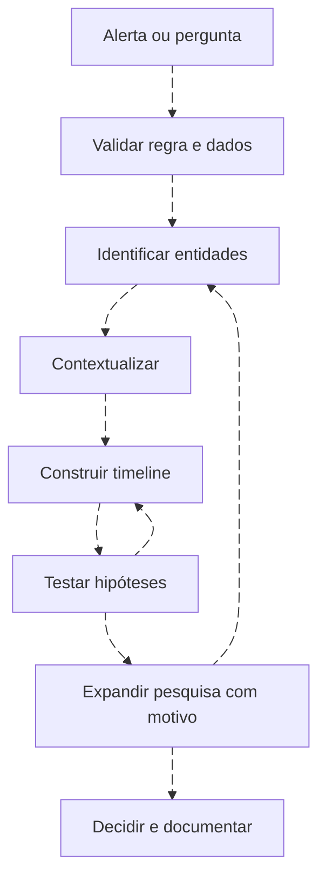
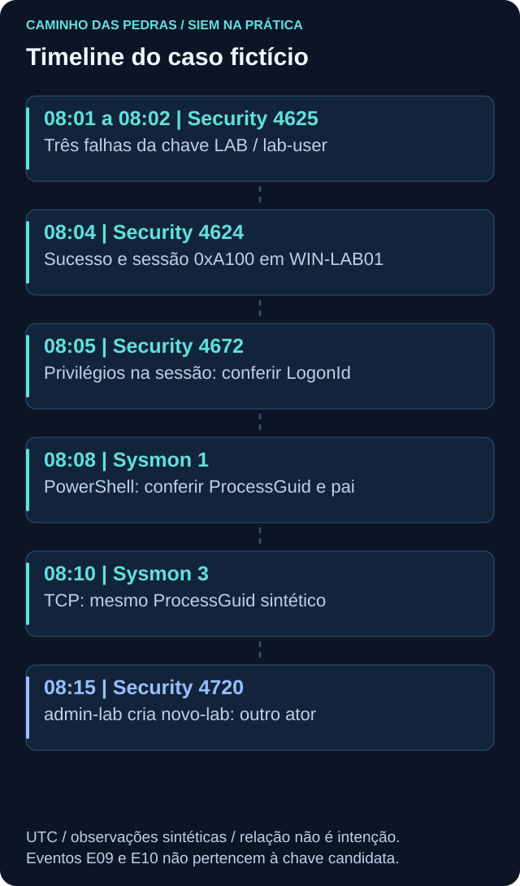

# Investigação: um caso, quatro plataformas

<!-- markdownlint-configure-file {"MD033": {"allowed_elements": ["details", "summary"]}} -->

[← Tópico anterior](alerts-incidents-offenses.md) · [↑ Índice do módulo](README.md) · [Página principal](../README.md) · [Próximo tópico →](threat-hunting.md)

## Método antes de interface

Comece pela pergunta e pelo escopo. Valide a regra, os registros, as entidades e o tempo. Formule hipóteses alternativas e procure dados que possam apoiá-las ou enfraquecê-las. Uma boa investigação registra por que uma consulta foi feita e o que mudou depois de seu resultado.



## Cenário final sintético

Data única: **2026-09-20, UTC**. Os horários e identidades são fictícios. O [dataset](labs/dados/cenario-final.jsonl) é uma representação didática, não um EVTX exportado. O registro `description` explica a observação e não deve ser tratado como campo nativo obrigatório.



| Horário UTC | Fonte/ID | Observação | Próxima pergunta |
| --- | --- | --- | --- |
| 08:01:00, 08:01:20, 08:02:00 | Security 4625 | Falhas para lab-user em WIN-LAB01 | Origem, domínio e LogonType são compatíveis? |
| 08:04:00 | Security 4624 | Sucesso para a mesma chave candidata | Qual TargetLogonId e contexto autorizado? |
| 08:05:00 | Security 4672 | Privilégios especiais no novo logon | SubjectLogonId corresponde à sessão no host? |
| 08:08:00 | Sysmon 1 | PowerShell com comando benigno de data | Qual usuário, pai, LogonId e ProcessGuid? |
| 08:10:00 | Sysmon 3 | Comunicação TCP associada ao ProcessGuid sintético | Foi iniciada, para qual destino e com qual contexto? |
| 08:15:00 | Security 4720 | admin-lab cria novo-lab | O ator é outra conta; há vínculo demonstrado com a sequência? |

4672 não significa “usuário adicionado a Administradores”. O 4720 tem ator diferente e não deve ser conectado à sessão anterior sem evidência adicional. A sessão candidata usa LogonType 10 (RemoteInteractive). O PowerShell foi iniciado com `-NoExit`, mantendo a sessão aberta após `Get-Date`; o comando de criação não registra comandos interativos posteriores. A consulta de data não explica sozinha uma conexão posterior; o sensor observa outro aspecto e precisamos investigar a origem desse vínculo. O dataset não pede que você reproduza tráfego ou operações em ambiente real.

## Hipóteses concorrentes

| Hipótese | Evidência necessária | O que a enfraquece |
| --- | --- | --- |
| Administração autorizada | Mudança, responsável, comando e escopo compatíveis | Ação fora do escopo ou identidade inconsistente |
| Credencial antiga seguida de acesso legítimo | Aplicação/tarefa identificada e confirmação contextual | Origem ou padrão incompatível |
| Uso não autorizado de identidade | Conjunto coerente de ações e contexto contrário à autorização | Evidência verificável de finalidade/escopo legítimos |
| Eventos sem relação entre si | Chaves diferentes, sessões e atores distintos | Identificadores fortes que demonstrem vínculo |

Não procure apenas evidência que confirma sua hipótese favorita. Se duas explicações permanecem possíveis, declare a incerteza e o próximo teste.

## Pivôs defensivos

Usuário → hosts → processos → hash → IP → domínio → outros hosts é uma trilha de perguntas, não uma associação automática. Cada passagem exige um campo que sustente o vínculo. Hash igual ajuda a comparar bytes quando calculado corretamente; não comprova intenção. IP compartilhado e DNS variável limitam o salto entre hosts.

Outra trilha: 4625 → conta/origem → 4624 → sessão → 4672 → 4688/Sysmon 1. Falhas podem não oferecer uma sessão utilizável. Para ligar sucesso a processo, confira host, tempo, identidade e LogonId/LogonGuid quando presentes. Não una eventos apenas pelo relógio.

## Como o trabalho aparece nas plataformas

| Etapa | Wazuh | Splunk | QRadar | Sentinel |
| --- | --- | --- | --- | --- |
| Recuperar registros | Indexer/archives com cobertura confirmada | SPL em índices corretos | AQL em Ariel/propriedades validadas | KQL em SecurityEvent e WindowsEvent |
| Identificar entidades | win.system e win.eventdata | Campos extraídos e aliases | Propriedades DSM/customizadas | Colunas e EventData |
| Acompanhar caso | Registro externo ou integração disponível | Fluxo do produto/ES implantado | Offense e notas relacionadas | Incident, entidades e investigação |
| Documentar limites | Eventos não indexados, filtros e sensor | Extrações, índice e retenção | DSM, coalescência e propriedades | Conector, tabela, permissões e atraso |

## Modelo de relatório

```text
Título / identificador / responsável:
Pergunta inicial e motivo da prioridade:
Fontes, cobertura e versão/schema:
Entidades e janela com fuso:
Fatos com referências aos registros:
Timeline e vínculos demonstrados:
Hipóteses e testes de apoio/contradição:
Consultas, parâmetros e resultados:
Conclusão e confiança qualitativa justificada:
Ações autorizadas, resultado e impacto:
Limitações, responsável e próximos passos:
Melhoria proposta e teste de regressão:
```

Preserve originais quando possível e analise cópias identificadas. Registre origem, momento de coleta e filtros. Exportações podem conter segredos e dados pessoais; portfólio usa exemplos fictícios. Um hash de arquivo ajuda a verificar integridade dos bytes, não prova sozinho a veracidade do conteúdo.

## Prática

No [Lab 08](labs/lab-08-investigation.md), reconstrua a sequência e marque separadamente vínculos confirmados pelo dataset e relações ainda hipotéticas. Conclua sem declarar ataque ou falso positivo por conveniência. Proponha uma melhoria de coleta ou detecção com critério de teste.

## Checkpoint

**Qual é o erro de ligar todo evento pelo horário?**

<details>
<summary>Ver resposta</summary>

Proximidade temporal não comprova relação causal; entidades e identificadores podem ser diferentes.

</details>

**Como concluir com evidência insuficiente?**

<details>
<summary>Ver resposta</summary>

Declare o que foi observado, as hipóteses abertas, as lacunas e o próximo passo, sem inventar confiança numérica.

</details>

[← Tópico anterior](alerts-incidents-offenses.md) · [↑ Índice do módulo](README.md) · [Página principal](../README.md) · [Próximo tópico →](threat-hunting.md)
