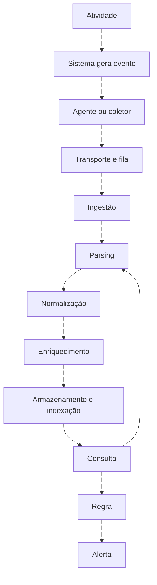
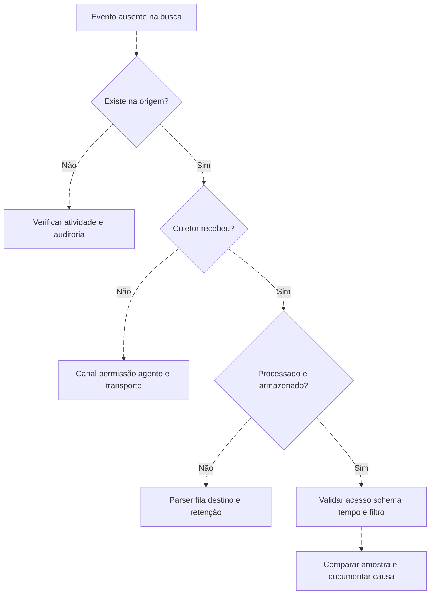
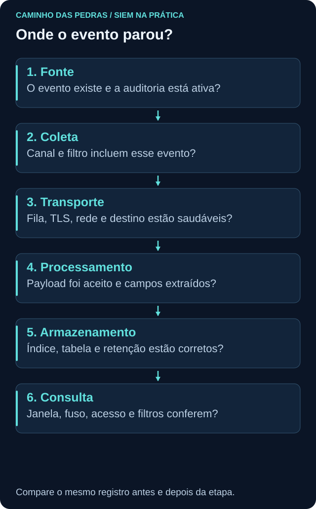

# Pipeline de logs: do evento à evidência

<!-- markdownlint-configure-file {"MD033": {"allowed_elements": ["details", "summary"]}} -->

[← Tópico anterior](arquitetura-siem.md) · [↑ Índice do módulo](README.md) · [Página principal](../README.md) · [Próximo tópico →](coleta-de-logs.md)

## Acompanhe um registro, não apenas o conector

Uma fonte marcada como conectada pode entregar o canal errado, ter campos vazios ou receber apenas parte dos eventos. A unidade básica de validação é um registro conhecido, com provedor, ID, computador, timestamp e identificador no seu escopo. Compare amostras da origem, transporte e destino.

## O que cada transformação deve preservar

| Etapa | Entrada e resultado | Evidência de funcionamento |
| --- | --- | --- |
| Geração | Atividade torna-se evento se a auditoria cobre o cenário | Registro original e política aplicável |
| Agente/coletor | Lê canal, arquivo ou API no escopo configurado | Estado, permissão, bookmark/cursor e canal |
| Transporte | Encaminha lote ou stream | Fila, confirmação, falhas e tentativas |
| Ingestão | Plataforma recebe o dado | Contagem de entrada e atraso |
| Parsing | Estrutura vira campos e tipos | Ator/alvo extraídos sem troca |
| Normalização | Campos passam a um significado comum | Fonte original e semântica preservadas |
| Enriquecimento | Adiciona contexto como criticidade | Origem, validade e momento do inventário |
| Armazenamento | Documento/evento fica acessível | Índice/tabela e retenção correta |
| Consulta/regra | Filtro seleciona dados e lógica os avalia | Resultado comparado à amostra conhecida |

Ordem varia: alguns campos são extraídos na busca e regras podem operar antes da indexação. No QRadar, CRE não precisa esperar uma consulta manual em Ariel. No Wazuh, rules do manager analisam eventos antes de os alertas serem enviados ao indexer.

## Quatro tempos, quatro perguntas

Exemplo fictício: evento `10:00:00Z`, coleta `10:00:15Z`, ingestão `10:02:00Z`, alerta `10:05:00Z`. O atraso até o alerta inclui transporte e agendamento. Nem todo produto registra os quatro momentos; não preencha os ausentes por suposição.

Conserve UTC ou offsets explícitos e o valor original relevante. Um relógio errado pode colocar ocorrência depois da chegada. Compare precisão e sincronização antes de ordenar. Dados tardios exigem política de lookback e deduplicação, não simplesmente uma janela maior sem teste.

## Não encontrei o evento

## Falhas comuns e testes úteis

| Sintoma | Hipótese | Teste discriminante |
| --- | --- | --- |
| Fonte sem evento | Auditoria não habilitada ou cenário diferente | Consultar canal local e subcategoria |
| Agente offline | Serviço, rede ou identidade | Estado local, logs do agente e conectividade autorizada |
| Evento atrasado | Fila, lote ou indisponibilidade | Comparar ocorrência e chegada |
| Usuário vazio | Campo opcional ou parser quebrado | Verificar payload e versão do evento |
| Host duplicado | Coleta redundante ou normalização de nome | Comparar provedor, record ID, host e tempo |
| Volume explodiu | Nova fonte, loop ou filtro alterado | Segmentar por fonte/canal/versão |
| Busca vazia em histórico | Retenção/camada/permissão | Conferir política e recuperação |
| Regra silenciosa | Não executou ou consultou tabela errada | Histórico de execução e resultado da consulta |

Duplicação e perda podem coexistir: receber duas cópias de um canal não compensa faltar outro. Compare cobertura por tipo de evento e origem. Ingestão excessiva pode esgotar capacidade e atrasar justamente os dados úteis.

## Contrato mínimo e prática

Registre fonte, provedor, canal, IDs, host original, timestamp de ocorrência, identidade do registro, ator/alvo e destino. Acrescente responsável, campos obrigatórios, latência observada e método de validação. Não imponha latência universal.

No [Lab 01](labs/lab-01-entendendo-o-pipeline.md), acompanhe uma amostra e introduza uma lacuna apenas no exercício de papel: canal não coletado, data fora da janela ou usuário ausente. Explique onde o diagnóstico termina e o que falta para continuar.

## Checkpoint

**Agente online prova chegada de todos os eventos?**

Ver resposta

Não. Verifique canal, filtro, permissões, transformação e armazenamento.

**Como distinguir atraso de ausência?**

Ver resposta

Compare tempos e filas, confirme origem e acompanhe a chegada. Uma consulta instantânea não distingue todas as causas.

[← Tópico anterior](arquitetura-siem.md) · [↑ Índice do módulo](README.md) · [Página principal](../README.md) · [Próximo tópico →](coleta-de-logs.md)
