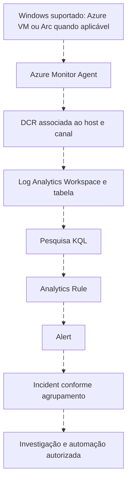

# Microsoft Sentinel dentro de uma arquitetura SIEM

<!-- markdownlint-configure-file {"MD033": {"allowed_elements": ["details", "summary"]}} -->

[← Tópico anterior](qradar.md) · [↑ Índice do módulo](README.md) · [Página principal](../README.md) · [Próximo tópico →](labs/README.md)

## Preservar conceitos e atualizar o caminho

Sentinel oferece capacidades SIEM integradas ao ecossistema Microsoft e a fontes externas. Este capítulo mantém o conhecimento de workspace, conectores, regras, incidents e automação, situando cada um no ciclo de dados e decisões. Experiências de portal, recursos e licenciamento evoluem; use a documentação atual da implantação.



Azure Arc representa/gerencia servidor fora do Azure quando aplicável; não é o sensor que substitui AMA. DCR define coleta/fluxo no caminho utilizado e precisa estar associada ao recurso correto. Nem todo conector Sentinel usa AMA ou DCR.

## Workspace e schemas

Um workspace organiza logs e acesso. Tabelas têm contratos próprios. Antes da regra, inspecione schema e disponibilidade. Consulta de leitura para o caminho Security conectado:

```kusto
SecurityEvent
| getschema
```

Isso retorna informações das colunas, não comprova que cada campo esteja preenchido para todos os eventos. Compare amostra de 4625 e 4720. `SecurityEvent` do conector Windows Security Events via AMA não é `WindowsEvent` do conector Windows Forwarded Events. Sysmon precisa do caminho específico de [Sysmon e WEF](sysmon-wef.md).

## Fontes Microsoft e limites

| Origem | Tipo de pergunta | Cuidado |
| --- | --- | --- |
| Entra ID | Autenticação e operações de identidade cloud | Não confundir com logon local Windows |
| Microsoft 365 | Atividades/auditoria de colaboração | Cobertura, permissões, produto e retenção |
| Microsoft Defender | Alertas e telemetria dos produtos integrados | Nem toda tabela de Advanced Hunting existe no workspace |
| Azure Activity | Operações de controle do Azure | Não equivale a todo acesso de dados de aplicações |
| Windows | Autenticação, conta e processo conforme coleta | Canal, auditoria e tabela |

Mapeie produto → fonte → conector → tabela → campos antes de portar queries. Acesso ao portal não garante todas as licenças, fontes ou permissões. UEBA pode acrescentar contexto comportamental quando habilitado e alimentado por fontes compatíveis; não comprova intenção. Watchlists oferecem dados de referência que precisam de owner, chave, atualização e controle de acesso.

## Analytics Rules, entidades e incidents

Uma query retorna registros. Analytics Rule acrescenta frequência, lookback, threshold, entidades, alertas e agrupamento. Janelas sobrepostas podem duplicar notificações; dados tardios podem escapar. Teste essas situações antes de produção.

Mapeie contas e hosts corretamente, distinguindo Subject e Target. Incidents organizam alertas e investigação; revise se o agrupamento uniu atividades realmente relacionadas. Classificação, responsável, timeline e limites fazem parte do caso. Não encerre todos os alertas de atividade autorizada sob a mesma categoria sem entender o processo.

## Workbooks, automation rules e Logic Apps

Workbooks apresentam consultas e visualizações; não substituem detecção ou investigação. Automation Rules podem aplicar condições e ações em objetos suportados, incluindo chamada de playbooks. Ordem, escopo e repetição alteram resultados.

Playbooks são fluxos do Azure Logic Apps, com conexões e identidades. Defina privilégio mínimo, tratamento de erro, timeout, idempotência, logs de execução e custo. Comece por enriquecimento/etiqueta; teste correspondência e não correspondência. Não inclua credenciais em exportações de fluxo.

Exercício preservado: desenhe uma automação que adicione uma etiqueta a um incident de lab e um enriquecimento que anexe contexto sintético. Defina entrada, saída, falha, repetição e desativação. Não bloqueie usuários ou isole endpoints para completar o estudo.

## Laboratório orientado

1. Planeje assinatura, recursos suportados, região, permissões e orçamento. Alertas de orçamento não interrompem gastos automaticamente.
2. Prepare workspace e Sentinel no ambiente de lab, conforme documentação atual. Não crie recursos se estiver apenas no percurso offline.
3. Configure Windows Security Events via AMA, DCR e associação ao host adequado. Confirme auditoria local.
4. Observe um evento benigno na origem e busque na tabela, comparando provedor, ID, host, conta e tempo.
5. Inspecione schema, população e atraso. Use a query de saúde e compare com inventário esperado.
6. Para Sysmon, valide primeiro o caminho WEF/WEC e só depois AMA/DCR no coletor, conforme o roteiro específico.
7. Especifique a regra de 4720, teste a query e depois o alerta/incident. Registre resultado, duplicação e entidades.
8. Modele automação de etiqueta sem contenção. Verifique execução repetida e falha de conexão.
9. Revise recursos exclusivos do lab, retenção e custos após terminar. Preserve notas sintéticas antes da limpeza.

## Entrega e referências

Entregue inventário de tabelas, diagrama de coleta, comparação origem/destino, regra com matriz de testes, timeline de incident e automação documentada. O [Lab 05 existente](../12-Labs-Praticos/05-Microsoft-Sentinel/README.md) continua válido como percurso introdutório e aponta para o roteiro reorganizado.

- [Visão oficial](https://learn.microsoft.com/en-us/azure/sentinel/overview): capacidades e terminologia atuais.
- [Conectores Windows](https://learn.microsoft.com/en-us/azure/sentinel/connect-services-windows-based): AMA, DCR e tabelas de destino.
- [Catálogo de conectores](https://learn.microsoft.com/en-us/azure/sentinel/data-connectors-reference): requisitos por fonte.
- [Automation Rules](https://learn.microsoft.com/en-us/azure/sentinel/automate-incident-handling-with-automation-rules): condições e ações suportadas.
- [Playbooks](https://learn.microsoft.com/en-us/azure/sentinel/automate-responses-with-playbooks): Logic Apps, permissões e execução.

## Checkpoint

**Azure Arc substitui AMA na coleta?**

<details>
<summary>Ver resposta</summary>

Não. São papéis diferentes. Verifique elegibilidade, agente e associação da DCR no caminho escolhido.

</details>

**Uma query de Advanced Hunting pode ser colada em qualquer workspace?**

<details>
<summary>Ver resposta</summary>

Não. Tabelas, campos, fontes e funções podem diferir, mesmo usando KQL.

</details>

[← Tópico anterior](qradar.md) · [↑ Índice do módulo](README.md) · [Página principal](../README.md) · [Próximo tópico →](labs/README.md)
