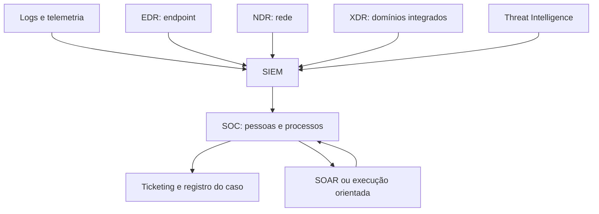

# O que é SIEM

<!-- markdownlint-configure-file {"MD033": {"allowed_elements": ["details", "summary"]}} -->

[← Tópico anterior](README.md) · [↑ Índice do módulo](README.md) · [Página principal](../README.md) · [Próximo tópico →](arquitetura-siem.md)

## Da fragmentação à pergunta investigável

Security Information and Event Management reúne capacidades para centralizar registros, armazenar, pesquisar, correlacionar e apoiar a gestão de eventos de segurança. Centralizar significa disponibilizar fontes de modo governado; não significa necessariamente copiar tudo para um único disco ou coletar sem critério.

Uma pergunta como “quem criou esta conta e o que ela fez depois?” exige identidade, tempo, fonte e contexto. A tela que apresenta os resultados é a parte visível de um sistema de coleta, tratamento e acesso. Sem entender esse sistema, uma resposta vazia pode ser interpretada incorretamente.

## Capacidades que trabalham juntas

| Capacidade | Problema que resolve | Limite |
| --- | --- | --- |
| Coleta e centralização | Dados espalhados em muitas origens | Não cria auditoria ausente |
| Parsing e normalização | Formatos e campos incompatíveis | Pode perder significado se mapear errado |
| Enriquecimento | Registro não informa criticidade ou responsável | Inventário desatualizado induz erro |
| Armazenamento e retenção | Evidência precisa continuar disponível | Camada histórica pode exigir recuperação |
| Pesquisa e correlação | Localizar e relacionar observações | Similaridade não prova causalidade |
| Detecção e alertas | Transformar condição em trabalho operacional | Disparo correto não implica malícia |
| Dashboards e reporting | Dar visibilidade e comunicar situação | Volume não mede sozinho proteção |
| Investigação e integração | Ajudar a organizar contexto e ações | Ferramenta não decide sozinha autorização |

Reporting deve informar período, população, método e limitações. “Não houve alertas” pode significar baixa atividade, regra desabilitada ou sensor parado. A interpretação depende de saúde e cobertura.

## SIEM dentro da operação

É um mapa de integrações possíveis, não uma lista de compras. Um laboratório pode ter somente Windows e Wazuh; uma operação pode integrar várias tecnologias. EDR observa e responde no endpoint; NDR analisa sinais de rede; XDR correlaciona domínios integrados. SOAR orquestra ações e fluxos; ticketing organiza responsabilidade e histórico. Inteligência de ameaças acrescenta contexto cuja validade e atualidade precisam ser avaliadas.

SIEM não é SOC, não é apenas dashboard e não substitui o analista. Detecções também podem ocorrer em EDR, identidade, aplicação, email e outros controles, antes de qualquer dado chegar ao SIEM.

## Consulta, detecção, alerta e caso

| Objeto | Exemplo | O que falta para o próximo passo |
| --- | --- | --- |
| Consulta | Selecionar 4625 de um host em uma hora | Objetivo, janela de execução e critérios |
| Detecção | Reconhecer uma condição relevante com lógica testada | Agendamento, roteamento e evidências |
| Alerta | Informar que a condição foi observada | Contexto, prioridade e triagem |
| Caso | Reunir análise, entidades e decisões | Investigação e classificação justificadas |

Nem toda investigação nasce de alerta. Um relato humano ou uma hipótese de hunting também inicia pesquisa. Não transforme automaticamente todo resultado de query em fila para o SOC.

## Exemplo guiado

Uma busca mostra três falhas para `lab-user`. O analista verifica conta, autoridade, origem, host, tipo de logon e fuso. Descobre que parte dos registros chegou duplicada. Antes de aumentar o threshold, corrige a contagem e documenta a cobertura. A melhoria ocorreu no dado e no método, não apenas na regra.

## Prática

Descreva uma pergunta que precisaria de duas fontes. Para cada fonte, anote o que ela observa, o que não observa, como relacionar entidades e qual resultado enfraqueceria sua hipótese. Termine com um exemplo de conclusão que seria exagerada diante dos dados disponíveis.

## Checkpoint

**SIEM precisa receber toda a telemetria da organização?**

Ver resposta

A cobertura deve seguir casos de uso, investigação, obrigações e capacidade, com lacunas explícitas. Volume indiscriminado não garante qualidade.

**Um alerta correto é sempre um ataque?**

Ver resposta

Não. A condição pode ser real e autorizada. A classificação depende do objetivo da regra e do contexto.

[← Tópico anterior](README.md) · [↑ Índice do módulo](README.md) · [Página principal](../README.md) · [Próximo tópico →](arquitetura-siem.md)
