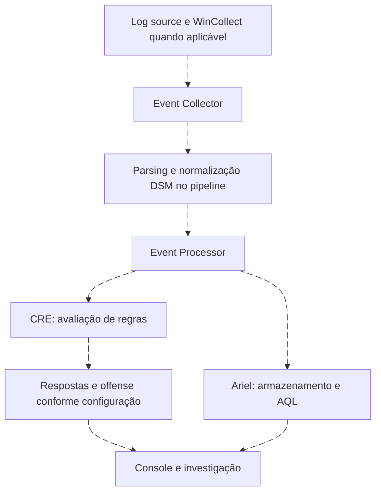

# IBM QRadar: eventos, Ariel, CRE e offenses

<!-- markdownlint-configure-file {"MD033": {"allowed_elements": ["details", "summary"]}} -->

[← Tópico anterior](splunk.md) · [↑ Índice do módulo](README.md) · [Página principal](../README.md) · [Próximo tópico →](microsoft-sentinel.md)

## Delimite o produto

Este capítulo trata da arquitetura QRadar SIEM e AQL em Ariel, com referência à documentação 7.5. Não presume que outros produtos IBM tenham o mesmo schema ou linguagem. Recursos, componentes e disponibilidade de laboratório dependem da edição e do ambiente.

## Caminho correto do evento

CRE e pesquisa em Ariel não são etapas que dependem de uma consulta manual anterior. Componentes podem coexistir em appliance all-in-one. A Console organiza operação e investigação; a arquitetura distribuída acrescenta decisões de capacidade e disponibilidade.

| Conceito | Uso | Limite |
| --- | --- | --- |
| Log source | Identifica origem/configuração da coleta | Nome não prova parsing correto |
| DSM | Reconhece e normaliza tipos de evento | Precisa corresponder ao payload |
| Ariel | Armazena dados consultáveis por AQL | Consulta não cria regra CRE |
| CRE | Avalia condições/correlação | Depende de campos e estado corretos |
| Building block | Condição reutilizável em regras | Mudança pode afetar várias detecções |
| Reference set | Conjunto de valores para contexto/testes | Precisa de owner, validade e escopo |
| Offense | Objeto de análise resultante de condições/respostas | Não é sinônimo de um evento nem prova de ataque |

## Events versus flows

Evento descreve uma ocorrência registrada. Flow resume características de comunicação entre entidades e pode produzir registros em intervalos. Não equivale a captura integral de pacotes. Use flows para perguntas de comunicação, volume e pares; use eventos para operações e identidades conforme a fonte.

Coalescência pode representar vários eventos em um registro. `COUNT(*)` e `SUM(eventcount)` respondem perguntas diferentes. Confirme se a amostra usada para correlação preserva o detalhe temporal necessário.

## Contrato AQL do laboratório

**QID é identificação/categorização do QRadar, não Windows Event ID.** Não filtre `qid=4625` esperando falhas Windows. O módulo usa propriedades customizadas para tornar o requisito explícito, sem inventar um campo nativo universal.

| Propriedade de texto | Origem semântica esperada |
| --- | --- |
| LabProvider | Provider original |
| LabEventID | Event ID Windows como string |
| LabUser | TargetUserName para autenticação/criação |
| LabActor | SubjectUserName quando presente |
| LabDomain | TargetDomainName |
| LabComputer | Computer original, não nome do coletor |
| LabSourceIP | IpAddress original quando informado |
| LabLogonType | LogonType como texto |

No DSM Editor, selecione a log source correta, carregue amostras do formato realmente recebido, crie/ajuste extrações e confirme os resultados. Habilite as propriedades para os usos exigidos por pesquisa/regras conforme a versão. XML, LEEF e mensagens renderizadas exigem métodos distintos; não aplique regex de XML a payload diferente. Se propriedades equivalentes já existem e estão corretas, adapte os nomes das consultas e documente o contrato.

## Laboratório conceitual ou ambiente disponível

1. Identifique uma log source Windows de laboratório e o mecanismo de coleta compatível.
2. Compare o payload recebido com o evento local, incluindo host, horário e Event ID.
3. Verifique reconhecimento DSM, categoria/QID e os campos extraídos. Corrija o parser antes de criar conteúdo.
4. Defina as propriedades Lab acima e teste eventos 4624, 4625 e 4720, além de amostras sem IP.
5. Use AQL da Roseta para localizar, contar e agrupar. Compare registros versus eventcount.
6. Modele uma regra CRE de 4720 com resposta de lab. Documente escopo, entidade indexada, criação/atualização de offense e resultado esperado.
7. Teste evento de outro tipo, duplicata e conta de domínio. Registre limitações e rollback.

Sem acesso a QRadar, faça os passos 2 a 7 no papel com o dataset: mapeamento de propriedades, consulta, população esperada e fluxo de offense. Não é necessário adquirir um laboratório pago. Declare explicitamente que a configuração não foi executada no produto.

## Diagnóstico

Evento desconhecido pede revisão de tipo de log source/DSM e payload. Propriedade vazia pede revisão de extração/escopo. Resultado AQL vazio pede tempo, fuso, permissão e nome de campo. Offense com entidades misturadas pede revisão de regra, indexação e agrupamento. Não altere uma regra para compensar um parser incorreto sem registrar a causa.

## Referências

- [Eventos e flows](https://www.ibm.com/docs/en/qsip/7.5.0?topic=overview-qradar-events-flows): pipeline e distinção das fontes.
- [AQL](https://www.ibm.com/docs/en/qsip/7.5.0?topic=aql-ariel-query-language): sintaxe e modelo de busca.
- [DSM Editor](https://www.ibm.com/docs/en/qsip/7.5.0?topic=qradar-properties-in-dsm-editor): reconhecimento e extração de propriedades.
- [WinCollect](https://www.ibm.com/docs/en/qradar-common?topic=10-wincollect-overview): integração Windows e compatibilidade.

## Checkpoint

**Por que qid=4625 é uma suposição errada?**

Ver resposta

QID e Event ID Windows são identificadores de sistemas distintos. Valide a propriedade que representa o ID original.

**Ariel precisa ser pesquisado antes de CRE avaliar eventos?**

Ver resposta

Não. Pesquisa investigativa e avaliação de regras são capacidades distintas do pipeline.

[← Tópico anterior](splunk.md) · [↑ Índice do módulo](README.md) · [Página principal](../README.md) · [Próximo tópico →](microsoft-sentinel.md)
