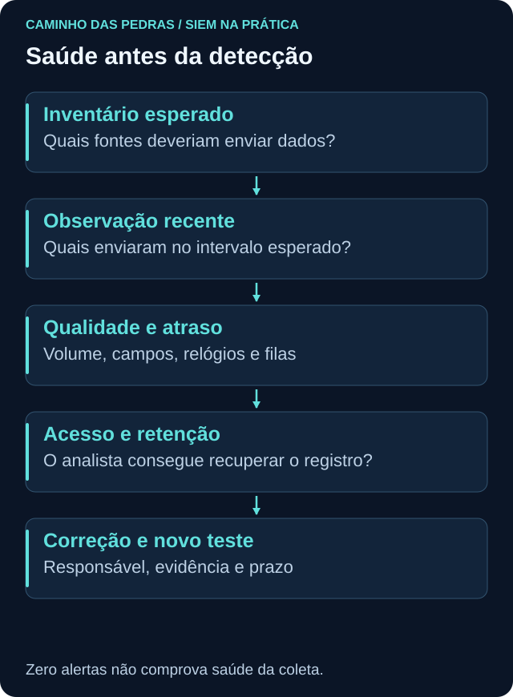
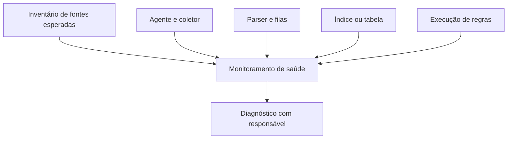

# Quem monitora o monitoramento?

<!-- markdownlint-configure-file {"MD033": {"allowed_elements": ["details", "summary"]}} -->

[← Tópico anterior](dashboards.md) · [↑ Índice do módulo](README.md) · [Página principal](../README.md) · [Próximo tópico →](retention-and-cost.md)

## Saúde é parte da capacidade de detectar

Uma regra só pode avaliar os dados que recebe. Falha silenciosa no agente, parser, indexer ou scheduler reduz a cobertura sem necessariamente aumentar a fila de alertas. Monitore cada camada e compare com o inventário de fontes esperadas.

## Sinais e interpretação

| Sinal | Possíveis causas | Conferência |
| --- | --- | --- |
| Endpoint sem logs | Offline, filtro, permissão ou ausência real de atividade | Inventário e estado local |
| Agente offline | Serviço, rede, autenticação | Logs e canal de gestão |
| Collector atrasado | Buffer, limitação ou destino indisponível | Fila e tempo de chegada |
| Parser falhou | Formato/versão mudou | Amostra original e campos obrigatórios |
| Volume caiu/explodiu | Mudança de atividade, filtro, loop ou duplicação | Segmentar por fonte e canal |
| Timestamp incorreto | Relógio, fuso ou extração | Ocorrência versus ingestão |
| Índice sem dados | Routing, retenção ou permissão | Destino efetivo e amostra |
| Regra não executou | Schedule, permissão, erro ou limite | Histórico de execução e falhas |

## Não basta procurar a última linha

Uma query que calcula `max(timestamp)` por host só vê hosts com registros no conjunto pesquisado. Ela não encontra automaticamente a máquina que nunca enviou nada. Cruze com inventário esperado e trate diferença entre desligamento planejado e perda inesperada.

No [exemplo KQL existente](../queries/kql/05-saude-coleta.md), mantenha esse limite explícito. Não altere um limiar de atraso apenas para parar o alerta; primeiro explique fila, frequência da fonte e necessidade do caso de uso.

## Plano por plataforma

Wazuh: verifique estado de agentes, manager, buffers, gravação de alerts/archives e indexação. Splunk: compare forwarder, recebimento, índice, parsing e execução de buscas. QRadar: examine log source, coleta/processamento, DSM, taxa e CRE. Sentinel: confira conector/DCR quando aplicável, associação ao host, tabela, ingestão e execuções de regras. Os indicadores nativos complementam uma amostra ponta a ponta.

## Teste de saúde sem interromper produção

No exercício de papel, retire um host do dataset de chegada, mantenha-o no inventário e verifique se ele aparece como pendência. Acrescente um timestamp futuro e um registro sem usuário. Mostre que volume total normal pode esconder esses problemas.

## Prática

Crie uma matriz fonte esperada × canal × última ocorrência × última chegada × campos obrigatórios × responsável. Defina critérios conforme frequência real e impacto. Documente como a própria verificação de saúde falha e quem recebe esse sinal.

## Checkpoint

**Max de timestamp por host encontra hosts nunca vistos?**

Ver resposta

Não. É preciso comparar com uma lista de fontes esperadas.

**Volume normal prova qualidade dos campos?**

Ver resposta

Não. O parser pode preencher errado ou deixar campos essenciais vazios.

[← Tópico anterior](dashboards.md) · [↑ Índice do módulo](README.md) · [Página principal](../README.md) · [Próximo tópico →](retention-and-cost.md)
