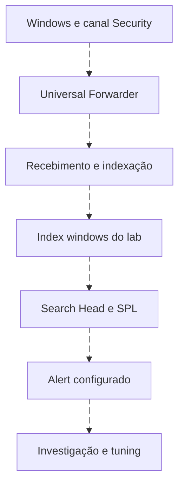

# Splunk: da coleta ao SPL

<!-- markdownlint-configure-file {"MD033": {"allowed_elements": ["details", "summary"]}} -->

[← Tópico anterior](wazuh.md) · [↑ Índice do módulo](README.md) · [Página principal](../README.md) · [Próximo tópico →](qradar.md)

## Plataforma de dados e produto de segurança

Splunk Enterprise oferece ingestão, pesquisa e análise de dados. Splunk Enterprise Security adiciona conteúdos e fluxos de segurança conforme versão/licença. Ter uma pesquisa em Splunk não significa ter todos os recursos de ES. Nomes como notable e finding variam com a evolução do produto; confirme a versão antes de seguir uma tela antiga.



| Componente/conceito | Função | Pergunta útil |
| --- | --- | --- |
| Universal Forwarder | Coleta e encaminhamento com configuração de inputs | Qual canal, destino e buffer? |
| Heavy Forwarder | Instância com processamento/roteamento quando necessário | Essa camada resolve um requisito real? |
| Indexer | Processa/indexa e armazena dados | Onde caiu o evento e qual retenção? |
| Search Head | Executa e apresenta pesquisas | Quais índices e permissões a busca usa? |
| Index | Conjunto de armazenamento/pesquisa | `windows` existe ou é apenas nome do tutorial? |
| Sourcetype | Classificação do formato e conhecimento aplicável | Parser/extractions correspondem ao formato? |
| Source | Origem lógica do input | Canal ou arquivo esperado? |
| Host | Metadado de origem | É o endpoint ou o forwarder intermediário? |
| Fields | Valores extraídos/disponíveis | Ator e alvo mantêm seus papéis? |

## Inputs do laboratório

Requer ambiente Splunk próprio, receiver e index previamente configurados. Trecho de `inputs.conf` em app/local apropriado ao deployment, sem sobrescrever configurações existentes:

```ini
[WinEventLog://Security]
disabled = 0
renderXml = true
index = windows
```

O input seleciona Security, habilita a entrada, pede representação XML e aponta para o index do lab. Ele não configura receiver, outputs, TLS ou auditoria Windows. Use a documentação do Universal Forwarder e do add-on para concluir essas partes. Confira source e sourcetype reais após a primeira chegada.

## Contrato de campos dos exemplos SPL

As consultas da Roseta assumem `EventCode` extraído e estes aliases/extrações validados: `lab_user` para TargetUserName, `lab_actor` para SubjectUserName, `lab_domain` para TargetDomainName, `lab_source_ip` para IpAddress, `lab_logon_type` para LogonType e `lab_host` para Computer original. Se o add-on já fornece campos semanticamente corretos, defina aliases explícitos; não escolha um campo multivalorado Account_Name sem separar papéis.

Para entender a extração em uma amostra **XML com elementos Data nomeados**, este exemplo de pesquisa captura o alvo. É um exercício sobre formato, não um parser universal:

```spl
index=windows source="XmlWinEventLog:Security" EventCode=4625 earliest=-24h latest=now
| rex field=_raw "<Data Name=['\"]TargetUserName['\"]>(?<lab_user>[^<]*)</Data>"
| table _time EventCode lab_user _raw
```

O primeiro trecho limita a fonte; `rex` captura o conteúdo do elemento identificado; `table` compara campo e original. Espaços, namespaces, escaping XML ou outro formato podem exigir parser adequado. Para reutilizar, valide extrações de todos os campos do contrato no mecanismo de knowledge da implantação, usando amostras positivas, vazias e de outros eventos. Não generalize uma regex testada em uma linha para todo Windows.

## Laboratório pequeno

1. Prepare receiver/index e permissões de leitura no ambiente de lab conforme documentação. Confirme licença e limites sem presumir que uma edição gratuita/trial esteja disponível.
2. Configure Universal Forwarder e canal, com TLS e identidade apropriados. Use app de configuração e mantenha rollback.
3. Gere uma falha manual benigna em VM própria e confirme o registro local.
4. Pesquise primeiro o index/tempo, depois source/sourcetype e EventCode. Se vier vazio, remova uma restrição por vez com objetivo explícito.
5. Compare `_time`, Computer, ator/alvo e códigos. Configure os aliases do contrato somente após verificar a semântica.
6. Faça contagem e agrupamento em SPL e inspecione os eventos de suporte.
7. Crie um alerta de lab para 4720 somente depois dos testes. Documente schedule, janela, condição, throttle e ação. Use notificação/registro de teste, sem contenção.

## CIM, modelos e dashboards

CIM ajuda a representar campos e modelos comuns. Isso permite conteúdo reutilizável quando o mapeamento está correto, mas não transforma automaticamente qualquer input. Data models e aceleração dependem de configuração e recursos; não use uma consulta a modelo acelerado como prova de que todos os eventos brutos estão cobertos.

Um dashboard consulta os dados que seus filtros permitem. Verifique tokens, limites e permissões. Uma busca agendada pode falhar mesmo quando a busca manual funciona, por identidade executora ou limites diferentes.

## Entrega e referências

Registre input, destination, index, source, sourcetype, campos, query, resultado e limite. Compare o mesmo 4625 na origem e no SPL, sem publicar payload sensível.

- [Splunk add-on Windows](https://splunk.github.io/splunk-add-on-for-microsoft-windows/): compatibilidade, inputs e campos.
- [Universal Forwarder](https://help.splunk.com/en/splunk-cloud-platform/forward-and-process-data/ingest-actions/process-data-with-forwarders/the-universal-forwarder): responsabilidades do coletor.
- [SPL stats](https://help.splunk.com/en/splunk-enterprise/search/spl-search-reference/9.4/search-commands/stats): agregação e agrupamento.

## Checkpoint

**Index, source e sourcetype são o mesmo metadado?**

<details>
<summary>Ver resposta</summary>

Não. Representam conjunto de armazenamento, origem lógica e classificação/formato.

</details>

**Uma pesquisa manual funcionando garante alerta agendado?**

<details>
<summary>Ver resposta</summary>

Não. Verifique identidade, schedule, limites, janela e ação configurada.

</details>

[← Tópico anterior](wazuh.md) · [↑ Índice do módulo](README.md) · [Página principal](../README.md) · [Próximo tópico →](qradar.md)
