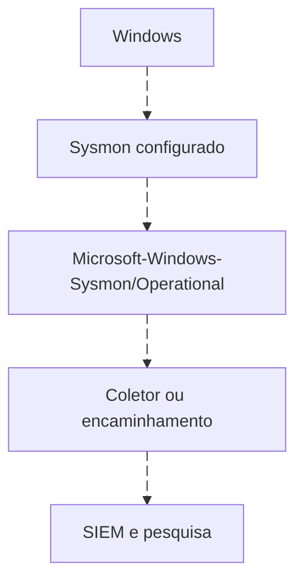

# Sysmon e WEF como fontes para vários SIEMs

<!-- markdownlint-configure-file {"MD033": {"allowed_elements": ["details", "summary"]}} -->

[← Tópico anterior](windows-events.md) · [↑ Índice do módulo](README.md) · [Página principal](../README.md) · [Próximo tópico →](detection-engineering.md)

## Fonte, transporte e plataforma

Sysmon observa atividades conforme configuração e escreve no Windows Event Log. WEF encaminha eventos Windows a um Windows Event Collector. Nenhuma dessas tecnologias pertence exclusivamente ao Sentinel. Um estudante pode começar no Event Viewer e só depois adicionar transporte e SIEM.



| Destino | Caminho possível | Validação necessária |
| --- | --- | --- |
| Wazuh | Sysmon → eventchannel no Wazuh Agent → manager → indexer | Canal, campos decodificados e alertas/archives |
| Splunk | Sysmon → Windows Event Log input no Universal Forwarder → index | Source, sourcetype e extração próprios de Sysmon |
| QRadar | Sysmon → WinCollect/integração suportada → log source/DSM | Versão do coletor, XPath/canal e parser Sysmon compatível |
| Sentinel | Sysmon → WEF/WEC → AMA/DCR → WindowsEvent | Evento encaminhado no coletor e EventData no destino |

Os caminhos são alternativas, não uma cadeia que envia tudo aos quatro produtos. Pode haver coleta direta por mecanismos suportados, mas o roteiro abaixo usa WEF para preservar uma arquitetura verificável. Não suponha que o conector Windows Security Events via AMA colete Sysmon ou grave Sysmon em SecurityEvent.

## WEF antes da nuvem

WEF organiza assinaturas e entrega ao WEC. O canal ForwardedEvents fica no coletor; o evento contém o computador original. Um SIEM deve preservar essa origem. Domínio, DNS, sincronização, permissões e transporte fazem parte do funcionamento. Para laboratório inicial, valide primeiro um único evento encaminhado e compare provider, Event ID, Computer e ProcessGuid.

## Coleta Wazuh do canal Sysmon

Trecho a incluir na configuração existente do agente, sem duplicar uma entrada já presente:

```xml
<localfile>
  <location>Microsoft-Windows-Sysmon/Operational</location>
  <log_format>eventchannel</log_format>
</localfile>
```

O bloco seleciona o canal, não habilita todos os tipos de evento no Sysmon. Revise filtros e volume antes de ampliar. Em Splunk, o input equivalente lê o mesmo canal, mas os campos e sourcetype precisam ser configurados para Sysmon. Em QRadar, confirme suporte na documentação de WinCollect/DSM da versão implantada antes de definir a log source.

## Caminho opcional preservado: WEF para Sentinel

VM de origem com Sysmon → assinatura WEF → Windows Event Collector (WEC), canal ForwardedEvents → AMA e DCR do conector Windows Forwarded Events → workspace, tabela WindowsEvent.

Use um domínio de laboratório isolado com origem e coletor ingressados, DNS e horário corretos, permissões administrativas para configuração e acesso da conta usada pela assinatura aos eventos da origem. O coletor deve ser elegível para AMA (Azure VM ou servidor habilitado no Azure Arc). Não exponha WinRM na Internet. Um cenário sem domínio exige configurar autenticação/certificados conforme a documentação; não é coberto por este roteiro inicial.

## Configuração orientada

1. Na origem, instale Sysmon com ProcessCreate habilitado e confirme um evento benigno no canal `Microsoft-Windows-Sysmon/Operational`.
2. Prepare a origem para acesso remoto aos eventos e WinRM dentro da rede do lab. No coletor, inicialize Windows Event Collector com `wecutil qc` em terminal elevado. Revise as mudanças de serviço/firewall e limite acesso à rede do exercício.
3. No Event Viewer do coletor, abra Subscriptions e crie uma assinatura **Collector initiated**, adicionando a origem pelo nome de domínio. Use uma identidade do laboratório com permissão de leitura do canal. Teste a conectividade na interface antes de continuar.
4. Na seleção de eventos da assinatura, use o canal Sysmon e o Event ID 1. O XML de seleção equivalente é mostrado abaixo. Use entrega de baixa latência no lab e destino **Forwarded Events**.
5. Execute o comando benigno do Lab 03 na origem. Antes de configurar nuvem, confirme que o evento chegou a **ForwardedEvents** no coletor, preservando provedor e campos. Se falhar, examine o estado da assinatura, DNS, WinRM, firewall e permissões do canal; não avance com coleta local incompleta.
6. Instale a solução que disponibiliza **Windows Forwarded Events** no Content hub do Sentinel. Abra esse conector e crie a DCR associada ao **coletor**, com o workspace de laboratório como destino e coleta do canal ForwardedEvents. Se a interface solicitar XPath no formato `canal!expressão`, use `ForwardedEvents!*[System[Provider[@Name='Microsoft-Windows-Sysmon'] and EventID=1]]`. Confirme AMA ativo e associação da DCR.
7. Gere outro evento e execute a query de conferência abaixo. Exija `Provider` correto e `EventData.Image` preenchido. Se os campos chegarem em outro formato, documente a configuração e ajuste o parser antes de executar o hunt.
8. Após os testes, remova a assinatura, associações/DCR e recursos criados exclusivamente para o lab quando não forem mais necessários. Revise as alterações de WinRM/firewall e custos remanescentes.

```xml
<QueryList>
  <Query Id="0" Path="Microsoft-Windows-Sysmon/Operational">
    <Select Path="Microsoft-Windows-Sysmon/Operational">*[System[EventID=1]]</Select>
  </Query>
</QueryList>
```

O XML acima é o filtro da assinatura WEF, não um arquivo DCR completo. Ele seleciona somente Process Creation. O filtro da DCR opera no canal ForwardedEvents do coletor; não confunda os dois canais.

## Conferência no workspace

```kusto
WindowsEvent
| where TimeGenerated >= ago(1h)
| where Provider == "Microsoft-Windows-Sysmon" and EventID == 1
| project TimeGenerated, Computer, Provider, EventID, EventData
| take 10
```

A consulta procura amostras de Sysmon 1: filtra período/provedor/ID, seleciona campos e limita dez linhas. Não detecta ameaça; processos legítimos são esperados. Melhore filtrando o host de origem e comparando horário e ProcessGuid com o evento local. Resultado vazio pode indicar atraso, coleta incorreta ou ausência de eventos.

## Limites e fontes

Evite coletar os mesmos eventos por múltiplas DCRs, o que pode duplicar dados e custos. O conector de Security não substitui esse caminho. Esta arquitetura ainda precisa ser executada e validada no ambiente do usuário.

- [Microsoft: coleta de eventos Windows para Sentinel](https://learn.microsoft.com/en-us/azure/sentinel/connect-services-windows-based)
- [Microsoft: configuração de assinatura iniciada pelo coletor](https://learn.microsoft.com/en-us/windows/win32/wec/creating-an-event-collector-subscription)
- [Catálogo: Windows Forwarded Events e tabela WindowsEvent](https://learn.microsoft.com/en-us/azure/sentinel/data-connectors-reference)

TODO: adicionar evidência real do laboratório

## Investigação com ProcessGuid

```kusto
WindowsEvent
| where TimeGenerated >= ago(1h)
| where Provider == "Microsoft-Windows-Sysmon" and EventID == 1
| extend ProcessGuid=tostring(EventData.ProcessGuid),
         Image=tostring(EventData.Image),
         ParentImage=tostring(EventData.ParentImage)
| project TimeGenerated, Computer, ProcessGuid, Image, ParentImage
```

A primeira linha escolhe a tabela do caminho WEF; os filtros delimitam tempo, provedor e tipo. `extend` extrai propriedades do objeto dinâmico EventData após conferir o payload real. `project` mostra campos úteis à linhagem. Se EventData chegar com outro formato, investigue transformação antes de adaptar a análise. A query não é uma detecção de malícia.

## Prática

Use apenas um comando benigno em VM própria, como consultar a data em PowerShell. Confira o evento local, o encaminhado quando houver WEF e o documento no SIEM. Explique uma divergência de tempo, nome de host ou campo, sem fabricar correspondência.

## Checkpoint

**Sysmon exige Sentinel?**

<details>
<summary>Ver resposta</summary>

Não. É uma fonte Windows que pode ser coletada por várias plataformas.

</details>

**ForwardedEvents e Security são o mesmo canal?**

<details>
<summary>Ver resposta</summary>

Não. Um é o destino de encaminhamento no coletor; o outro é um canal de origem. Preserve provedor e host original.

</details>

[← Tópico anterior](windows-events.md) · [↑ Índice do módulo](README.md) · [Página principal](../README.md) · [Próximo tópico →](detection-engineering.md)
