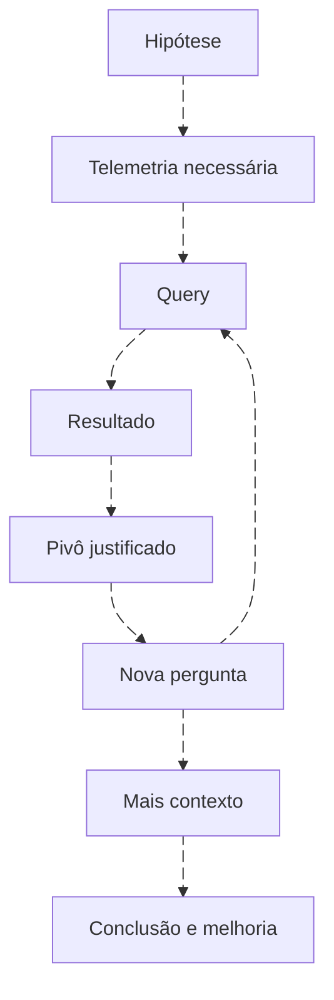

# Threat hunting orientado por hipóteses

<!-- markdownlint-configure-file {"MD033": {"allowed_elements": ["details", "summary"]}} -->

[← Tópico anterior](investigacao.md) · [↑ Índice do módulo](README.md) · [Página principal](../README.md) · [Próximo tópico →](tuning.md)

## Uma investigação pode começar sem alerta

Hunting busca responder uma hipótese sobre atividade ou exposição no escopo observado. Não é rodar muitas consultas aleatórias até encontrar algo estranho. Defina pergunta, população, período, fontes e critério de resultado. Um hunt pode concluir que falta telemetria, e essa conclusão pode ser a melhoria mais importante.

## Exemplo de hipótese

“No laboratório, existem contas que tiveram falhas em um host onde normalmente não aparecem?” A hipótese exige histórico de identidade+autoridade+host, não apenas top usuários. Defina “normalmente” como período e população, verificando saúde da fonte. Um novo host pode representar manutenção ou expansão legítima.

| Passo | Entrega |
| --- | --- |
| Delimitar | Contas de lab, hosts conhecidos, período fixo |
| Verificar fonte | Security 4625 com usuário, domínio, host e origem |
| Construir referência | Distribuição histórica, dias cobertos e lacunas |
| Buscar diferença | Novas combinações ou aumento contextual |
| Investigar | Mudança, tarefa, origem e sucesso posterior |
| Concluir | Explicação sustentada, alternativa e limite |

## Quatro plataformas, a mesma pergunta

Wazuh: confirme que archives contêm a população necessária, depois use Query DSL e agregações/paginação. Splunk: busque no índice e extrações corretos, agregando por identidade e host; modelos CIM só ajudam quando a fonte está mapeada. QRadar: use AQL com propriedades validadas e interprete eventcount/coalescência. Sentinel: consulte a tabela adequada e verifique que os campos estão presentes no evento.

A [Roseta](traduzindo-entre-siems.md) mostra filtros, baseline e raridade. Reutilize intenção e contrato, não uma string de consulta. Não compare contagem de alertas Wazuh com todos os eventos Security de outra plataforma como se fossem a mesma população.

## Pivôs e critérios de parada

Um usuário leva a hosts observados; um host leva a processos; um processo pode levar a rede se houver vínculo na fonte. Cada ampliação deve informar por que é necessária. Não investigue todos os hosts que acessaram um IP compartilhado sem outro sinal.

Pare quando a pergunta estiver respondida dentro do escopo, quando a coleta impedir avanço ou quando um caso relevante exigir transferência ao processo de incidentes. Documente resultado negativo com cobertura, e mantenha a hipótese revisável.

## Do hunt para uma detecção

Um achado pode virar regra se houver comportamento definível, fonte sustentável, campos confiáveis, custo aceitável e teste. Um caso raro por si só pode continuar como pesquisa periódica, não como alerta urgente. Defina critérios de manutenção e avalie exceções antes de operacionalizar.

## Prática

No [Lab 09](labs/lab-09-threat-hunting.md), procure combinações raras no conjunto completo. Produza uma hipótese inicial, consulta conceitual em quatro ambientes, resultado esperado offline, pivô, conclusão e proposta de melhoria. Declare que o dataset pequeno não estabelece baseline de mercado nem normalidade empresarial.

## Checkpoint

**Hunting depende de um alerta inicial?**

Ver resposta

Não. Pode começar por uma hipótese, mudança, inteligência ou lacuna de cobertura.

**Todo achado raro deve virar alerta?**

Ver resposta

Não. Precisa de relevância, contexto, telemetria sustentável e teste de impacto operacional.

[← Tópico anterior](investigacao.md) · [↑ Índice do módulo](README.md) · [Página principal](../README.md) · [Próximo tópico →](tuning.md)
