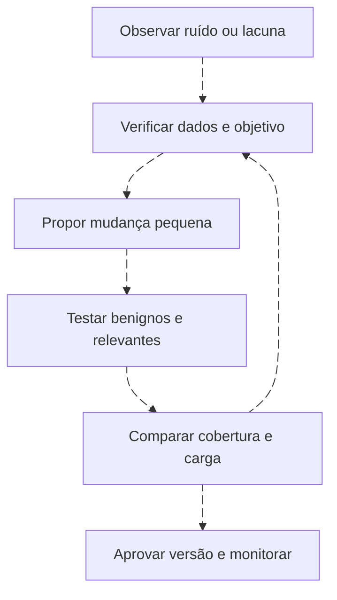

# Tuning: melhorar a decisão sem esconder o problema

<!-- markdownlint-configure-file {"MD033": {"allowed_elements": ["details", "summary"]}} -->

[← Tópico anterior](threat-hunting.md) · [↑ Índice do módulo](README.md) · [Página principal](../README.md) · [Próximo tópico →](dashboards.md)

## Desabilitar e melhorar têm efeitos diferentes

Desabilitar uma regra interrompe sua avaliação ou notificação, conforme o produto. Pode ser necessário diante de erro grave, mas deixa uma lacuna que exige responsável, motivo e plano de retorno. Melhorar a regra altera dados, lógica, contexto ou encaminhamento e verifica o efeito em casos relevantes e benignos.

O objetivo não é a menor fila possível. Uma fila vazia pode indicar sensor parado. O objetivo é aumentar a utilidade das decisões preservando a cobertura necessária.

## Evolução de uma regra ruim

| Versão didática | Mudança | Ganho possível | Risco introduzido |
| --- | --- | --- | --- |
| Qualquer 4625 gera High | Nenhum contexto | Simples de observar | Ruído, rótulo exagerado e fadiga |
| Múltiplos 4625 | Threshold | Reduz casos isolados | Pode perder tentativa relevante de baixo volume |
| Mesma conta e autoridade | Chave de entidade | Evita misturar usuários | Pode perder padrão distribuído por várias contas |
| Janela curta | Tempo explícito | Define concentração | Pode perder atividade lenta |
| Origem e LogonType | Contexto de mecanismo | Distingue caminhos | Ausência de campo pode excluir casos |
| Função e criticidade do ativo | Priorização contextual | Encaminha atenção | Inventário errado distorce prioridade |
| Sucesso posterior relacionado | Sequência | Identifica um caso específico | Não cobre tentativas sem sucesso nem prova ataque |

Essas versões não são uma escada obrigatória. Uma detecção de password spray pode agrupar várias contas por origem e não deve ser substituída pela regra da mesma conta. Uma detecção de falhas sem sucesso tem objetivo diferente da sequência 4625/4624.

## Alavancas e perguntas

| Alavanca | O que avaliar antes de mudar |
| --- | --- |
| Threshold | Distribuição, criticidade e cenários abaixo do limiar |
| Janela/frequência | Dados tardios, sobreposição, repetição e atividade lenta |
| Campo adicional | Preenchimento, estabilidade e efeito nos falsos negativos |
| Allowlist | Combinação restrita, owner, justificativa, validade e revisão |
| Conta de serviço | Função real e origem esperada, sem imunidade permanente |
| Horário esperado | Fuso, manutenção e atividade indevida dentro do horário |
| Origem confiável | NAT, host comprometido e mudanças de inventário |
| Correlação | Chaves, ordem, cobertura e custo da consulta |
| Supressão | O que deixa de notificar e qual evidência permanece |
| Agrupamento | Se casos diferentes estão sendo unidos |

Nunca exclua uma conta inteira só porque ela gera volume. Uma exceção contextual pode combinar conta, host, operação, origem e mudança válida. Quanto mais restrita a exceção, mais importante verificar manutenção e campos ausentes. A entidade esperada também pode ser usada indevidamente.

## Teste antes/depois

Exemplo fictício: versão A gera 40 candidatos; versão B gera 12. Isso não prova melhoria. Separe casos relevantes conhecidos, benignos conhecidos, inconclusivos e perda de coleta. Verifique quais 28 desapareceram e por quê.

| Caso de teste | O que a revisão deve preservar |
| --- | --- |
| Operação autorizada dentro da exceção | Tratamento esperado com motivo |
| Mesma conta em outro host | Continua visível quando fora do escopo autorizado |
| Campo de origem ausente | Não desaparece sem política explícita |
| Atividade relevante com baixo volume | Perda conhecida ou detecção complementar |
| Evento tardio/duplicado | Contagem e notificação coerentes |

Falsos positivos e falsos negativos dependem do objetivo declarado e da população de teste. Um conjunto pequeno de exemplos não estima sozinho desempenho real. Mantenha casos de regressão e valide no contexto do ambiente.

## Como aplicar nas plataformas

Wazuh pode ajustar rules e condições no manager; teste com logtest e depois o caminho de alertas. Splunk separa alteração SPL de schedule, throttle e ação. QRadar separa building blocks, regras CRE, reference sets e respostas. Sentinel separa KQL, frequência/lookback, supressão, entidades e agrupamento. Documente a camada alterada para não atribuir um efeito ao mecanismo errado.

## Registro de tuning e prática

Guarde objetivo, versão anterior, motivo, alteração, população de teste, resultados antes/depois, cobertura perdida, owner, data de revisão e rollback. No [Lab 07](labs/lab-07-tuning.md), proponha uma mudança que reduza ruído e mostre um cenário que ela poderia perder. A resposta deve explicar esse tradeoff, não escondê-lo.

## Checkpoint

**Menos alertas comprovam tuning melhor?**

Ver resposta

Não. Compare casos removidos, cobertura, falsos negativos e saúde das fontes.

**Uma origem confiável deve ser excluída permanentemente?**

Ver resposta

Não. Contexto muda e a origem pode ser comprometida. Exceções precisam de escopo, owner e revisão.

[← Tópico anterior](threat-hunting.md) · [↑ Índice do módulo](README.md) · [Página principal](../README.md) · [Próximo tópico →](dashboards.md)
