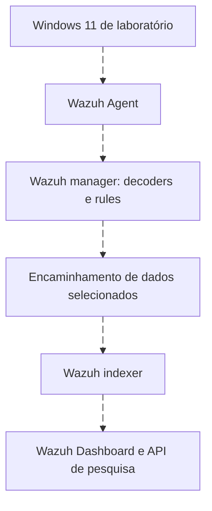

# Wazuh: arquitetura e laboratório verificável

<!-- markdownlint-configure-file {"MD033": {"allowed_elements": ["details", "summary"]}} -->

[← Tópico anterior](retention-and-cost.md) · [↑ Índice do módulo](README.md) · [Página principal](../README.md) · [Próximo tópico →](splunk.md)

## O que cada componente faz

Wazuh combina monitoramento de endpoint, análise de logs e outras capacidades de segurança. Não se resume a “SIEM grátis”. Agentes, regras, FIM, SCA e inventário/vulnerabilidades têm propósitos próprios. Há sobreposição com SIEMs, mas arquitetura, escala, conteúdo, gestão de casos e integrações precisam ser avaliados pelo caso de uso.



| Componente | Responsabilidade | Teste útil |
| --- | --- | --- |
| Agent | Coletar canais/arquivos e executar capacidades configuradas | Conexão e evento conhecido recebido |
| Manager/server | Decodificar, aplicar regras e gerenciar agentes | Logtest e logs de processamento |
| Indexer | Indexar e pesquisar documentos | Mapping, índice e amostra pesquisável |
| Dashboard | Apresentar dados e funções de operação | Padrão de índice, tempo e permissões |

No caminho de alertas da arquitetura 4.14 documentada, o encaminhamento ao indexer envolve Filebeat. Outros tipos de dados e integrações podem usar mecanismos distintos. Não assuma que todo arquivo do manager é automaticamente pesquisável no dashboard.

## Alerts não são archives

Alerts são resultados de regras e limiares configurados. Archives podem registrar eventos recebidos independentemente de gerarem alerta, quando habilitados. `archives.json` no disco não significa que o índice `wazuh-archives-*` já exista: encaminhamento/indexação e data view também precisam ser configurados.

Para as pesquisas comparativas do módulo, escolhemos archives indexados com schema eventchannel. Isso permite procurar também um sucesso 4624 que talvez não tenha gerado alerta. Se sua instalação só tem `wazuh-alerts-*`, use o índice disponível e declare que a população é de alertas, não todos os eventos. Nunca habilite archives amplos sem estimar volume, acesso e retenção.

## Capacidades e seus limites

| Capacidade | Pergunta | Cuidado |
| --- | --- | --- |
| Log collection | Que registro chegou? | Canal, permissão e filtro |
| Decoders/rules | Como foi interpretado e classificado? | Parser e regra podem precisar de ajuste |
| File Integrity Monitoring | O que mudou nos caminhos monitorados? | Não cobre arquivos fora do escopo |
| Security Configuration Assessment | A configuração atende aos checks selecionados? | Check não equivale a garantia de segurança |
| Vulnerability Detection | Inventário corresponde a vulnerabilidades conhecidas? | Versão, inventário, feed e confirmação de aplicabilidade |
| Active Response | Que ação configurada será executada? | Autorização, impacto e repetição |

FIM não é sinônimo de detecção de malware. SCA não substitui revisão contextual de hardening. Uma vulnerabilidade identificada precisa de verificação de aplicabilidade e tratamento; não significa exploração observada.

## Laboratório pequeno, passo a passo

1. Planeje um servidor Linux suportado para componentes centrais e uma VM Windows própria. Confira requisitos atuais no quickstart. Anote CPU, RAM, disco, rede, versão e escopo; não trate all-in-one de lab como desenho obrigatório de produção.
2. Instale conforme o guia oficial, revise certificados e use credenciais próprias protegidas. Restrinja portas e acesso à rede do exercício. Não publique dashboard ou indexer indiscriminadamente.
3. Cadastre o agente Windows e confirme sua identidade no manager. Estado conectado é só a primeira verificação.
4. Confira a coleta de Security e, se utilizado, do canal Sysmon. Evite duplicar blocos localfile. Não altere auditoria de uma máquina corporativa.
5. Gere apenas a atividade benigna dos labs anteriores ou use amostra sintética no caminho de teste. Compare o evento local com os campos decodificados.
6. Verifique se o registro gerou alert e qual regra venceu. Para estudar eventos que não alertam, planeje archives e sua indexação conforme a documentação.
7. Consulte mapping/field capabilities do índice e confirme tipos antes de copiar Query DSL. Não substitua `.keyword` sem ver se existe.
8. Execute o filtro 4625 da [Roseta](traduzindo-entre-siems.md), compare contagem e amostra e registre a janela.
9. Ao concluir, preserve notas sintéticas, revise retenção e remova apenas recursos exclusivos do lab que você criou, quando não forem mais necessários.

## Exemplo de canal Windows

Trecho dentro da configuração existente do agente, após conferir se já está presente:

```xml
<localfile>
  <location>Security</location>
  <log_format>eventchannel</log_format>
</localfile>
```

`location` escolhe o canal e `eventchannel` escolhe o mecanismo de leitura. Não habilita auditoria ausente. O serviço precisa carregar a configuração conforme o procedimento da versão. A coleta deve ser confirmada ponta a ponta, não apenas pela ausência de erro no XML.

## Onde investigar falhas

| Sintoma | Conferência |
| --- | --- |
| Agente conectado, evento ausente | Canal, política de auditoria, permissões e filtros |
| Evento recebido, sem alert | Regra, nível, condição e limiar de gravação |
| Archive no disco, busca vazia | Indexação, padrão de índice, tempo e acesso |
| Campo existe na tela, term não encontra | Mapping, tipo, capitalização e valor exato |
| 4624 não aparece em alerts | Verificar se houve regra alertável; usar archives quando planejado |

## Entrega e referências

Entregue arquitetura, contrato, evento conhecido, regra/decoder observado, índice, query e limitações. Um Windows Server/AD pode ser acrescentado depois para estudar conta de domínio, mantendo laboratório isolado e diferenciando fontes do DC.

- [Arquitetura Wazuh](https://documentation.wazuh.com/current/getting-started/architecture.html): responsabilidades dos componentes.
- [Quickstart](https://documentation.wazuh.com/current/quickstart.html): requisitos e implantação suportada.
- [Event logging](https://documentation.wazuh.com/current/user-manual/manager/event-logging.html): distinção de alerts/archives e ativação.
- [Índices](https://documentation.wazuh.com/current/user-manual/wazuh-indexer/wazuh-indexer-indices.html): destinos e padrões pesquisáveis.

## Checkpoint

**Archives habilitados no manager garantem busca no dashboard?**

<details>
<summary>Ver resposta</summary>

Não. É preciso verificar encaminhamento, indexação, padrão de índice e permissões.

</details>

**WQL e Query DSL do indexer são a mesma linguagem?**

<details>
<summary>Ver resposta</summary>

Não. WQL filtra recursos da API do servidor em contextos próprios; aqui os logs são pesquisados pela API do indexer.

</details>

[← Tópico anterior](retention-and-cost.md) · [↑ Índice do módulo](README.md) · [Página principal](../README.md) · [Próximo tópico →](splunk.md)
